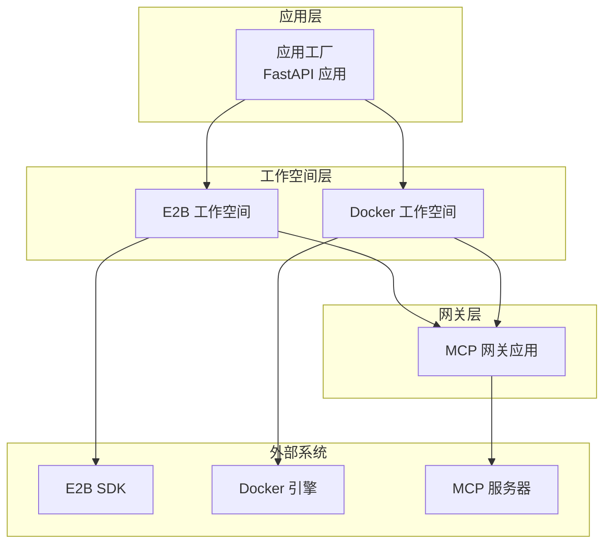
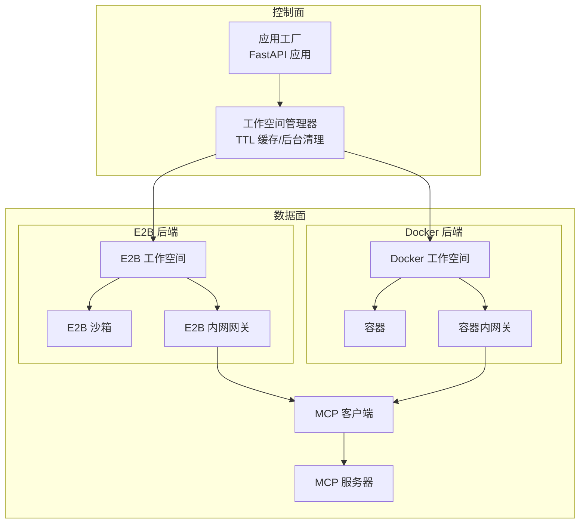
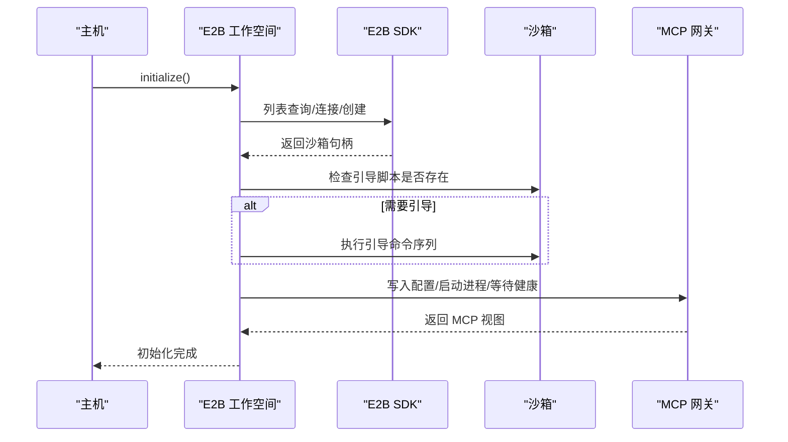
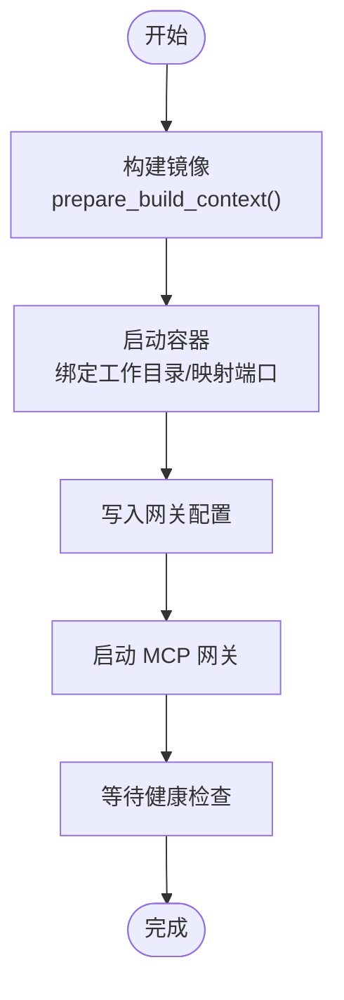
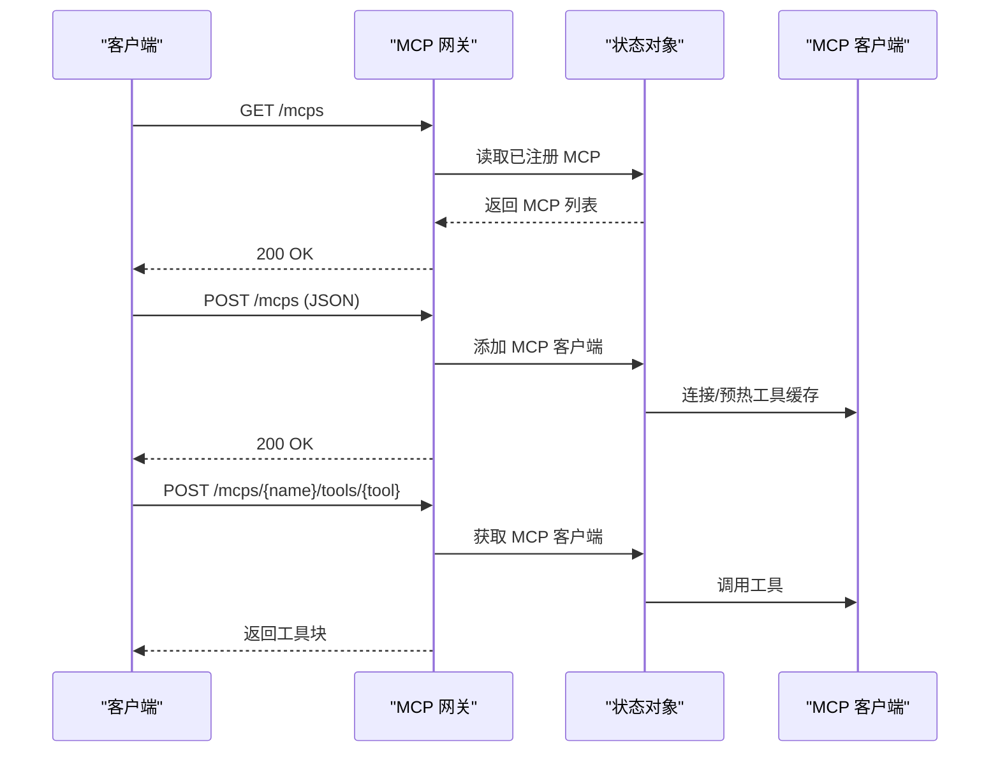
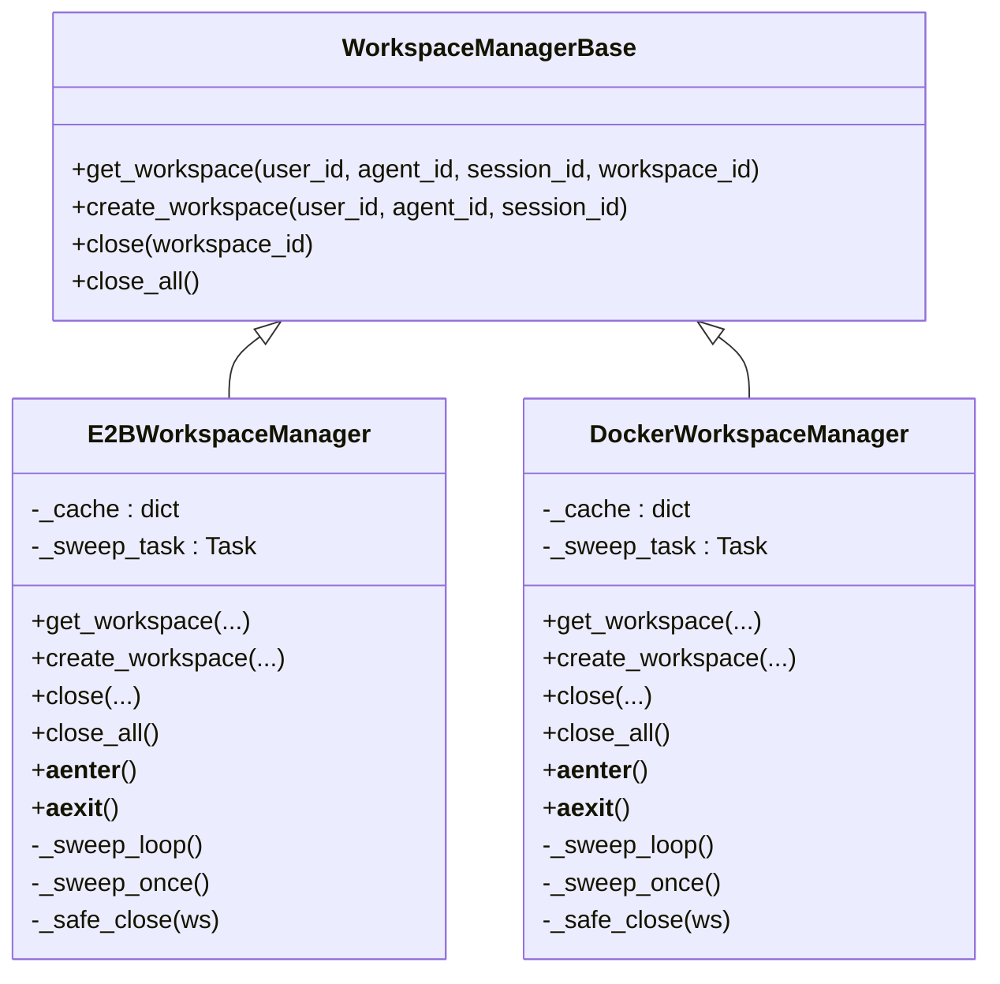
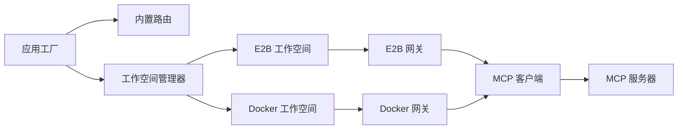

# 云平台部署

<cite>
**本文引用的文件**
- [E2B 工作空间实现](file://src/agentscope/workspace/_e2b/_e2b_workspace.py)
- [E2B 引导脚本](file://src/agentscope/workspace/_e2b/_bootstrap.py)
- [E2B 工作空间管理器](file://src/agentscope/app/_manager/_e2b_workspace_manager.py)
- [Docker 工作空间实现](file://src/agentscope/workspace/_docker/_docker_workspace.py)
- [Docker 工作空间管理器](file://src/agentscope/app/_manager/_docker_workspace_manager.py)
- [MCP 网关应用](file://src/agentscope/workspace/_mcp_gateway/_mcp_gateway_app.py)
- [MCP 网关入口](file://src/agentscope/workspace/_mcp_gateway/__main__.py)
- [MCP 客户端](file://src/agentscope/mcp/_mcp_client.py)
- [应用工厂](file://src/agentscope/app/_app.py)
- [README](file://README.md)
</cite>

## 目录
1. [简介](#简介)
2. [项目结构](#项目结构)
3. [核心组件](#核心组件)
4. [架构总览](#架构总览)
5. [详细组件分析](#详细组件分析)
6. [依赖关系分析](#依赖关系分析)
7. [性能考虑](#性能考虑)
8. [故障排查指南](#故障排查指南)
9. [结论](#结论)
10. [附录](#附录)

## 简介
本文件面向在云平台上部署 AgentScope 的工程团队，重点覆盖以下内容：
- E2B 沙箱工作空间的配置与使用：包括沙箱环境初始化、资源配额管理与安全策略设置
- MCP 网关应用的部署配置：服务发现、负载均衡与高可用
- AWS/Azure/GCP 等主流云服务的部署指南：计算实例配置、存储服务设置与网络策略
- 云原生部署模式：Serverless 函数、无服务器容器与托管服务选择
- 成本优化与性能监控的实践建议

AgentScope 提供两种工作空间后端：基于 Docker 的容器化工作空间与基于 E2B 的云端沙箱工作空间。两者均通过 MCP（Model Context Protocol）网关对外暴露工具能力，并由统一的应用工厂进行集成。

章节来源
- [README:66-70](file://README.md#L66-L70)

## 项目结构
AgentScope 的云部署相关代码主要集中在以下模块：
- 工作空间层：E2B 与 Docker 两种实现，分别对应云沙箱与本地容器
- 网关层：MCP 网关应用，提供 HTTP 接口与认证
- 应用层：FastAPI 应用工厂，负责路由注册与生命周期管理
- 管理器层：工作空间管理器，负责生命周期、缓存与后台清理

图表来源
- [应用工厂:29-129](file://src/agentscope/app/_app.py#L29-L129)
- [E2B 工作空间实现:244-328](file://src/agentscope/workspace/_e2b/_e2b_workspace.py#L244-L328)
- [Docker 工作空间实现:230-293](file://src/agentscope/workspace/_docker/_docker_workspace.py#L230-L293)
- [MCP 网关应用:95-173](file://src/agentscope/workspace/_mcp_gateway/_mcp_gateway_app.py#L95-L173)

章节来源
- [应用工厂:29-129](file://src/agentscope/app/_app.py#L29-L129)

## 核心组件
- E2B 工作空间：基于 E2B 云端沙箱，支持模板选择、元数据挂载、引导安装与持久化
- Docker 工作空间：基于容器，支持镜像构建、卷挂载与端口映射
- MCP 网关应用：在工作空间内运行的 FastAPI 服务，提供工具列表与调用接口
- MCP 客户端：统一的 MCP 连接抽象，支持 STDIO/HTTP/SSE 传输与状态管理
- 工作空间管理器：负责 TTL 缓存、后台清理与多租户隔离

章节来源
- [E2B 工作空间实现:143-328](file://src/agentscope/workspace/_e2b/_e2b_workspace.py#L143-L328)
- [Docker 工作空间实现:127-293](file://src/agentscope/workspace/_docker/_docker_workspace.py#L127-L293)
- [MCP 网关应用:95-173](file://src/agentscope/workspace/_mcp_gateway/_mcp_gateway_app.py#L95-L173)
- [MCP 客户端:23-106](file://src/agentscope/mcp/_mcp_client.py#L23-L106)
- [E2B 工作空间管理器:52-133](file://src/agentscope/app/_manager/_e2b_workspace_manager.py#L52-L133)
- [Docker 工作空间管理器:45-117](file://src/agentscope/app/_manager/_docker_workspace_manager.py#L45-L117)

## 架构总览
下图展示了 AgentScope 在云平台上的整体部署架构，涵盖工作空间后端、网关与外部 MCP 服务器的关系。

图表来源
- [应用工厂:29-129](file://src/agentscope/app/_app.py#L29-L129)
- [E2B 工作空间管理器:187-250](file://src/agentscope/app/_manager/_e2b_workspace_manager.py#L187-L250)
- [Docker 工作空间管理器:167-226](file://src/agentscope/app/_manager/_docker_workspace_manager.py#L167-L226)
- [E2B 工作空间实现:244-328](file://src/agentscope/workspace/_e2b/_e2b_workspace.py#L244-L328)
- [Docker 工作空间实现:230-293](file://src/agentscope/workspace/_docker/_docker_workspace.py#L230-L293)
- [MCP 客户端:23-106](file://src/agentscope/mcp/_mcp_client.py#L23-L106)

## 详细组件分析

### E2B 沙箱工作空间
E2B 工作空间通过 E2B SDK 创建或连接沙箱，执行引导流程以安装 uv、虚拟环境与 AgentScope，并在沙箱内启动 MCP 网关。其生命周期管理包括：
- 初始化：查找现有沙箱或创建新沙箱；若引导脚本缺失则重新引导
- 注册 MCP：通过网关客户端连接上游 MCP 服务器
- 技能管理：上传/删除技能目录
- 关闭：暂停沙箱以保留文件系统状态

图表来源
- [E2B 工作空间实现:244-328](file://src/agentscope/workspace/_e2b/_e2b_workspace.py#L244-L328)
- [E2B 引导脚本:122-162](file://src/agentscope/workspace/_e2b/_bootstrap.py#L122-L162)

章节来源
- [E2B 工作空间实现:244-391](file://src/agentscope/workspace/_e2b/_e2b_workspace.py#L244-L391)
- [E2B 引导脚本:122-195](file://src/agentscope/workspace/_e2b/_bootstrap.py#L122-L195)

### Docker 工作空间
Docker 工作空间通过动态生成 Dockerfile 并构建镜像，随后启动容器并在容器内运行 MCP 网关。关键点包括：
- 镜像构建：根据基础镜像、Node 版本与额外 Python 包生成内容哈希镜像标签
- 容器启动：绑定宿主工作目录到容器工作区，暴露网关端口
- 网关通信：通过 GatewayClient 访问容器内网关

图表来源
- [Docker 工作空间实现:230-293](file://src/agentscope/workspace/_docker/_docker_workspace.py#L230-L293)
- [Docker 工作空间管理器:136-163](file://src/agentscope/app/_manager/_docker_workspace_manager.py#L136-L163)

章节来源
- [Docker 工作空间实现:230-384](file://src/agentscope/workspace/_docker/_docker_workspace.py#L230-L384)
- [Docker 工作空间管理器:136-163](file://src/agentscope/app/_manager/_docker_workspace_manager.py#L136-L163)

### MCP 网关应用
MCP 网关应用在工作空间内部署为独立的 FastAPI 服务，提供以下接口：
- 健康检查：/health
- MCP 管理：列出、添加、删除 MCP
- 工具调用：按名称列出工具与调用工具

图表来源
- [MCP 网关应用:95-173](file://src/agentscope/workspace/_mcp_gateway/_mcp_gateway_app.py#L95-L173)
- [MCP 客户端:205-284](file://src/agentscope/mcp/_mcp_client.py#L205-L284)

章节来源
- [MCP 网关应用:95-243](file://src/agentscope/workspace/_mcp_gateway/_mcp_gateway_app.py#L95-L243)
- [MCP 客户端:205-429](file://src/agentscope/mcp/_mcp_client.py#L205-L429)

### 工作空间管理器
工作空间管理器负责：
- TTL 缓存：按 workspace_id 缓存工作空间实例
- 后台清理：周期性扫描并暂停闲置工作空间
- 多租户隔离：通过用户/代理 ID 构建沙箱元数据
- 并发保护：在缓存未命中时串行构建，避免重复实例

图表来源
- [E2B 工作空间管理器:52-133](file://src/agentscope/app/_manager/_e2b_workspace_manager.py#L52-L133)
- [Docker 工作空间管理器:45-117](file://src/agentscope/app/_manager/_docker_workspace_manager.py#L45-L117)

章节来源
- [E2B 工作空间管理器:187-387](file://src/agentscope/app/_manager/_e2b_workspace_manager.py#L187-L387)
- [Docker 工作空间管理器:167-371](file://src/agentscope/app/_manager/_docker_workspace_manager.py#L167-L371)

## 依赖关系分析
- 工作空间与网关：E2B/Docker 工作空间在各自环境中启动 MCP 网关，并通过 GatewayClient 与其交互
- 网关与 MCP：MCP 网关持有 MCP 客户端实例，负责工具列表与调用转发
- 应用工厂：注册内置路由，挂载中间件，提供统一的 HTTP 入口

图表来源
- [应用工厂:112-123](file://src/agentscope/app/_app.py#L112-L123)
- [E2B 工作空间实现:306-328](file://src/agentscope/workspace/_e2b/_e2b_workspace.py#L306-L328)
- [Docker 工作空间实现:274-293](file://src/agentscope/workspace/_docker/_docker_workspace.py#L274-L293)
- [MCP 客户端:23-106](file://src/agentscope/mcp/_mcp_client.py#L23-L106)

章节来源
- [应用工厂:112-123](file://src/agentscope/app/_app.py#L112-L123)

## 性能考虑
- 缓存与复用
  - E2B：沙箱文件系统在暂停后保留，引导成本仅发生一次
  - Docker：镜像内容哈希缓存避免重复构建
- 并发与清理
  - 管理器使用后台任务定期清理闲置工作空间，降低资源占用
  - 关闭操作并行化，缩短停机时间
- 网关性能
  - MCP 客户端在状态型连接中预热工具缓存，减少后续查询开销
  - 网关采用异步处理与锁机制保证并发安全

章节来源
- [E2B 工作空间实现:791-800](file://src/agentscope/workspace/_e2b/_e2b_workspace.py#L791-L800)
- [Docker 工作空间实现:728-800](file://src/agentscope/workspace/_docker/_docker_workspace.py#L728-L800)
- [E2B 工作空间管理器:305-320](file://src/agentscope/app/_manager/_e2b_workspace_manager.py#L305-L320)
- [Docker 工作空间管理器:289-304](file://src/agentscope/app/_manager/_docker_workspace_manager.py#L289-L304)
- [MCP 客户端:293-336](file://src/agentscope/mcp/_mcp_client.py#L293-L336)

## 故障排查指南
- 沙箱/容器未就绪
  - E2B：工作空间会轮询沙箱健康状态，超时会抛出异常；检查网络代理与访问令牌
  - Docker：镜像构建失败会记录流日志尾部；检查基础镜像与构建上下文
- 网关不可达
  - 确认网关健康端点可访问，检查端口映射与防火墙规则
  - 网关配置文件是否正确写入，令牌是否匹配
- MCP 连接问题
  - 状态型 MCP 需要显式 connect/close；确认会话初始化与工具缓存
  - HTTP/SSE 传输需验证 URL 与头部配置

章节来源
- [E2B 工作空间实现:690-724](file://src/agentscope/workspace/_e2b/_e2b_workspace.py#L690-L724)
- [Docker 工作空间实现:788-800](file://src/agentscope/workspace/_docker/_docker_workspace.py#L788-L800)
- [MCP 网关应用:196-226](file://src/agentscope/workspace/_mcp_gateway/_mcp_gateway_app.py#L196-L226)
- [MCP 客户端:205-284](file://src/agentscope/mcp/_mcp_client.py#L205-L284)

## 结论
AgentScope 提供了可移植的工作空间抽象与统一的 MCP 网关，便于在不同云平台上进行部署与扩展。通过 TTL 缓存、后台清理与状态型 MCP 连接，系统在性能与资源利用率方面具备良好表现。结合本文档的配置要点与最佳实践，可在 AWS/Azure/GCP 等主流云服务上实现稳定、可扩展的 AgentScope 云平台部署。

## 附录

### E2B 沙箱工作空间配置要点
- 模板与超时
  - 模板：默认使用基础模板，包含 Python 与 curl
  - 超时：保持沙箱活跃的时间（秒）
- 环境变量与元数据
  - 环境变量：在沙箱创建时注入
  - 元数据：用于 E2B 仪表盘过滤，包含用户/代理标识
- 引导安装
  - 支持发布版与开发版安装模式，避免拉取完整依赖树
- 网关端口
  - 默认端口为固定值，确保与代理头配合使用

章节来源
- [E2B 工作空间实现:150-236](file://src/agentscope/workspace/_e2b/_e2b_workspace.py#L150-L236)
- [E2B 引导脚本:44-85](file://src/agentscope/workspace/_e2b/_bootstrap.py#L44-L85)

### MCP 网关部署配置
- 认证
  - Bearer Token：除健康检查外所有接口需要授权
- 端点
  - /health：存活检查
  - /mcps：列出/添加/删除 MCP
  - /mcps/{name}/tools：列出工具
  - /mcps/{name}/tools/{tool}：调用工具
- 配置文件
  - token：网关访问令牌
  - servers：MCP 客户端配置数组

章节来源
- [MCP 网关应用:16-35](file://src/agentscope/workspace/_mcp_gateway/_mcp_gateway_app.py#L16-L35)
- [MCP 网关入口:1-15](file://src/agentscope/workspace/_mcp_gateway/__main__.py#L1-L15)

### 云原生部署模式与实践
- Serverless 函数
  - 适合短时任务与事件驱动场景；注意冷启动与依赖打包
- 无服务器容器
  - 使用容器镜像与最小运行时，结合自动扩缩容
- 托管服务
  - 优先选择具备稳定网络与可观测性的托管容器/编排平台
- 资源配额与安全
  - 限制 CPU/内存与磁盘；启用网络隔离与只读根文件系统
  - 使用密钥管理服务与最小权限原则

[本节为通用实践建议，不直接分析具体文件]