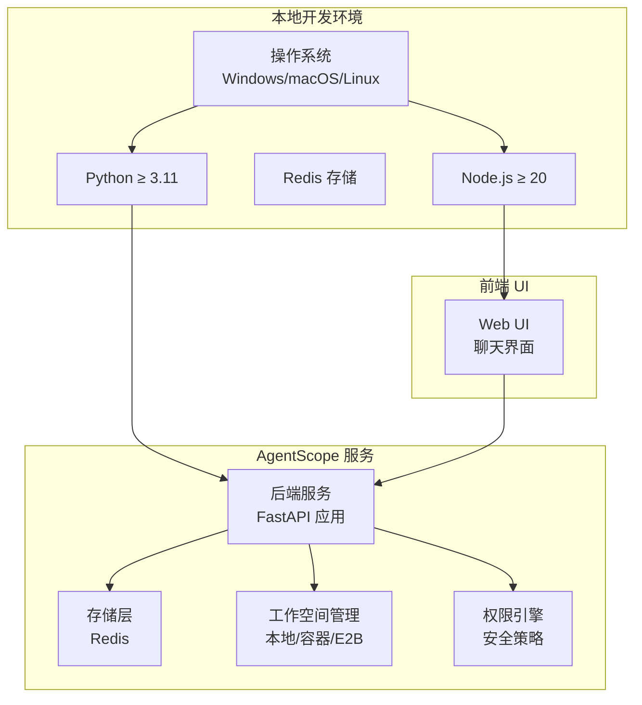
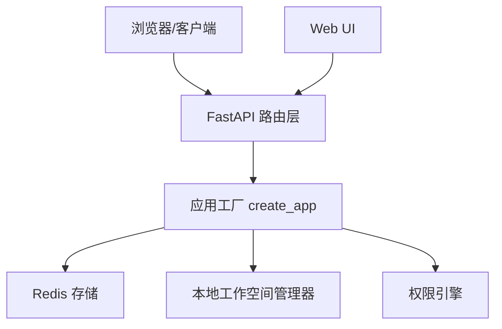
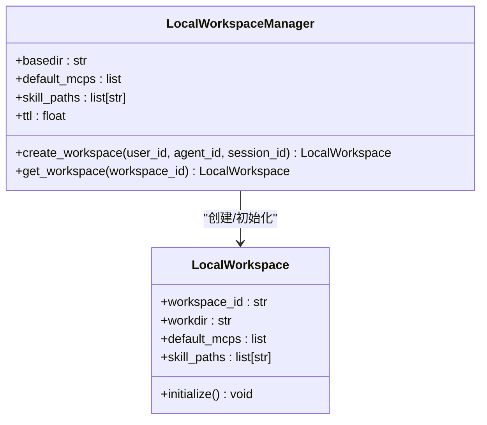
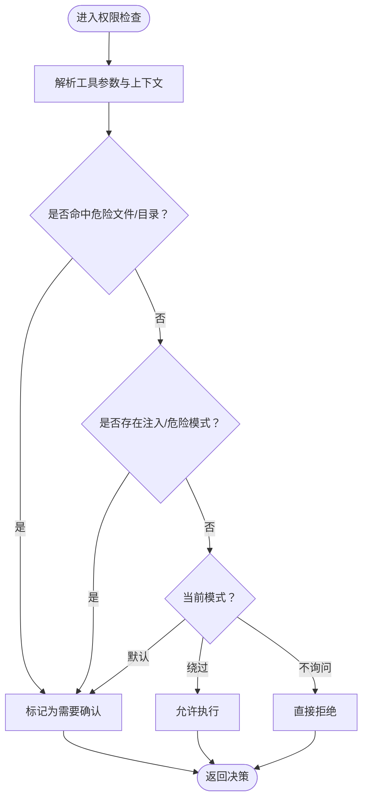
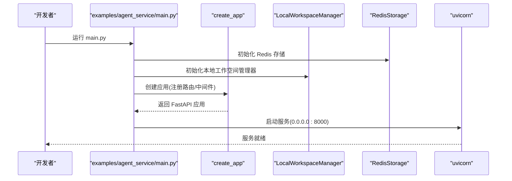
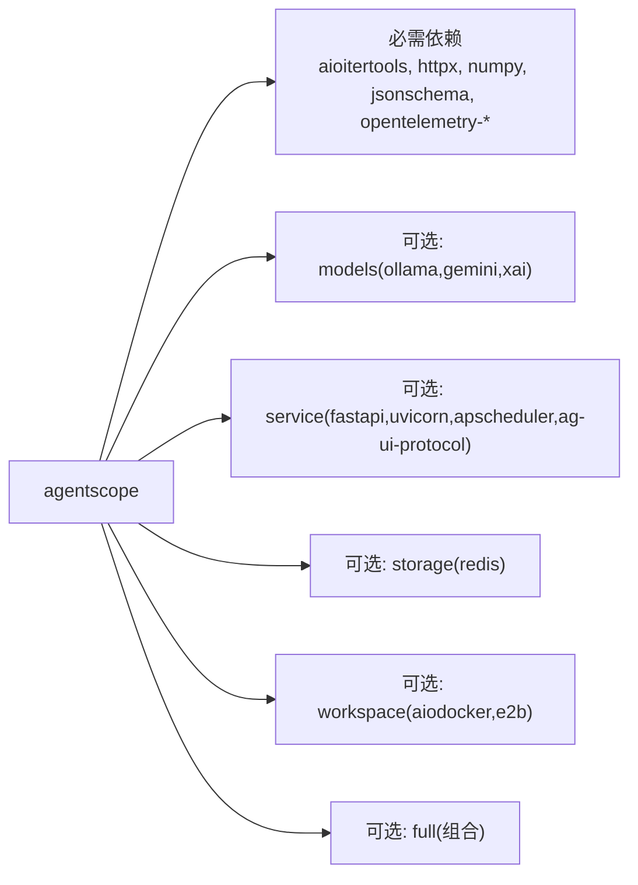

# 本地部署

<cite>
**本文引用的文件**
- [README.md](file://README.md)
- [pyproject.toml](file://pyproject.toml)
- [examples/agent_service/README.md](file://examples/agent_service/README.md)
- [examples/agent_service/main.py](file://examples/agent_service/main.py)
- [src/agentscope/app/_manager/_workspace_manager.py](file://src/agentscope/app/_manager/_workspace_manager.py)
- [src/agentscope/workspace/_local_workspace.py](file://src/agentscope/workspace/_local_workspace.py)
- [src/agentscope/tool/_constants.py](file://src/agentscope/tool/_constants.py)
- [src/agentscope/permission/_engine.py](file://src/agentscope/permission/_engine.py)
- [src/agentscope/permission/_decision.py](file://src/agentscope/permission/_decision.py)
- [src/agentscope/permission/_rule.py](file://src/agentscope/permission/_rule.py)
- [src/agentscope/permission/_types.py](file://src/agentscope/permission/_types.py)
- [src/agentscope/permission/_context.py](file://src/agentscope/permission/_context.py)
- [src/agentscope/workspace/_docker/_docker_workspace.py](file://src/agentscope/workspace/_docker/_docker_workspace.py)
- [src/agentscope/workspace/_docker/_make_dockerfile.py](file://src/agentscope/workspace/_docker/_make_dockerfile.py)
- [src/agentscope/workspace/_e2b/_e2b_workspace.py](file://src/agentscope/workspace/_e2b/_e2b_workspace.py)
- [src/agentscope/app/_app.py](file://src/agentscope/app/_app.py)
- [src/agentscope/app/storage/_redis_storage.py](file://src/agentscope/app/storage/_redis_storage.py)
- [src/agentscope/app/_deps.py](file://src/agentscope/app/_deps.py)
- [src/agentscope/app/_lifespan.py](file://src/agentscope/app/_lifespan.py)
- [src/agentscope/app/_types.py](file://src/agentscope/app/_types.py)
- [src/agentscope/app/_router/_workspace.py](file://src/agentscope/app/_router/_workspace.py)
- [src/agentscope/app/_router/_agent.py](file://src/agentscope/app/_router/_agent.py)
- [src/agentscope/app/_router/_session.py](file://src/agentscope/app/_router/_session.py)
- [src/agentscope/app/_router/_credential.py](file://src/agentscope/app/_router/_credential.py)
- [src/agentscope/app/_router/_chat.py](file://src/agentscope/app/_router/_chat.py)
- [src/agentscope/app/_router/_schedule.py](file://src/agentscope/app/_router/_schedule.py)
- [src/agentscope/app/_router/_background_task.py](file://src/agentscope/app/_router/_background_task.py)
- [src/agentscope/app/_router/_model.py](file://src/agentscope/app/_router/_model.py)
- [src/agentscope/app/_middleware/_tool_offload_middleware.py](file://src/agentscope/app/_middleware/_tool_offload_middleware.py)
- [src/agentscope/app/_middleware/_protocol/_agui.py](file://src/agentscope/app/_middleware/_protocol/_agui.py)
- [src/agentscope/app/_middleware/_protocol/_base.py](file://src/agentscope/app/_middleware/_protocol/_base.py)
- [src/agentscope/app/_manager/_scheduler/_scheduler_manager.py](file://src/agentscope/app/_manager/_scheduler/_scheduler_manager.py)
- [src/agentscope/app/_manager/_scheduler/_tools/_schedule_create.py](file://src/agentscope/app/_manager/_scheduler/_tools/_schedule_create.py)
- [src/agentscope/app/_manager/_scheduler/_tools/_schedule_list.py](file://src/agentscope/app/_manager/_scheduler/_tools/_schedule_list.py)
- [src/agentscope/app/_manager/_scheduler/_tools/_schedule_stop.py](file://src/agentscope/app/_manager/_scheduler/_tools/_schedule_stop.py)
- [src/agentscope/app/_manager/_scheduler/_tools/_schedule_view.py](file://src/agentscope/app/_manager/_scheduler/_tools/_schedule_view.py)
- [src/agentscope/app/_manager/_background_task_manager.py](file://src/agentscope/app/_manager/_background_task_manager.py)
- [src/agentscope/app/_manager/_session_manager.py](file://src/agentscope/app/_manager/_session_manager.py)
- [src/agentscope/app/_schema/_agent.py](file://src/agentscope/app/_schema/_agent.py)
- [src/agentscope/app/_schema/_background_task.py](file://src/agentscope/app/_schema/_background_task.py)
- [src/agentscope/app/_schema/_chat.py](file://src/agentscope/app/_schema/_chat.py)
- [src/agentscope/app/_schema/_credential.py](file://src/agentscope/app/_schema/_credential.py)
- [src/agentscope/app/_schema/_mcp.py](file://src/agentscope/app/_schema/_mcp.py)
- [src/agentscope/app/_schema/_model.py](file://src/agentscope/app/_schema/_model.py)
- [src/agentscope/app/_schema/_schedule.py](file://src/agentscope/app/_schema/_schedule.py)
- [src/agentscope/app/_schema/_session.py](file://src/agentscope/app/_schema/_session.py)
- [src/agentscope/app/storage/_model/_agent.py](file://src/agentscope/app/storage/_model/_agent.py)
- [src/agentscope/app/storage/_model/_base.py](file://src/agentscope/app/storage/_model/_base.py)
- [src/agentscope/app/storage/_model/_credential.py](file://src/agentscope/app/storage/_model/_credential.py)
- [src/agentscope/app/storage/_model/_schedule.py](file://src/agentscope/app/storage/_model/_schedule.py)
- [src/agentscope/app/storage/_model/_session.py](file://src/agentscope/app/storage/_model/_session.py)
- [src/agentscope/app/storage/_model/_user.py](file://src/agentscope/app/storage/_model/_user.py)
- [src/agentscope/app/storage/_base.py](file://src/agentscope/app/storage/_base.py)
- [src/agentscope/app/storage/_redis_storage.py](file://src/agentscope/app/storage/_redis_storage.py)
- [src/agentscope/app/_service/_agent.py](file://src/agentscope/app/_service/_agent.py)
- [src/agentscope/app/_service/_chat.py](file://src/agentscope/app/_service/_chat.py)
- [src/agentscope/app/_service/_model.py](file://src/agentscope/app/_service/_model.py)
- [src/agentscope/app/_service/_background_task.py](file://src/agentscope/app/_service/_background_task.py)
- [src/agentscope/app/_service/_session.py](file://src/agentscope/app/_service/_session.py)
- [src/agentscope/app/_service/_credential.py](file://src/agentscope/app/_service/_credential.py)
- [src/agentscope/app/_service/_workspace.py](file://src/agentscope/app/_service/_workspace.py)
- [src/agentscope/app/_service/_schedule.py](file://src/agentscope/app/_service/_schedule.py)
- [src/agentscope/app/_service/_model.py](file://src/agentscope/app/_service/_model.py)
- [src/agentscope/app/_service/_background_task.py](file://src/agentscope/app/_service/_background_task.py)
- [src/agentscope/app/_service/_session.py](file://src/agentscope/app/_service/_session.py)
- [src/agentscope/app/_service/_credential.py](file://src/agentscope/app/_service/_credential.py)
- [src/agentscope/app/_service/_workspace.py](file://src/agentscope/app/_service/_workspace.py)
- [src/agentscope/app/_service/_schedule.py](file://src/agentscope/app/_service/_schedule.py)
- [src/agentscope/app/_service/_model.py](file://src/agentscope/app/_service/_model.py)
- [src/agentscope/app/_service/_background_task.py](file://src/agentscope/app/_service/_background_task.py)
- [src/agentscope/app/_service/_session.py](file://src/agentscope/app/_service/_session.py)
- [src/agentscope/app/_service/_credential.py](file://src/agentscope/app/_service/_credential.py)
- [src/agentscope/app/_service/_workspace.py](file://src/agentscope/app/_service/_workspace.py)
- [src/agentscope/app/_service/_schedule.py](file://src/agentscope/app/_service/_schedule.py)
- [src/agentscope/app/_service/_model.py](file://src/agentscope/app/_service/_model.py)
- [src/agentscope/app/_service/_background_task.py](file://src/agentscope/app/_service/_background_task.py)
- [src/agentscope/app/_service/_session.py](file://src/agentscope/app/_service/_session.py)
- [src/agentscope/app/_service/_credential.py](file://src/agentscope/app/_service/_credential.py)
- [src/agentscope/app/_service/_workspace.py](file://src/agentscope/app/_service/_workspace.py)
- [src/agentscope/app/_service/_schedule.py](file://src/agentscope/app/_service/_schedule.py)
- [src/agentscope/app/_service/_model.py](file://src/agentscope/app/_service/_model.py)
- [src/agentscope/app/_service/_background_task.py](file://src/agentscope/app/_service/_background_task.py)
- [src/agentscope/app/_service/_session.py](file://src/agentscope/app/_service/_session.py)
- [src/agentscope/app/_service/_credential.py](file://src/agentscope/app/_service/_credential.py)
- [src/agentscope/app/_service/_workspace.py](file://src/agentscope/app/_service/_workspace.py)
- [src/agentscope/app/_service/_schedule.py](file://src/agentscope/app/_service/_schedule.py)
- [src/agentscope/app/_service/_model.py](file://src/agentscope/app/_service/_model.py)
- [src/agentscope/app/_service/_background_task.py](file://src/agentscope/app/_service/_background_task.py)
- [src/agentscope/app/_service/_session.py](file://src/agentscope/app/_service/_session.py)
- [src/agentscope/app/_service/_credential.py](file://src/agentscope/app/_service/_credential.py)
- [src/agentscope/app/_service/_workspace.py](file://src/agentscope/app/_service/_workspace.py)
- [src/agentscope/app/_service/_schedule.py](file://src/agentscope/app/_service/_schedule.py)
- [src/agentscope/app/_service/_model.py](file://src/agentscope/app/_service/_model.py)
- [src/agentscope/app/_service/_background_task.py](file://src/agentscope/app/_service/_background_task.py)
- [src/agentscope/app/_service/_session.py](file://src/agentscope/app/_service/_session.py)
- [src......
</cite>

## 目录
1. [简介](#简介)
2. [项目结构](#项目结构)
3. [核心组件](#核心组件)
4. [架构总览](#架构总览)
5. [详细组件分析](#详细组件分析)
6. [依赖关系分析](#依赖关系分析)
7. [性能考虑](#性能考虑)
8. [故障排查指南](#故障排查指南)
9. [结论](#结论)
10. [附录](#附录)

## 简介
本文件面向在本地单机部署 AgentScope 的用户，提供从环境准备、依赖安装、配置与启动到工作空间管理的完整指南，并覆盖 Windows、macOS、Linux 三大平台的差异化步骤。同时给出常见问题排查与性能调优建议，以及可直接复用的部署脚本与配置要点。

## 项目结构
AgentScope 提供“服务端 + Web UI”的本地体验路径，核心入口位于示例工程中：
- 后端服务：基于 FastAPI 的多租户、多会话 Agent 服务，示例位于 examples/agent_service
- 前端 UI：examples/web_ui 提供聊天式交互界面
- 核心框架：src/agentscope 下为运行时能力（应用、存储、工作空间、权限、工具等）

图表来源
- [examples/agent_service/README.md:12-78](file://examples/agent_service/README.md#L12-L78)
- [examples/agent_service/main.py:1-72](file://examples/agent_service/main.py#L1-L72)
- [src/agentscope/app/_manager/_workspace_manager.py:79-211](file://src/agentscope/app/_manager/_workspace_manager.py#L79-L211)
- [src/agentscope/app/storage/_redis_storage.py](file://src/agentscope/app/storage/_redis_storage.py)

章节来源
- [README.md:106-133](file://README.md#L106-L133)
- [examples/agent_service/README.md:12-78](file://examples/agent_service/README.md#L12-L78)

## 核心组件
- 应用与路由：后端通过 create_app 构建，注册多模块路由（代理、会话、凭证、模型、调度、后台任务、工作空间等）
- 存储：支持 Redis 存储，用于会话、代理、计划等数据持久化
- 工作空间：本地工作空间（LocalWorkspace）按 agent_id 组织工作目录；支持默认 MCP 客户端注入
- 权限系统：内置危险文件/目录白名单与注入检测，支持多种模式（默认、绕过、不询问、需要确认）
- 中间件：工具离载中间件、AGUI 协议中间件等

章节来源
- [src/agentscope/app/_app.py](file://src/agentscope/app/_app.py)
- [src/agentscope/app/_router/_workspace.py](file://src/agentscope/app/_router/_workspace.py)
- [src/agentscope/app/_router/_agent.py](file://src/agentscope/app/_router/_agent.py)
- [src/agentscope/app/_router/_session.py](file://src/agentscope/app/_router/_session.py)
- [src/agentscope/app/_router/_credential.py](file://src/agentscope/app/_router/_credential.py)
- [src/agentscope/app/_router/_chat.py](file://src/agentscope/app/_router/_chat.py)
- [src/agentscope/app/_router/_schedule.py](file://src/agentscope/app/_router/_schedule.py)
- [src/agentscope/app/_router/_background_task.py](file://src/agentscope/app/_router/_background_task.py)
- [src/agentscope/app/_router/_model.py](file://src/agentscope/app/_router/_model.py)
- [src/agentscope/app/_middleware/_tool_offload_middleware.py](file://src/agentscope/app/_middleware/_tool_offload_middleware.py)
- [src/agentscope/app/_middleware/_protocol/_agui.py](file://src/agentscope/app/_middleware/_protocol/_agui.py)
- [src/agentscope/app/_middleware/_protocol/_base.py](file://src/agentscope/app/_middleware/_protocol/_base.py)
- [src/agentscope/app/_manager/_scheduler/_scheduler_manager.py](file://src/agentscope/app/_manager/_scheduler/_scheduler_manager.py)
- [src/agentscope/app/_manager/_background_task_manager.py](file://src/agentscope/app/_manager/_background_task_manager.py)
- [src/agentscope/app/_manager/_session_manager.py](file://src/agentscope/app/_manager/_session_manager.py)
- [src/agentscope/app/storage/_redis_storage.py](file://src/agentscope/app/storage/_redis_storage.py)

## 架构总览
下图展示本地部署的整体架构：后端服务监听 8000 端口，使用 Redis 作为存储，工作空间采用本地管理器，Web UI 通过浏览器访问后端接口。

图表来源
- [examples/agent_service/main.py:40-72](file://examples/agent_service/main.py#L40-L72)
- [src/agentscope/app/_app.py](file://src/agentscope/app/_app.py)
- [src/agentscope/app/storage/_redis_storage.py](file://src/agentscope/app/storage/_redis_storage.py)
- [src/agentscope/app/_manager/_workspace_manager.py:79-211](file://src/agentscope/app/_manager/_workspace_manager.py#L79-L211)

## 详细组件分析

### 本地工作空间（LocalWorkspace）
- 工作目录组织：以 agent_id 为子目录，路径确定性，便于本地调试与持久化
- 初始化流程：首次创建时可注入默认 MCP 客户端与技能目录
- 缓存与 TTL：工作空间实例按 workspace_id 缓存，空闲超时后回收

图表来源
- [src/agentscope/app/_manager/_workspace_manager.py:79-211](file://src/agentscope/app/_manager/_workspace_manager.py#L79-L211)
- [src/agentscope/workspace/_local_workspace.py:127-158](file://src/agentscope/workspace/_local_workspace.py#L127-L158)

章节来源
- [src/agentscope/app/_manager/_workspace_manager.py:79-211](file://src/agentscope/app/_manager/_workspace_manager.py#L79-L211)
- [src/agentscope/workspace/_local_workspace.py:127-158](file://src/agentscope/workspace/_local_workspace.py#L127-L158)

### 权限系统（Permission Engine）
- 危险文件/目录白名单：内置常见敏感路径，禁止自动编辑/写入
- 注入检测：对命令注入、危险删除路径、sed 执行等进行安全检查
- 模式控制：支持默认、绕过、不询问、需要确认四种模式，且安全检查对“绕过”免疫

图表来源
- [src/agentscope/tool/_constants.py:1-50](file://src/agentscope/tool/_constants.py#L1-L50)
- [src/agentscope/permission/_engine.py](file://src/agentscope/permission/_engine.py)
- [src/agentscope/permission/_decision.py](file://src/agentscope/permission/_decision.py)
- [src/agentscope/permission/_rule.py](file://src/agentscope/permission/_rule.py)
- [src/agentscope/permission/_types.py](file://src/agentscope/permission/_types.py)
- [src/agentscope/permission/_context.py](file://src/agentscope/permission/_context.py)

章节来源
- [src/agentscope/tool/_constants.py:1-50](file://src/agentscope/tool/_constants.py#L1-L50)
- [src/agentscope/permission/_engine.py](file://src/agentscope/permission/_engine.py)
- [src/agentscope/permission/_decision.py](file://src/agentscope/permission/_decision.py)
- [src/agentscope/permission/_rule.py](file://src/agentscope/permission/_rule.py)
- [src/agentscope/permission/_types.py](file://src/agentscope/permission/_types.py)
- [src/agentscope/permission/_context.py](file://src/agentscope/permission/_context.py)

### 后端服务启动流程（示例）
- 创建应用：传入 Redis 存储、本地工作空间管理器、CORS 中间件
- 启动服务：uvicorn 在 0.0.0.0:8000 上监听，支持热重载

图表来源
- [examples/agent_service/main.py:40-72](file://examples/agent_service/main.py#L40-L72)

章节来源
- [examples/agent_service/main.py:40-72](file://examples/agent_service/main.py#L40-L72)

## 依赖关系分析
- Python 版本：要求 Python ≥ 3.11
- 必需依赖：aioitertools、dashscope、anthropic、openai、httpx、numpy、jsonschema、opentelemetry-* 等
- 可选功能：models（ollama/gemini/xai）、service（fastapi/uvicorn/apscheduler/ag-ui-protocol）、storage（redis）、workspace（aiodocker/e2b）、full（组合上述全部）

图表来源
- [pyproject.toml:22-82](file://pyproject.toml#L22-L82)

章节来源
- [pyproject.toml:22-82](file://pyproject.toml#L22-L82)

## 性能考虑
- 工作空间缓存与 TTL：合理设置本地工作空间的空闲超时，避免过多常驻进程占用资源
- 存储选择：生产或高并发场景建议使用 Redis 集群；本地开发可用单实例
- 中间件与协议：工具离载中间件与 AGUI 协议可能带来额外开销，按需启用
- 平台差异：Windows 不支持 Bash 工具，跨平台兼容性需注意

## 故障排查指南
- 端口冲突：确保 8000 端口未被占用，或修改示例中的端口配置
- Redis 连接失败：确认 Redis 已安装并运行，主机与端口配置正确
- 权限拒绝：若工具操作被拒绝，检查危险文件/目录白名单与注入检测规则
- 跨域问题：示例已启用 CORS，如仍出现跨域，请检查前端与后端地址一致
- 平台限制：Windows 不支持 Bash 工具，如需 Bash 能力请使用 Linux/macOS 或容器/E2B 工作空间

章节来源
- [examples/agent_service/main.py:53-61](file://examples/agent_service/main.py#L53-L61)
- [src/agentscope/tool/_constants.py:1-50](file://src/agentscope/tool/_constants.py#L1-L50)
- [src/agentscope/permission/_engine.py](file://src/agentscope/permission/_engine.py)

## 结论
通过本指南，您可以在本地快速完成 AgentScope 的单机部署，启动后端服务与 Web UI，并基于本地工作空间进行开发与调试。根据实际需求选择存储与工作空间类型，结合权限系统保障安全，按需优化性能并排查常见问题。

## 附录

### 一、环境与依赖安装（通用）
- Python：版本要求 ≥ 3.11
- 包管理：推荐使用 uv，也可使用 pip
- 安装方式：
  - 从 PyPI 安装：agentscope 或 agentscope[full]
  - 从源码安装：克隆仓库后以可编辑模式安装

章节来源
- [README.md:108-133](file://README.md#L108-L133)
- [pyproject.toml:50-82](file://pyproject.toml#L50-L82)

### 二、Redis 存储（本地/容器）
- macOS（Homebrew）
  - brew install redis
  - brew services start redis
- Linux（systemd）
  - sudo apt install redis-server
  - sudo systemctl start redis-server
- Docker（跨平台）
  - docker run --rm -p 6379:6379 redis:7

章节来源
- [examples/agent_service/README.md:28-41](file://examples/agent_service/README.md#L28-L41)

### 三、启动后端服务
- 进入示例目录
  - cd examples/agent_service
- 启动服务
  - python main.py

章节来源
- [examples/agent_service/README.md:43-49](file://examples/agent_service/README.md#L43-L49)
- [examples/agent_service/main.py:64-72](file://examples/agent_service/main.py#L64-L72)

### 四、启动 Web UI
- 进入前端目录
  - cd examples/web_ui
- 安装依赖
  - pnpm install
- 开发模式启动
  - pnpm dev
- 在 UI 中设置后端地址为 http://localhost:8000

章节来源
- [examples/agent_service/README.md:51-61](file://examples/agent_service/README.md#L51-L61)

### 五、本地工作空间配置与使用
- 工作目录设置：示例中默认在 examples/agent_service/workspaces 下按 agent_id 组织工作空间
- 权限配置：通过权限引擎的模式与规则控制工具执行行为
- 环境变量管理：可在启动前设置 AMAP_API_KEY 等环境变量以启用相应 MCP 服务

章节来源
- [examples/agent_service/main.py:45-52](file://examples/agent_service/main.py#L45-L52)
- [src/agentscope/app/_manager/_workspace_manager.py:79-211](file://src/agentscope/app/_manager/_workspace_manager.py#L79-L211)
- [src/agentscope/permission/_engine.py](file://src/agentscope/permission/_engine.py)

### 六、不同操作系统部署要点
- Windows
  - Python：≥ 3.11
  - Redis：可使用 Docker 或系统包管理器安装
  - Bash 工具不可用，如需 Bash 能力请使用容器或 E2B 工作空间
- macOS
  - 推荐使用 Homebrew 安装 Redis
  - Node.js ≥ 20，使用 pnpm
- Linux
  - 使用包管理器安装 Redis 与 Node.js
  - Docker 可用于快速部署 Redis 与工作空间

章节来源
- [examples/agent_service/README.md:12-17](file://examples/agent_service/README.md#L12-L17)
- [examples/agent_service/README.md:28-41](file://examples/agent_service/README.md#L28-L41)
- [examples/agent_service/main.py:28-38](file://examples/agent_service/main.py#L28-L38)

### 七、部署脚本与配置示例（路径参考）
- 后端服务启动脚本：见 examples/agent_service/main.py
- Web UI 启动脚本：见 examples/web_ui/package.json（开发模式命令为 pnpm dev）
- 配置示例（路径参考）
  - 本地工作空间：examples/agent_service/main.py 中的 LocalWorkspaceManager 初始化
  - Redis 存储：examples/agent_service/main.py 中的 RedisStorage 初始化
  - 权限系统：src/agentscope/permission/* 下的引擎与规则定义

章节来源
- [examples/agent_service/main.py:40-72](file://examples/agent_service/main.py#L40-L72)
- [src/agentscope/app/storage/_redis_storage.py](file://src/agentscope/app/storage/_redis_storage.py)
- [src/agentscope/permission/_engine.py](file://src/agentscope/permission/_engine.py)