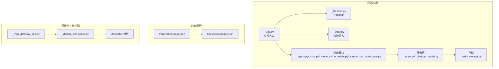
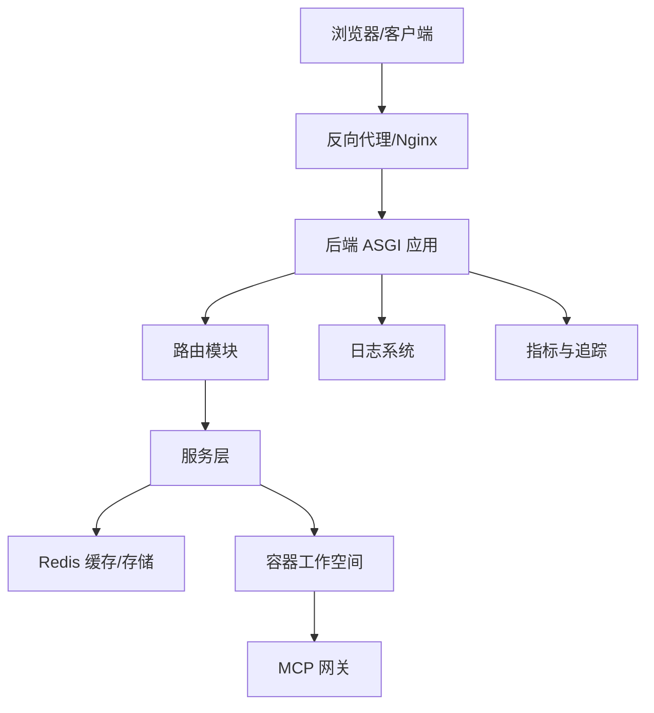
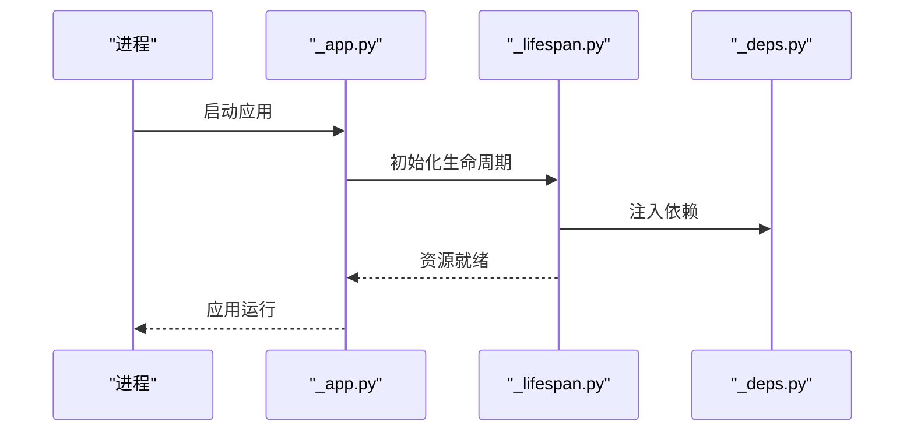
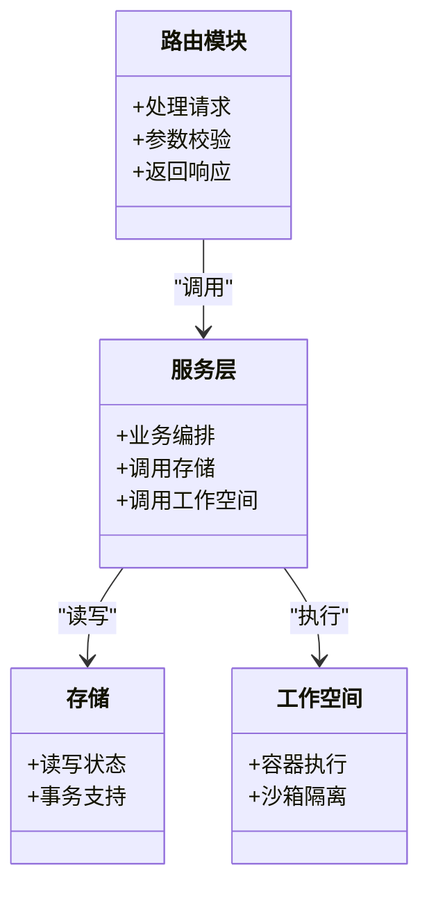
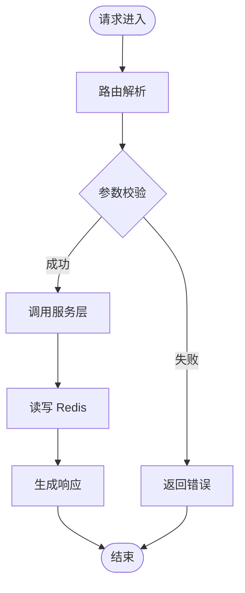
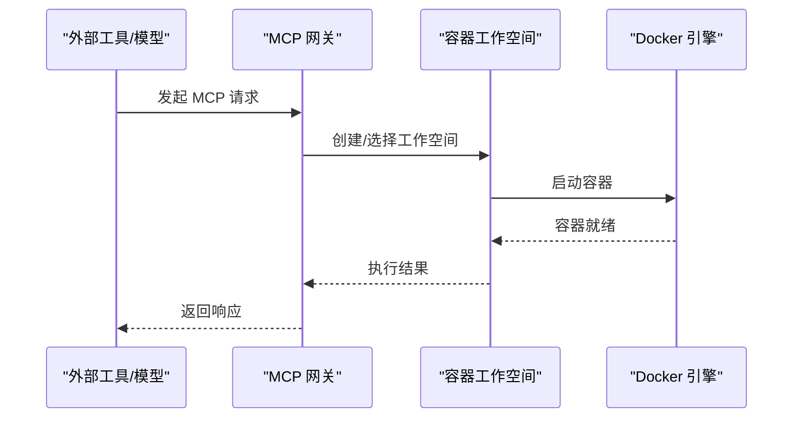
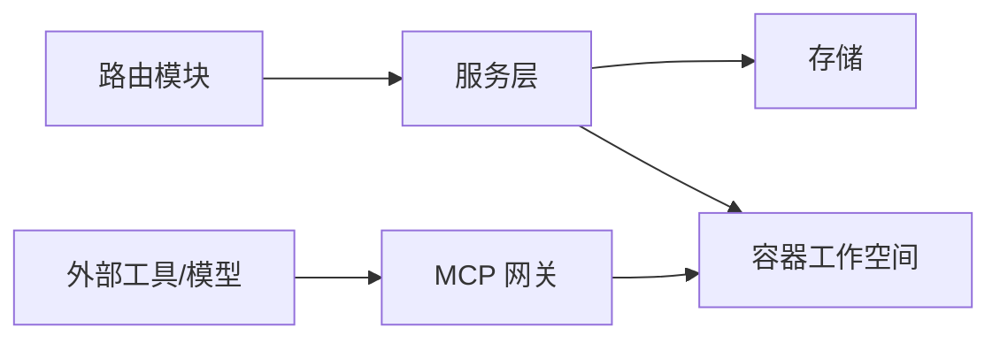

# 生产环境部署

<cite>
**本文引用的文件**
- [README.md](file://README.md)
- [pyproject.toml](file://pyproject.toml)
- [examples/web_ui/backend/package.json](file://examples/web_ui/backend/package.json)
- [examples/web_ui/frontend/package.json](file://examples/web_ui/frontend/package.json)
- [src/agentscope/app/_app.py](file://src/agentscope/app/_app.py)
- [src/agentscope/app/_lifespan.py](file://src/agentscope/app/_lifespan.py)
- [src/agentscope/app/_deps.py](file://src/agentscope/app/_deps.py)
- [src/agentscope/app/_router/_agent.py](file://src/agentscope/app/_router/_agent.py)
- [src/agentscope/app/_router/_chat.py](file://src/agentscope/app/_router/_chat.py)
- [src/agentscope/app/_router/_credential.py](file://src/agentscope/app/_router/_credential.py)
- [src/agentscope/app/_router/_model.py](file://src/agentscope/app/_router/_model.py)
- [src/agentscope/app/_router/_schedule.py](file://src/agentscope/app/_router/_schedule.py)
- [src/agentscope/app/_router/_session.py](file://src/agentscope/app/_router/_session.py)
- [src/agentscope/app/_router/_workspace.py](file://src/agentscope/app/_router/_workspace.py)
- [src/agentscope/app/_service/_agent.py](file://src/agentscope/app/_service/_agent.py)
- [src/agentscope/app/_service/_chat.py](file://src/agentscope/app/_service/_chat.py)
- [src/agentscope/app/_service/_model.py](file://src/agentscope/app/_service/_model.py)
- [src/agentscope/app/storage/_redis_storage.py](file://src/agentscope/app/storage/_redis_storage.py)
- [src/agentscope/workspace/_docker/Dockerfile.template](file://src/agentscope/workspace/_docker/Dockerfile.template)
- [src/agentscope/workspace/_docker/Dockerfile.install_pypi.template](file://src/agentscope/workspace/_docker/Dockerfile.install_pypi.template)
- [src/agentscope/workspace/_docker/Dockerfile.install_src.template](file://src/agentscope/workspace/_docker/Dockerfile.install_src.template)
- [src/agentscope/workspace/_docker/_docker_workspace.py](file://src/agentscope/workspace/_docker/_docker_workspace.py)
- [src/agentscope/workspace/_mcp_gateway/_mcp_gateway_app.py](file://src/agentscope/workspace/_mcp_gateway/_mcp_gateway_app.py)
- [src/agentscope/middleware/_tracing/_setup.py](file://src/agentscope/middleware/_tracing/_setup.py)
- [src/agentscope/_logging.py](file://src/agentscope/_logging.py)
- [src/agentscope/_version.py](file://src/agentscope/_version.py)
- [.github/workflows](file://.github/workflows)
</cite>

## 目录
1. [简介](#简介)
2. [项目结构](#项目结构)
3. [核心组件](#核心组件)
4. [架构总览](#架构总览)
5. [详细组件分析](#详细组件分析)
6. [依赖关系分析](#依赖关系分析)
7. [性能考虑](#性能考虑)
8. [故障排查指南](#故障排查指南)
9. [结论](#结论)
10. [附录](#附录)

## 简介
本指南面向在生产环境中部署 AgentScope 的工程团队，目标是提供一套可落地的部署架构与运维实践，涵盖微服务拆分、服务间通信、数据流管理、监控告警、负载均衡与高可用、安全加固、自动化流水线、版本管理与回滚策略，以及容量规划与性能调优建议。文档以仓库现有代码为依据，结合后端应用框架、前端 Web UI、容器化与工作空间能力，给出可操作的部署蓝图。

## 项目结构
AgentScope 采用 Python 后端与 TypeScript 前端分离的多模块组织方式：
- 后端核心：位于 src/agentscope，包含应用框架（路由、服务层、存储）、工具与技能、模型适配器、权限与中间件等。
- 前端示例：examples/web_ui 提供基于 Vite + React 的 Web UI 示例，包含后端接口对接与会话交互。
- 容器化与工作空间：src/agentscope/workspace 下提供 Docker 工作空间模板与 MCP 网关应用，支持沙箱执行与外部工具链集成。
- 配置与打包：pyproject.toml 定义项目元数据与依赖；各子包有独立 package.json（如 Web UI）。

**图表来源**
- [src/agentscope/app/_app.py](file://src/agentscope/app/_app.py)
- [src/agentscope/app/_lifespan.py](file://src/agentscope/app/_lifespan.py)
- [src/agentscope/app/_deps.py](file://src/agentscope/app/_deps.py)
- [src/agentscope/app/_router/_agent.py](file://src/agentscope/app/_router/_agent.py)
- [src/agentscope/app/_router/_chat.py](file://src/agentscope/app/_router/_chat.py)
- [src/agentscope/app/_router/_model.py](file://src/agentscope/app/_router/_model.py)
- [src/agentscope/app/_router/_schedule.py](file://src/agentscope/app/_router/_schedule.py)
- [src/agentscope/app/_router/_session.py](file://src/agentscope/app/_router/_session.py)
- [src/agentscope/app/_router/_workspace.py](file://src/agentscope/app/_router/_workspace.py)
- [src/agentscope/app/_service/_agent.py](file://src/agentscope/app/_service/_agent.py)
- [src/agentscope/app/_service/_chat.py](file://src/agentscope/app/_service/_chat.py)
- [src/agentscope/app/_service/_model.py](file://src/agentscope/app/_service/_model.py)
- [src/agentscope/app/storage/_redis_storage.py](file://src/agentscope/app/storage/_redis_storage.py)
- [src/agentscope/workspace/_docker/Dockerfile.template](file://src/agentscope/workspace/_docker/Dockerfile.template)
- [src/agentscope/workspace/_docker/_docker_workspace.py](file://src/agentscope/workspace/_docker/_docker_workspace.py)
- [src/agentscope/workspace/_mcp_gateway/_mcp_gateway_app.py](file://src/agentscope/workspace/_mcp_gateway/_mcp_gateway_app.py)
- [examples/web_ui/frontend/package.json](file://examples/web_ui/frontend/package.json)
- [examples/web_ui/backend/package.json](file://examples/web_ui/backend/package.json)

**章节来源**
- [README.md](file://README.md)
- [pyproject.toml](file://pyproject.toml)
- [src/agentscope/app/_app.py](file://src/agentscope/app/_app.py)
- [src/agentscope/app/_router/_agent.py](file://src/agentscope/app/_router/_agent.py)
- [src/agentscope/app/_router/_chat.py](file://src/agentscope/app/_router/_chat.py)
- [src/agentscope/app/_router/_model.py](file://src/agentscope/app/_router/_model.py)
- [src/agentscope/app/_router/_schedule.py](file://src/agentscope/app/_router/_schedule.py)
- [src/agentscope/app/_router/_session.py](file://src/agentscope/app/_router/_session.py)
- [src/agentscope/app/_router/_workspace.py](file://src/agentscope/app/_router/_workspace.py)
- [src/agentscope/app/_service/_agent.py](file://src/agentscope/app/_service/_agent.py)
- [src/agentscope/app/_service/_chat.py](file://src/agentscope/app/_service/_chat.py)
- [src/agentscope/app/_service/_model.py](file://src/agentscope/app/_service/_model.py)
- [src/agentscope/app/storage/_redis_storage.py](file://src/agentscope/app/storage/_redis_storage.py)
- [src/agentscope/workspace/_docker/Dockerfile.template](file://src/agentscope/workspace/_docker/Dockerfile.template)
- [src/agentscope/workspace/_docker/_docker_workspace.py](file://src/agentscope/workspace/_docker/_docker_workspace.py)
- [src/agentscope/workspace/_mcp_gateway/_mcp_gateway_app.py](file://src/agentscope/workspace/_mcp_gateway/_mcp_gateway_app.py)
- [examples/web_ui/frontend/package.json](file://examples/web_ui/frontend/package.json)
- [examples/web_ui/backend/package.json](file://examples/web_ui/backend/package.json)

## 核心组件
- 应用入口与生命周期：应用通过入口模块初始化，生命周期钩子负责启动与关闭时的资源准备与释放。
- 路由与服务层：按领域拆分为 agent、chat、model、schedule、session、workspace 等路由模块，对应的服务层封装业务逻辑。
- 存储：使用 Redis 作为主要存储后端，支撑会话、凭证、计划任务等状态管理。
- 容器与工作空间：提供 Dockerfile 模板与工作空间实现，支持沙箱运行与外部工具链集成。
- MCP 网关：提供 MCP（Model Context Protocol）网关应用，便于与外部工具或模型服务互通。
- 日志与追踪：内置日志模块与分布式追踪设置，便于生产可观测性。

**章节来源**
- [src/agentscope/app/_app.py](file://src/agentscope/app/_app.py)
- [src/agentscope/app/_lifespan.py](file://src/agentscope/app/_lifespan.py)
- [src/agentscope/app/_router/_agent.py](file://src/agentscope/app/_router/_agent.py)
- [src/agentscope/app/_router/_chat.py](file://src/agentscope/app/_router/_chat.py)
- [src/agentscope/app/_router/_model.py](file://src/agentscope/app/_router/_model.py)
- [src/agentscope/app/_router/_schedule.py](file://src/agentscope/app/_router/_schedule.py)
- [src/agentscope/app/_router/_session.py](file://src/agentscope/app/_router/_session.py)
- [src/agentscope/app/_router/_workspace.py](file://src/agentscope/app/_router/_workspace.py)
- [src/agentscope/app/_service/_agent.py](file://src/agentscope/app/_service/_agent.py)
- [src/agentscope/app/_service/_chat.py](file://src/agentscope/app/_service/_chat.py)
- [src/agentscope/app/_service/_model.py](file://src/agentscope/app/_service/_model.py)
- [src/agentscope/app/storage/_redis_storage.py](file://src/agentscope/app/storage/_redis_storage.py)
- [src/agentscope/workspace/_docker/_docker_workspace.py](file://src/agentscope/workspace/_docker/_docker_workspace.py)
- [src/agentscope/workspace/_mcp_gateway/_mcp_gateway_app.py](file://src/agentscope/workspace/_mcp_gateway/_mcp_gateway_app.py)
- [src/agentscope/_logging.py](file://src/agentscope/_logging.py)
- [src/agentscope/middleware/_tracing/_setup.py](file://src/agentscope/middleware/_tracing/_setup.py)

## 架构总览
AgentScope 生产部署建议采用“后端 API 服务 + 前端 Web UI + 容器化工作空间 + MCP 网关”的整体架构。后端以 ASGI 应用为核心，通过路由模块划分功能域，服务层处理业务，Redis 提供状态持久化。前端通过后端 API 进行会话、工具与模型交互。容器化工作空间用于隔离与扩展执行环境，MCP 网关用于外部协议接入。

**图表来源**
- [src/agentscope/app/_app.py](file://src/agentscope/app/_app.py)
- [src/agentscope/app/_router/_agent.py](file://src/agentscope/app/_router/_agent.py)
- [src/agentscope/app/_router/_chat.py](file://src/agentscope/app/_router/_chat.py)
- [src/agentscope/app/_router/_model.py](file://src/agentscope/app/_router/_model.py)
- [src/agentscope/app/_router/_schedule.py](file://src/agentscope/app/_router/_schedule.py)
- [src/agentscope/app/_router/_session.py](file://src/agentscope/app/_router/_session.py)
- [src/agentscope/app/_router/_workspace.py](file://src/agentscope/app/_router/_workspace.py)
- [src/agentscope/app/_service/_agent.py](file://src/agentscope/app/_service/_agent.py)
- [src/agentscope/app/_service/_chat.py](file://src/agentscope/app/_service/_chat.py)
- [src/agentscope/app/_service/_model.py](file://src/agentscope/app/_service/_model.py)
- [src/agentscope/app/storage/_redis_storage.py](file://src/agentscope/app/storage/_redis_storage.py)
- [src/agentscope/workspace/_docker/_docker_workspace.py](file://src/agentscope/workspace/_docker/_docker_workspace.py)
- [src/agentscope/workspace/_mcp_gateway/_mcp_gateway_app.py](file://src/agentscope/workspace/_mcp_gateway/_mcp_gateway_app.py)
- [src/agentscope/_logging.py](file://src/agentscope/_logging.py)
- [src/agentscope/middleware/_tracing/_setup.py](file://src/agentscope/middleware/_tracing/_setup.py)

## 详细组件分析

### 应用入口与生命周期
- 入口模块负责应用初始化、中间件注册与路由挂载。
- 生命周期模块在启动阶段建立数据库/缓存连接，在关闭阶段释放资源，确保优雅停机。

**图表来源**
- [src/agentscope/app/_app.py](file://src/agentscope/app/_app.py)
- [src/agentscope/app/_lifespan.py](file://src/agentscope/app/_lifespan.py)
- [src/agentscope/app/_deps.py](file://src/agentscope/app/_deps.py)

**章节来源**
- [src/agentscope/app/_app.py](file://src/agentscope/app/_app.py)
- [src/agentscope/app/_lifespan.py](file://src/agentscope/app/_lifespan.py)
- [src/agentscope/app/_deps.py](file://src/agentscope/app/_deps.py)

### 路由与服务层
- 路由模块按领域拆分，每个领域路由负责请求解析与响应封装。
- 服务层封装具体业务逻辑，调用存储与工作空间能力，保证领域职责清晰。

**图表来源**
- [src/agentscope/app/_router/_agent.py](file://src/agentscope/app/_router/_agent.py)
- [src/agentscope/app/_router/_chat.py](file://src/agentscope/app/_router/_chat.py)
- [src/agentscope/app/_router/_model.py](file://src/agentscope/app/_router/_model.py)
- [src/agentscope/app/_router/_schedule.py](file://src/agentscope/app/_router/_schedule.py)
- [src/agentscope/app/_router/_session.py](file://src/agentscope/app/_router/_session.py)
- [src/agentscope/app/_router/_workspace.py](file://src/agentscope/app/_router/_workspace.py)
- [src/agentscope/app/_service/_agent.py](file://src/agentscope/app/_service/_agent.py)
- [src/agentscope/app/_service/_chat.py](file://src/agentscope/app/_service/_chat.py)
- [src/agentscope/app/_service/_model.py](file://src/agentscope/app/_service/_model.py)
- [src/agentscope/app/storage/_redis_storage.py](file://src/agentscope/app/storage/_redis_storage.py)
- [src/agentscope/workspace/_docker/_docker_workspace.py](file://src/agentscope/workspace/_docker/_docker_workspace.py)

**章节来源**
- [src/agentscope/app/_router/_agent.py](file://src/agentscope/app/_router/_agent.py)
- [src/agentscope/app/_router/_chat.py](file://src/agentscope/app/_router/_chat.py)
- [src/agentscope/app/_router/_model.py](file://src/agentscope/app/_router/_model.py)
- [src/agentscope/app/_router/_schedule.py](file://src/agentscope/app/_router/_schedule.py)
- [src/agentscope/app/_router/_session.py](file://src/agentscope/app/_router/_session.py)
- [src/agentscope/app/_router/_workspace.py](file://src/agentscope/app/_router/_workspace.py)
- [src/agentscope/app/_service/_agent.py](file://src/agentscope/app/_service/_agent.py)
- [src/agentscope/app/_service/_chat.py](file://src/agentscope/app/_service/_chat.py)
- [src/agentscope/app/_service/_model.py](file://src/agentscope/app/_service/_model.py)
- [src/agentscope/app/storage/_redis_storage.py](file://src/agentscope/app/storage/_redis_storage.py)
- [src/agentscope/workspace/_docker/_docker_workspace.py](file://src/agentscope/workspace/_docker/_docker_workspace.py)

### 数据流与状态管理
- 会话与消息：通过会话管理器与聊天服务维护对话上下文，使用 Redis 存储会话状态。
- 凭证与权限：凭证存储于 Redis，权限引擎根据规则进行访问控制。
- 计划任务：调度器管理后台任务，支持创建、查询、停止与查看。

**图表来源**
- [src/agentscope/app/_router/_chat.py](file://src/agentscope/app/_router/_chat.py)
- [src/agentscope/app/_service/_chat.py](file://src/agentscope/app/_service/_chat.py)
- [src/agentscope/app/storage/_redis_storage.py](file://src/agentscope/app/storage/_redis_storage.py)

**章节来源**
- [src/agentscope/app/_router/_chat.py](file://src/agentscope/app/_router/_chat.py)
- [src/agentscope/app/_service/_chat.py](file://src/agentscope/app/_service/_chat.py)
- [src/agentscope/app/storage/_redis_storage.py](file://src/agentscope/app/storage/_redis_storage.py)

### 容器化与 MCP 网关
- Dockerfile 模板：提供安装 PyPI 包、从源码安装、Node 复制与基础镜像构建的模板，便于定制运行环境。
- 工作空间：基于 Docker 的沙箱执行，支持隔离的工具链与依赖。
- MCP 网关：提供 MCP 协议接入点，便于与外部工具或模型服务互通。

**图表来源**
- [src/agentscope/workspace/_mcp_gateway/_mcp_gateway_app.py](file://src/agentscope/workspace/_mcp_gateway/_mcp_gateway_app.py)
- [src/agentscope/workspace/_docker/_docker_workspace.py](file://src/agentscope/workspace/_docker/_docker_workspace.py)
- [src/agentscope/workspace/_docker/Dockerfile.template](file://src/agentscope/workspace/_docker/Dockerfile.template)
- [src/agentscope/workspace/_docker/Dockerfile.install_pypi.template](file://src/agentscope/workspace/_docker/Dockerfile.install_pypi.template)
- [src/agentscope/workspace/_docker/Dockerfile.install_src.template](file://src/agentscope/workspace/_docker/Dockerfile.install_src.template)

**章节来源**
- [src/agentscope/workspace/_docker/Dockerfile.template](file://src/agentscope/workspace/_docker/Dockerfile.template)
- [src/agentscope/workspace/_docker/Dockerfile.install_pypi.template](file://src/agentscope/workspace/_docker/Dockerfile.install_pypi.template)
- [src/agentscope/workspace/_docker/Dockerfile.install_src.template](file://src/agentscope/workspace/_docker/Dockerfile.install_src.template)
- [src/agentscope/workspace/_docker/_docker_workspace.py](file://src/agentscope/workspace/_docker/_docker_workspace.py)
- [src/agentscope/workspace/_mcp_gateway/_mcp_gateway_app.py](file://src/agentscope/workspace/_mcp_gateway/_mcp_gateway_app.py)

## 依赖关系分析
- 组件耦合：路由模块与服务层松耦合，通过清晰的接口交互；服务层与存储层通过统一抽象解耦。
- 外部依赖：Redis 作为集中式状态存储；容器运行时依赖 Docker；MCP 网关依赖外部工具链。
- 可能的循环依赖：当前结构以单向依赖为主，路由 -> 服务 -> 存储，未见循环依赖迹象。

**图表来源**
- [src/agentscope/app/_router/_agent.py](file://src/agentscope/app/_router/_agent.py)
- [src/agentscope/app/_router/_chat.py](file://src/agentscope/app/_router/_chat.py)
- [src/agentscope/app/_router/_model.py](file://src/agentscope/app/_router/_model.py)
- [src/agentscope/app/_router/_schedule.py](file://src/agentscope/app/_router/_schedule.py)
- [src/agentscope/app/_router/_session.py](file://src/agentscope/app/_router/_session.py)
- [src/agentscope/app/_router/_workspace.py](file://src/agentscope/app/_router/_workspace.py)
- [src/agentscope/app/_service/_agent.py](file://src/agentscope/app/_service/_agent.py)
- [src/agentscope/app/_service/_chat.py](file://src/agentscope/app/_service/_chat.py)
- [src/agentscope/app/_service/_model.py](file://src/agentscope/app/_service/_model.py)
- [src/agentscope/app/storage/_redis_storage.py](file://src/agentscope/app/storage/_redis_storage.py)
- [src/agentscope/workspace/_docker/_docker_workspace.py](file://src/agentscope/workspace/_docker/_docker_workspace.py)
- [src/agentscope/workspace/_mcp_gateway/_mcp_gateway_app.py](file://src/agentscope/workspace/_mcp_gateway/_mcp_gateway_app.py)

**章节来源**
- [src/agentscope/app/_router/_agent.py](file://src/agentscope/app/_router/_agent.py)
- [src/agentscope/app/_router/_chat.py](file://src/agentscope/app/_router/_chat.py)
- [src/agentscope/app/_router/_model.py](file://src/agentscope/app/_router/_model.py)
- [src/agentscope/app/_router/_schedule.py](file://src/agentscope/app/_router/_schedule.py)
- [src/agentscope/app/_router/_session.py](file://src/agentscope/app/_router/_session.py)
- [src/agentscope/app/_router/_workspace.py](file://src/agentscope/app/_router/_workspace.py)
- [src/agentscope/app/_service/_agent.py](file://src/agentscope/app/_service/_agent.py)
- [src/agentscope/app/_service/_chat.py](file://src/agentscope/app/_service/_chat.py)
- [src/agentscope/app/_service/_model.py](file://src/agentscope/app/_service/_model.py)
- [src/agentscope/app/storage/_redis_storage.py](file://src/agentscope/app/storage/_redis_storage.py)
- [src/agentscope/workspace/_docker/_docker_workspace.py](file://src/agentscope/workspace/_docker/_docker_workspace.py)
- [src/agentscope/workspace/_mcp_gateway/_mcp_gateway_app.py](file://src/agentscope/workspace/_mcp_gateway/_mcp_gateway_app.py)

## 性能考虑
- 连接池与并发：Redis 使用连接池减少握手开销；路由与服务层应避免阻塞操作，必要时引入异步处理。
- 缓存策略：热点数据（如模型列表、常用配置）放入缓存，降低存储压力。
- 序列化与压缩：对大对象传输进行序列化优化与必要压缩，减少网络带宽占用。
- 资源限制：容器工作空间设置 CPU/内存限额，防止资源争用影响其他实例。
- 调优建议：启用持久连接、批量写入、延迟加载非关键资源；对长耗时任务使用队列异步化。

## 故障排查指南
- 日志定位：通过日志模块输出请求、错误与关键事件，结合追踪 ID 快速定位问题。
- 健康检查：在反向代理与容器编排中配置健康检查端点，及时发现不可用实例。
- 存储异常：Redis 连接失败时，检查连接参数与网络连通性；必要时启用重试与熔断。
- 容器执行：容器启动失败时，检查镜像构建日志与资源配额；确认沙箱权限与网络策略。
- MCP 网关：外部工具不可达时，检查网关配置与超时设置，必要时增加重试与降级策略。

**章节来源**
- [src/agentscope/_logging.py](file://src/agentscope/_logging.py)
- [src/agentscope/middleware/_tracing/_setup.py](file://src/agentscope/middleware/_tracing/_setup.py)
- [src/agentscope/app/storage/_redis_storage.py](file://src/agentscope/app/storage/_redis_storage.py)
- [src/agentscope/workspace/_docker/_docker_workspace.py](file://src/agentscope/workspace/_docker/_docker_workspace.py)
- [src/agentscope/workspace/_mcp_gateway/_mcp_gateway_app.py](file://src/agentscope/workspace/_mcp_gateway/_mcp_gateway_app.py)

## 结论
AgentScope 在生产部署上具备良好的模块化与可扩展性。通过明确的路由与服务层划分、集中式 Redis 存储、容器化工作空间与 MCP 网关，可满足复杂场景下的会话管理、工具执行与外部协议接入需求。配合完善的监控告警、负载均衡与高可用策略、安全加固与自动化流水线，可实现稳定、可观测、可演进的生产环境。

## 附录

### 监控告警配置要点
- 应用指标：暴露 HTTP 请求量、响应时间、错误率、Redis 延迟等指标，结合 Prometheus/Grafana 监控。
- 日志聚合：统一输出结构化日志，接入 ELK 或 Loki 进行采集与检索。
- 分布式追踪：启用追踪模块，关联请求链路，定位慢调用与异常路径。
- 告警策略：基于指标阈值与异常模式设置告警，区分严重、警告与通知级别。

**章节来源**
- [src/agentscope/_logging.py](file://src/agentscope/_logging.py)
- [src/agentscope/middleware/_tracing/_setup.py](file://src/agentscope/middleware/_tracing/_setup.py)

### 负载均衡与高可用
- 反向代理：Nginx/HAProxy 做前置负载均衡，配置健康检查与会话保持策略。
- 实例扩展：无状态后端可横向扩展，状态通过 Redis 集群共享。
- 故障转移：多副本部署，自动故障检测与流量切换；容器编排中设置重启策略与探针。
- 前端部署：静态资源由 CDN 分发，后端 API 通过内网域名访问，降低跨域与网络延迟。

**章节来源**
- [examples/web_ui/frontend/package.json](file://examples/web_ui/frontend/package.json)
- [examples/web_ui/backend/package.json](file://examples/web_ui/backend/package.json)

### 安全加固
- 身份认证：后端提供认证中间件与令牌校验，前端通过安全头与 HTTPS 传输。
- 授权控制：基于权限引擎的细粒度授权，最小权限原则与审计日志。
- 数据加密：敏感数据在传输与存储两端加密；凭证与密钥通过密钥管理服务保护。
- 网络隔离：容器网络与主机网络隔离，MCP 网关与外部工具间设置防火墙策略。

**章节来源**
- [src/agentscope/app/_router/_credential.py](file://src/agentscope/app/_router/_credential.py)
- [src/agentscope/permission/_engine.py](file://src/agentscope/permission/_engine.py)

### 自动化部署流水线、版本管理与回滚
- 流水线：CI/CD 自动拉取代码、构建镜像、推送制品库、发布到预生产与生产环境。
- 版本管理：语义化版本号与标签管理，变更记录与兼容性评估。
- 回滚策略：蓝绿/金丝雀发布，快速回滚至上一个稳定版本；容器编排中保留历史镜像。
- 前端构建：Vite 打包产物上传 CDN，后端 API 通过版本化接口保证兼容。

**章节来源**
- [.github/workflows](file://.github/workflows)
- [src/agentscope/_version.py](file://src/agentscope/_version.py)
- [examples/web_ui/frontend/package.json](file://examples/web_ui/frontend/package.json)
- [examples/web_ui/backend/package.json](file://examples/web_ui/backend/package.json)