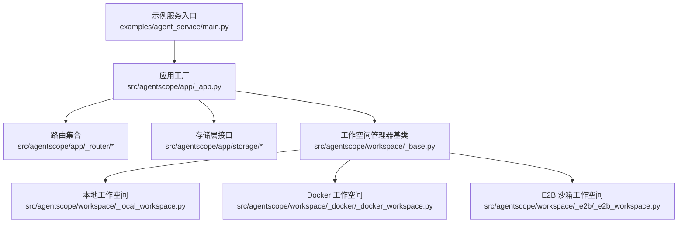
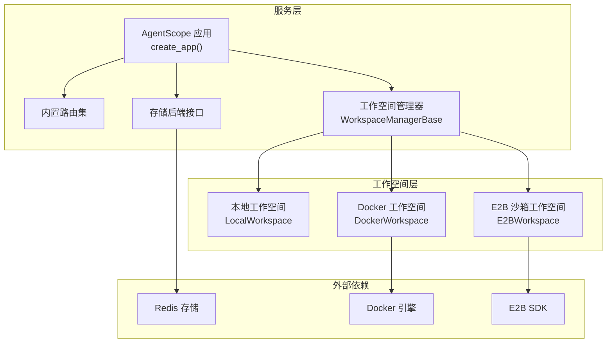
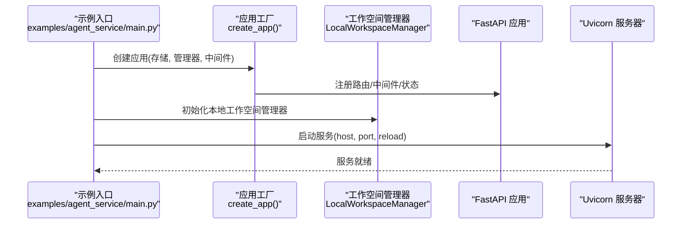
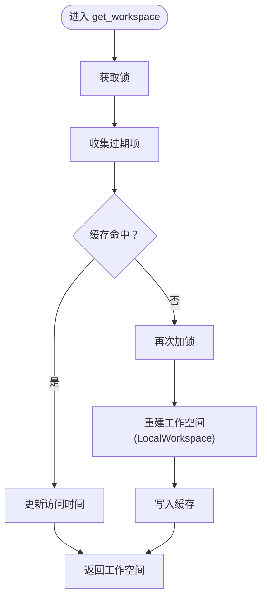
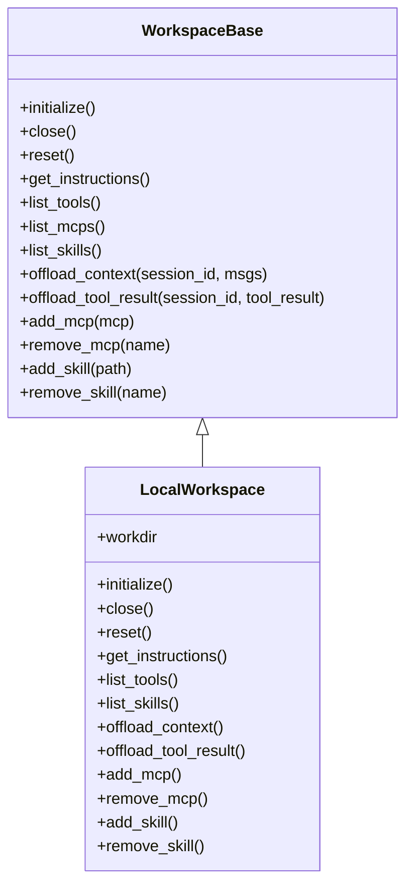
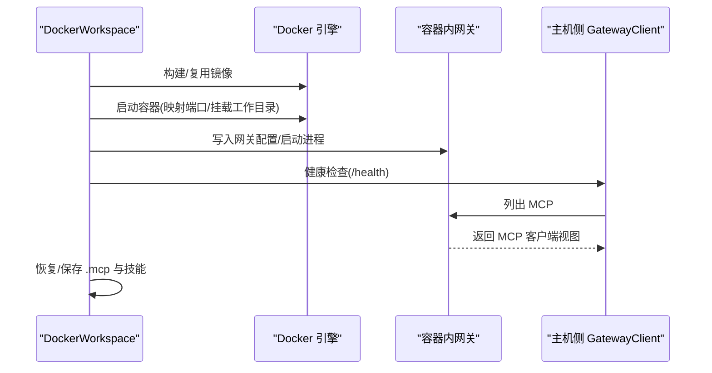
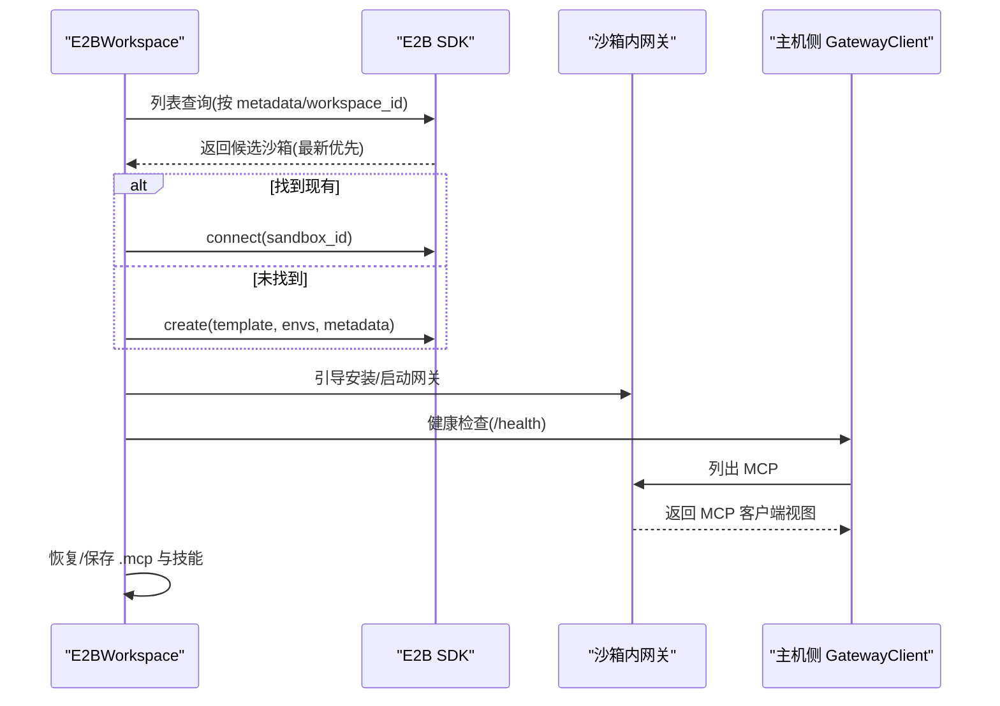
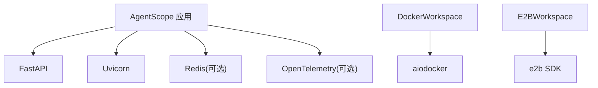

# 部署指南

<cite>
**本文档引用的文件**
- [README.md](file://README.md)
- [pyproject.toml](file://pyproject.toml)
- [src/agentscope/app/_app.py](file://src/agentscope/app/_app.py)
- [src/agentscope/app/_manager/_workspace_manager.py](file://src/agentscope/app/_manager/_workspace_manager.py)
- [src/agentscope/workspace/_base.py](file://src/agentscope/workspace/_base.py)
- [src/agentscope/workspace/_local_workspace.py](file://src/agentscope/workspace/_local_workspace.py)
- [src/agentscope/workspace/_docker/_docker_workspace.py](file://src/agentscope/workspace/_docker/_docker_workspace.py)
- [src/agentscope/workspace/_e2b/_e2b_workspace.py](file://src/agentscope/workspace/_e2b/_e2b_workspace.py)
- [examples/agent_service/main.py](file://examples/agent_service/main.py)
</cite>

## 目录
1. [简介](#简介)
2. [项目结构](#项目结构)
3. [核心组件](#核心组件)
4. [架构总览](#架构总览)
5. [详细组件分析](#详细组件分析)
6. [依赖分析](#依赖分析)
7. [性能考虑](#性能考虑)
8. [故障排查指南](#故障排查指南)
9. [结论](#结论)
10. [附录](#附录)

## 简介
本指南面向在本地与生产环境中部署 AgentScope 的工程团队，覆盖以下主题：
- 本地部署：单机部署、Docker 容器化部署、Kubernetes 集群部署
- 工作空间管理：本地工作空间、Docker 工作空间、E2B 沙箱工作空间的配置与使用
- 生产部署最佳实践：负载均衡、监控告警、日志管理、安全配置
- 云平台部署：AWS/Azure/GCP 等主流云服务的部署要点
- 性能优化：资源分配、缓存策略、并发控制
- 部署脚本与配置示例：基于仓库现有实现的可操作路径

## 项目结构
AgentScope 提供了可嵌入的 FastAPI 应用工厂、多后端工作空间抽象以及示例服务入口，便于在不同运行环境中快速落地。

图表来源
- [src/agentscope/app/_app.py:29-130](file://src/agentscope/app/_app.py#L29-L130)
- [src/agentscope/workspace/_base.py:36-204](file://src/agentscope/workspace/_base.py#L36-L204)
- [src/agentscope/workspace/_local_workspace.py:118-308](file://src/agentscope/workspace/_local_workspace.py#L118-L308)
- [src/agentscope/workspace/_docker/_docker_workspace.py:127-294](file://src/agentscope/workspace/_docker/_docker_workspace.py#L127-L294)
- [src/agentscope/workspace/_e2b/_e2b_workspace.py:143-328](file://src/agentscope/workspace/_e2b/_e2b_workspace.py#L143-L328)
- [examples/agent_service/main.py:1-72](file://examples/agent_service/main.py#L1-L72)

章节来源
- [README.md:58-72](file://README.md#L58-L72)
- [pyproject.toml:1-122](file://pyproject.toml#L1-L122)

## 核心组件
- 应用工厂 create_app：提供可嵌入的 FastAPI 应用，自动注册内置路由，并支持扩展中间件、凭证类型、代理工具等。
- 工作空间抽象 WorkspaceBase：定义工作空间生命周期（initialize/close/reset）、指令生成、工具/MCP/技能发现、上下文与工具结果离线持久化等统一接口。
- 三种工作空间实现：
  - 本地工作空间 LocalWorkspace：基于本地文件系统，适合开发与测试。
  - Docker 工作空间 DockerWorkspace：基于容器沙箱，适合隔离执行与可重复构建。
  - E2B 沙箱工作空间 E2BWorkspace：基于云端沙箱，适合生产级隔离与弹性扩缩容。
- 示例服务入口 examples/agent_service/main.py：演示如何以本地工作空间与 Redis 存储启动服务，并启用 CORS 中间件。

章节来源
- [src/agentscope/app/_app.py:29-130](file://src/agentscope/app/_app.py#L29-L130)
- [src/agentscope/workspace/_base.py:36-204](file://src/agentscope/workspace/_base.py#L36-L204)
- [src/agentscope/workspace/_local_workspace.py:118-308](file://src/agentscope/workspace/_local_workspace.py#L118-L308)
- [src/agentscope/workspace/_docker/_docker_workspace.py:127-294](file://src/agentscope/workspace/_docker/_docker_workspace.py#L127-L294)
- [src/agentscope/workspace/_e2b/_e2b_workspace.py:143-328](file://src/agentscope/workspace/_e2b/_e2b_workspace.py#L143-L328)
- [examples/agent_service/main.py:1-72](file://examples/agent_service/main.py#L1-L72)

## 架构总览
AgentScope 的服务由“应用工厂 + 路由 + 存储 + 工作空间管理器 + 多后端工作空间”构成，示例服务通过 LocalWorkspaceManager 与 RedisStorage 连接，形成最小可用部署。

图表来源
- [src/agentscope/app/_app.py:29-130](file://src/agentscope/app/_app.py#L29-L130)
- [src/agentscope/app/_manager/_workspace_manager.py:13-77](file://src/agentscope/app/_manager/_workspace_manager.py#L13-L77)
- [src/agentscope/workspace/_base.py:36-204](file://src/agentscope/workspace/_base.py#L36-L204)
- [src/agentscope/workspace/_docker/_docker_workspace.py:127-294](file://src/agentscope/workspace/_docker/_docker_workspace.py#L127-L294)
- [src/agentscope/workspace/_e2b/_e2b_workspace.py:143-328](file://src/agentscope/workspace/_e2b/_e2b_workspace.py#L143-L328)

## 详细组件分析

### 应用工厂与服务入口
- 应用工厂 create_app 支持注入存储后端、工作空间管理器、扩展中间件与动态工具/中间件工厂，返回可直接运行的 FastAPI 实例。
- 示例服务入口 examples/agent_service/main.py 展示了：
  - 使用 RedisStorage 连接本地 Redis
  - 使用 LocalWorkspaceManager 指定工作空间根目录与默认 MCP 列表
  - 注册 CORS 中间件
  - 通过 uvicorn 启动服务

图表来源
- [examples/agent_service/main.py:1-72](file://examples/agent_service/main.py#L1-L72)
- [src/agentscope/app/_app.py:29-130](file://src/agentscope/app/_app.py#L29-L130)

章节来源
- [src/agentscope/app/_app.py:29-130](file://src/agentscope/app/_app.py#L29-L130)
- [examples/agent_service/main.py:1-72](file://examples/agent_service/main.py#L1-L72)

### 工作空间管理器与生命周期
- WorkspaceManagerBase 定义了获取/创建/关闭工作空间的异步接口，并支持作为 async 上下文管理器进行后台任务与缓存清理。
- LocalWorkspaceManager 基于本地目录，采用 TTL 懒回收策略，支持并发安全的缓存命中与过期清理。

图表来源
- [src/agentscope/app/_manager/_workspace_manager.py:128-191](file://src/agentscope/app/_manager/_workspace_manager.py#L128-L191)

章节来源
- [src/agentscope/app/_manager/_workspace_manager.py:13-77](file://src/agentscope/app/_manager/_workspace_manager.py#L13-L77)
- [src/agentscope/app/_manager/_workspace_manager.py:128-191](file://src/agentscope/app/_manager/_workspace_manager.py#L128-L191)

### 本地工作空间（LocalWorkspace）
- 生命周期：initialize 恢复或种子 MCP 与技能；close 关闭状态化 MCP；reset 清空 MCP/技能/会话数据。
- 指令：提供系统提示片段模板，描述工作目录布局与最佳实践。
- 离线持久化：将消息与工具结果序列化为 JSONL/文本文件，大体积数据转存到 data 目录并通过 URL 引用。
- 技能索引：维护 .skills 索引文件，支持内容哈希去重与冲突命名处理。

图表来源
- [src/agentscope/workspace/_base.py:36-204](file://src/agentscope/workspace/_base.py#L36-L204)
- [src/agentscope/workspace/_local_workspace.py:118-308](file://src/agentscope/workspace/_local_workspace.py#L118-L308)

章节来源
- [src/agentscope/workspace/_local_workspace.py:118-308](file://src/agentscope/workspace/_local_workspace.py#L118-L308)
- [src/agentscope/workspace/_local_workspace.py:478-592](file://src/agentscope/workspace/_local_workspace.py#L478-L592)

### Docker 工作空间（DockerWorkspace）
- 生命周期：构建/复用镜像、启动容器、启动网关进程、健康检查、恢复 MCP、持久化 .mcp 与技能。
- 网关通信：通过 GatewayClient 与容器内网关交互，支持动态添加/移除 MCP 与技能。
- 离线持久化：在容器内写入 sessions/data 目录，base64 数据转存 data 并以 URL 引用。
- 可选宿主挂载：绑定宿主工作目录以实现重启持久化。

图表来源
- [src/agentscope/workspace/_docker/_docker_workspace.py:230-294](file://src/agentscope/workspace/_docker/_docker_workspace.py#L230-L294)
- [src/agentscope/workspace/_docker/_docker_workspace.py:282-287](file://src/agentscope/workspace/_docker/_docker_workspace.py#L282-L287)

章节来源
- [src/agentscope/workspace/_docker/_docker_workspace.py:127-294](file://src/agentscope/workspace/_docker/_docker_workspace.py#L127-L294)
- [src/agentscope/workspace/_docker/_docker_workspace.py:621-724](file://src/agentscope/workspace/_docker/_docker_workspace.py#L621-L724)

### E2B 沙箱工作空间（E2BWorkspace）
- 生命周期：按 workspace_id 查询/连接现有沙箱或创建新沙箱，执行引导安装网关与 agentscope，启动网关并健康检查。
- 持久化：沙箱文件系统即持久层，pause 保留状态，resume 自动恢复。
- 网关通信：通过 E2B 代理访问沙箱端口，使用 X-Access-Token 请求头。
- 离线持久化：在沙箱内写入 sessions/data 目录，base64 数据转存 data 并以 URL 引用。

图表来源
- [src/agentscope/workspace/_e2b/_e2b_workspace.py:244-328](file://src/agentscope/workspace/_e2b/_e2b_workspace.py#L244-L328)
- [src/agentscope/workspace/_e2b/_e2b_workspace.py:646-724](file://src/agentscope/workspace/_e2b/_e2b_workspace.py#L646-L724)

章节来源
- [src/agentscope/workspace/_e2b/_e2b_workspace.py:143-328](file://src/agentscope/workspace/_e2b/_e2b_workspace.py#L143-L328)
- [src/agentscope/workspace/_e2b/_e2b_workspace.py:568-642](file://src/agentscope/workspace/_e2b/_e2b_workspace.py#L568-L642)

## 依赖分析
- 应用依赖：FastAPI、Uvicorn、Redis（可选）、OpenTelemetry（可观测性）等。
- 工作空间依赖：
  - 本地：纯文件系统操作，无外部依赖。
  - Docker：aiodocker（异步 Docker 客户端）。
  - E2B：e2b SDK（异步沙箱客户端）。

图表来源
- [pyproject.toml:22-82](file://pyproject.toml#L22-L82)
- [src/agentscope/workspace/_docker/_docker_workspace.py:259-261](file://src/agentscope/workspace/_docker/_docker_workspace.py#L259-L261)
- [src/agentscope/workspace/_e2b/_e2b_workspace.py:661-661](file://src/agentscope/workspace/_e2b/_e2b_workspace.py#L661-L661)

章节来源
- [pyproject.toml:22-82](file://pyproject.toml#L22-L82)

## 性能考虑
- 资源分配
  - CPU/内存：根据模型规模与并发会话数评估，容器/沙箱需设置合理的资源限制与预留。
  - 存储：本地工作空间建议 SSD；Docker/E2B 工作空间注意卷/磁盘配额与 IO 开销。
- 缓存策略
  - 工作空间缓存：LocalWorkspaceManager 使用 TTL 懒回收，减少频繁初始化开销。
  - 离线持久化：将大体积数据转存至 data 目录并通过 URL 引用，降低 JSONL 文件体积。
- 并发控制
  - 本地：使用 asyncio.Lock 保护 MCP/技能索引变更。
  - Docker/E2B：容器/沙箱内命令执行与文件上传/下载采用异步 I/O，避免阻塞事件循环。
- 观测性
  - 建议启用 OpenTelemetry 导出器，采集链路追踪与指标，结合日志聚合进行性能分析。

## 故障排查指南
- 本地工作空间
  - 初始化失败：检查工作目录权限与磁盘空间；确认 MCP 配置正确。
  - 技能加载异常：检查 SKILL.md 格式与 frontmatter 字段完整性。
- Docker 工作空间
  - 镜像构建失败：查看构建流日志尾部输出，定位具体 RUN 步骤错误。
  - 容器启动/网关健康检查超时：检查端口映射、防火墙与资源限制。
- E2B 沙箱
  - 环境不可达：等待沙箱运行就绪（is_running），必要时增加超时。
  - 代理访问失败：确认 X-Access-Token 请求头与沙箱端口映射。
- 通用
  - 日志：使用应用日志与工作空间日志定位问题；生产环境建议集中化日志收集。
  - 中间件：如 CORS、认证中间件导致请求异常，逐步禁用排查。

章节来源
- [src/agentscope/workspace/_docker/_docker_workspace.py:798-800](file://src/agentscope/workspace/_docker/_docker_workspace.py#L798-L800)
- [src/agentscope/workspace/_e2b/_e2b_workspace.py:705-724](file://src/agentscope/workspace/_e2b/_e2b_workspace.py#L705-L724)
- [src/agentscope/workspace/_local_workspace.py:350-351](file://src/agentscope/workspace/_local_workspace.py#L350-L351)

## 结论
AgentScope 提供了从本地到云端的一体化工作空间解决方案。通过应用工厂与工作空间抽象，可在单机、容器与云沙箱之间灵活切换；配合示例服务入口与 Redis 存储，可快速搭建生产可用的服务。建议在生产中结合负载均衡、监控告警、日志管理与安全配置，确保稳定性与可运维性。

## 附录

### 本地部署方案
- 单机部署
  - 使用示例服务入口启动，配置 Redis 存储与本地工作空间管理器。
  - 参考路径：[examples/agent_service/main.py:1-72](file://examples/agent_service/main.py#L1-L72)
- Docker 容器化部署
  - 使用 DockerWorkspace 时，需确保 Docker 引擎可用；可挂载宿主工作目录实现持久化。
  - 参考路径：[src/agentscope/workspace/_docker/_docker_workspace.py:127-294](file://src/agentscope/workspace/_docker/_docker_workspace.py#L127-L294)
- Kubernetes 集群部署
  - 将 AgentScope 服务容器化，使用 Deployment/Service 暴露端口；结合 ConfigMap/Secret 管理配置与密钥。
  - 使用 DockerWorkspace 时，需要在节点上启用 Docker 或通过 DaemonSet 提供 Docker 访问能力；或优先选择 E2BWorkspace 以避免节点依赖。
  - 参考路径：[src/agentscope/workspace/_docker/_docker_workspace.py:127-294](file://src/agentscope/workspace/_docker/_docker_workspace.py#L127-L294)

### 工作空间管理机制
- 本地工作空间
  - 基于文件系统，适合开发与测试；支持 TTL 缓存与懒回收。
  - 参考路径：[src/agentscope/workspace/_local_workspace.py:118-308](file://src/agentscope/workspace/_local_workspace.py#L118-L308)
- Docker 工作空间
  - 基于容器沙箱，支持镜像缓存与端口映射；可挂载宿主目录实现持久化。
  - 参考路径：[src/agentscope/workspace/_docker/_docker_workspace.py:127-294](file://src/agentscope/workspace/_docker/_docker_workspace.py#L127-L294)
- E2B 沙箱工作空间
  - 基于云沙箱，支持自动暂停/恢复与 metadata 查询；无需节点 Docker 依赖。
  - 参考路径：[src/agentscope/workspace/_e2b/_e2b_workspace.py:143-328](file://src/agentscope/workspace/_e2b/_e2b_workspace.py#L143-L328)

### 生产环境最佳实践
- 负载均衡
  - 使用反向代理（如 Nginx/Traefik）分发请求，开启健康检查与会话亲和。
- 监控告警
  - 集成 OpenTelemetry，导出指标与追踪；结合告警规则对延迟、错误率与资源使用进行告警。
- 日志管理
  - 统一日志格式与标签，接入集中化日志系统（如 ELK/Fluentd/Loki）。
- 安全配置
  - 限制容器/沙箱权限与网络；启用 TLS 与访问令牌；定期轮换密钥与证书。

### 云平台部署选项
- AWS
  - 使用 ECS/EKS 托管容器服务；结合 ECR 存储镜像；使用 IAM 角色与 VPC 网络隔离。
- Azure
  - 使用 AKS/Acr；结合托管身份与网络安全组；利用 Azure Monitor 与 Log Analytics。
- GCP
  - 使用 GKE/GCR；结合服务账户与 VPC；利用 Cloud Monitoring/Logging 与 Security Command Center。

### 性能优化建议
- 资源分配：根据模型参数量与并发会话数合理设置 CPU/内存；容器/沙箱设置资源限制与 QoS。
- 缓存策略：利用工作空间缓存与 TTL；离线持久化时将大文件转存 data 目录并以 URL 引用。
- 并发控制：在 MCP/技能索引变更处使用 asyncio.Lock；避免阻塞 I/O，优先使用异步客户端。
- 观测性：启用 OpenTelemetry，采集链路追踪与指标，结合日志聚合进行性能分析与容量规划。

### 部署脚本与配置示例
- 示例服务启动脚本
  - 参考路径：[examples/agent_service/main.py:64-72](file://examples/agent_service/main.py#L64-L72)
- 应用工厂配置
  - 参考路径：[src/agentscope/app/_app.py:29-130](file://src/agentscope/app/_app.py#L29-L130)
- 工作空间管理器配置
  - 参考路径：[src/agentscope/app/_manager/_workspace_manager.py:87-114](file://src/agentscope/app/_manager/_workspace_manager.py#L87-L114)
- 本地工作空间配置
  - 参考路径：[src/agentscope/workspace/_local_workspace.py:131-170](file://src/agentscope/workspace/_local_workspace.py#L131-L170)
- Docker 工作空间配置
  - 参考路径：[src/agentscope/workspace/_docker/_docker_workspace.py:134-226](file://src/agentscope/workspace/_docker/_docker_workspace.py#L134-L226)
- E2B 沙箱工作空间配置
  - 参考路径：[src/agentscope/workspace/_e2b/_e2b_workspace.py:150-235](file://src/agentscope/workspace/_e2b/_e2b_workspace.py#L150-L235)