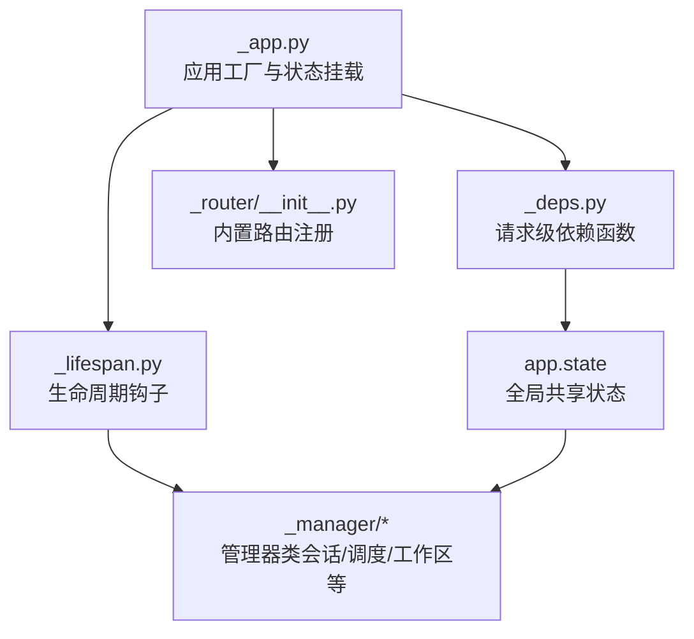
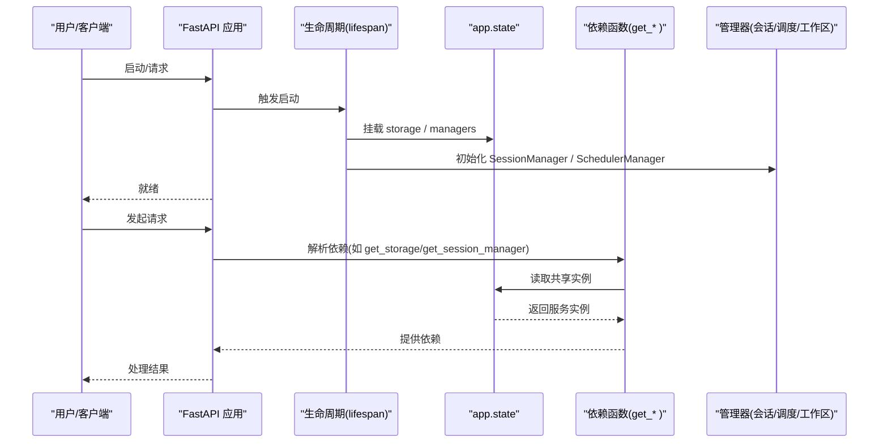
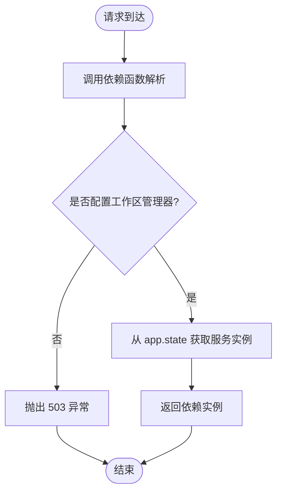
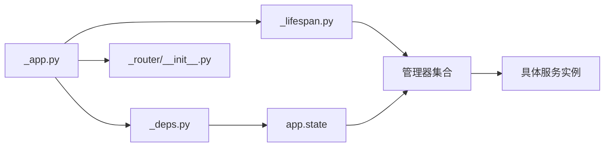

# 依赖注入系统

<cite>
**本文引用的文件**
- [src/agentscope/app/_app.py](file://src/agentscope/app/_app.py)
- [src/agentscope/app/_deps.py](file://src/agentscope/app/_deps.py)
- [src/agentscope/app/_lifespan.py](file://src/agentscope/app/_lifespan.py)
- [src/agentscope/app/_router/__init__.py](file://src/agentscope/app/_router/__init__.py)
- [src/agentscope/app/_manager/_workspace_manager.py](file://src/agentscope/app/_manager/_workspace_manager.py)
- [src/agentscope/app/_manager/_scheduler/scheduler_manager.py](file://src/agentscope/app/_manager/_scheduler/scheduler_manager.py)
- [src/agentscope/workspace/_gateway_client.py](file://src/agentscope/workspace/_gateway_client.py)
- [.gemini/styleguide.md](file://.gemini/styleguide.md)
</cite>

## 目录
1. [简介](#简介)
2. [项目结构](#项目结构)
3. [核心组件](#核心组件)
4. [架构总览](#架构总览)
5. [详细组件分析](#详细组件分析)
6. [依赖关系分析](#依赖关系分析)
7. [性能考量](#性能考量)
8. [故障排查指南](#故障排查指南)
9. [结论](#结论)
10. [附录](#附录)

## 简介
本文件系统性梳理 AgentScope 的依赖注入与生命周期管理机制，重点覆盖以下方面：
- 依赖注入容器与服务注册：通过 FastAPI 的依赖注入（DI）能力与应用生命周期钩子，集中管理跨模块共享资源。
- 生命周期管理：在应用启动时初始化全局服务，在关闭时进行有序清理，避免资源泄漏。
- 依赖解析机制：通过请求级依赖函数从 app.state 中解析共享服务实例。
- 注入模式：以“请求级依赖注入”为主，辅以“工厂/构造函数注入”的扩展点（如中间件与工具工厂）。
- 单例化与作用域：全局共享服务采用 app.state 单例；请求级依赖按请求作用域解析。
- 循环依赖检测与规避：通过延迟导入与运行时装配降低耦合风险。
- 最佳实践：接口设计、延迟初始化、条件注册、可扩展性与调试技巧。

## 项目结构
AgentScope 的 DI 体系围绕 FastAPI 应用工厂、生命周期钩子与一组“请求级依赖函数”构建，配合路由器自动注册与状态对象 app.state 实现服务的集中管理与按需解析。

图表来源
- [src/agentscope/app/_app.py:104-129](file://src/agentscope/app/_app.py#L104-L129)
- [src/agentscope/app/_lifespan.py:35-63](file://src/agentscope/app/_lifespan.py#L35-L63)
- [src/agentscope/app/_deps.py:44-142](file://src/agentscope/app/_deps.py#L44-L142)
- [src/agentscope/app/_router/__init__.py:1-21](file://src/agentscope/app/_router/__init__.py#L1-L21)

章节来源
- [src/agentscope/app/_app.py:29-129](file://src/agentscope/app/_app.py#L29-L129)
- [src/agentscope/app/_lifespan.py:14-63](file://src/agentscope/app/_lifespan.py#L14-L63)
- [src/agentscope/app/_router/__init__.py:1-21](file://src/agentscope/app/_router/__init__.py#L1-L21)

## 核心组件
- 应用工厂 create_app：负责注册内置路由、挂载 app.state 全局状态、配置可选中间件与扩展项。
- 生命周期 lifespan：在启动阶段创建并注入全局管理器实例，恢复持久化任务；在关闭阶段取消任务、停止调度器、释放工作区资源。
- 请求级依赖函数：从 app.state 解析存储、会话、调度、工作区、后台任务等共享服务，同时提供额外中间件与工具工厂的注入点。
- 路由器集合：统一注册各领域路由，确保依赖解析在处理请求时生效。
- 管理器基类与实现：抽象出工作区管理器接口，提供本地与容器化实现，统一生命周期管理。

章节来源
- [src/agentscope/app/_app.py:29-129](file://src/agentscope/app/_app.py#L29-L129)
- [src/agentscope/app/_lifespan.py:14-63](file://src/agentscope/app/_lifespan.py#L14-L63)
- [src/agentscope/app/_deps.py:15-142](file://src/agentscope/app/_deps.py#L15-L142)
- [src/agentscope/app/_manager/_workspace_manager.py:41-81](file://src/agentscope/app/_manager/_workspace_manager.py#L41-L81)

## 架构总览
下图展示依赖注入与生命周期的整体交互：应用工厂创建 FastAPI 实例并挂载全局状态；生命周期钩子在启动/关闭时创建/销毁全局服务；请求到达时，依赖函数从 app.state 解析所需服务。

图表来源
- [src/agentscope/app/_app.py:104-129](file://src/agentscope/app/_app.py#L104-L129)
- [src/agentscope/app/_lifespan.py:35-63](file://src/agentscope/app/_lifespan.py#L35-L63)
- [src/agentscope/app/_deps.py:44-142](file://src/agentscope/app/_deps.py#L44-L142)

## 详细组件分析

### 组件A：应用工厂与全局状态
- 职责
  - 注册内置路由集合。
  - 在 app.state 中挂载存储后端、工作区管理器、扩展中间件与工具工厂。
  - 可选地提前注册凭证类型。
- 关键点
  - 使用 lifespan 管理存储连接池与工作区上下文。
  - 支持将 AgentScope 作为子应用挂载到现有 FastAPI。
- 扩展点
  - extra_agent_middlewares：异步工厂，按用户/会话动态生成中间件。
  - extra_agent_tools：异步工厂，按用户/会话动态生成工具实例。

章节来源
- [src/agentscope/app/_app.py:29-129](file://src/agentscope/app/_app.py#L29-L129)

### 组件B：生命周期管理
- 职责
  - 启动：进入存储上下文，创建并注入 SessionManager、BackgroundTaskManager；初始化 SchedulerManager 并启动；从存储恢复持久化计划。
  - 关闭：取消进行中的会话与后台任务，等待调度器优雅关闭，退出工作区上下文并关闭所有缓存工作区。
- 生命周期钩子
  - 使用 AsyncExitStack 管理嵌套异步上下文，保证异常场景下的资源回收。

章节来源
- [src/agentscope/app/_lifespan.py:14-63](file://src/agentscope/app/_lifespan.py#L14-L63)

### 组件C：请求级依赖函数
- 职责
  - 从请求对象的 app.state 中解析共享服务实例，作为 FastAPI 依赖注入的解析器。
  - 提供认证用户 ID 的提取逻辑（占位实现，后续替换为 JWT）。
  - 提供额外中间件与工具工厂的注入入口。
- 错误处理
  - 当未配置工作区管理器时，返回 503。
  - 当缺少必需请求头时，返回 401。

图表来源
- [src/agentscope/app/_deps.py:80-98](file://src/agentscope/app/_deps.py#L80-L98)

章节来源
- [src/agentscope/app/_deps.py:15-142](file://src/agentscope/app/_deps.py#L15-L142)

### 组件D：管理器与作用域
- 工作区管理器基类
  - 定义创建、关闭单个工作区与批量关闭的能力，并提供异步上下文协议。
- 本地工作区管理器
  - 基于 TTL 的惰性生命周期管理，支持后台清扫任务。
- 调度器管理器
  - 在生命周期中创建并启动，负责恢复持久化计划并在触发时执行业务流程（内部使用延迟导入规避循环依赖）。

章节来源
- [src/agentscope/app/_manager/_workspace_manager.py:41-81](file://src/agentscope/app/_manager/_workspace_manager.py#L41-L81)
- [src/agentscope/app/_manager/_scheduler/scheduler_manager.py:93-125](file://src/agentscope/app/_manager/_scheduler/scheduler_manager.py#L93-L125)

### 组件E：MCP 网关客户端与注入扩展
- 功能
  - 与网关交互注册/注销 MCP，支持状态式与无状态 MCP。
  - 列举已注册 MCP 并重建客户端实例。
- 与 DI 的关系
  - 通过工作区管理器与网关客户端协作，间接体现“按需装配”的思想：仅在需要时建立上游连接并注入到会话或调度流程中。

章节来源
- [src/agentscope/workspace/_gateway_client.py:270-303](file://src/agentscope/workspace/_gateway_client.py#L270-L303)
- [src/agentscope/workspace/_gateway_client.py:542-547](file://src/agentscope/workspace/_gateway_client.py#L542-L547)

## 依赖关系分析
- 组件耦合
  - 应用工厂对生命周期、依赖函数与路由器有直接依赖；生命周期对管理器有直接依赖；依赖函数对 app.state 有直接依赖。
- 间接依赖
  - 调度器管理器在触发回调中延迟导入服务，避免循环依赖。
- 外部依赖
  - FastAPI 的依赖注入与生命周期钩子；APScheduler 用于定时调度。

图表来源
- [src/agentscope/app/_app.py:104-129](file://src/agentscope/app/_app.py#L104-L129)
- [src/agentscope/app/_lifespan.py:35-63](file://src/agentscope/app/_lifespan.py#L35-L63)
- [src/agentscope/app/_deps.py:44-142](file://src/agentscope/app/_deps.py#L44-L142)
- [src/agentscope/app/_router/__init__.py:1-21](file://src/agentscope/app/_router/__init__.py#L1-L21)

章节来源
- [src/agentscope/app/_app.py:104-129](file://src/agentscope/app/_app.py#L104-L129)
- [src/agentscope/app/_lifespan.py:35-63](file://src/agentscope/app/_lifespan.py#L35-L63)
- [src/agentscope/app/_deps.py:44-142](file://src/agentscope/app/_deps.py#L44-L142)
- [src/agentscope/app/_router/__init__.py:1-21](file://src/agentscope/app/_router/__init__.py#L1-L21)

## 性能考量
- 延迟初始化
  - 在调度器触发回调中延迟导入服务，减少启动时的模块加载开销与潜在循环依赖。
- 资源复用
  - 存储连接池与工作区缓存通过生命周期统一管理，避免重复创建。
- 异步上下文
  - 使用 AsyncExitStack 管理多层异步资源，确保异常路径也能正确回收。
- 调度与清扫
  - 工作区管理器的后台清扫任务周期性清理闲置资源，降低内存占用。

章节来源
- [src/agentscope/app/_manager/_scheduler/scheduler_manager.py:93-125](file://src/agentscope/app/_manager/_scheduler/scheduler_manager.py#L93-L125)
- [src/agentscope/app/_lifespan.py:35-63](file://src/agentscope/app/_lifespan.py#L35-L63)

## 故障排查指南
- 401 未提供用户标识
  - 现象：缺少 X-User-ID 请求头导致认证失败。
  - 排查：确认客户端是否携带该头部；后续应替换为 JWT 认证。
- 503 未配置工作区管理器
  - 现象：访问需要工作区的接口时报错。
  - 排查：检查应用工厂参数是否传入 workspace_manager；确认生命周期已正确挂载。
- MCP 注册失败
  - 现象：状态式 MCP 注册返回非 2xx。
  - 排查：检查网关地址、令牌与超时设置；确认 MCP 客户端未重复连接。
- 调度器未恢复计划
  - 现象：重启后定时任务未恢复。
  - 排查：确认存储中存在持久化计划；检查生命周期恢复逻辑是否执行。

章节来源
- [src/agentscope/app/_deps.py:15-41](file://src/agentscope/app/_deps.py#L15-L41)
- [src/agentscope/app/_deps.py:80-98](file://src/agentscope/app/_deps.py#L80-L98)
- [src/agentscope/workspace/_gateway_client.py:288-300](file://src/agentscope/workspace/_gateway_client.py#L288-L300)
- [src/agentscope/app/_lifespan.py:54-57](file://src/agentscope/app/_lifespan.py#L54-L57)

## 结论
AgentScope 的依赖注入体系以 FastAPI 为基础，结合应用生命周期钩子与请求级依赖函数，实现了：
- 全局服务的集中注册与单例化（app.state）。
- 请求级服务的按需解析与作用域隔离。
- 可扩展的工厂注入点（中间件与工具工厂），满足动态装配需求。
- 通过延迟导入与后台清扫等手段，兼顾性能与稳定性。

## 附录

### 依赖注入模式说明
- 构造函数注入
  - 在生命周期中通过构造函数注入全局服务（如 SchedulerManager 的构造参数列表）。
- 属性注入
  - 通过 app.state 为管理器实例赋值（如 session_manager、background_task_manager）。
- 方法注入
  - 通过依赖函数在请求处理链路中解析服务（如 get_storage、get_session_manager）。

章节来源
- [src/agentscope/app/_lifespan.py:39-51](file://src/agentscope/app/_lifespan.py#L39-L51)
- [src/agentscope/app/_deps.py:44-142](file://src/agentscope/app/_deps.py#L44-L142)

### 服务单例化与作用域
- 单例化
  - app.state 中的服务在应用范围内单例；生命周期负责其创建与销毁。
- 作用域
  - 请求级依赖按请求作用域解析；工作区与会话等按业务场景管理其生命周期。

章节来源
- [src/agentscope/app/_app.py:104-129](file://src/agentscope/app/_app.py#L104-L129)
- [src/agentscope/app/_lifespan.py:35-63](file://src/agentscope/app/_lifespan.py#L35-L63)

### 循环依赖检测与规避
- 延迟导入
  - 在调度器触发回调中延迟导入服务，避免模块级导入造成的循环依赖。
- 运行时装配
  - 通过工厂注入与运行时解析，降低编译期耦合。

章节来源
- [.gemini/styleguide.md:10-19](file://.gemini/styleguide.md#L10-L19)
- [src/agentscope/app/_manager/_scheduler/scheduler_manager.py:120-125](file://src/agentscope/app/_manager/_scheduler/scheduler_manager.py#L120-L125)

### 最佳实践
- 服务接口设计
  - 使用抽象基类定义服务契约，便于替换与测试。
- 延迟初始化
  - 对重资源或高成本服务采用惰性初始化策略。
- 条件注册
  - 通过 extra_* 参数按环境/租户条件注册中间件与工具。
- 可扩展性
  - 优先使用工厂注入与 app.state 扩展，避免硬编码依赖。

章节来源
- [src/agentscope/app/_app.py:66-89](file://src/agentscope/app/_app.py#L66-L89)
- [src/agentscope/app/_deps.py:115-142](file://src/agentscope/app/_deps.py#L115-L142)

### 调试技巧
- 启动日志
  - 关注生命周期钩子的启动/关闭日志，定位资源初始化与回收问题。
- 请求追踪
  - 在依赖函数中增加日志，记录解析的服务实例与来源。
- MCP 连接
  - 通过网关客户端的日志与错误信息，定位注册/注销失败原因。

章节来源
- [src/agentscope/app/_lifespan.py:16-28](file://src/agentscope/app/_lifespan.py#L16-L28)
- [src/agentscope/workspace/_gateway_client.py:288-300](file://src/agentscope/workspace/_gateway_client.py#L288-L300)