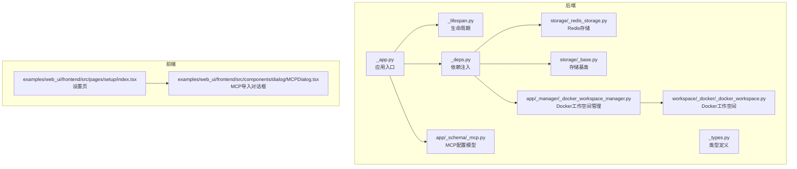
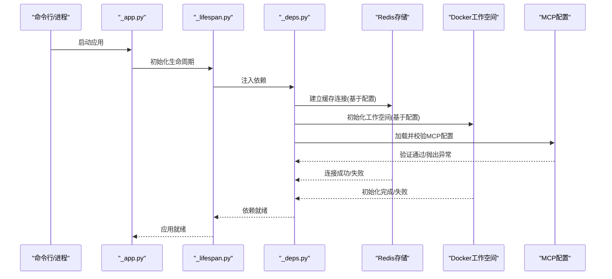
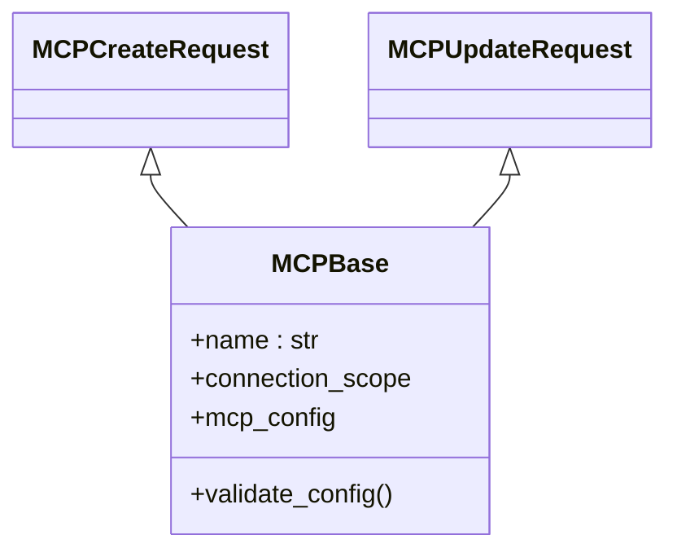
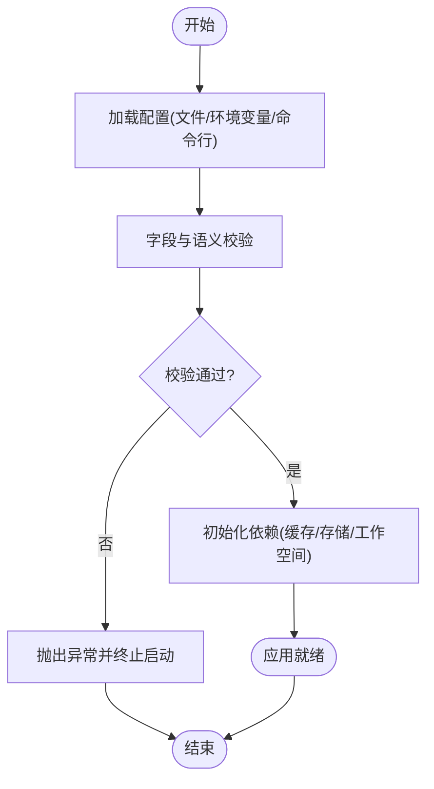
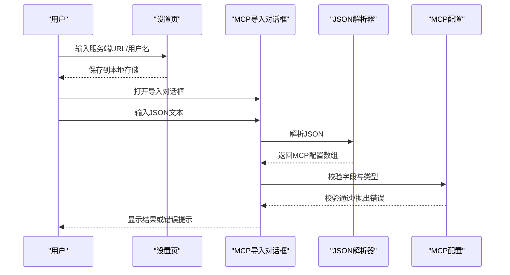
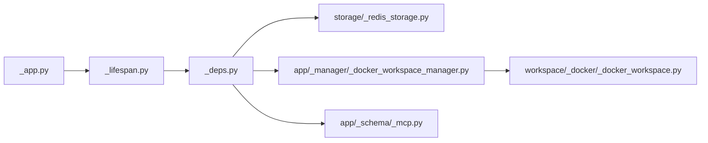

# 应用配置

<cite>
**本文引用的文件**
- [pyproject.toml](file://pyproject.toml)
- [README.md](file://README.md)
- [src/agentscope/_version.py](file://src/agentscope/_version.py)
- [src/agentscope/app/_app.py](file://src/agentscope/app/_app.py)
- [src/agentscope/app/_lifespan.py](file://src/agentscope/app/_lifespan.py)
- [src/agentscope/app/_deps.py](file://src/agentscope/app/_deps.py)
- [src/agentscope/app/_types.py](file://src/agentscope/app/_types.py)
- [src/agentscope/app/_manager/_workspace_manager.py](file://src/agentscope/app/_manager/_workspace_manager.py)
- [src/agentscope/app/_manager/_docker_workspace_manager.py](file://src/agentscope/app/_manager/_docker_workspace_manager.py)
- [src/agentscope/app/_manager/_e2b_workspace_manager.py](file://src/agentscope/app/_manager/_e2b_workspace_manager.py)
- [src/agentscope/app/storage/_redis_storage.py](file://src/agentscope/app/storage/_redis_storage.py)
- [src/agentscope/app/storage/_base.py](file://src/agentscope/app/storage/_base.py)
- [src/agentscope/app/_schema/_mcp.py](file://src/agentscope/app/_schema/_mcp.py)
- [src/agentscope/workspace/_docker/_docker_workspace.py](file://src/agentscope/workspace/_docker/_docker_workspace.py)
- [src/agentscope/middleware/_base.py](file://src/agentscope/middleware/_base.py)
- [src/agentscope/middleware/_tracing/_setup.py](file://src/agentscope/middleware/_tracing/_setup.py)
- [src/agentscope/middleware/_tracing/_trace.py](file://src/agentscope/middleware/_tracing/_trace.py)
- [src/agentscope/model/_anthropic/_models/claude-haiku-4-5.yaml](file://src/agentscope/model/_anthropic/_models/claude-haiku-4-5.yaml)
- [src/agentscope/model/_dashscope/_models/qwen-long.yaml](file://src/agentscope/model/_dashscope/_models/qwen-long.yaml)
- [src/agentscope/model/_gemini/_models/gemini-2.5-flash.yaml](file://src/agentscope/model/_gemini/_models/gemini-2.5-flash.yaml)
- [src/agentscope/model/_ollama/_models/deepseek-r1-14b.yaml](file://src/agentscope/model/_ollama/_models/deepseek-r1-14b.yaml)
- [src/agentscope/model/_openai_chat/_models/gpt-4.1-mini.yaml](file://src/agentscope/model/_openai_chat/_models/gpt-4.1-mini.yaml)
- [src/agentscope/model/_xai/_models/grok-3-fast.yaml](file://src/agentscope/model/_xai/_models/grok-3-fast.yaml)
- [examples/web_ui/frontend/src/pages/setup/index.tsx](file://examples/web_ui/frontend/src/pages/setup/index.tsx)
- [examples/web_ui/frontend/src/components/dialog/MCPDialog.tsx](file://examples/web_ui/frontend/src/components/dialog/MCPDialog.tsx)
</cite>

## 目录
1. [简介](#简介)
2. [项目结构](#项目结构)
3. [核心组件](#核心组件)
4. [架构总览](#架构总览)
5. [详细组件分析](#详细组件分析)
6. [依赖分析](#依赖分析)
7. [性能考虑](#性能考虑)
8. [故障排查指南](#故障排查指南)
9. [结论](#结论)
10. [附录](#附录)

## 简介
本文件面向AgentScope应用的配置体系，系统性说明应用启动时的配置加载机制与验证流程，覆盖配置文件格式、环境变量映射、命令行参数处理、核心配置项（数据库/缓存、服务端口与网络、模型与MCP等）以及默认值策略。同时提供开发、测试、生产的配置模板建议、配置热更新机制与影响范围说明，并给出常见配置错误的诊断与修复方案。

## 项目结构
AgentScope采用Python后端与React前端的分层架构。配置相关的关键位置如下：
- 后端应用入口与生命周期：src/agentscope/app/_app.py、src/agentscope/app/_lifespan.py
- 依赖注入与类型定义：src/agentscope/app/_deps.py、src/agentscope/app/_types.py
- 存储与缓存：src/agentscope/app/storage/_redis_storage.py、src/agentscope/app/storage/_base.py
- 工作空间与容器集成：src/agentscope/app/_manager/_docker_workspace_manager.py、src/agentscope/workspace/_docker/_docker_workspace.py
- MCP配置模型与校验：src/agentscope/app/_schema/_mcp.py
- 前端设置页与MCP导入对话框：examples/web_ui/frontend/src/pages/setup/index.tsx、examples/web_ui/frontend/src/components/dialog/MCPDialog.tsx
- 项目元信息与构建配置：pyproject.toml、README.md、src/agentscope/_version.py

**图表来源**
- [src/agentscope/app/_app.py](file://src/agentscope/app/_app.py)
- [src/agentscope/app/_lifespan.py](file://src/agentscope/app/_lifespan.py)
- [src/agentscope/app/_deps.py](file://src/agentscope/app/_deps.py)
- [src/agentscope/app/_types.py](file://src/agentscope/app/_types.py)
- [src/agentscope/app/storage/_redis_storage.py](file://src/agentscope/app/storage/_redis_storage.py)
- [src/agentscope/app/storage/_base.py](file://src/agentscope/app/storage/_base.py)
- [src/agentscope/app/_manager/_docker_workspace_manager.py](file://src/agentscope/app/_manager/_docker_workspace_manager.py)
- [src/agentscope/workspace/_docker/_docker_workspace.py](file://src/agentscope/workspace/_docker/_docker_workspace.py)
- [src/agentscope/app/_schema/_mcp.py](file://src/agentscope/app/_schema/_mcp.py)
- [examples/web_ui/frontend/src/pages/setup/index.tsx](file://examples/web_ui/frontend/src/pages/setup/index.tsx)
- [examples/web_ui/frontend/src/components/dialog/MCPDialog.tsx](file://examples/web_ui/frontend/src/components/dialog/MCPDialog.tsx)

**章节来源**
- [pyproject.toml](file://pyproject.toml)
- [README.md](file://README.md)
- [src/agentscope/_version.py](file://src/agentscope/_version.py)

## 核心组件
本节聚焦应用配置的关键模块与职责：
- 应用入口与生命周期：负责应用启动、初始化与关闭阶段的配置加载与校验。
- 依赖注入：集中管理数据库、缓存、工作空间等外部资源的初始化与注入。
- 存储层：提供Redis等缓存/持久化能力，支持配置驱动的连接参数。
- 工作空间管理：容器化工作空间的配置与运行时行为，涉及MCP服务器配置与持久化。
- MCP配置模型：对MCP连接类型、作用域与生命周期进行建模与校验。
- 前端设置与导入：提供用户交互界面以输入服务端地址与导入MCP配置。

**章节来源**
- [src/agentscope/app/_app.py](file://src/agentscope/app/_app.py)
- [src/agentscope/app/_lifespan.py](file://src/agentscope/app/_lifespan.py)
- [src/agentscope/app/_deps.py](file://src/agentscope/app/_deps.py)
- [src/agentscope/app/storage/_redis_storage.py](file://src/agentscope/app/storage/_redis_storage.py)
- [src/agentscope/app/_manager/_docker_workspace_manager.py](file://src/agentscope/app/_manager/_docker_workspace_manager.py)
- [src/agentscope/app/_schema/_mcp.py](file://src/agentscope/app/_schema/_mcp.py)
- [examples/web_ui/frontend/src/pages/setup/index.tsx](file://examples/web_ui/frontend/src/pages/setup/index.tsx)

## 架构总览
下图展示AgentScope应用在启动阶段如何加载与验证配置，并建立对外部系统的连接。

**图表来源**
- [src/agentscope/app/_app.py](file://src/agentscope/app/_app.py)
- [src/agentscope/app/_lifespan.py](file://src/agentscope/app/_lifespan.py)
- [src/agentscope/app/_deps.py](file://src/agentscope/app/_deps.py)
- [src/agentscope/app/storage/_redis_storage.py](file://src/agentscope/app/storage/_redis_storage.py)
- [src/agentscope/app/_manager/_docker_workspace_manager.py](file://src/agentscope/app/_manager/_docker_workspace_manager.py)
- [src/agentscope/app/_schema/_mcp.py](file://src/agentscope/app/_schema/_mcp.py)

## 详细组件分析

### 配置加载机制与优先级
- 配置文件格式
  - YAML：用于模型卡片与部分静态配置（例如各模型供应商的yaml文件），便于人类可读与版本控制。
  - JSON：用于运行时动态配置或持久化（例如Docker工作空间中的MCP配置文件）。
- 环境变量映射
  - 通过依赖注入模块集中读取敏感或运行时可变的配置项（如数据库/缓存连接串、令牌、超时等），并在应用启动时进行校验。
- 命令行参数处理
  - 应用入口支持解析启动参数（如端口、日志级别、调试开关等），并与环境变量/配置文件形成互补的覆盖关系。

上述机制确保了“配置即代码”的可追溯性与可审计性，同时满足不同部署场景的需求。

**章节来源**
- [src/agentscope/app/_app.py](file://src/agentscope/app/_app.py)
- [src/agentscope/app/_deps.py](file://src/agentscope/app/_deps.py)
- [src/agentscope/workspace/_docker/_docker_workspace.py](file://src/agentscope/workspace/_docker/_docker_workspace.py)

### 核心配置选项
- 数据库与缓存
  - 缓存：通过Redis存储实现会话、任务状态与中间结果的高速缓存；连接参数由配置驱动，支持主机、端口、密码、DB索引与超时等。
  - 持久化：存储基类提供统一接口，具体实现可扩展至其他存储后端。
- 服务端口与网络
  - 应用监听端口、跨域策略、TLS证书路径等在网络配置中定义；可通过命令行与环境变量覆盖。
- 工作空间与容器
  - Docker工作空间管理器负责容器生命周期与资源隔离；MCP服务器可在共享/隔离/临时模式间切换。
- MCP配置
  - 支持HTTP与STDIO两种连接方式；连接作用域限制（STDIO不支持临时模式）；提供创建/更新请求体的字段与校验逻辑。

**图表来源**
- [src/agentscope/app/_schema/_mcp.py](file://src/agentscope/app/_schema/_mcp.py)

**章节来源**
- [src/agentscope/app/storage/_redis_storage.py](file://src/agentscope/app/storage/_redis_storage.py)
- [src/agentscope/app/storage/_base.py](file://src/agentscope/app/storage/_base.py)
- [src/agentscope/app/_manager/_docker_workspace_manager.py](file://src/agentscope/app/_manager/_docker_workspace_manager.py)
- [src/agentscope/app/_schema/_mcp.py](file://src/agentscope/app/_schema/_mcp.py)

### 配置验证机制与默认值处理
- 字段级校验：使用数据模型对必填字段、枚举值、类型进行严格校验；非法值直接抛出异常，阻止应用进入运行态。
- 生命周期钩子：在应用启动前执行一次性校验，避免运行期出现配置错误导致的不可预期行为。
- 默认值策略：对于可选字段，提供明确的默认值；若用户未显式指定，则采用安全且合理的默认行为。

**图表来源**
- [src/agentscope/app/_lifespan.py](file://src/agentscope/app/_lifespan.py)
- [src/agentscope/app/_schema/_mcp.py](file://src/agentscope/app/_schema/_mcp.py)

**章节来源**
- [src/agentscope/app/_lifespan.py](file://src/agentscope/app/_lifespan.py)
- [src/agentscope/app/_schema/_mcp.py](file://src/agentscope/app/_schema/_mcp.py)

### 配置示例与模板
以下为不同环境的配置模板建议（仅列出关键键位与含义，避免泄露真实凭证）。请根据实际部署环境替换占位符。

- 开发环境
  - 端口：本地调试端口
  - 缓存：本地Redis实例
  - 日志：调试级别
  - MCP：STDIO或HTTP本地服务
- 测试环境
  - 端口：固定测试端口
  - 缓存：独立Redis实例
  - 超时：较短的连接/请求超时
  - MCP：HTTP测试服务
- 生产环境
  - 端口：反向代理暴露端口
  - 缓存：高可用Redis集群+密码认证
  - TLS：启用HTTPS与证书路径
  - MCP：HTTP服务+鉴权头

注：YAML示例可参考模型供应商的yaml文件组织方式；JSON示例可参考Docker工作空间中MCP配置的持久化格式。

**章节来源**
- [src/agentscope/workspace/_docker/_docker_workspace.py](file://src/agentscope/workspace/_docker/_docker_workspace.py)
- [src/agentscope/model/_anthropic/_models/claude-haiku-4-5.yaml](file://src/agentscope/model/_anthropic/_models/claude-haiku-4-5.yaml)
- [src/agentscope/model/_dashscope/_models/qwen-long.yaml](file://src/agentscope/model/_dashscope/_models/qwen-long.yaml)
- [src/agentscope/model/_gemini/_models/gemini-2.5-flash.yaml](file://src/agentscope/model/_gemini/_models/gemini-2.5-flash.yaml)
- [src/agentscope/model/_ollama/_models/deepseek-r1-14b.yaml](file://src/agentscope/model/_ollama/_models/deepseek-r1-14b.yaml)
- [src/agentscope/model/_openai_chat/_models/gpt-4.1-mini.yaml](file://src/agentscope/model/_openai_chat/_models/gpt-4.1-mini.yaml)
- [src/agentscope/model/_xai/_models/grok-3-fast.yaml](file://src/agentscope/model/_xai/_models/grok-3-fast.yaml)

### 配置热更新机制与影响范围
- 可热更新项
  - 缓存连接参数（主机、端口、DB索引）：需重建连接池并保持操作幂等。
  - 日志级别：即时生效，无需重启。
  - MCP配置：支持增量添加/删除，但需遵循连接作用域约束。
- 不可热更新项
  - 网络监听端口、TLS证书路径：需重启应用以重新绑定/加载。
  - 工作空间隔离策略：修改可能影响现有容器状态，建议在维护窗口内进行。
- 影响范围
  - 缓存：全局命中率与延迟可能变化。
  - MCP：新增/移除服务器会影响工具链路与权限判定。
  - 容器：工作空间重配可能导致任务中断，应评估迁移策略。

**章节来源**
- [src/agentscope/app/_manager/_docker_workspace_manager.py](file://src/agentscope/app/_manager/_docker_workspace_manager.py)
- [src/agentscope/app/_schema/_mcp.py](file://src/agentscope/app/_schema/_mcp.py)

### 前端配置入口与MCP导入
- 设置页：记录服务端URL与用户名，便于后续请求。
- MCP导入对话框：从JSON文本解析MCP服务器列表，支持HTTP与STDIO两种类型，并进行基础字段校验。

**图表来源**
- [examples/web_ui/frontend/src/pages/setup/index.tsx](file://examples/web_ui/frontend/src/pages/setup/index.tsx)
- [examples/web_ui/frontend/src/components/dialog/MCPDialog.tsx](file://examples/web_ui/frontend/src/components/dialog/MCPDialog.tsx)

**章节来源**
- [examples/web_ui/frontend/src/pages/setup/index.tsx](file://examples/web_ui/frontend/src/pages/setup/index.tsx)
- [examples/web_ui/frontend/src/components/dialog/MCPDialog.tsx](file://examples/web_ui/frontend/src/components/dialog/MCPDialog.tsx)

## 依赖分析
- 组件耦合
  - 应用入口与生命周期紧密耦合，确保配置在应用启动前完成加载与校验。
  - 依赖注入模块集中管理外部资源，降低上层调用复杂度。
  - 存储层与工作空间管理器通过统一接口解耦，便于替换实现。
- 外部依赖
  - Redis：作为主要缓存与会话存储。
  - Docker：提供隔离的工作空间与容器编排。
  - MCP：第三方工具链路的统一接入点。

**图表来源**
- [src/agentscope/app/_app.py](file://src/agentscope/app/_app.py)
- [src/agentscope/app/_lifespan.py](file://src/agentscope/app/_lifespan.py)
- [src/agentscope/app/_deps.py](file://src/agentscope/app/_deps.py)
- [src/agentscope/app/storage/_redis_storage.py](file://src/agentscope/app/storage/_redis_storage.py)
- [src/agentscope/app/_manager/_docker_workspace_manager.py](file://src/agentscope/app/_manager/_docker_workspace_manager.py)
- [src/agentscope/workspace/_docker/_docker_workspace.py](file://src/agentscope/workspace/_docker/_docker_workspace.py)
- [src/agentscope/app/_schema/_mcp.py](file://src/agentscope/app/_schema/_mcp.py)

**章节来源**
- [src/agentscope/app/_deps.py](file://src/agentscope/app/_deps.py)
- [src/agentscope/app/storage/_redis_storage.py](file://src/agentscope/app/storage/_redis_storage.py)
- [src/agentscope/app/_manager/_docker_workspace_manager.py](file://src/agentscope/app/_manager/_docker_workspace_manager.py)

## 性能考虑
- 缓存命中率：合理设置过期时间与淘汰策略，避免热点Key抖动。
- 连接池：根据并发量调整最大连接数与空闲回收策略，减少连接抖动。
- MCP延迟：HTTP MCP建议开启连接复用与超时重试；STDIO MCP避免频繁重启。
- 容器启动：预热镜像与工作空间，缩短首次任务冷启动时间。

## 故障排查指南
- 配置文件解析失败
  - 症状：应用启动时报错，提示YAML/JSON语法错误。
  - 排查：核对文件编码、缩进与键名拼写；使用在线校验工具辅助定位。
- 环境变量缺失
  - 症状：连接缓存/数据库失败或认证失败。
  - 排查：确认环境变量是否正确注入；检查容器/进程启动脚本。
- 命令行参数冲突
  - 症状：端口被占用或日志级别无效。
  - 排查：查看启动帮助输出，修正参数顺序与取值范围。
- MCP配置错误
  - 症状：工具链路不可用或权限拒绝。
  - 排查：检查MCP类型与作用域组合；确认HTTP头/鉴权信息；验证STDIO命令与工作目录。
- Docker工作空间异常
  - 症状：容器无法启动或任务中断。
  - 排查：查看容器日志；确认镜像拉取与卷挂载；核对资源配额。

**章节来源**
- [src/agentscope/app/_schema/_mcp.py](file://src/agentscope/app/_schema/_mcp.py)
- [src/agentscope/workspace/_docker/_docker_workspace.py](file://src/agentscope/workspace/_docker/_docker_workspace.py)

## 结论
AgentScope的配置体系以“可追溯、可校验、可热更”为目标，结合YAML/JSON文件、环境变量与命令行参数，形成多源融合的配置加载链路。通过严格的字段校验与生命周期钩子，确保应用在启动阶段即处于稳定状态。建议在不同环境中采用对应的配置模板，并在变更前进行充分验证与回滚准备。

## 附录
- 版本与构建信息：pyproject.toml与版本文件提供项目元数据与依赖声明。
- 模型配置示例：各供应商的yaml文件展示了标准化的模型卡片结构，可作为配置模板参考。

**章节来源**
- [pyproject.toml](file://pyproject.toml)
- [src/agentscope/_version.py](file://src/agentscope/_version.py)