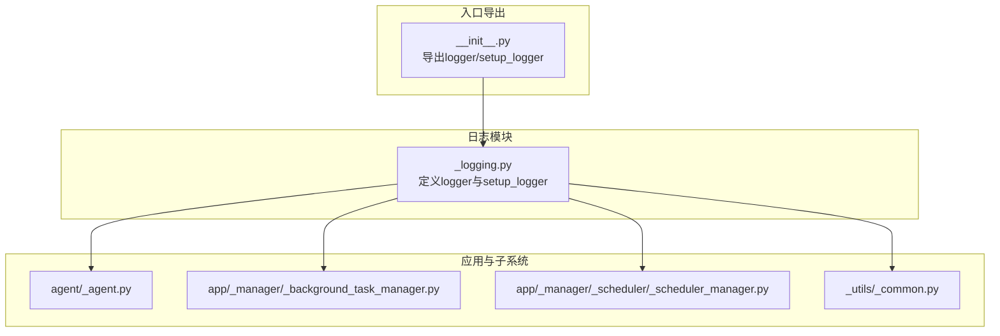
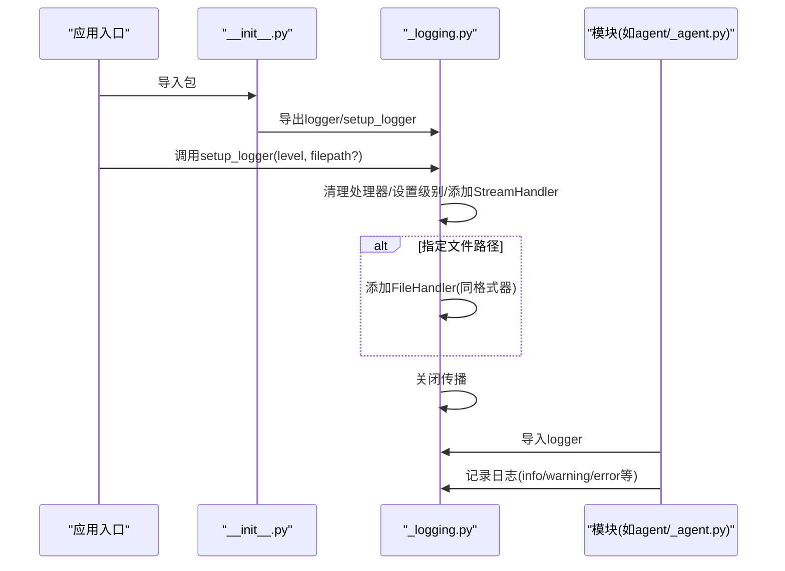
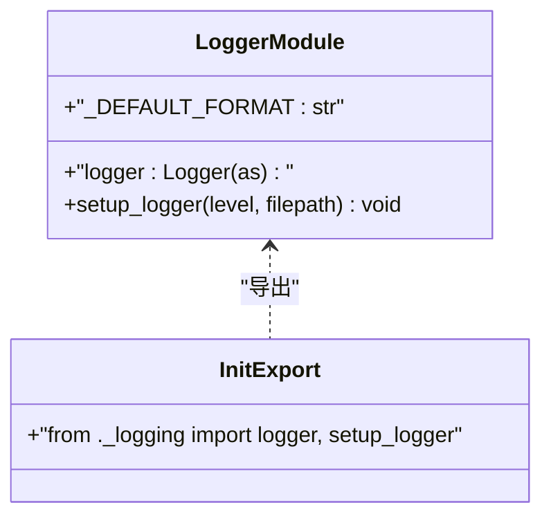
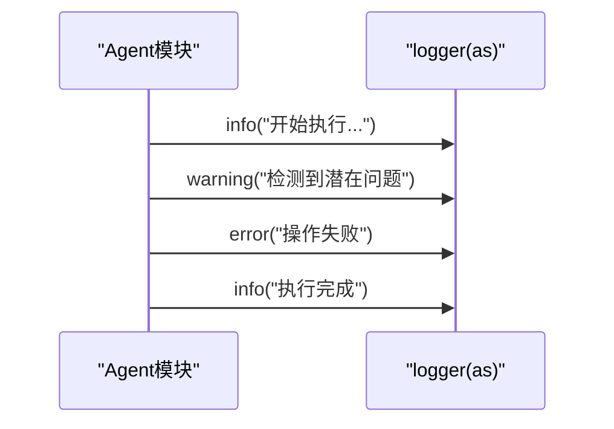
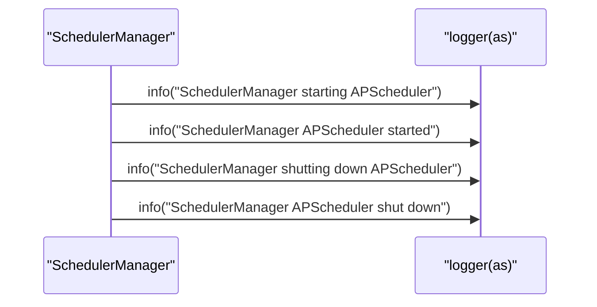
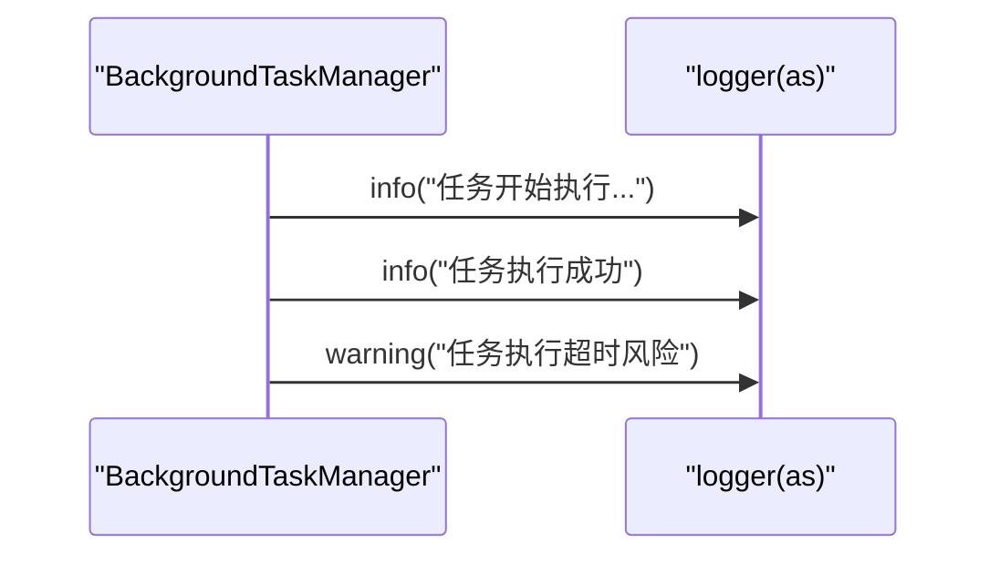
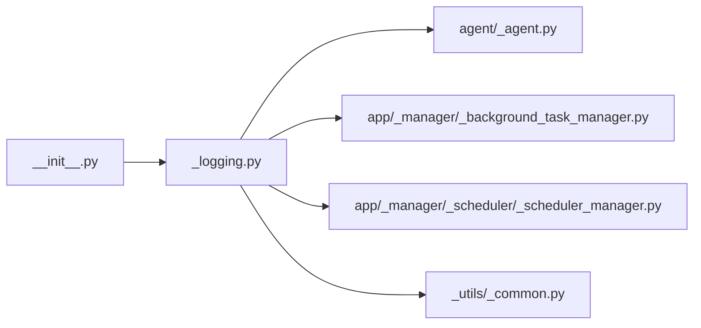

# 日志配置

<cite>
**本文引用的文件**
- [src/agentscope/_logging.py](file://src/agentscope/_logging.py)
- [src/agentscope/__init__.py](file://src/agentscope/__init__.py)
- [src/agentscope/_utils/_common.py](file://src/agentscope/_utils/_common.py)
- [src/agentscope/agent/_agent.py](file://src/agentscope/agent/_agent.py)
- [src/agentscope/app/_manager/_background_task_manager.py](file://src/agentscope/app/_manager/_background_task_manager.py)
- [src/agentscope/app/_manager/_scheduler/_scheduler_manager.py](file://src/agentscope/app/_manager/_scheduler/_scheduler_manager.py)
</cite>

## 目录
1. [简介](#简介)
2. [项目结构](#项目结构)
3. [核心组件](#核心组件)
4. [架构总览](#架构总览)
5. [详细组件分析](#详细组件分析)
6. [依赖分析](#依赖分析)
7. [性能考虑](#性能考虑)
8. [故障排除指南](#故障排除指南)
9. [结论](#结论)
10. [附录](#附录)

## 简介
本文件面向AgentScope的日志系统，提供从全局到模块与运行时的完整配置说明。内容涵盖：
- 日志配置层次：全局初始化、模块级使用、运行时动态调整
- 日志级别与过滤规则
- 输出格式与字段定制
- 日志轮转策略（按大小/按时间/压缩）
- 多环境配置示例：开发调试、生产监控、审计
- 性能优化与故障排除建议

AgentScope当前采用标准Python logging库实现统一日志入口，并通过模块内导入使用，支持同时输出至控制台与文件。

## 项目结构
AgentScope的日志体系由一个集中式日志模块与多处模块级使用点构成：
- 集中式日志模块：负责默认格式、级别设置、处理器注册与传播控制
- 模块级使用：各子系统在自身文件中导入并使用该logger
- 运行时动态配置：通过公共接口在应用启动或特定场景下调用以更新级别与输出目标

图表来源
- [src/agentscope/_logging.py:1-47](file://src/agentscope/_logging.py#L1-L47)
- [src/agentscope/__init__.py:5-8](file://src/agentscope/__init__.py#L5-L8)
- [src/agentscope/agent/_agent.py:22-22](file://src/agentscope/agent/_agent.py#L22-L22)
- [src/agentscope/app/_manager/_background_task_manager.py:17-17](file://src/agentscope/app/_manager/_background_task_manager.py#L17-L17)
- [src/agentscope/app/_manager/_scheduler/_scheduler_manager.py:8-8](file://src/agentscope/app/_manager/_scheduler/_scheduler_manager.py#L8-L8)
- [src/agentscope/_utils/_common.py:16-16](file://src/agentscope/_utils/_common.py#L16-L16)

章节来源
- [src/agentscope/_logging.py:1-47](file://src/agentscope/_logging.py#L1-L47)
- [src/agentscope/__init__.py:5-8](file://src/agentscope/__init__.py#L5-L8)

## 核心组件
- 日志器与默认格式
  - 默认格式包含时间戳、级别、模块名、函数名、行号与消息体
  - 控制台与文件处理器共享同一格式器
- 全局初始化
  - 提供setup_logger(level, filepath=None)用于设置级别与可选文件输出
  - 初始化时清理旧处理器，设置根级别，关闭传播，避免重复输出
- 模块级使用
  - 各模块通过from .._logging import logger导入并直接使用
  - 常见使用模式为info/warning等不同级别的记录

章节来源
- [src/agentscope/_logging.py:7-10](file://src/agentscope/_logging.py#L7-L10)
- [src/agentscope/_logging.py:15-44](file://src/agentscope/_logging.py#L15-L44)
- [src/agentscope/__init__.py:5-8](file://src/agentscope/__init__.py#L5-L8)

## 架构总览
下图展示AgentScope日志从初始化到模块使用的整体流程：

图表来源
- [src/agentscope/__init__.py:5-8](file://src/agentscope/__init__.py#L5-L8)
- [src/agentscope/_logging.py:15-44](file://src/agentscope/_logging.py#L15-L44)
- [src/agentscope/agent/_agent.py:323-323](file://src/agentscope/agent/_agent.py#L323-L323)

## 详细组件分析

### 组件A：日志模块（_logging.py）
- 角色与职责
  - 定义命名空间为“as”的logger
  - 提供setup_logger接口，支持设置级别与文件输出
  - 统一默认格式，确保跨模块一致性
- 数据结构与复杂度
  - 使用标准logging.Logger对象；格式器为一次性构造，复杂度O(1)
- 依赖关系
  - 依赖标准库logging
  - 被__init__.py导出，被各模块导入使用
- 错误处理
  - 对非法级别抛出异常，防止错误配置
- 性能影响
  - 单次初始化，后续仅进行日志写入，开销极低

图表来源
- [src/agentscope/_logging.py:7-10](file://src/agentscope/_logging.py#L7-L10)
- [src/agentscope/_logging.py:15-44](file://src/agentscope/_logging.py#L15-L44)
- [src/agentscope/__init__.py:5-8](file://src/agentscope/__init__.py#L5-L8)

章节来源
- [src/agentscope/_logging.py:1-47](file://src/agentscope/_logging.py#L1-L47)
- [src/agentscope/__init__.py:5-8](file://src/agentscope/__init__.py#L5-L8)

### 组件B：模块级日志使用（示例：agent/_agent.py）
- 使用方式
  - 在模块顶部导入logger
  - 在关键流程中调用logger.info/warning/error等方法
- 示例流程（序列）

图表来源
- [src/agentscope/agent/_agent.py:323-323](file://src/agentscope/agent/_agent.py#L323-L323)
- [src/agentscope/agent/_agent.py:358-358](file://src/agentscope/agent/_agent.py#L358-L358)
- [src/agentscope/agent/_agent.py:413-413](file://src/agentscope/agent/_agent.py#L413-L413)

章节来源
- [src/agentscope/agent/_agent.py:323-323](file://src/agentscope/agent/_agent.py#L323-L323)
- [src/agentscope/agent/_agent.py:358-358](file://src/agentscope/agent/_agent.py#L358-L358)
- [src/agentscope/agent/_agent.py:413-413](file://src/agentscope/agent/_agent.py#L413-L413)

### 组件C：调度器管理器中的日志（app/_manager/_scheduler/_scheduler_manager.py）
- 使用方式
  - 在启动、停止与状态变更时记录info日志
- 流程示意（序列）

图表来源
- [src/agentscope/app/_manager/_scheduler/_scheduler_manager.py:80-88](file://src/agentscope/app/_manager/_scheduler/_scheduler_manager.py#L80-L88)

章节来源
- [src/agentscope/app/_manager/_scheduler/_scheduler_manager.py:80-88](file://src/agentscope/app/_manager/_scheduler/_scheduler_manager.py#L80-L88)

### 组件D：后台任务管理器中的日志（app/_manager/_background_task_manager.py）
- 使用方式
  - 在任务执行前后记录info/warning日志
- 流程示意（序列）

图表来源
- [src/agentscope/app/_manager/_background_task_manager.py:137-137](file://src/agentscope/app/_manager/_background_task_manager.py#L137-L137)
- [src/agentscope/app/_manager/_background_task_manager.py:252-252](file://src/agentscope/app/_manager/_background_task_manager.py#L252-L252)
- [src/agentscope/app/_manager/_background_task_manager.py:280-280](file://src/agentscope/app/_manager/_background_task_manager.py#L280-L280)

章节来源
- [src/agentscope/app/_manager/_background_task_manager.py:137-137](file://src/agentscope/app/_manager/_background_task_manager.py#L137-L137)
- [src/agentscope/app/_manager/_background_task_manager.py:252-252](file://src/agentscope/app/_manager/_background_task_manager.py#L252-L252)
- [src/agentscope/app/_manager/_background_task_manager.py:280-280](file://src/agentscope/app/_manager/_background_task_manager.py#L280-L280)

## 依赖分析
- 模块耦合
  - 所有模块仅依赖统一的logger对象，降低耦合度
  - 通过__init__.py导出，形成清晰的对外接口
- 直接与间接依赖
  - 直接依赖：logging标准库
  - 间接依赖：平台控制台/文件IO能力
- 循环依赖
  - 无循环依赖迹象
- 外部集成点
  - 文件输出依赖操作系统文件句柄
  - 控制台输出依赖终端支持ANSI转义（若需要彩色输出）

图表来源
- [src/agentscope/__init__.py:5-8](file://src/agentscope/__init__.py#L5-L8)
- [src/agentscope/_logging.py:1-47](file://src/agentscope/_logging.py#L1-L47)
- [src/agentscope/agent/_agent.py:22-22](file://src/agentscope/agent/_agent.py#L22-L22)
- [src/agentscope/app/_manager/_background_task_manager.py:17-17](file://src/agentscope/app/_manager/_background_task_manager.py#L17-L17)
- [src/agentscope/app/_manager/_scheduler/_scheduler_manager.py:8-8](file://src/agentscope/app/_manager/_scheduler/_scheduler_manager.py#L8-L8)
- [src/agentscope/_utils/_common.py:16-16](file://src/agentscope/_utils/_common.py#L16-L16)

章节来源
- [src/agentscope/__init__.py:5-8](file://src/agentscope/__init__.py#L5-L8)
- [src/agentscope/_logging.py:1-47](file://src/agentscope/_logging.py#L1-L47)

## 性能考虑
- 初始化成本
  - setup_logger为一次性初始化，后续仅进行日志写入，开销极低
- 处理器数量
  - 默认仅添加StreamHandler；启用文件输出会增加FileHandler，注意磁盘IO开销
- 传播控制
  - 关闭propagate可避免重复输出，减少不必要的日志复制
- 建议
  - 生产环境优先使用文件输出，避免频繁控制台刷新
  - 避免在高频路径中记录大量细粒度日志
  - 合理选择级别，避免DEBUG在生产中开启

## 故障排除指南
- 常见问题
  - 日志不输出
    - 检查是否正确调用setup_logger并传入有效级别
    - 确认未意外关闭传播或清空处理器
  - 日志重复
    - 确保仅在顶层调用setup_logger一次
    - 检查是否存在多个logger实例或重复导入
  - 文件输出失败
    - 检查文件路径权限与目录存在性
    - 确认磁盘空间充足
- 排查步骤
  - 在应用入口调用setup_logger后，打印当前logger.handlers数量验证处理器注册
  - 在模块中插入临时info日志确认链路可用
  - 如需彩色输出，检查终端是否支持ANSI转义

章节来源
- [src/agentscope/_logging.py:28-32](file://src/agentscope/_logging.py#L28-L32)
- [src/agentscope/_logging.py:33-44](file://src/agentscope/_logging.py#L33-L44)

## 结论
AgentScope的日志系统以简洁统一的方式实现了跨模块的一致性输出。通过集中式初始化与模块级使用，既保证了灵活性，又降低了维护成本。建议在不同环境中采用差异化的级别与输出策略，并结合轮转与压缩机制保障长期稳定运行。

## 附录

### 日志配置层次与实践
- 全局日志配置
  - 在应用启动时调用setup_logger，设置全局级别与文件输出路径
  - 适用于统一入口的应用（如服务端主程序）
- 模块级配置
  - 各模块仅导入并使用logger，无需重复初始化
  - 适合在子系统内部保持独立日志上下文
- 运行时动态配置
  - 可在运行时再次调用setup_logger以调整级别或切换输出目标
  - 注意避免在高并发场景中频繁切换，必要时加锁或批处理

章节来源
- [src/agentscope/_logging.py:15-44](file://src/agentscope/_logging.py#L15-L44)
- [src/agentscope/__init__.py:5-8](file://src/agentscope/__init__.py#L5-L8)

### 日志级别与过滤规则
- 支持级别
  - INFO、DEBUG、WARNING、ERROR、CRITICAL
- 过滤建议
  - 开发：DEBUG，便于定位问题
  - 生产：INFO及以上，减少冗余
  - 审计：ERROR及以上，聚焦关键事件
- 实施要点
  - 通过setup_logger(level)统一设置
  - 模块内按场景选择合适级别，避免滥用

章节来源
- [src/agentscope/_logging.py:21-32](file://src/agentscope/_logging.py#L21-L32)

### 输出格式与字段定制
- 默认格式字段
  - 时间戳、日志级别、模块名、函数名、行号、消息
- 自定义建议
  - 若需结构化日志，可在应用层封装格式器或使用第三方库
  - 时间戳格式可按需调整，但需保持跨模块一致
- 字段定制
  - 可通过自定义Formatter扩展字段（如trace_id、span_id），便于分布式追踪

章节来源
- [src/agentscope/_logging.py:7-10](file://src/agentscope/_logging.py#L7-L10)

### 日志轮转策略
- 按大小轮转
  - 使用RotatingFileHandler，设定maxBytes与backupCount
  - 适合生产环境，避免单文件过大
- 按时间轮转
  - 使用TimedRotatingFileHandler，按日/小时/分钟等周期轮转
  - 适合审计与合规场景
- 压缩配置
  - 轮转后自动压缩历史文件，节省存储空间
- 实施建议
  - 生产环境推荐组合：大小+时间轮转 + 压缩
  - 审计日志建议启用压缩并保留较长周期

[本节为通用实践指导，不直接分析具体源码文件]

### 多环境日志配置示例
- 开发调试日志
  - 级别：DEBUG
  - 输出：控制台为主，便于实时查看
  - 特性：详细堆栈与上下文信息
- 生产监控日志
  - 级别：INFO
  - 输出：文件 + 远程日志收集（如stdout转发）
  - 特性：结构化字段、时间戳、模块标识
- 审计日志
  - 级别：ERROR及以上
  - 输出：文件轮转 + 压缩 + 长期归档
  - 特性：不可篡改、合规要求、最小暴露面

[本节为通用实践指导，不直接分析具体源码文件]