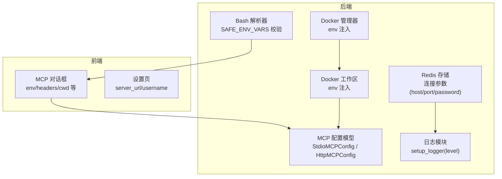
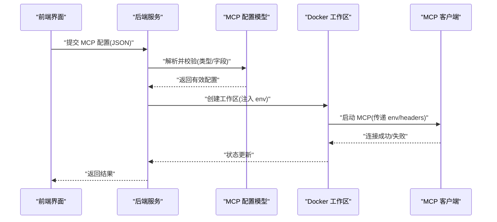
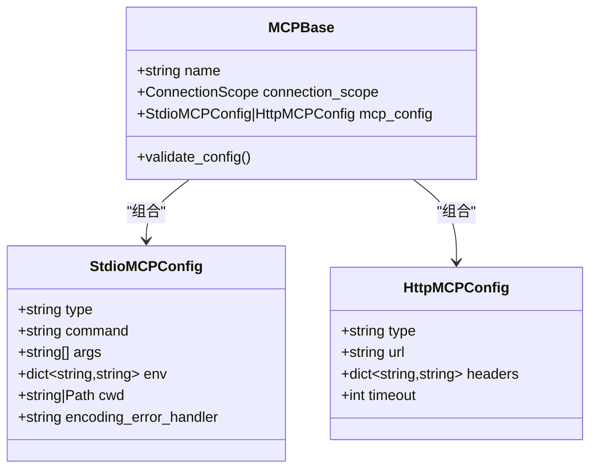
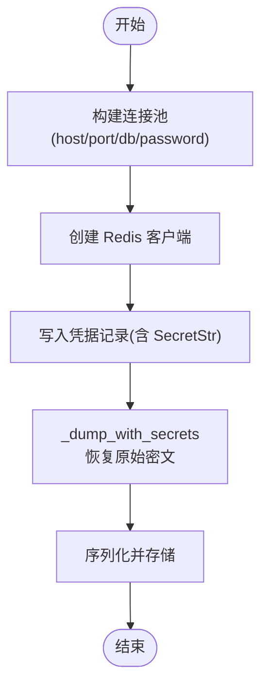
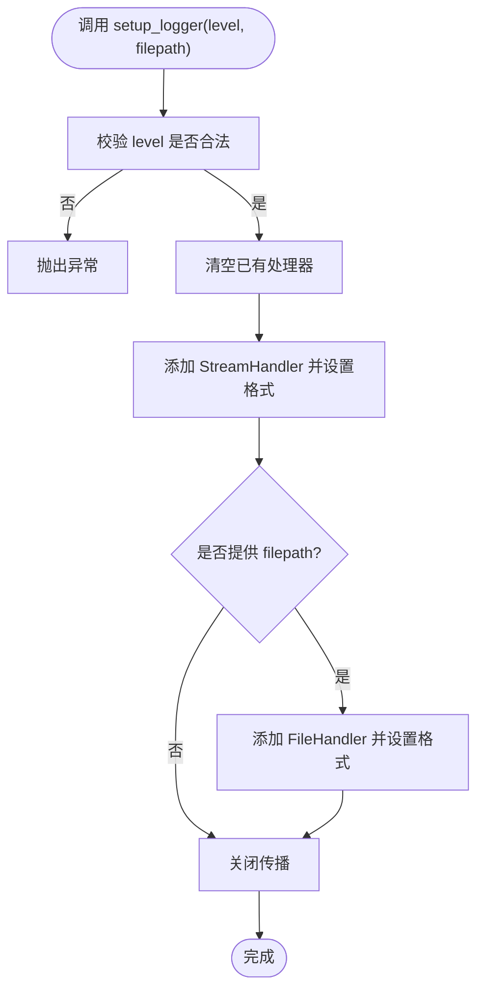
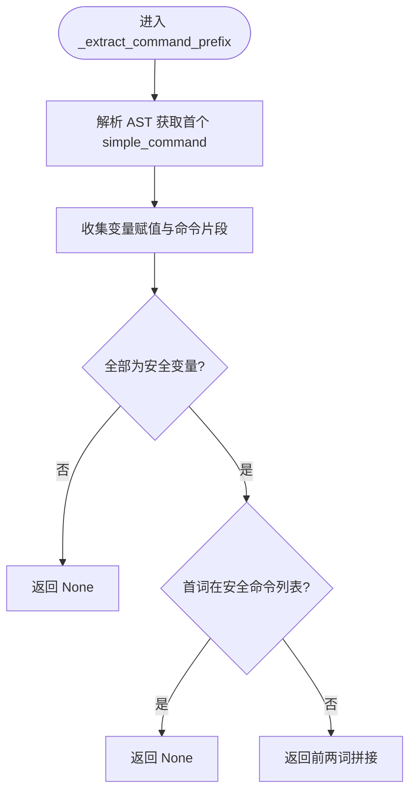
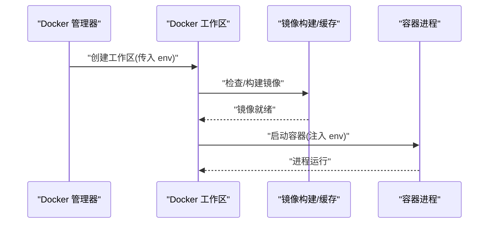
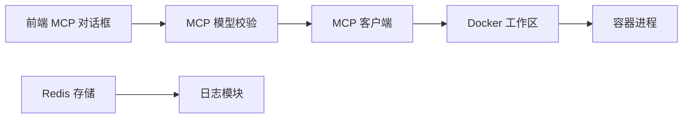

# 环境变量配置

<cite>
**本文引用的文件**
- [src/agentscope/mcp/_config.py](file://src/agentscope/mcp/_config.py)
- [src/agentscope/app/storage/_redis_storage.py](file://src/agentscope/app/storage/_redis_storage.py)
- [src/agentscope/app/storage/_utils.py](file://src/agentscope/app/storage/_utils.py)
- [src/agentscope/_logging.py](file://src/agentscope/_logging.py)
- [src/agentscope/tool/_builtin/_bash_parser.py](file://src/agentscope/tool/_builtin/_bash_parser.py)
- [src/agentscope/app/_schema/_mcp.py](file://src/agentscope/app/_schema/_mcp.py)
- [src/agentscope/mcp/_mcp_client.py](file://src/agentscope/mcp/_mcp_client.py)
- [src/agentscope/workspace/_docker/_docker_workspace.py](file://src/agentscope/workspace/_docker/_docker_workspace.py)
- [src/agentscope/app/_manager/_docker_workspace_manager.py](file://src/agentscope/app/_manager/_docker_workspace_manager.py)
- [examples/web_ui/frontend/src/components/dialog/MCPDialog.tsx](file://examples/web_ui/frontend/src/components/dialog/MCPDialog.tsx)
- [examples/web_ui/frontend/src/pages/setup/index.tsx](file://examples/web_ui/frontend/src/pages/setup/index.tsx)
- [tests/permission_bash_parser_test.py](file://tests/permission_bash_parser_test.py)
</cite>

## 目录
1. [简介](#简介)
2. [项目结构](#项目结构)
3. [核心组件](#核心组件)
4. [架构总览](#架构总览)
5. [详细组件分析](#详细组件分析)
6. [依赖关系分析](#依赖关系分析)
7. [性能考量](#性能考量)
8. [故障排查指南](#故障排查指南)
9. [结论](#结论)
10. [附录：环境变量配置模板与最佳实践](#附录环境变量配置模板与最佳实践)

## 简介
本文件聚焦于 AgentScope 的“环境变量配置”主题，系统梳理项目中与环境变量相关的设计点、使用方式与安全实践，涵盖以下方面：
- 支持的环境变量及其用途（含数据库连接、API 密钥、服务端口、日志级别等）
- 配置来源的优先级规则（命令行参数覆盖、配置文件覆盖、默认值回退）
- 敏感信息的安全处理（密钥管理、访问控制、存储掩码）
- 不同部署场景的配置模板（本地开发、容器化、云平台）
- 验证机制与错误处理策略
- 最佳实践与安全建议

说明：在当前仓库中，未发现集中式的“环境变量读取器”或“统一的配置加载器”。因此，本文基于现有实现进行归纳总结，并给出可落地的配置建议。

## 项目结构
围绕“环境变量配置”的关键代码分布在如下模块：
- MCP 配置模型与客户端：定义了 STDIO/HTTP MCP 的环境变量传递能力
- Redis 存储：暴露了连接参数（主机、端口、密码），用于持久化配置与凭据
- 日志模块：提供日志级别设置入口
- Bash 权限解析：对环境变量赋值进行白名单校验，避免危险前缀
- Web 前端：MCP 创建对话框支持传入 env 字典；设置页保存服务器地址与用户名
- Docker 工作区：支持为容器注入全局环境变量

图表来源
- [src/agentscope/mcp/_config.py:9-51](file://src/agentscope/mcp/_config.py#L9-L51)
- [src/agentscope/app/storage/_redis_storage.py:58-110](file://src/agentscope/app/storage/_redis_storage.py#L58-L110)
- [src/agentscope/_logging.py:15-47](file://src/agentscope/_logging.py#L15-L47)
- [src/agentscope/tool/_builtin/_bash_parser.py:511-573](file://src/agentscope/tool/_builtin/_bash_parser.py#L511-L573)
- [src/agentscope/workspace/_docker/_docker_workspace.py:134-147](file://src/agentscope/workspace/_docker/_docker_workspace.py#L134-L147)
- [src/agentscope/app/_manager/_docker_workspace_manager.py:66-92](file://src/agentscope/app/_manager/_docker_workspace_manager.py#L66-L92)
- [examples/web_ui/frontend/src/components/dialog/MCPDialog.tsx:60-79](file://examples/web_ui/frontend/src/components/dialog/MCPDialog.tsx#L60-L79)
- [examples/web_ui/frontend/src/pages/setup/index.tsx:23-31](file://examples/web_ui/frontend/src/pages/setup/index.tsx#L23-L31)

章节来源
- [src/agentscope/mcp/_config.py:1-51](file://src/agentscope/mcp/_config.py#L1-L51)
- [src/agentscope/app/storage/_redis_storage.py:58-110](file://src/agentscope/app/storage/_redis_storage.py#L58-L110)
- [src/agentscope/_logging.py:15-47](file://src/agentscope/_logging.py#L15-L47)
- [src/agentscope/tool/_builtin/_bash_parser.py:511-573](file://src/agentscope/tool/_builtin/_bash_parser.py#L511-L573)
- [src/agentscope/workspace/_docker/_docker_workspace.py:134-147](file://src/agentscope/workspace/_docker/_docker_workspace.py#L134-L147)
- [src/agentscope/app/_manager/_docker_workspace_manager.py:66-92](file://src/agentscope/app/_manager/_docker_workspace_manager.py#L66-L92)
- [examples/web_ui/frontend/src/components/dialog/MCPDialog.tsx:37-80](file://examples/web_ui/frontend/src/components/dialog/MCPDialog.tsx#L37-L80)
- [examples/web_ui/frontend/src/pages/setup/index.tsx:21-31](file://examples/web_ui/frontend/src/pages/setup/index.tsx#L21-L31)

## 核心组件
- MCP 环境变量传递
  - STDIO MCP 支持通过 env 字典向子进程注入环境变量
  - HTTP MCP 支持通过 headers 传递认证头
- Redis 连接参数
  - host、port、db、password 等参数用于建立连接池
- 日志级别
  - 提供 setup_logger(level, filepath) 接口，支持 INFO/DEBUG/WARNING/ERROR/CRITICAL
- Bash 安全前缀提取
  - 对环境变量赋值进行白名单校验，仅允许已知安全变量名
- Docker 工作区
  - 支持为容器注入全局环境变量，便于统一配置

章节来源
- [src/agentscope/mcp/_config.py:9-51](file://src/agentscope/mcp/_config.py#L9-L51)
- [src/agentscope/app/storage/_redis_storage.py:58-110](file://src/agentscope/app/storage/_redis_storage.py#L58-L110)
- [src/agentscope/_logging.py:15-47](file://src/agentscope/_logging.py#L15-L47)
- [src/agentscope/tool/_builtin/_bash_parser.py:511-573](file://src/agentscope/tool/_builtin/_bash_parser.py#L511-L573)
- [src/agentscope/workspace/_docker/_docker_workspace.py:134-147](file://src/agentscope/workspace/_docker/_docker_workspace.py#L134-L147)

## 架构总览
下图展示了“环境变量配置”在系统中的关键交互路径：前端输入 MCP 环境变量，后端模型接收并校验，最终由 Docker 工作区或 MCP 客户端应用到运行时。

图表来源
- [examples/web_ui/frontend/src/components/dialog/MCPDialog.tsx:105-131](file://examples/web_ui/frontend/src/components/dialog/MCPDialog.tsx#L105-L131)
- [src/agentscope/mcp/_config.py:9-51](file://src/agentscope/mcp/_config.py#L9-L51)
- [src/agentscope/workspace/_docker/_docker_workspace.py:134-147](file://src/agentscope/workspace/_docker/_docker_workspace.py#L134-L147)
- [src/agentscope/mcp/_mcp_client.py:117-149](file://src/agentscope/mcp/_mcp_client.py#L117-L149)

## 详细组件分析

### 组件一：MCP 环境变量配置
- 支持的字段
  - STDIO 模式：command、args、env、cwd、encoding_error_handler
  - HTTP 模式：url、headers、timeout
- 校验规则
  - STDIO MCP 必须为“有状态”（is_stateful=True）
  - enable_tools/disable_tools 不能同时包含相同工具名
- 使用场景
  - 在容器内运行 MCP 服务时，通过 env 注入 API Key 或其他凭据
  - 通过 headers 为 HTTP MCP 服务提供鉴权

图表来源
- [src/agentscope/mcp/_config.py:9-51](file://src/agentscope/mcp/_config.py#L9-L51)
- [src/agentscope/app/_schema/_mcp.py:41-84](file://src/agentscope/app/_schema/_mcp.py#L41-L84)
- [src/agentscope/mcp/_mcp_client.py:117-149](file://src/agentscope/mcp/_mcp_client.py#L117-L149)

章节来源
- [src/agentscope/mcp/_config.py:9-51](file://src/agentscope/mcp/_config.py#L9-L51)
- [src/agentscope/app/_schema/_mcp.py:41-84](file://src/agentscope/app/_schema/_mcp.py#L41-L84)
- [src/agentscope/mcp/_mcp_client.py:117-149](file://src/agentscope/mcp/_mcp_client.py#L117-L149)

### 组件二：Redis 连接参数与凭据存储
- 连接参数
  - host、port、db、password、连接池参数（如 max_connections、socket_timeout）
- 凭据存储
  - 使用 SecretStr 字段进行掩码处理，写入时保留原始值，读取时掩码显示
- TTL 与键模板
  - 支持滑动过期（key_ttl），键命名采用模板化配置

图表来源
- [src/agentscope/app/storage/_redis_storage.py:58-110](file://src/agentscope/app/storage/_redis_storage.py#L58-L110)
- [src/agentscope/app/storage/_utils.py:7-29](file://src/agentscope/app/storage/_utils.py#L7-L29)

章节来源
- [src/agentscope/app/storage/_redis_storage.py:58-110](file://src/agentscope/app/storage/_redis_storage.py#L58-L110)
- [src/agentscope/app/storage/_utils.py:7-29](file://src/agentscope/app/storage/_utils.py#L7-L29)

### 组件三：日志级别与输出
- 提供 setup_logger(level, filepath) 接口
- 支持控制台与文件输出，格式化日志内容
- 仅接受预设级别集合，非法值抛出异常

图表来源
- [src/agentscope/_logging.py:15-47](file://src/agentscope/_logging.py#L15-L47)

章节来源
- [src/agentscope/_logging.py:15-47](file://src/agentscope/_logging.py#L15-L47)

### 组件四：Bash 命令与环境变量安全
- 安全前缀提取逻辑
  - 跳过安全环境变量赋值（如 PATH/NODE_ENV/DEBUG 等）
  - 仅当第二词为子命令且非标志时才提取命令前缀
- 危险变量过滤
  - 若存在非安全变量赋值，则判定为不可提取，避免危险命令被放行

图表来源
- [src/agentscope/tool/_builtin/_bash_parser.py:511-573](file://src/agentscope/tool/_builtin/_bash_parser.py#L511-L573)
- [tests/permission_bash_parser_test.py:53-72](file://tests/permission_bash_parser_test.py#L53-L72)

章节来源
- [src/agentscope/tool/_builtin/_bash_parser.py:511-573](file://src/agentscope/tool/_builtin/_bash_parser.py#L511-L573)
- [tests/permission_bash_parser_test.py:53-72](file://tests/permission_bash_parser_test.py#L53-L72)

### 组件五：Docker 工作区与容器环境变量
- 管理器初始化
  - 支持为每个工作区容器注入全局 env
- 工作区初始化
  - 可指定 env 字典，随容器启动传递给进程

图表来源
- [src/agentscope/app/_manager/_docker_workspace_manager.py:66-92](file://src/agentscope/app/_manager/_docker_workspace_manager.py#L66-L92)
- [src/agentscope/workspace/_docker/_docker_workspace.py:134-147](file://src/agentscope/workspace/_docker/_docker_workspace.py#L134-L147)

章节来源
- [src/agentscope/app/_manager/_docker_workspace_manager.py:66-92](file://src/agentscope/app/_manager/_docker_workspace_manager.py#L66-L92)
- [src/agentscope/workspace/_docker/_docker_workspace.py:134-147](file://src/agentscope/workspace/_docker/_docker_workspace.py#L134-L147)

## 依赖关系分析
- 前端 MCP 对话框将用户输入的 JSON 解析为 MCP 配置，随后传递给后端
- 后端 MCP 配置模型负责字段校验与类型约束
- Docker 管理器与工作区负责将 env 注入容器
- 日志模块与 Redis 存储分别服务于可观测性与数据持久化

图表来源
- [examples/web_ui/frontend/src/components/dialog/MCPDialog.tsx:105-131](file://examples/web_ui/frontend/src/components/dialog/MCPDialog.tsx#L105-L131)
- [src/agentscope/mcp/_config.py:9-51](file://src/agentscope/mcp/_config.py#L9-L51)
- [src/agentscope/mcp/_mcp_client.py:117-149](file://src/agentscope/mcp/_mcp_client.py#L117-L149)
- [src/agentscope/workspace/_docker/_docker_workspace.py:134-147](file://src/agentscope/workspace/_docker/_docker_workspace.py#L134-L147)
- [src/agentscope/app/storage/_redis_storage.py:58-110](file://src/agentscope/app/storage/_redis_storage.py#L58-L110)
- [src/agentscope/_logging.py:15-47](file://src/agentscope/_logging.py#L15-L47)

章节来源
- [examples/web_ui/frontend/src/components/dialog/MCPDialog.tsx:105-131](file://examples/web_ui/frontend/src/components/dialog/MCPDialog.tsx#L105-L131)
- [src/agentscope/mcp/_config.py:9-51](file://src/agentscope/mcp/_config.py#L9-L51)
- [src/agentscope/mcp/_mcp_client.py:117-149](file://src/agentscope/mcp/_mcp_client.py#L117-L149)
- [src/agentscope/workspace/_docker/_docker_workspace.py:134-147](file://src/agentscope/workspace/_docker/_docker_workspace.py#L134-L147)
- [src/agentscope/app/storage/_redis_storage.py:58-110](file://src/agentscope/app/storage/_redis_storage.py#L58-L110)
- [src/agentscope/_logging.py:15-47](file://src/agentscope/_logging.py#L15-L47)

## 性能考量
- Redis 连接池参数（如 max_connections）直接影响并发性能与资源占用，应结合业务量合理配置
- 日志级别过高会增加 I/O 开销，生产环境建议使用 INFO 或 WARNING
- Docker 工作区的 env 注入不会显著影响容器启动时间，但过多环境变量可能增大进程内存占用

[本节为通用指导，不直接分析具体文件]

## 故障排查指南
- MCP 配置校验失败
  - 检查 STDIO 模式必须为“有状态”
  - 检查 enable_tools 与 disable_tools 是否存在重复项
- Redis 连接异常
  - 核对 host/port/db/password 是否正确
  - 关注连接池参数与网络连通性
- 日志级别无效
  - 确认传入级别在允许集合内
- Bash 命令被拒绝
  - 检查是否存在非安全环境变量赋值
  - 确认命令前缀提取逻辑是否命中安全规则

章节来源
- [src/agentscope/mcp/_mcp_client.py:117-149](file://src/agentscope/mcp/_mcp_client.py#L117-L149)
- [src/agentscope/app/storage/_redis_storage.py:133-155](file://src/agentscope/app/storage/_redis_storage.py#L133-L155)
- [src/agentscope/_logging.py:28-32](file://src/agentscope/_logging.py#L28-L32)
- [src/agentscope/tool/_builtin/_bash_parser.py:561-563](file://src/agentscope/tool/_builtin/_bash_parser.py#L561-L563)

## 结论
- AgentScope 在多处实现了对“环境变量”的显式支持：MCP 的 env/headers、Docker 的 env 注入、Redis 连接参数、日志级别设置
- 安全方面，Bash 解析器对环境变量赋值进行了白名单校验，降低潜在风险
- 当前仓库未发现统一的“环境变量读取器”，建议在实际部署中结合各组件的参数入口，按需引入配置文件与命令行参数，并遵循“最小权限”原则

[本节为总结性内容，不直接分析具体文件]

## 附录：环境变量配置模板与最佳实践

### 支持的环境变量与用途
- MCP 相关
  - STDIO 模式：通过 env 注入 API Key、令牌或其他运行时参数
  - HTTP 模式：通过 headers 注入 Authorization 等认证头
- Redis 相关
  - host、port、db、password：用于连接 Redis 存储
- 日志相关
  - 日志级别：INFO/DEBUG/WARNING/ERROR/CRITICAL
- Docker 相关
  - 全局 env：为容器注入统一的运行时环境变量

章节来源
- [src/agentscope/mcp/_config.py:9-51](file://src/agentscope/mcp/_config.py#L9-L51)
- [src/agentscope/app/storage/_redis_storage.py:58-110](file://src/agentscope/app/storage/_redis_storage.py#L58-L110)
- [src/agentscope/_logging.py:15-47](file://src/agentscope/_logging.py#L15-L47)
- [src/agentscope/workspace/_docker/_docker_workspace.py:134-147](file://src/agentscope/workspace/_docker/_docker_workspace.py#L134-L147)

### 配置优先级规则（建议）
- 建议顺序（从高到低）
  1) 命令行参数（覆盖默认值）
  2) 环境变量（覆盖配置文件）
  3) 配置文件（覆盖默认值）
  4) 默认值（兜底）
- 说明
  - 本仓库未内置统一的配置加载器，建议在应用入口处实现上述优先级策略
  - 对于敏感信息（如 API Key），优先通过环境变量注入，避免硬编码

[本节为通用指导，不直接分析具体文件]

### 敏感信息的安全处理
- 存储掩码
  - 使用 SecretStr 字段，在写入时保留原始值，读取时掩码显示
- 访问控制
  - 限制对凭据存储的访问范围，仅授权服务账户可读写
- 传输安全
  - 通过 HTTPS/headers 注入敏感头，避免明文传输

章节来源
- [src/agentscope/app/storage/_utils.py:7-29](file://src/agentscope/app/storage/_utils.py#L7-L29)

### 不同部署场景的配置模板（示例说明）
- 本地开发
  - Redis：host=localhost、port=6379、db=0、password=（可选）
  - 日志：level=DEBUG
  - MCP：STDIO 模式 env 注入本地密钥；HTTP 模式 headers 注入本地令牌
- 容器化部署
  - 通过 Docker 管理器的 env 参数为所有容器注入统一环境变量
  - Redis 连接参数通过环境变量注入
- 云平台部署
  - 使用平台提供的密钥管理服务（如 KMS/Vault）注入密钥
  - 通过环境变量传递 Redis 连接参数与 MCP 认证头

[本节为通用指导，不直接分析具体文件]

### 验证机制与错误处理
- 字段校验
  - STDIO MCP 必须为“有状态”
  - enable_tools 与 disable_tools 不能重叠
- 类型与取值校验
  - 日志级别必须在允许集合内
- 异常处理
  - 校验失败抛出异常，确保问题早发现
  - 前端对 JSON 解析与必填字段缺失进行提示

章节来源
- [src/agentscope/mcp/_mcp_client.py:117-149](file://src/agentscope/mcp/_mcp_client.py#L117-L149)
- [src/agentscope/_logging.py:28-32](file://src/agentscope/_logging.py#L28-L32)
- [examples/web_ui/frontend/src/components/dialog/MCPDialog.tsx:42-58](file://examples/web_ui/frontend/src/components/dialog/MCPDialog.tsx#L42-L58)

### 最佳实践与安全建议
- 最小权限
  - 仅注入必要的环境变量，避免泄露敏感信息
- 分层隔离
  - 将不同环境（开发/测试/生产）的配置分离，使用独立的环境变量空间
- 审计与轮换
  - 对密钥进行定期轮换，并记录变更历史
- 前端安全
  - 避免在前端存储长期有效的敏感令牌；必要时使用短期令牌与刷新机制

[本节为通用指导，不直接分析具体文件]