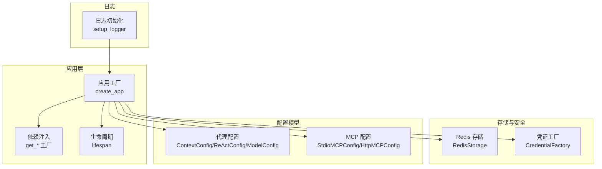
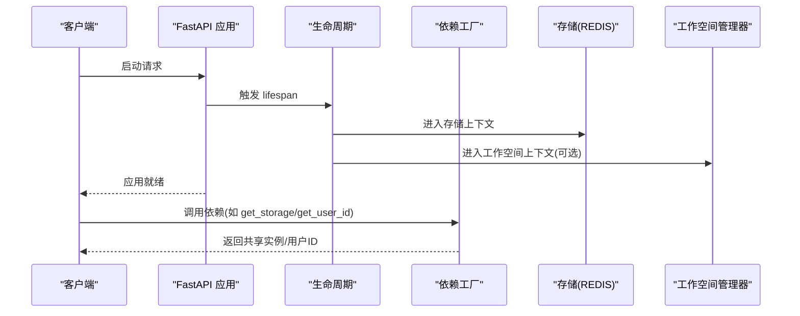
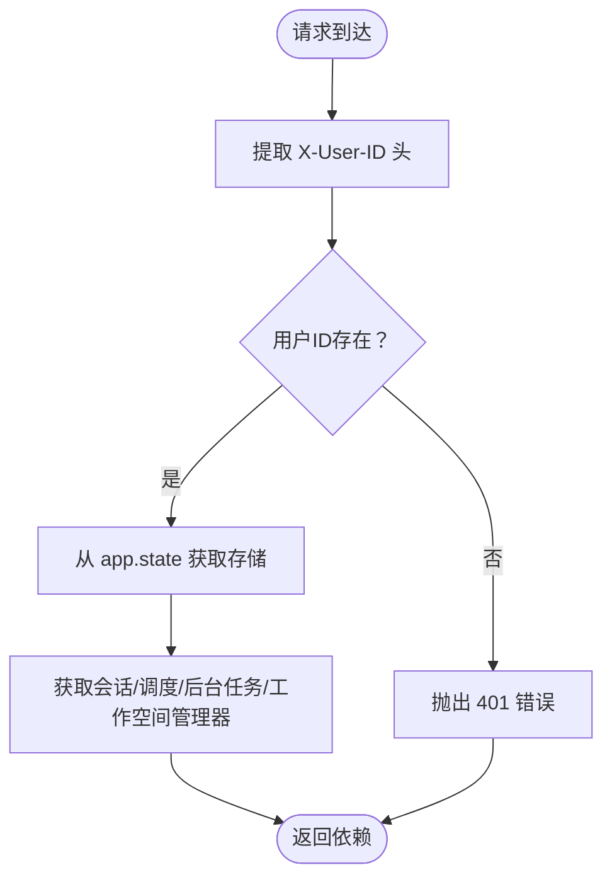
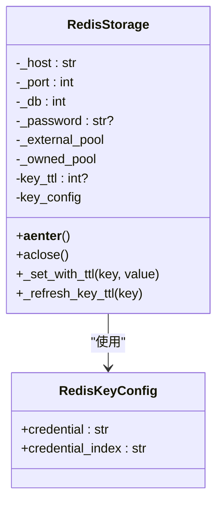
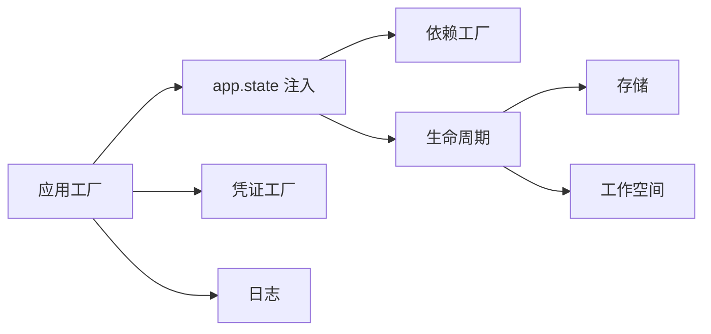
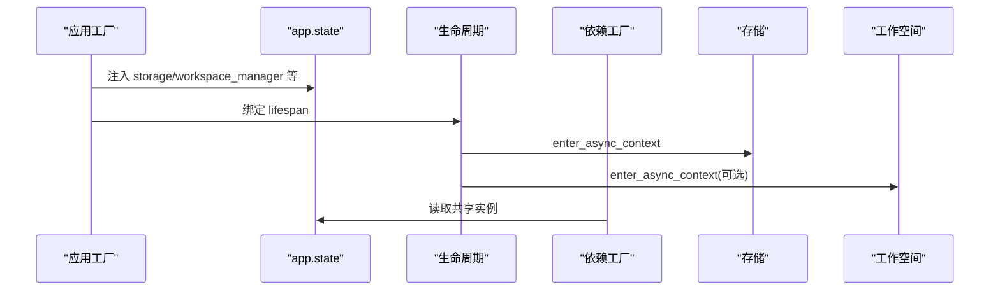

# 配置管理

<cite>
**本文引用的文件**
- [src/agentscope/app/_app.py](file://src/agentscope/app/_app.py)
- [src/agentscope/app/_deps.py](file://src/agentscope/app/_deps.py)
- [src/agentscope/app/_lifespan.py](file://src/agentscope/app/_lifespan.py)
- [src/agentscope/app/storage/_redis_storage.py](file://src/agentscope/app/storage/_redis_storage.py)
- [src/agentscope/_logging.py](file://src/agentscope/_logging.py)
- [src/agentscope/agent/_config.py](file://src/agentscope/agent/_config.py)
- [src/agentscope/mcp/_config.py](file://src/agentscope/mcp/_config.py)
- [src/agentscope/credential/_factory.py](file://src/agentscope/credential/_factory.py)
- [examples/agent_service/main.py](file://examples/agent_service/main.py)
- [src/agentscope/tool/_constants.py](file://src/agentscope/tool/_constants.py)
- [src/agentscope/tool/_builtin/_bash_parser.py](file://src/agentscope/tool/_builtin/_bash_parser.py)
</cite>

## 目录
1. [简介](#简介)
2. [项目结构](#项目结构)
3. [核心组件](#核心组件)
4. [架构总览](#架构总览)
5. [详细组件分析](#详细组件分析)
6. [依赖关系分析](#依赖关系分析)
7. [性能考量](#性能考量)
8. [故障排除指南](#故障排除指南)
9. [结论](#结论)
10. [附录](#附录)

## 简介
本文件系统性阐述 AgentScope 的配置管理与运行时装配机制，覆盖以下主题：
- 配置来源与优先级：环境变量、配置对象与命令行参数的优先级策略
- 应用配置项：数据库/存储（Redis）、缓存键模板、日志配置、安全参数（凭证、权限）
- 依赖注入与生命周期：FastAPI 依赖工厂、应用生命周期管理、共享状态注入
- 日志系统：默认格式、级别、文件落盘与轮转建议
- 环境最佳实践：开发、测试、生产三环境差异化配置
- 完整配置示例与故障排除指引

## 项目结构
AgentScope 的配置与运行时装配主要集中在应用工厂、依赖注入、生命周期管理、存储与日志模块中；同时，模型与 MCP 的配置采用 Pydantic 模型进行声明式定义。

图表来源
- [src/agentscope/app/_app.py:29-129](file://src/agentscope/app/_app.py#L29-L129)
- [src/agentscope/app/_deps.py:15-142](file://src/agentscope/app/_deps.py#L15-L142)
- [src/agentscope/app/_lifespan.py:14-38](file://src/agentscope/app/_lifespan.py#L14-L38)
- [src/agentscope/app/storage/_redis_storage.py:76-164](file://src/agentscope/app/storage/_redis_storage.py#L76-L164)
- [src/agentscope/credential/_factory.py:18-115](file://src/agentscope/credential/_factory.py#L18-L115)
- [src/agentscope/agent/_config.py:56-178](file://src/agentscope/agent/_config.py#L56-L178)
- [src/agentscope/mcp/_config.py:9-65](file://src/agentscope/mcp/_config.py#L9-L65)
- [src/agentscope/_logging.py:15-47](file://src/agentscope/_logging.py#L15-L47)

章节来源
- [src/agentscope/app/_app.py:29-129](file://src/agentscope/app/_app.py#L29-L129)
- [src/agentscope/app/_deps.py:15-142](file://src/agentscope/app/_deps.py#L15-L142)
- [src/agentscope/app/_lifespan.py:14-38](file://src/agentscope/app/_lifespan.py#L14-L38)
- [src/agentscope/app/storage/_redis_storage.py:76-164](file://src/agentscope/app/storage/_redis_storage.py#L76-L164)
- [src/agentscope/_logging.py:15-47](file://src/agentscope/_logging.py#L15-L47)
- [src/agentscope/agent/_config.py:56-178](file://src/agentscope/agent/_config.py#L56-L178)
- [src/agentscope/mcp/_config.py:9-65](file://src/agentscope/mcp/_config.py#L9-L65)
- [src/agentscope/credential/_factory.py:18-115](file://src/agentscope/credential/_factory.py#L18-L115)

## 核心组件
- 应用工厂与路由注册：通过工厂函数集中创建与装配 FastAPI 应用，注册内置路由与可选中间件，注入共享状态（存储、工作空间、扩展工具/中间件工厂等）。
- 依赖注入：提供统一的依赖工厂，从请求上下文提取用户 ID、存储实例、会话/调度/后台任务管理器以及工作空间管理器。
- 生命周期管理：在应用启动时打开存储连接池、进入工作空间管理器、启动会话/后台任务/调度器；在关闭时取消会话与任务、等待调度器完成、退出工作空间管理器。
- 存储与缓存：Redis 异步客户端封装，支持外部连接池复用、滑动过期 TTL、键模板化命名空间。
- 日志系统：默认控制台输出，支持文件落盘；提供日志级别校验与格式化。
- 配置模型：代理上下文压缩、ReAct 迭代、模型回退与重试；MCP 进程/HTTP 启动参数。
- 凭证工厂：基于类型判别器的动态反序列化，支持注册自定义凭证类型。
- 安全与权限：危险文件/目录白名单、Bash 命令前缀提取与安全环境变量判定。

章节来源
- [src/agentscope/app/_app.py:29-129](file://src/agentscope/app/_app.py#L29-L129)
- [src/agentscope/app/_deps.py:15-142](file://src/agentscope/app/_deps.py#L15-L142)
- [src/agentscope/app/_lifespan.py:14-38](file://src/agentscope/app/_lifespan.py#L14-L38)
- [src/agentscope/app/storage/_redis_storage.py:76-164](file://src/agentscope/app/storage/_redis_storage.py#L76-L164)
- [src/agentscope/_logging.py:15-47](file://src/agentscope/_logging.py#L15-L47)
- [src/agentscope/agent/_config.py:56-178](file://src/agentscope/agent/_config.py#L56-L178)
- [src/agentscope/mcp/_config.py:9-65](file://src/agentscope/mcp/_config.py#L9-L65)
- [src/agentscope/credential/_factory.py:18-115](file://src/agentscope/credential/_factory.py#L18-L115)
- [src/agentscope/tool/_constants.py:1-50](file://src/agentscope/tool/_constants.py#L1-L50)
- [src/agentscope/tool/_builtin/_bash_parser.py:430-581](file://src/agentscope/tool/_builtin/_bash_parser.py#L430-L581)

## 架构总览
下图展示应用启动到请求处理的关键流程，体现配置与依赖注入如何协同工作。

图表来源
- [src/agentscope/app/_lifespan.py:14-38](file://src/agentscope/app/_lifespan.py#L14-L38)
- [src/agentscope/app/_deps.py:15-142](file://src/agentscope/app/_deps.py#L15-L142)
- [src/agentscope/app/storage/_redis_storage.py:125-164](file://src/agentscope/app/storage/_redis_storage.py#L125-L164)

## 详细组件分析

### 应用工厂与路由注册
- 职责：创建 FastAPI 实例、注册内置路由、挂载可选中间件、注入共享状态（存储、工作空间、扩展工具/中间件工厂）。
- 关键点：
  - 支持将应用挂载到现有根应用的子路径。
  - 在启动前注册额外凭证类型，便于后续认证/授权。
  - 通过 app.state 注入存储、工作空间、扩展工厂，供依赖工厂与各路由使用。

章节来源
- [src/agentscope/app/_app.py:29-129](file://src/agentscope/app/_app.py#L29-L129)

### 依赖注入与共享状态
- 用户标识：从请求头提取用户 ID，作为后续鉴权与租户隔离的基础。
- 存储与管理器：从 app.state 获取存储实例、会话/调度/后台任务/工作空间管理器。
- 可选扩展：返回应用启动时注入的扩展中间件/工具工厂，按调用方上下文动态生成。

图表来源
- [src/agentscope/app/_deps.py:15-142](file://src/agentscope/app/_deps.py#L15-L142)

章节来源
- [src/agentscope/app/_deps.py:15-142](file://src/agentscope/app/_deps.py#L15-L142)

### 应用生命周期管理
- 启动阶段：进入存储上下文、进入工作空间上下文（若配置），恢复调度器持久化任务。
- 关闭阶段：取消会话与后台任务、等待调度器结束、退出工作空间上下文并清理缓存工作空间。

章节来源
- [src/agentscope/app/_lifespan.py:14-38](file://src/agentscope/app/_lifespan.py#L14-L38)

### Redis 存储与缓存键配置
- 连接参数：主机、端口、数据库索引、密码、连接池（可外部传入以复用生命周期）。
- 键模板：通过键配置类对不同记录类型（如凭证）进行命名空间化，便于维护与清理。
- TTL 策略：写入时可刷新滑动过期时间，避免冷键失效。
- 上下文管理：内部创建的连接池在退出时自动关闭，外部传入的连接池由调用方负责生命周期。

图表来源
- [src/agentscope/app/storage/_redis_storage.py:76-164](file://src/agentscope/app/storage/_redis_storage.py#L76-L164)
- [src/agentscope/app/storage/_redis_storage.py:111-124](file://src/agentscope/app/storage/_redis_storage.py#L111-L124)
- [src/agentscope/app/storage/_redis_storage.py:157-164](file://src/agentscope/app/storage/_redis_storage.py#L157-L164)

章节来源
- [src/agentscope/app/storage/_redis_storage.py:76-164](file://src/agentscope/app/storage/_redis_storage.py#L76-L164)
- [src/agentscope/app/storage/_redis_storage.py:111-124](file://src/agentscope/app/storage/_redis_storage.py#L111-L124)
- [src/agentscope/app/storage/_redis_storage.py:157-164](file://src/agentscope/app/storage/_redis_storage.py#L157-L164)

### 日志系统配置与使用
- 默认格式：包含时间戳、级别、模块名:函数名:行号与消息正文。
- 级别校验：仅允许预设级别（INFO/DEBUG/WARNING/ERROR/CRITICAL）。
- 输出目标：控制台处理器与可选文件处理器；关闭继承以避免重复输出。

章节来源
- [src/agentscope/_logging.py:15-47](file://src/agentscope/_logging.py#L15-L47)

### 代理配置选项
- 上下文压缩：触发阈值、保留比例、压缩提示词、摘要模板与结构化模式。
- ReAct 行为：最大迭代次数、被拒绝执行工具时的停止策略。
- 模型回退：重试次数与备用模型，与底层模型自身的重试语义保持一致。

章节来源
- [src/agentscope/agent/_config.py:56-178](file://src/agentscope/agent/_config.py#L56-L178)

### MCP 配置
- STDIO 模式：命令、参数、环境变量、工作目录、编码错误处理策略。
- HTTP 模式：服务器地址、附加请求头、超时秒数。

章节来源
- [src/agentscope/mcp/_config.py:9-65](file://src/agentscope/mcp/_config.py#L9-L65)

### 凭证工厂与安全参数
- 类型判别：基于“type”字段的联合类型适配器，支持注册自定义凭证类型。
- 动态反序列化：根据存储中的字典数据还原为具体凭证实例。
- 危险文件/目录白名单：内置保护列表，防止敏感文件/目录被自动编辑。
- Bash 命令解析：安全环境变量集合与安全命令集合，用于识别可直接放行的命令前缀，避免过度授权。

章节来源
- [src/agentscope/credential/_factory.py:18-115](file://src/agentscope/credential/_factory.py#L18-L115)
- [src/agentscope/tool/_constants.py:1-50](file://src/agentscope/tool/_constants.py#L1-L50)
- [src/agentscope/tool/_builtin/_bash_parser.py:430-581](file://src/agentscope/tool/_builtin/_bash_parser.py#L430-L581)

## 依赖关系分析
- 组件耦合：
  - 应用工厂与依赖注入紧密耦合：依赖工厂从 app.state 读取共享资源，确保单例与生命周期可控。
  - 生命周期管理器与存储/工作空间管理器强耦合：启动/关闭时必须成对进入/退出。
  - 凭证工厂与存储：凭证序列化/反序列化依赖存储读写能力。
- 外部依赖：
  - Redis 异步客户端库（安装提示见存储实现注释）。
  - FastAPI（ASGI 应用框架）。
- 循环依赖：未发现循环导入迹象；依赖方向清晰。

图表来源
- [src/agentscope/app/_app.py:104-129](file://src/agentscope/app/_app.py#L104-L129)
- [src/agentscope/app/_deps.py:44-98](file://src/agentscope/app/_deps.py#L44-L98)
- [src/agentscope/app/_lifespan.py:30-38](file://src/agentscope/app/_lifespan.py#L30-L38)

章节来源
- [src/agentscope/app/_app.py:104-129](file://src/agentscope/app/_app.py#L104-L129)
- [src/agentscope/app/_deps.py:44-98](file://src/agentscope/app/_deps.py#L44-L98)
- [src/agentscope/app/_lifespan.py:30-38](file://src/agentscope/app/_lifespan.py#L30-L38)

## 性能考量
- Redis 连接池复用：通过传入外部连接池减少频繁创建/销毁成本。
- 滑动 TTL：写入即刷新，避免冷键过期导致的频繁重建。
- 日志输出：默认仅控制台输出，生产环境建议开启文件处理器并配合系统级轮转策略。
- 依赖注入：避免在请求路径上重复创建昂贵对象，统一从 app.state 获取。

## 故障排除指南
- Redis 安装缺失
  - 现象：创建 RedisStorage 时报错提示缺少 redis 包。
  - 处理：按照实现注释安装异步 Redis 包。
  - 参考
    - [src/agentscope/app/storage/_redis_storage.py:134-139](file://src/agentscope/app/storage/_redis_storage.py#L134-L139)
- 缺少必需请求头
  - 现象：访问需要用户身份的接口返回 401。
  - 处理：确保请求头包含有效的用户 ID。
  - 参考
    - [src/agentscope/app/_deps.py:36-41](file://src/agentscope/app/_deps.py#L36-L41)
- 工作空间未配置
  - 现象：访问工作空间相关接口返回 503。
  - 处理：启动应用时提供工作空间管理器或禁用相关功能。
  - 参考
    - [src/agentscope/app/_deps.py:92-98](file://src/agentscope/app/_deps.py#L92-L98)
- 日志级别非法
  - 现象：设置日志级别时报错。
  - 处理：仅使用受支持的日志级别。
  - 参考
    - [src/agentscope/_logging.py:28-32](file://src/agentscope/_logging.py#L28-L32)
- MCP 配置错误
  - 现象：STDIO/HTTP MCP 启动失败或超时。
  - 处理：检查命令/URL、环境变量、工作目录与超时设置。
  - 参考
    - [src/agentscope/mcp/_config.py:14-41](file://src/agentscope/mcp/_config.py#L14-L41)
    - [src/agentscope/mcp/_config.py:49-64](file://src/agentscope/mcp/_config.py#L49-L64)

## 结论
AgentScope 的配置管理以“声明式配置 + 声明式依赖注入 + 明确生命周期”的方式组织，既保证了灵活性（可插拔存储、凭证与中间件），又确保了可运维性（日志、TTL、上下文管理）。通过合理的环境变量与配置模型组合，可在不同环境中快速切换部署形态。

## 附录

### 配置来源与优先级
- 环境变量：用于敏感信息与运行参数（如 API Key、MCP 服务器地址），在示例与脚本中广泛使用。
  - 示例参考
    - [examples/agent_service/main.py:27-33](file://examples/agent_service/main.py#L27-L33)
    - [examples/agent_service/main.py:19-25](file://examples/agent_service/main.py#L19-L25)
- 配置对象：通过 Pydantic 模型定义（代理配置、MCP 配置、凭证工厂等），提供类型安全与默认值。
  - 示例参考
    - [src/agentscope/agent/_config.py:56-178](file://src/agentscope/agent/_config.py#L56-L178)
    - [src/agentscope/mcp/_config.py:9-65](file://src/agentscope/mcp/_config.py#L9-L65)
    - [src/agentscope/credential/_factory.py:18-115](file://src/agentscope/credential/_factory.py#L18-L115)
- 命令行参数：当前仓库未发现显式的命令行解析逻辑；建议通过环境变量或配置文件驱动。

### 应用配置清单
- 数据库/存储
  - Redis 主机/端口/数据库/密码/连接池/TTL/键模板
  - 参考
    - [src/agentscope/app/storage/_redis_storage.py:76-164](file://src/agentscope/app/storage/_redis_storage.py#L76-L164)
- 缓存设置
  - 滑动过期 TTL、键模板命名空间
  - 参考
    - [src/agentscope/app/storage/_redis_storage.py:111-124](file://src/agentscope/app/storage/_redis_storage.py#L111-L124)
- 日志配置
  - 级别、格式、输出到文件
  - 参考
    - [src/agentscope/_logging.py:15-47](file://src/agentscope/_logging.py#L15-L47)
- 安全参数
  - 凭证类型判别与动态反序列化
  - 危险文件/目录白名单
  - Bash 安全环境变量与安全命令集合
  - 参考
    - [src/agentscope/credential/_factory.py:18-115](file://src/agentscope/credential/_factory.py#L18-L115)
    - [src/agentscope/tool/_constants.py:1-50](file://src/agentscope/tool/_constants.py#L1-L50)
    - [src/agentscope/tool/_builtin/_bash_parser.py:545-581](file://src/agentscope/tool/_builtin/_bash_parser.py#L545-L581)

### 依赖注入与生命周期（代码级）

图表来源
- [src/agentscope/app/_app.py:104-129](file://src/agentscope/app/_app.py#L104-L129)
- [src/agentscope/app/_lifespan.py:30-38](file://src/agentscope/app/_lifespan.py#L30-L38)
- [src/agentscope/app/_deps.py:44-98](file://src/agentscope/app/_deps.py#L44-L98)