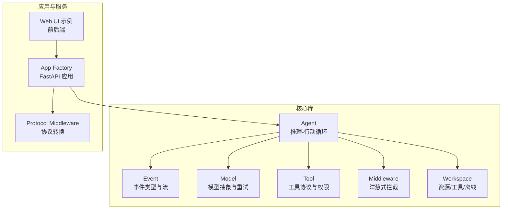
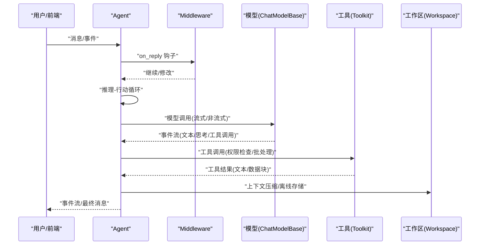
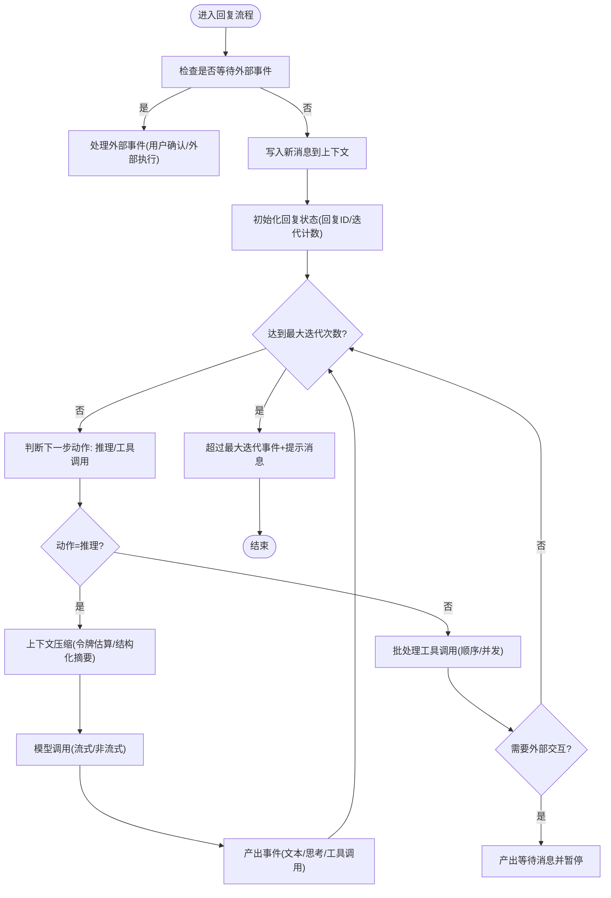
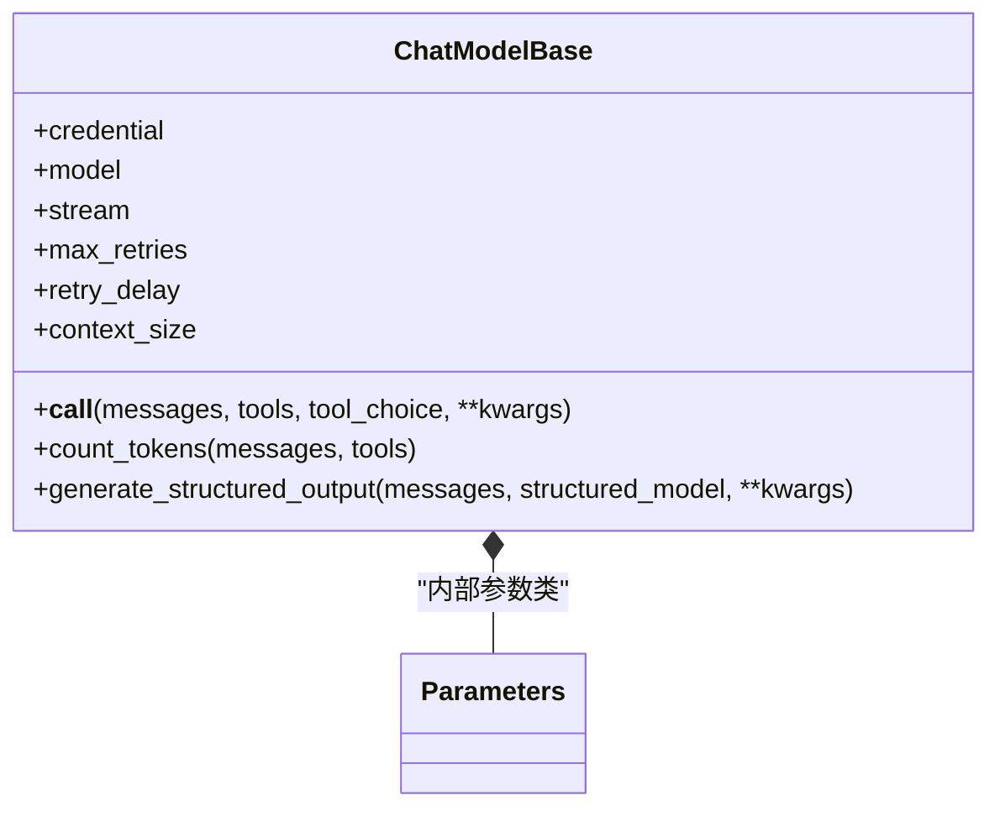
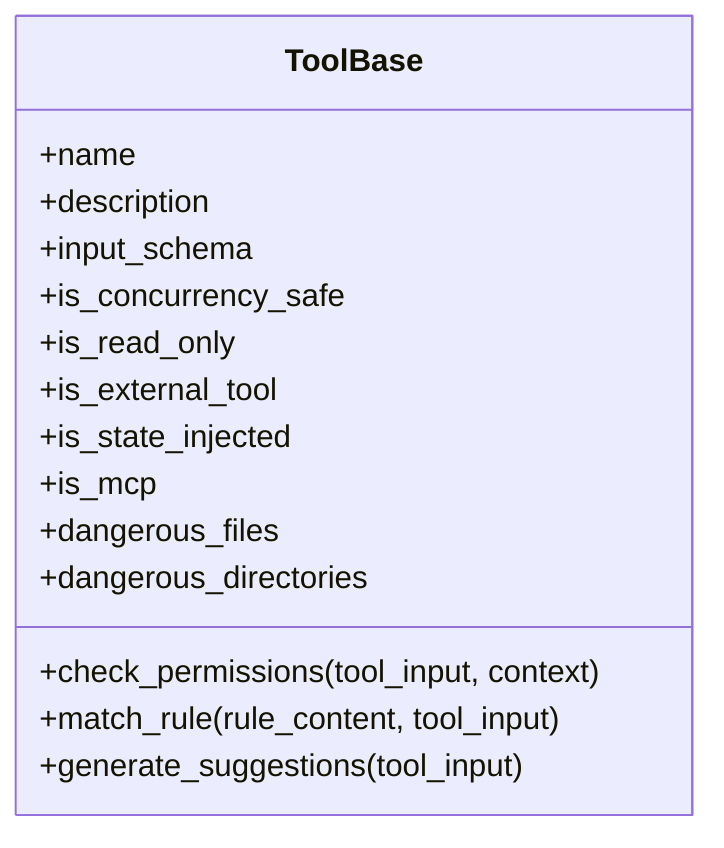
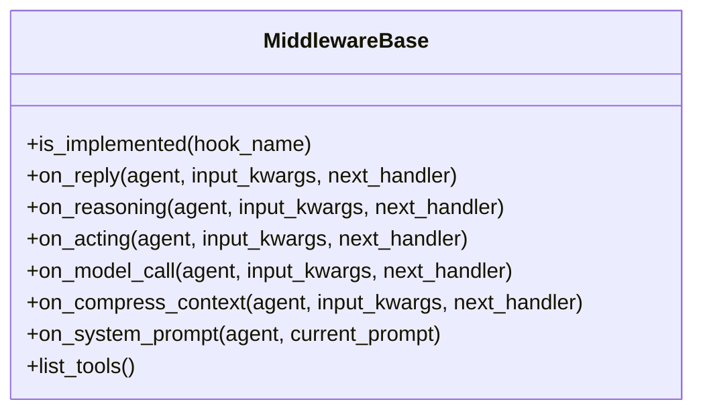
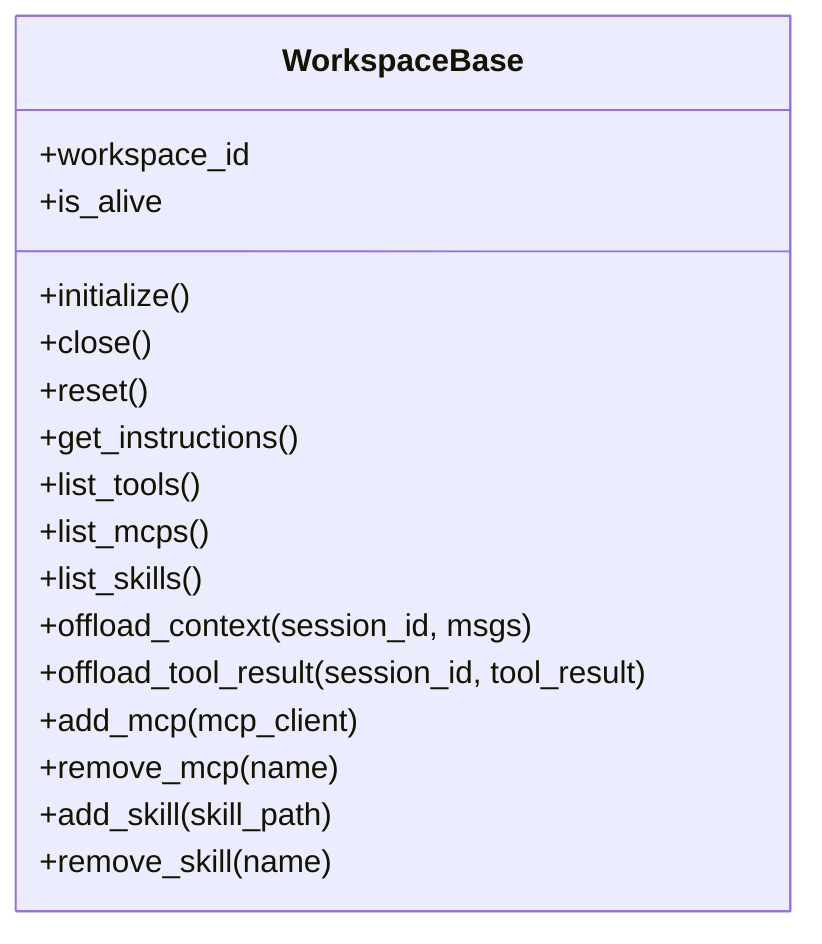
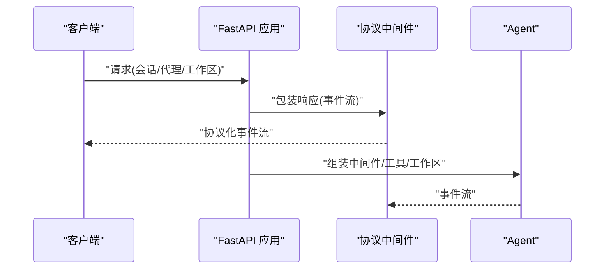
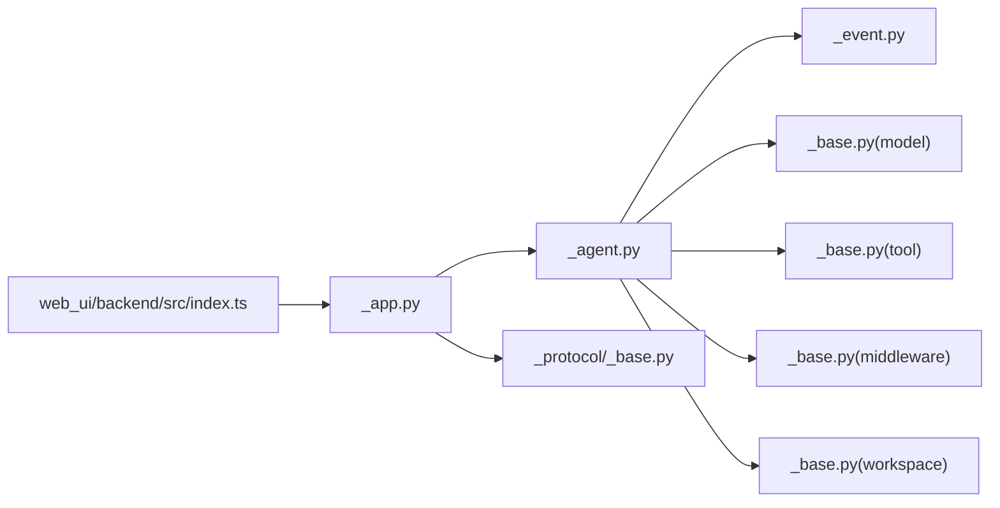

# 与其他框架对比

<cite>
**本文引用的文件**
- [README.md](file://README.md)
- [src/agentscope/__init__.py](file://src/agentscope/__init__.py)
- [src/agentscope/agent/_agent.py](file://src/agentscope/agent/_agent.py)
- [src/agentscope/event/_event.py](file://src/agentscope/event/_event.py)
- [src/agentscope/app/_app.py](file://src/agentscope/app/_app.py)
- [src/agentscope/tool/_base.py](file://src/agentscope/tool/_base.py)
- [src/agentscope/model/_base.py](file://src/agentscope/model/_base.py)
- [src/agentscope/middleware/_base.py](file://src/agentscope/middleware/_base.py)
- [src/agentscope/workspace/_base.py](file://src/agentscope/workspace/_base.py)
- [src/agentscope/app/_middleware/_protocol/_base.py](file://src/agentscope/app/_middleware/_protocol/_base.py)
- [examples/web_ui/backend/src/index.ts](file://examples/web_ui/backend/src/index.ts)
</cite>

## 目录
1. [引言](#引言)
2. [项目结构](#项目结构)
3. [核心组件](#核心组件)
4. [架构总览](#架构总览)
5. [详细组件分析](#详细组件分析)
6. [依赖分析](#依赖分析)
7. [性能考量](#性能考量)
8. [故障排查指南](#故障排查指南)
9. [结论](#结论)
10. [附录](#附录)

## 引言
本文件面向希望在多智能体与智能体应用开发中进行技术选型的工程师与架构师，系统对比 AgentScope 2.0 与主流智能体框架（如 LangChain、AutoGen、CrewAI 等），从设计理念、架构模式、易用性、性能表现、生态系统等方面进行横向分析，并结合 AgentScope 的实际源码能力，突出其“面向日益智能的 LLM 设计”“事件驱动架构”“生产就绪特性”等独特优势，辅以可落地的使用场景与性能基准建议，帮助读者做出更清晰的技术决策。

## 项目结构
AgentScope 采用模块化分层组织：核心抽象（Agent、Event、Model、Tool、Middleware、Workspace）、应用服务（FastAPI 应用工厂与路由）、Web UI 示例、以及多云/本地工作区支持。整体呈现“以事件流为核心”的异步流水线，强调可插拔中间件与工具集，以及对多模态输入输出与权限控制的内置支持。

图示来源
- [src/agentscope/agent/_agent.py:94-110](file://src/agentscope/agent/_agent.py#L94-L110)
- [src/agentscope/event/_event.py:14-51](file://src/agentscope/event/_event.py#L14-L51)
- [src/agentscope/model/_base.py:35-96](file://src/agentscope/model/_base.py#L35-L96)
- [src/agentscope/tool/_base.py:35-62](file://src/agentscope/tool/_base.py#L35-L62)
- [src/agentscope/middleware/_base.py:12-50](file://src/agentscope/middleware/_base.py#L12-L50)
- [src/agentscope/workspace/_base.py:36-61](file://src/agentscope/workspace/_base.py#L36-L61)
- [src/agentscope/app/_app.py:29-97](file://src/agentscope/app/_app.py#L29-L97)
- [src/agentscope/app/_middleware/_protocol/_base.py:16-36](file://src/agentscope/app/_middleware/_protocol/_base.py#L16-L36)
- [examples/web_ui/backend/src/index.ts:1-16](file://examples/web_ui/backend/src/index.ts#L1-L16)

章节来源
- [README.md:58-72](file://README.md#L58-L72)
- [src/agentscope/__init__.py:15-19](file://src/agentscope/__init__.py#L15-L19)
- [src/agentscope/app/_app.py:29-97](file://src/agentscope/app/_app.py#L29-L97)

## 核心组件
- Agent：统一的智能体类，封装“推理-行动”循环，支持事件流、权限检查、上下文压缩、工具批处理与外部交互（用户确认/外部执行）。
- Event：完备的事件类型体系，覆盖回复开始/结束、模型调用、文本/思考/数据块增量、工具调用与结果、最大迭代超限、外部触发等。
- Model：模型抽象基类，统一参数、重试策略、令牌估算、结构化输出生成、流式响应处理。
- Tool：工具协议与权限控制，内置危险路径检测、规则匹配与建议、并发安全标记、MCP 工具标识。
- Middleware：洋葱式拦截点（on_reply/on_reasoning/on_acting/on_model_call/on_compress_context/on_system_prompt），支持链式组合与按需实现。
- Workspace：工作区抽象，支持本地/容器/沙箱三种后端，提供资源发现、技能/MCP 管理、上下文/工具结果离线存储。
- App：FastAPI 应用工厂，自动注册路由，支持扩展中间件、凭证、工具与中间件工厂，便于嵌入或独立部署。

章节来源
- [src/agentscope/agent/_agent.py:94-150](file://src/agentscope/agent/_agent.py#L94-L150)
- [src/agentscope/event/_event.py:14-51](file://src/agentscope/event/_event.py#L14-L51)
- [src/agentscope/model/_base.py:35-96](file://src/agentscope/model/_base.py#L35-L96)
- [src/agentscope/tool/_base.py:35-62](file://src/agentscope/tool/_base.py#L35-L62)
- [src/agentscope/middleware/_base.py:12-50](file://src/agentscope/middleware/_base.py#L12-L50)
- [src/agentscope/workspace/_base.py:36-61](file://src/agentscope/workspace/_base.py#L36-L61)
- [src/agentscope/app/_app.py:29-97](file://src/agentscope/app/_app.py#L29-L97)

## 架构总览
AgentScope 的运行时以“事件流”为中心，Agent 在每次回复中产出结构化事件，中间件可在关键阶段插入横切逻辑；模型层负责与多厂商 LLM 对接并提供统一接口；工具层通过权限引擎与危险路径检测保障安全；工作区层提供资源与离线能力；应用层通过 FastAPI 提供多租户、多会话的服务化能力，并可通过协议中间件适配不同前端协议。

图示来源
- [src/agentscope/agent/_agent.py:191-252](file://src/agentscope/agent/_agent.py#L191-L252)
- [src/agentscope/middleware/_base.py:65-89](file://src/agentscope/middleware/_base.py#L65-L89)
- [src/agentscope/model/_base.py:157-217](file://src/agentscope/model/_base.py#L157-L217)
- [src/agentscope/tool/_base.py:70-76](file://src/agentscope/tool/_base.py#L70-L76)
- [src/agentscope/workspace/_base.py:123-155](file://src/agentscope/workspace/_base.py#L123-L155)

## 详细组件分析

### 组件一：Agent（推理-行动循环与事件驱动）
- 设计理念：围绕“日益智能的 LLM”，不以严格提示工程限制模型能力，而是利用模型的推理与工具使用能力，通过事件流与中间件实现可观测、可扩展、可调试的智能体行为。
- 关键机制：
  - 事件流：统一的事件类型与流式产出，便于前端实时渲染与后端可观测性。
  - 权限引擎：在工具调用前进行权限判定与规则建议，支持细粒度规则匹配与危险路径检测。
  - 上下文压缩：基于令牌估算与结构化摘要生成，避免上下文溢出。
  - 批处理工具调用：支持顺序/并发两种批量策略，提升执行效率。
  - 外部交互：当需要用户确认或外部执行时，Agent 会发出等待事件并暂停，待外部恢复后再继续。
- 适用场景：复杂任务编排、人机协作、长对话记忆管理、多模态内容生成与处理。

图示来源
- [src/agentscope/agent/_agent.py:595-686](file://src/agentscope/agent/_agent.py#L595-L686)
- [src/agentscope/event/_event.py:328-337](file://src/agentscope/event/_event.py#L328-L337)

章节来源
- [src/agentscope/agent/_agent.py:94-150](file://src/agentscope/agent/_agent.py#L94-L150)
- [src/agentscope/agent/_agent.py:191-252](file://src/agentscope/agent/_agent.py#L191-L252)
- [src/agentscope/agent/_agent.py:497-541](file://src/agentscope/agent/_agent.py#L497-L541)
- [src/agentscope/agent/_agent.py:542-686](file://src/agentscope/agent/_agent.py#L542-L686)

### 组件二：事件系统（EventType 与事件流）
- 事件类型覆盖完整：回复生命周期、模型调用、文本/思考/数据块增量、工具调用/结果、外部交互触发与结果、最大迭代超限等。
- 事件流用于：
  - 前端实时渲染（如聊天 UI）。
  - 后端可观测性与审计。
  - 中间件与协议适配器的统一数据格式。

```mermaid
classDiagram
class EventType {
+REPLY_START
+REPLY_END
+MODEL_CALL_START
+MODEL_CALL_END
+TEXT_BLOCK_START
+TEXT_BLOCK_DELTA
+TEXT_BLOCK_END
+DATA_BLOCK_START
+DATA_BLOCK_DELTA
+DATA_BLOCK_END
+THINKING_BLOCK_START
+THINKING_BLOCK_DELTA
+THINKING_BLOCK_END
+TOOL_CALL_START
+TOOL_CALL_DELTA
+TOOL_CALL_END
+TOOL_RESULT_START
+TOOL_RESULT_TEXT_DELTA
+TOOL_RESULT_DATA_DELTA
+TOOL_RESULT_END
+EXCEED_MAX_ITERS
+REQUIRE_USER_CONFIRM
+REQUIRE_EXTERNAL_EXECUTION
+USER_CONFIRM_RESULT
+EXTERNAL_EXECUTION_RESULT
}
class EventBase {
+id
+created_at
}
class ReplyStartEvent
class ReplyEndEvent
class ModelCallStartEvent
class ModelCallEndEvent
class TextBlockStartEvent
class TextBlockDeltaEvent
class TextBlockEndEvent
class DataBlockStartEvent
class DataBlockDeltaEvent
class DataBlockEndEvent
class ThinkingBlockStartEvent
class ThinkingBlockDeltaEvent
class ThinkingBlockEndEvent
class ToolCallStartEvent
class ToolCallDeltaEvent
class ToolCallEndEvent
class ToolResultStartEvent
class ToolResultTextDeltaEvent
class ToolResultDataDeltaEvent
class ToolResultEndEvent
class ExceedMaxItersEvent
class RequireUserConfirmEvent
class RequireExternalExecutionEvent
class UserConfirmResultEvent
class ExternalExecutionResultEvent
EventBase <|-- ReplyStartEvent
EventBase <|-- ReplyEndEvent
EventBase <|-- ModelCallStartEvent
EventBase <|-- ModelCallEndEvent
EventBase <|-- TextBlockStartEvent
EventBase <|-- TextBlockDeltaEvent
EventBase <|-- TextBlockEndEvent
EventBase <|-- DataBlockStartEvent
EventBase <|-- DataBlockDeltaEvent
EventBase <|-- DataBlockEndEvent
EventBase <|-- ThinkingBlockStartEvent
EventBase <|-- ThinkingBlockDeltaEvent
EventBase <|-- ThinkingBlockEndEvent
EventBase <|-- ToolCallStartEvent
EventBase <|-- ToolCallDeltaEvent
EventBase <|-- ToolCallEndEvent
EventBase <|-- ToolResultStartEvent
EventBase <|-- ToolResultTextDeltaEvent
EventBase <|-- ToolResultDataDeltaEvent
EventBase <|-- ToolResultEndEvent
EventBase <|-- ExceedMaxItersEvent
EventBase <|-- RequireUserConfirmEvent
EventBase <|-- RequireExternalExecutionEvent
EventBase <|-- UserConfirmResultEvent
EventBase <|-- ExternalExecutionResultEvent
```

图示来源
- [src/agentscope/event/_event.py:14-51](file://src/agentscope/event/_event.py#L14-L51)
- [src/agentscope/event/_event.py:64-88](file://src/agentscope/event/_event.py#L64-L88)
- [src/agentscope/event/_event.py:90-112](file://src/agentscope/event/_event.py#L90-L112)
- [src/agentscope/event/_event.py:114-147](file://src/agentscope/event/_event.py#L114-L147)
- [src/agentscope/event/_event.py:149-186](file://src/agentscope/event/_event.py#L149-L186)
- [src/agentscope/event/_event.py:188-224](file://src/agentscope/event/_event.py#L188-L224)
- [src/agentscope/event/_event.py:227-262](file://src/agentscope/event/_event.py#L227-L262)
- [src/agentscope/event/_event.py:264-326](file://src/agentscope/event/_event.py#L264-L326)
- [src/agentscope/event/_event.py:328-403](file://src/agentscope/event/_event.py#L328-L403)

章节来源
- [src/agentscope/event/_event.py:14-51](file://src/agentscope/event/_event.py#L14-L51)

### 组件三：模型抽象（ChatModelBase）与多厂商集成
- 统一参数与重试策略：支持最大重试次数、延迟、异常类型过滤，保证调用稳定性。
- 令牌估算与结构化输出：提供统一的令牌估算方法与结构化输出生成，兼容不同厂商 API 的差异。
- 流式响应：统一处理流式/非流式响应，便于事件驱动渲染。

图示来源
- [src/agentscope/model/_base.py:35-96](file://src/agentscope/model/_base.py#L35-L96)
- [src/agentscope/model/_base.py:157-217](file://src/agentscope/model/_base.py#L157-L217)
- [src/agentscope/model/_base.py:296-371](file://src/agentscope/model/_base.py#L296-L371)
- [src/agentscope/model/_base.py:373-436](file://src/agentscope/model/_base.py#L373-L436)

章节来源
- [src/agentscope/model/_base.py:35-96](file://src/agentscope/model/_base.py#L35-L96)
- [src/agentscope/model/_base.py:157-217](file://src/agentscope/model/_base.py#L157-L217)

### 组件四：工具系统（ToolBase）与权限控制
- 工具协议：统一的工具输入/输出规范、并发安全标记、外部工具标识、MCP 工具支持。
- 权限控制：提供权限检查、规则匹配与建议、危险路径检测（敏感文件/目录），确保安全可控。
- 可扩展性：支持自定义工具与工具组，配合中间件实现横切逻辑。

图示来源
- [src/agentscope/tool/_base.py:35-62](file://src/agentscope/tool/_base.py#L35-L62)
- [src/agentscope/tool/_base.py:70-144](file://src/agentscope/tool/_base.py#L70-L144)
- [src/agentscope/tool/_base.py:146-195](file://src/agentscope/tool/_base.py#L146-L195)

章节来源
- [src/agentscope/tool/_base.py:35-62](file://src/agentscope/tool/_base.py#L35-L62)
- [src/agentscope/tool/_base.py:70-144](file://src/agentscope/tool/_base.py#L70-L144)

### 组件五：中间件系统（MiddlewareBase）
- 拦截点：on_reply、on_reasoning、on_acting、on_model_call、on_compress_context、on_system_prompt。
- 执行模式：洋葱式拦截与变换管线（on_system_prompt），支持链式组合与按需实现。
- 安全考虑：on_acting 仅包裹纯 I/O 层，避免并发状态下对 Agent 状态的直接修改，必要时需在中间件中加锁或隔离。

图示来源
- [src/agentscope/middleware/_base.py:12-50](file://src/agentscope/middleware/_base.py#L12-L50)
- [src/agentscope/middleware/_base.py:65-89](file://src/agentscope/middleware/_base.py#L65-L89)
- [src/agentscope/middleware/_base.py:91-112](file://src/agentscope/middleware/_base.py#L91-L112)
- [src/agentscope/middleware/_base.py:114-158](file://src/agentscope/middleware/_base.py#L114-L158)
- [src/agentscope/middleware/_base.py:160-187](file://src/agentscope/middleware/_base.py#L160-L187)
- [src/agentscope/middleware/_base.py:188-208](file://src/agentscope/middleware/_base.py#L188-L208)
- [src/agentscope/middleware/_base.py:210-230](file://src/agentscope/middleware/_base.py#L210-L230)

章节来源
- [src/agentscope/middleware/_base.py:12-50](file://src/agentscope/middleware/_base.py#L12-L50)

### 组件六：工作区（WorkspaceBase）与离线能力
- 资源与工具：提供 MCP 列表、技能列表、内置工具发现。
- 离线存储：支持上下文与工具结果的持久化，便于后续检索与回放。
- 生命周期：统一的 initialize/close/reset 协议，支持 async with 上下文管理。

图示来源
- [src/agentscope/workspace/_base.py:36-61](file://src/agentscope/workspace/_base.py#L36-L61)
- [src/agentscope/workspace/_base.py:103-155](file://src/agentscope/workspace/_base.py#L103-L155)
- [src/agentscope/workspace/_base.py:159-203](file://src/agentscope/workspace/_base.py#L159-L203)

章节来源
- [src/agentscope/workspace/_base.py:36-61](file://src/agentscope/workspace/_base.py#L36-L61)

### 组件七：应用服务（FastAPI 应用工厂与协议中间件）
- 应用工厂：自动注册路由、挂载扩展中间件、注入存储与工作区管理器，支持多租户与多会话。
- 协议中间件：将 AgentEvent 流转换为特定协议（如 AGUI/A2A），便于前端适配。

图示来源
- [src/agentscope/app/_app.py:29-97](file://src/agentscope/app/_app.py#L29-L97)
- [src/agentscope/app/_middleware/_protocol/_base.py:16-36](file://src/agentscope/app/_middleware/_protocol/_base.py#L16-L36)

章节来源
- [src/agentscope/app/_app.py:29-97](file://src/agentscope/app/_app.py#L29-L97)
- [src/agentscope/app/_middleware/_protocol/_base.py:16-36](file://src/agentscope/app/_middleware/_protocol/_base.py#L16-L36)

## 依赖分析
- 内聚性：各模块职责清晰，Agent 负责推理-行动循环，Event 负责事件建模，Model/Tool/Middleware/Workspace 分别承担模型对接、工具协议、横切逻辑与资源管理。
- 耦合性：通过抽象接口（如 ChatModelBase、ToolBase、WorkspaceBase、MiddlewareBase）降低耦合；应用层通过工厂与中间件实现与业务的解耦。
- 外部依赖：FastAPI、Starlette、Pydantic、jsonschema 等，均通过模块化封装在各自领域内使用，未见循环依赖迹象。

图示来源
- [src/agentscope/agent/_agent.py:20-86](file://src/agentscope/agent/_agent.py#L20-L86)
- [src/agentscope/app/_app.py:7-16](file://src/agentscope/app/_app.py#L7-L16)
- [examples/web_ui/backend/src/index.ts:1-16](file://examples/web_ui/backend/src/index.ts#L1-L16)

章节来源
- [src/agentscope/agent/_agent.py:20-86](file://src/agentscope/agent/_agent.py#L20-L86)
- [src/agentscope/app/_app.py:7-16](file://src/agentscope/app/_app.py#L7-L16)

## 性能考量
- 令牌估算与上下文压缩：通过统一的令牌估算与结构化摘要生成，减少上下文长度，提高长对话与多轮任务的稳定性。
- 流式响应与事件驱动：模型与工具的流式输出与事件驱动渲染，显著降低前端等待时间，提升用户体验。
- 批处理工具调用：顺序/并发两种策略，根据任务特性选择，平衡吞吐与一致性。
- 中间件与协议适配：通过中间件与协议中间件，可按需引入缓存、追踪与审计，避免对核心路径的侵入。
- 生产部署：内置 FastAPI 应用工厂与多工作区后端，支持本地/云端/容器化部署，具备可观测性基础。

## 故障排查指南
- 事件流异常：检查事件类型与消费逻辑，确保前端/中间件正确解析事件。
- 权限拒绝：核对工具规则与危险路径检测，必要时调整规则或使用建议规则。
- 上下文溢出：启用上下文压缩，调整阈值与保留比例，避免系统提示与摘要超出上下文。
- 模型调用失败：检查重试策略与异常类型，确认网络与凭据配置。
- 协议转换问题：验证协议中间件的事件转换逻辑，确保与前端协议一致。

章节来源
- [src/agentscope/event/_event.py:405-431](file://src/agentscope/event/_event.py#L405-L431)
- [src/agentscope/tool/_base.py:70-144](file://src/agentscope/tool/_base.py#L70-L144)
- [src/agentscope/agent/_agent.py:300-492](file://src/agentscope/agent/_agent.py#L300-L492)
- [src/agentscope/model/_base.py:98-107](file://src/agentscope/model/_base.py#L98-L107)

## 结论
AgentScope 2.0 以“事件驱动 + 中间件 + 工作区”的架构，构建了面向日益智能 LLM 的生产级智能体平台。其优势体现在：
- 设计理念：拥抱 LLM 的推理与工具能力，而非受限于严格提示工程。
- 架构模式：事件流贯穿始终，中间件提供强大的横切能力，工作区提供资源与离线能力。
- 易用性：内置 ReAct 智能体、工具与技能、人机协作、内存与计划、实时语音、评估与微调支持。
- 生产就绪：支持本地/无服务器/云原生部署，内置可观测性与多租户多会话服务。
- 生态系统：内置 MCP 与 A2A 支持，消息中心用于灵活的多智能体编排与工作流。

在与 LangChain、AutoGen、CrewAI 等框架的对比中，AgentScope 更强调“事件驱动 + 生产就绪 + 安全可控”的工程化路径，适合需要高扩展性、强可观测性与多模态/多工具集成的企业级场景。

## 附录
- 使用场景建议：
  - 企业知识助手：利用事件驱动与上下文压缩，实现长对话与多轮任务。
  - 人机协作编排：通过外部交互事件与权限控制，实现安全可控的人机协同。
  - 多模态内容生成：结合模型与工具的多模态支持，完成图文/音视频处理。
  - 云原生智能体服务：通过应用工厂与工作区后端，快速部署与扩展。
- 性能基准建议：
  - 令牌估算与上下文压缩：在长对话场景中，建议开启压缩并监控摘要质量。
  - 工具批处理：并发工具调用适用于 I/O 密集任务，顺序调用适用于状态敏感任务。
  - 中间件与协议：在高并发场景中，优先使用流式事件与协议中间件，减少阻塞。
- 参考部署：
  - 本地/容器/云原生：通过应用工厂与工作区后端，按需选择部署方式。
  - Web UI 示例：参考示例工程，快速搭建可视化界面与服务。

章节来源
- [README.md:134-216](file://README.md#L134-L216)
- [src/agentscope/app/_app.py:29-97](file://src/agentscope/app/_app.py#L29-L97)
- [examples/web_ui/backend/src/index.ts:1-16](file://examples/web_ui/backend/src/index.ts#L1-L16)