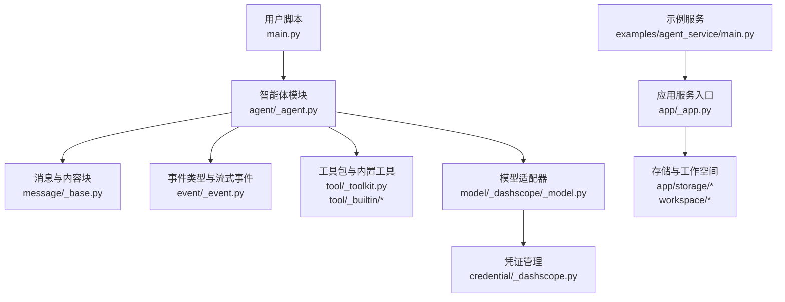
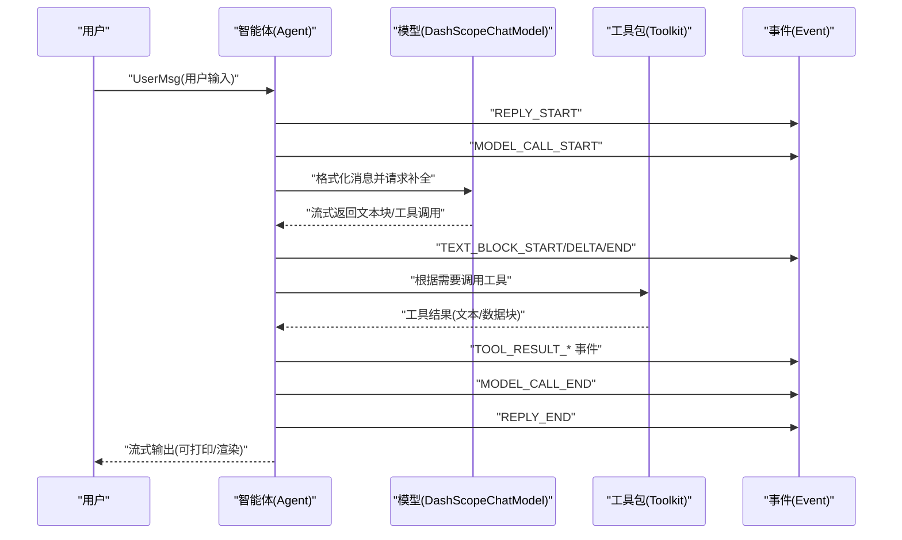
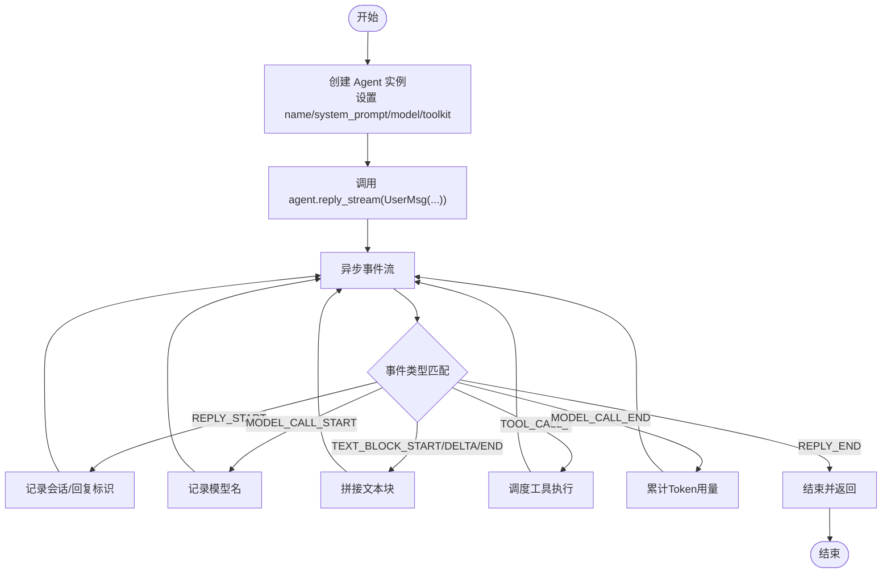
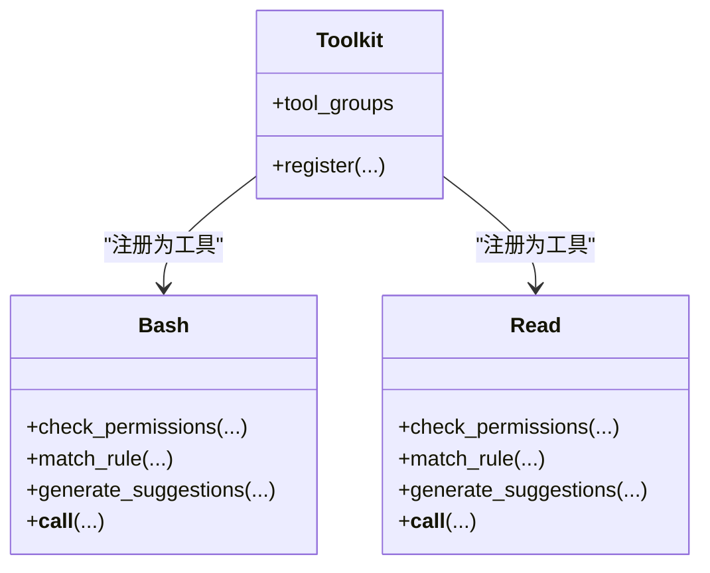
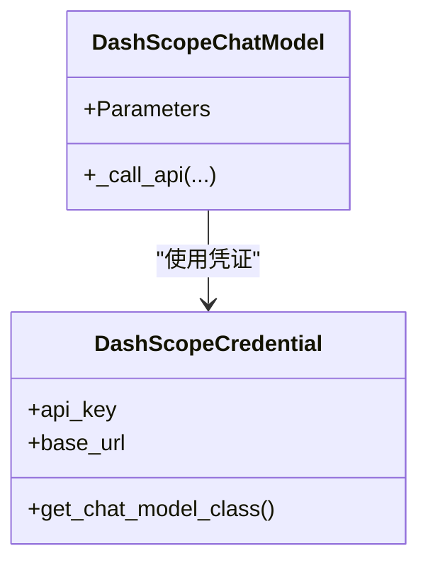
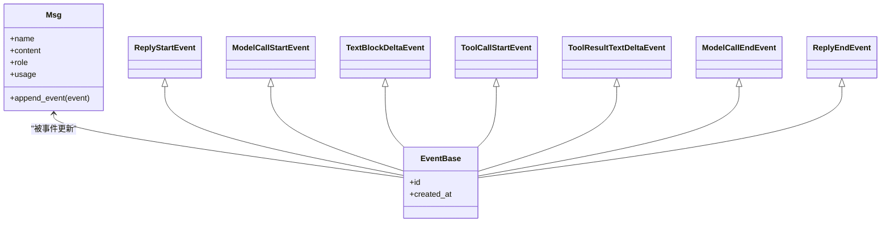
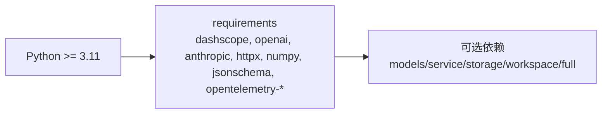

# 快速开始

<cite>
**本文引用的文件**
- [README.md](file://README.md)
- [pyproject.toml](file://pyproject.toml)
- [src/agentscope/__init__.py](file://src/agentscope/__init__.py)
- [src/agentscope/agent/__init__.py](file://src/agentscope/agent/__init__.py)
- [src/agentscope/agent/_agent.py](file://src/agentscope/agent/_agent.py)
- [src/agentscope/tool/_toolkit.py](file://src/agentscope/tool/_toolkit.py)
- [src/agentscope/tool/_builtin/__init__.py](file://src/agentscope/tool/_builtin/__init__.py)
- [src/agentscope/tool/_builtin/_bash.py](file://src/agentscope/tool/_builtin/_bash.py)
- [src/agentscope/tool/_builtin/_read.py](file://src/agentscope/tool/_builtin/_read.py)
- [src/agentscope/message/_base.py](file://src/agentscope/message/_base.py)
- [src/agentscope/event/_event.py](file://src/agentscope/event/_event.py)
- [src/agentscope/credential/_dashscope.py](file://src/agentscope/credential/_dashscope.py)
- [src/agentscope/model/_dashscope/_model.py](file://src/agentscope/model/_dashscope/_model.py)
- [examples/agent_service/README.md](file://examples/agent_service/README.md)
- [examples/agent_service/main.py](file://examples/agent_service/main.py)
</cite>

## 目录
1. [简介](#简介)
2. [项目结构](#项目结构)
3. [核心组件](#核心组件)
4. [架构总览](#架构总览)
5. [详细组件解析](#详细组件解析)
6. [依赖关系分析](#依赖关系分析)
7. [性能与并发特性](#性能与并发特性)
8. [故障排查与常见问题](#故障排查与常见问题)
9. [结论](#结论)
10. [附录：5分钟上手示例](#附录5分钟上手示例)

## 简介
本指南面向首次接触 AgentScope 2.0 的开发者，目标是在5分钟内完成安装、配置并运行你的第一个智能体。你将学到：
- 如何从 PyPI 或源码安装
- 环境要求（Python 3.11+）
- 导入必要模块、配置模型与凭证、创建工具包、初始化智能体
- 运行第一个流式回复示例，并理解事件驱动的执行过程
- 常见安装问题的解决方案与验证方法

## 项目结构
AgentScope 采用“分层+功能模块化”的组织方式：
- 核心库位于 src/agentscope，包含智能体、消息、事件、工具、模型、凭证、工作空间、应用服务等子系统
- 示例位于 examples，包含 Agent Service 服务端与 Web UI 前端
- 文档与发布信息位于根目录 README 与 pyproject.toml

图表来源
- [src/agentscope/agent/_agent.py](file://src/agentscope/agent/_agent.py)
- [src/agentscope/message/_base.py](file://src/agentscope/message/_base.py)
- [src/agentscope/event/_event.py](file://src/agentscope/event/_event.py)
- [src/agentscope/tool/_toolkit.py](file://src/agentscope/tool/_toolkit.py)
- [src/agentscope/tool/_builtin/_bash.py](file://src/agentscope/tool/_builtin/_bash.py)
- [src/agentscope/tool/_builtin/_read.py](file://src/agentscope/tool/_builtin/_read.py)
- [src/agentscope/model/_dashscope/_model.py](file://src/agentscope/model/_dashscope/_model.py)
- [src/agentscope/credential/_dashscope.py](file://src/agentscope/credential/_dashscope.py)
- [examples/agent_service/main.py](file://examples/agent_service/main.py)

章节来源
- [README.md](file://README.md)
- [pyproject.toml](file://pyproject.toml)

## 核心组件
- 智能体（Agent）：负责推理-行动循环、上下文管理、权限控制、中间件与工具调用
- 工具包（Toolkit）：统一注册工具、技能与 MCP 客户端，形成“基础”工具组
- 内置工具（Bash、Read、Write、Grep、Glob、Edit 等）：提供文件系统与文本处理能力
- 模型适配器（DashScopeChatModel）：通过 OpenAI 兼容接口对接 DashScope
- 凭证（DashScopeCredential）：封装 API Key 与基础地址
- 消息与事件：Msg 表达多模态内容块；事件流描述模型调用、文本块增量、工具调用与结果等

章节来源
- [src/agentscope/agent/__init__.py](file://src/agentscope/agent/__init__.py)
- [src/agentscope/agent/_agent.py](file://src/agentscope/agent/_agent.py)
- [src/agentscope/tool/_toolkit.py](file://src/agentscope/tool/_toolkit.py)
- [src/agentscope/tool/_builtin/__init__.py](file://src/agentscope/tool/_builtin/__init__.py)
- [src/agentscope/model/_dashscope/_model.py](file://src/agentscope/model/_dashscope/_model.py)
- [src/agentscope/credential/_dashscope.py](file://src/agentscope/credential/_dashscope.py)
- [src/agentscope/message/_base.py](file://src/agentscope/message/_base.py)
- [src/agentscope/event/_event.py](file://src/agentscope/event/_event.py)

## 架构总览
AgentScope 的执行路径如下：用户发起消息 -> 智能体生成回复流 -> 事件驱动更新消息状态 -> 工具调用与模型调用按需触发。

图表来源
- [src/agentscope/agent/_agent.py](file://src/agentscope/agent/_agent.py)
- [src/agentscope/event/_event.py](file://src/agentscope/event/_event.py)
- [src/agentscope/message/_base.py](file://src/agentscope/message/_base.py)
- [src/agentscope/model/_dashscope/_model.py](file://src/agentscope/model/_dashscope/_model.py)
- [src/agentscope/tool/_toolkit.py](file://src/agentscope/tool/_toolkit.py)

## 详细组件解析

### 智能体初始化与回复流程
- 初始化要点
  - 提供名称与系统提示词
  - 配置模型与凭证（如 DashScope）
  - 注册工具包（包含 Bash、Read、Write、Grep、Glob、Edit 等）
- 回复流程
  - 使用异步迭代器逐段接收事件
  - 通过事件类型区分模型调用、文本块增量、工具调用与结果等阶段

图表来源
- [src/agentscope/agent/_agent.py](file://src/agentscope/agent/_agent.py)
- [src/agentscope/event/_event.py](file://src/agentscope/event/_event.py)
- [src/agentscope/message/_base.py](file://src/agentscope/message/_base.py)

章节来源
- [src/agentscope/agent/_agent.py](file://src/agentscope/agent/_agent.py)
- [src/agentscope/event/_event.py](file://src/agentscope/event/_event.py)
- [src/agentscope/message/_base.py](file://src/agentscope/message/_base.py)

### 工具包与内置工具
- 工具包
  - 负责注册工具、技能与 MCP 客户端
  - 默认保留“basic”工具组，避免命名冲突
- 内置工具
  - Bash：安全检查与超时控制，支持权限决策与建议规则
  - Read：只读文件读取，支持行号格式化与缓存

图表来源
- [src/agentscope/tool/_toolkit.py](file://src/agentscope/tool/_toolkit.py)
- [src/agentscope/tool/_builtin/_bash.py](file://src/agentscope/tool/_builtin/_bash.py)
- [src/agentscope/tool/_builtin/_read.py](file://src/agentscope/tool/_builtin/_read.py)

章节来源
- [src/agentscope/tool/_toolkit.py](file://src/agentscope/tool/_toolkit.py)
- [src/agentscope/tool/_builtin/_bash.py](file://src/agentscope/tool/_builtin/_bash.py)
- [src/agentscope/tool/_builtin/_read.py](file://src/agentscope/tool/_builtin/_read.py)

### 模型与凭证
- 凭证
  - DashScopeCredential 封装 API Key 与兼容接口基础地址
- 模型
  - DashScopeChatModel 通过 OpenAI 兼容接口调用，支持文本与多模态输入
  - 支持重试异常类型与参数化配置

图表来源
- [src/agentscope/credential/_dashscope.py](file://src/agentscope/credential/_dashscope.py)
- [src/agentscope/model/_dashscope/_model.py](file://src/agentscope/model/_dashscope/_model.py)

章节来源
- [src/agentscope/credential/_dashscope.py](file://src/agentscope/credential/_dashscope.py)
- [src/agentscope/model/_dashscope/_model.py](file://src/agentscope/model/_dashscope/_model.py)

### 消息与事件
- 消息（Msg）
  - 支持文本、思考、数据、工具调用/结果等内容块
  - 提供 append_event 将事件增量合并到消息中
- 事件（Event）
  - 覆盖回复生命周期、模型调用、文本块、数据块、思考块、工具调用与结果等
  - 事件驱动消息状态演进（如 finished_at、usage）

图表来源
- [src/agentscope/message/_base.py](file://src/agentscope/message/_base.py)
- [src/agentscope/event/_event.py](file://src/agentscope/event/_event.py)

章节来源
- [src/agentscope/message/_base.py](file://src/agentscope/message/_base.py)
- [src/agentscope/event/_event.py](file://src/agentscope/event/_event.py)

## 依赖关系分析
- Python 版本要求：3.11+
- 关键依赖：dashscope、openai、anthropic、httpx、numpy、jsonschema、opentelemetry-*、aiofiles、ripgrep、tree_sitter 系列等
- 可选依赖：models（ollama/gemini/xai）、service（fastapi/uvicorn/apscheduler/ag-ui-protocol）、storage（redis）、workspace（aiodocker/e2b）、full 组合

图表来源
- [pyproject.toml](file://pyproject.toml)

章节来源
- [pyproject.toml](file://pyproject.toml)

## 性能与并发特性
- 异步事件流：通过 async for 接收事件，适合高吞吐与低延迟场景
- 流式文本块：TEXT_BLOCK_DELTA 提供增量输出，便于前端实时渲染
- 工具调用：Bash 工具带超时控制与输出截断，避免阻塞与内存膨胀
- 模型调用：DashScopeChatModel 支持重试异常类型，提升稳定性

章节来源
- [src/agentscope/tool/_builtin/_bash.py](file://src/agentscope/tool/_builtin/_bash.py)
- [src/agentscope/model/_dashscope/_model.py](file://src/agentscope/model/_dashscope/_model.py)
- [src/agentscope/event/_event.py](file://src/agentscope/event/_event.py)

## 故障排查与常见问题
- 安装失败（权限或网络）
  - 使用 uv 或 pip 安装 agentscope；若从源码安装，确保在仓库根目录执行可编辑安装
  - 若依赖下载缓慢，可切换至国内镜像源或代理
- Python 版本不满足（< 3.11）
  - 升级 Python 至 3.11 或更高版本
- 缺少 API Key 或凭证错误
  - 确认环境变量 DASHSCOPE_API_KEY 已设置
  - 凭证类会绑定 DashScope 兼容接口基础地址，请勿随意修改
- 无法连接 DashScope
  - 检查网络连通性与代理设置
  - 查看模型调用是否触发重试逻辑
- 工具调用被拒绝
  - Bash 工具对危险命令/路径有安全检查，必要时生成建议规则或调整命令
- 事件流未显示预期内容
  - 确保正确处理事件类型分支（REPLY_START/MODEL_CALL_START/TEXT_BLOCK_*等）
  - 使用消息的 append_event 将事件增量合并到消息中

章节来源
- [README.md](file://README.md)
- [src/agentscope/credential/_dashscope.py](file://src/agentscope/credential/_dashscope.py)
- [src/agentscope/model/_dashscope/_model.py](file://src/agentscope/model/_dashscope/_model.py)
- [src/agentscope/tool/_builtin/_bash.py](file://src/agentscope/tool/_builtin/_bash.py)
- [src/agentscope/message/_base.py](file://src/agentscope/message/_base.py)
- [src/agentscope/event/_event.py](file://src/agentscope/event/_event.py)

## 结论
通过本指南，你已掌握：
- 在5分钟内完成安装与环境准备
- 配置 DashScope 凭证与模型
- 创建工具包并注册常用工具
- 初始化智能体并消费事件流
- 处理常见问题与验证安装成功

下一步建议：
- 尝试更多内置工具（Write、Grep、Glob、Edit）
- 自定义权限规则与中间件
- 部署 Agent Service 并集成 Web UI

## 附录：5分钟上手示例
以下为“Hello AgentScope!”示例的步骤拆解与说明，帮助你在最短时间内跑通第一个智能体。

- 步骤1：安装
  - 从 PyPI 安装：使用 uv 或 pip 安装 agentscope
  - 从源码安装：克隆仓库并在根目录执行可编辑安装
- 步骤2：准备凭证
  - 设置环境变量 DASHSCOPE_API_KEY
  - 使用 DashScopeCredential 封装 API Key
- 步骤3：选择模型
  - 使用 DashScopeChatModel 并指定模型名称（如 qwen3.6-plus）
- 步骤4：创建工具包
  - 注册 Bash、Grep、Glob、Read、Write、Edit 等工具
- 步骤5：初始化智能体
  - 传入 name、system_prompt、model、toolkit
- 步骤6：发起对话
  - 使用异步迭代器遍历事件流，处理 REPLY_START、MODEL_CALL_START、TEXT_BLOCK_*、MODEL_CALL_END、REPLY_END 等事件
- 验证安装
  - 观察终端输出是否出现模型补全文本与工具调用结果
  - 检查事件顺序是否符合预期

章节来源
- [README.md](file://README.md)
- [src/agentscope/credential/_dashscope.py](file://src/agentscope/credential/_dashscope.py)
- [src/agentscope/model/_dashscope/_model.py](file://src/agentscope/model/_dashscope/_model.py)
- [src/agentscope/tool/_toolkit.py](file://src/agentscope/tool/_toolkit.py)
- [src/agentscope/tool/_builtin/_bash.py](file://src/agentscope/tool/_builtin/_bash.py)
- [src/agentscope/tool/_builtin/_read.py](file://src/agentscope/tool/_builtin/_read.py)
- [src/agentscope/message/_base.py](file://src/agentscope/message/_base.py)
- [src/agentscope/event/_event.py](file://src/agentscope/event/_event.py)