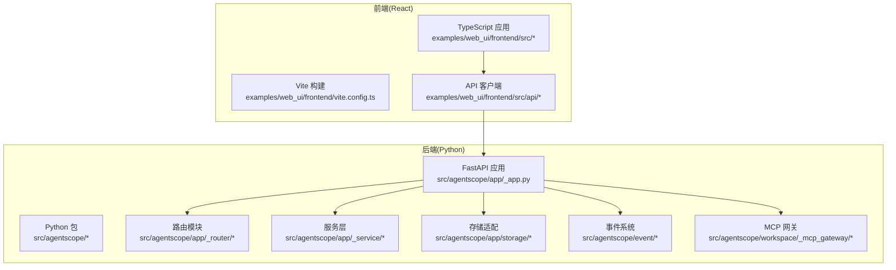
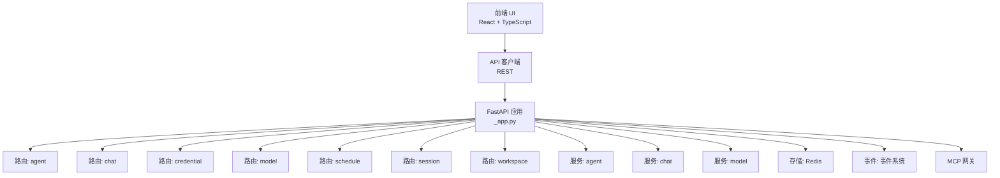
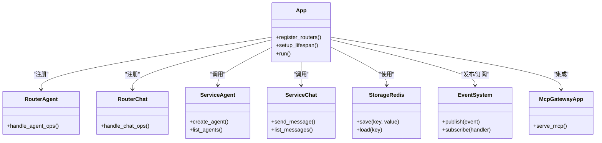
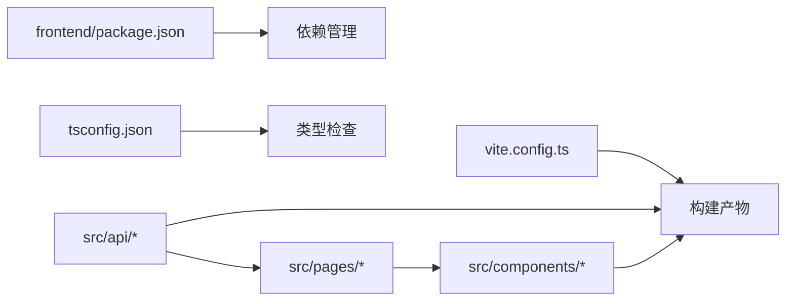
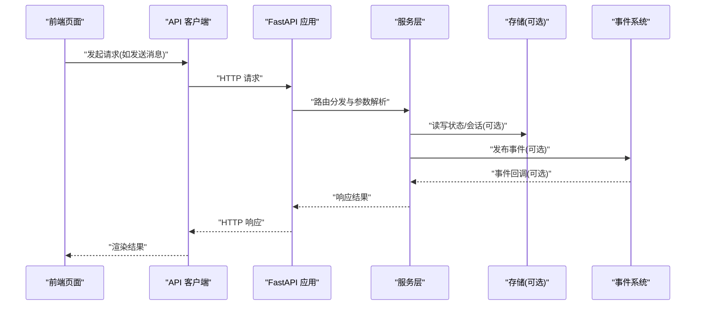
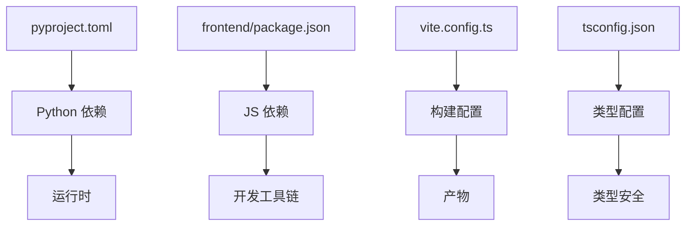

# 技术栈

<cite>
**本文引用的文件**
- [pyproject.toml](file://pyproject.toml)
- [README.md](file://README.md)
- [examples/web_ui/backend/package.json](file://examples/web_ui/backend/package.json)
- [examples/web_ui/frontend/package.json](file://examples/web_ui/frontend/package.json)
- [examples/web_ui/backend/tsconfig.json](file://examples/web_ui/backend/tsconfig.json)
- [examples/web_ui/frontend/tsconfig.json](file://examples/web_ui/frontend/tsconfig.json)
- [examples/web_ui/frontend/vite.config.ts](file://examples/web_ui/frontend/vite.config.ts)
- [src/agentscope/__init__.py](file://src/agentscope/__init__.py)
- [src/agentscope/_version.py](file://src/agentscope/_version.py)
- [src/agentscope/app/_app.py](file://src/agentscope/app/_app.py)
- [src/agentscope/event/_event.py](file://src/agentscope/event/_event.py)
- [src/agentscope/middleware/_base.py](file://src/agentscope/middleware/_base.py)
- [src/agentscope/app/_router/_agent.py](file://src/agentscope/app/_router/_agent.py)
- [src/agentscope/app/_router/_chat.py](file://src/agentscope/app/_router/_chat.py)
- [src/agentscope/app/_router/_credential.py](file://src/agentscope/app/_router/_credential.py)
- [src/agentscope/app/_router/_model.py](file://src/agentscope/app/_router/_model.py)
- [src/agentscope/app/_router/_schedule.py](file://src/agentscope/app/_router/_schedule.py)
- [src/agentscope/app/_router/_session.py](file://src/agentscope/app/_router/_session.py)
- [src/agentscope/app/_router/_workspace.py](file://src/agentscope/app/_router/_workspace.py)
- [src/agentscope/app/_service/_agent.py](file://src/agentscope/app/_service/_agent.py)
- [src/agentscope/app/_service/_chat.py](file://src/agentscope/app/_service/_chat.py)
- [src/agentscope/app/_service/_model.py](file://src/agentscope/app/_service/_model.py)
- [src/agentscope/app/storage/_redis_storage.py](file://src/agentscope/app/storage/_redis_storage.py)
- [src/agentscope/workspace/_mcp_gateway/_mcp_gateway_app.py](file://src/agentscope/workspace/_mcp_gateway/_mcp_gateway_app.py)
</cite>

## 目录
1. [引言](#引言)
2. [项目结构](#项目结构)
3. [核心组件](#核心组件)
4. [架构总览](#架构总览)
5. [详细组件分析](#详细组件分析)
6. [依赖分析](#依赖分析)
7. [性能考量](#性能考量)
8. [故障排查指南](#故障排查指南)
9. [结论](#结论)
10. [附录](#附录)

## 引言
本技术栈说明文档面向 AgentScope 2.0 的后端与前端技术选型，系统阐述 Python 后端（FastAPI、异步编程、事件驱动架构）与前端（React、TypeScript、现代前端工具链）的实现方式、版本要求、兼容性与工程化实践。文档同时总结技术选型的优势与局限，并给出未来演进方向建议。

## 项目结构
AgentScope 2.0 采用“后端 Python 包 + 前端 React 应用”的双栈架构。后端以 Python 包形式提供服务与业务能力；前端通过 Vite 构建并使用 TypeScript 开发，二者通过 REST 接口交互。示例 Web UI 提供了后端与前端的集成样例，便于理解整体数据流与控制流。

图表来源
- [src/agentscope/app/_app.py](file://src/agentscope/app/_app.py)
- [src/agentscope/app/_router/_agent.py](file://src/agentscope/app/_router/_agent.py)
- [src/agentscope/app/_router/_chat.py](file://src/agentscope/app/_router/_chat.py)
- [src/agentscope/app/_service/_agent.py](file://src/agentscope/app/_service/_agent.py)
- [src/agentscope/app/storage/_redis_storage.py](file://src/agentscope/app/storage/_redis_storage.py)
- [src/agentscope/event/_event.py](file://src/agentscope/event/_event.py)
- [src/agentscope/workspace/_mcp_gateway/_mcp_gateway_app.py](file://src/agentscope/workspace/_mcp_gateway/_mcp_gateway_app.py)
- [examples/web_ui/frontend/vite.config.ts](file://examples/web_ui/frontend/vite.config.ts)

章节来源
- [README.md](file://README.md)
- [pyproject.toml](file://pyproject.toml)

## 核心组件
- 后端核心：基于 FastAPI 的应用入口与生命周期管理，统一注册路由、中间件与服务层，支持异步处理与事件驱动扩展。
- 路由与服务：按领域拆分路由模块（如 agent、chat、credential、model、schedule、session、workspace），服务层负责具体业务逻辑。
- 存储与事件：Redis 存储适配器用于会话与状态持久化；事件系统提供跨模块解耦的消息机制。
- MCP 网关：提供 MCP 协议网关能力，作为外部工具与工作空间的桥接。
- 前端核心：Vite + React + TypeScript，通过 API 客户端与后端交互，提供聊天、凭证、日程、工作区等页面与组件。

章节来源
- [src/agentscope/app/_app.py](file://src/agentscope/app/_app.py)
- [src/agentscope/app/_router/_agent.py](file://src/agentscope/app/_router/_agent.py)
- [src/agentscope/app/_router/_chat.py](file://src/agentscope/app/_router/_chat.py)
- [src/agentscope/app/_service/_agent.py](file://src/agentscope/app/_service/_agent.py)
- [src/agentscope/app/storage/_redis_storage.py](file://src/agentscope/app/storage/_redis_storage.py)
- [src/agentscope/event/_event.py](file://src/agentscope/event/_event.py)
- [src/agentscope/workspace/_mcp_gateway/_mcp_gateway_app.py](file://src/agentscope/workspace/_mcp_gateway/_mcp_gateway_app.py)
- [examples/web_ui/frontend/vite.config.ts](file://examples/web_ui/frontend/vite.config.ts)

## 架构总览
后端采用“应用入口 + 路由 + 服务 + 存储 + 事件”的分层架构，前端通过 REST API 与后端交互。MCP 网关作为可选扩展，连接外部工具生态。

图表来源
- [src/agentscope/app/_app.py](file://src/agentscope/app/_app.py)
- [src/agentscope/app/_router/_agent.py](file://src/agentscope/app/_router/_agent.py)
- [src/agentscope/app/_router/_chat.py](file://src/agentscope/app/_router/_chat.py)
- [src/agentscope/app/_router/_credential.py](file://src/agentscope/app/_router/_credential.py)
- [src/agentscope/app/_router/_model.py](file://src/agentscope/app/_router/_model.py)
- [src/agentscope/app/_router/_schedule.py](file://src/agentscope/app/_router/_schedule.py)
- [src/agentscope/app/_router/_session.py](file://src/agentscope/app/_router/_session.py)
- [src/agentscope/app/_router/_workspace.py](file://src/agentscope/app/_router/_workspace.py)
- [src/agentscope/app/_service/_agent.py](file://src/agentscope/app/_service/_agent.py)
- [src/agentscope/app/_service/_chat.py](file://src/agentscope/app/_service/_chat.py)
- [src/agentscope/app/_service/_model.py](file://src/agentscope/app/_service/_model.py)
- [src/agentscope/app/storage/_redis_storage.py](file://src/agentscope/app/storage/_redis_storage.py)
- [src/agentscope/event/_event.py](file://src/agentscope/event/_event.py)
- [src/agentscope/workspace/_mcp_gateway/_mcp_gateway_app.py](file://src/agentscope/workspace/_mcp_gateway/_mcp_gateway_app.py)

## 详细组件分析

### 后端技术栈与实现要点
- Python 版本与包管理
  - 使用 pyproject.toml 管理 Python 依赖与元数据，确保版本约束与安装一致性。
  - 建议在本地开发环境满足 Python 3.11+ 的最低版本要求，以获得最佳兼容性与性能。
- FastAPI 应用与生命周期
  - 应用入口负责注册路由、中间件与服务，支持 lifespan 生命周期钩子，便于资源初始化与清理。
- 异步编程与事件驱动
  - 路由与服务层广泛采用异步方法，结合事件系统实现模块间解耦与可观测性增强。
- 存储与中间件
  - Redis 存储适配器用于会话与状态持久化；中间件提供通用横切能力（如追踪、协议适配）。
- MCP 网关
  - MCP 网关应用作为外部工具接入点，支持协议转换与安全控制。

图表来源
- [src/agentscope/app/_app.py](file://src/agentscope/app/_app.py)
- [src/agentscope/app/_router/_agent.py](file://src/agentscope/app/_router/_agent.py)
- [src/agentscope/app/_router/_chat.py](file://src/agentscope/app/_router/_chat.py)
- [src/agentscope/app/_service/_agent.py](file://src/agentscope/app/_service/_agent.py)
- [src/agentscope/app/_service/_chat.py](file://src/agentscope/app/_service/_chat.py)
- [src/agentscope/app/storage/_redis_storage.py](file://src/agentscope/app/storage/_redis_storage.py)
- [src/agentscope/event/_event.py](file://src/agentscope/event/_event.py)
- [src/agentscope/workspace/_mcp_gateway/_mcp_gateway_app.py](file://src/agentscope/workspace/_mcp_gateway/_mcp_gateway_app.py)

章节来源
- [pyproject.toml](file://pyproject.toml)
- [src/agentscope/app/_app.py](file://src/agentscope/app/_app.py)
- [src/agentscope/event/_event.py](file://src/agentscope/event/_event.py)
- [src/agentscope/app/storage/_redis_storage.py](file://src/agentscope/app/storage/_redis_storage.py)
- [src/agentscope/workspace/_mcp_gateway/_mcp_gateway_app.py](file://src/agentscope/workspace/_mcp_gateway/_mcp_gateway_app.py)

### 前端技术栈与实现要点
- 框架与类型系统
  - React + TypeScript 提供强类型保障与组件化开发体验；tsconfig 配置确保编译时类型检查严格性。
- 构建与开发工具
  - Vite 作为构建与开发服务器，提供快速热更新与现代化打包能力；前端 package.json 管理依赖与脚本。
- API 客户端
  - API 客户端模块封装后端接口，统一错误处理与数据转换，便于上层页面复用。
- 页面与组件
  - 页面按功能域划分（聊天、凭证、日程、设置等），组件库采用现代 UI 组件体系，提升开发效率与一致性。

图表来源
- [examples/web_ui/frontend/vite.config.ts](file://examples/web_ui/frontend/vite.config.ts)
- [examples/web_ui/frontend/package.json](file://examples/web_ui/frontend/package.json)
- [examples/web_ui/frontend/tsconfig.json](file://examples/web_ui/frontend/tsconfig.json)

章节来源
- [examples/web_ui/frontend/vite.config.ts](file://examples/web_ui/frontend/vite.config.ts)
- [examples/web_ui/frontend/package.json](file://examples/web_ui/frontend/package.json)
- [examples/web_ui/frontend/tsconfig.json](file://examples/web_ui/frontend/tsconfig.json)

### API 调用序列（前端到后端）
以下序列图展示前端通过 API 客户端调用后端服务的典型流程，体现异步与事件驱动特性。

图表来源
- [src/agentscope/app/_app.py](file://src/agentscope/app/_app.py)
- [src/agentscope/app/_service/_chat.py](file://src/agentscope/app/_service/_chat.py)
- [src/agentscope/app/storage/_redis_storage.py](file://src/agentscope/app/storage/_redis_storage.py)
- [src/agentscope/event/_event.py](file://src/agentscope/event/_event.py)

## 依赖分析
- 后端依赖管理
  - 通过 pyproject.toml 统一声明 Python 依赖与版本范围，建议使用虚拟环境隔离并锁定版本，确保 CI/CD 与本地一致。
- 前端依赖管理
  - 前端 package.json 管理依赖与脚本；Vite 配置与 tsconfig 确保构建与类型检查一致性。
- 兼容性与版本要求
  - Python 3.11+：推荐使用最新稳定版，兼顾性能与新语法特性。
  - FastAPI：遵循官方兼容矩阵，确保与 Pydantic、Uvicorn 等生态组件版本匹配。
  - React/TypeScript/Vite：遵循各生态的 LTS 与主流版本策略，避免过旧或过新的不兼容变更。

图表来源
- [pyproject.toml](file://pyproject.toml)
- [examples/web_ui/frontend/package.json](file://examples/web_ui/frontend/package.json)
- [examples/web_ui/frontend/vite.config.ts](file://examples/web_ui/frontend/vite.config.ts)
- [examples/web_ui/frontend/tsconfig.json](file://examples/web_ui/frontend/tsconfig.json)

章节来源
- [pyproject.toml](file://pyproject.toml)
- [examples/web_ui/frontend/package.json](file://examples/web_ui/frontend/package.json)
- [examples/web_ui/frontend/tsconfig.json](file://examples/web_ui/frontend/tsconfig.json)

## 性能考量
- 异步优先：后端广泛采用异步方法，减少阻塞，提升并发吞吐。
- 事件驱动：通过事件系统降低模块耦合，提高可扩展性与可观测性。
- 存储优化：Redis 适配器适合高频读写的场景；建议合理设置键空间与过期策略。
- 前端性能：Vite 提供快速冷启动与热更新；建议启用代码分割与懒加载，优化首屏与交互延迟。
- 可观测性：结合中间件与事件系统，记录关键路径指标与错误日志，辅助定位性能瓶颈。

## 故障排查指南
- 后端常见问题
  - 路由未注册：确认应用入口已正确注册各领域路由模块。
  - 异步异常：检查服务层异步方法的异常捕获与传播，避免未处理异常导致请求中断。
  - 存储连接：验证 Redis 连接参数与网络可达性，关注超时与重试策略。
  - 事件订阅：确认事件发布与订阅的生命周期与作用域，避免重复订阅或遗漏回调。
- 前端常见问题
  - 类型错误：根据 tsconfig 的严格模式逐项修复类型问题。
  - 构建失败：检查 vite.config 与 package.json 中的脚本与插件配置。
  - API 调用：核对 API 客户端的请求地址、认证与错误处理分支。

章节来源
- [src/agentscope/app/_app.py](file://src/agentscope/app/_app.py)
- [src/agentscope/app/_service/_agent.py](file://src/agentscope/app/_service/_agent.py)
- [src/agentscope/app/storage/_redis_storage.py](file://src/agentscope/app/storage/_redis_storage.py)
- [src/agentscope/event/_event.py](file://src/agentscope/event/_event.py)
- [examples/web_ui/frontend/tsconfig.json](file://examples/web_ui/frontend/tsconfig.json)
- [examples/web_ui/frontend/vite.config.ts](file://examples/web_ui/frontend/vite.config.ts)

## 结论
AgentScope 2.0 的技术栈围绕“高性能、可扩展、可观测”展开：后端以 FastAPI 与异步编程为核心，结合事件驱动与存储适配，满足复杂业务场景；前端以 React + TypeScript + Vite 构建现代化用户体验。通过严格的依赖管理与工程化配置，项目具备良好的可维护性与演进空间。

## 附录
- 版本与兼容性建议
  - Python：3.11+，建议使用 3.12.x 或 3.13.x（视平台与生态而定）。
  - FastAPI：使用稳定版本，配合 Pydantic v2 与 Uvicorn。
  - React/TypeScript：使用主流 LTS 版本，保持与 Vite 生态兼容。
- 工具链与流程
  - 后端：使用 pip/pipenv/uv 等工具进行依赖安装与锁定；结合 pytest 进行单元测试。
  - 前端：pnpm/yarn/npm 管理依赖；Vite 提供开发与构建；ESLint/Prettier 规范代码风格。
- 未来演进方向
  - 后端：引入更细粒度的服务拆分、可观测性增强（指标/日志/追踪）、容器化与多进程部署。
  - 前端：渐进式增强（PWA、离线能力）、组件库治理与主题系统、自动化测试覆盖。