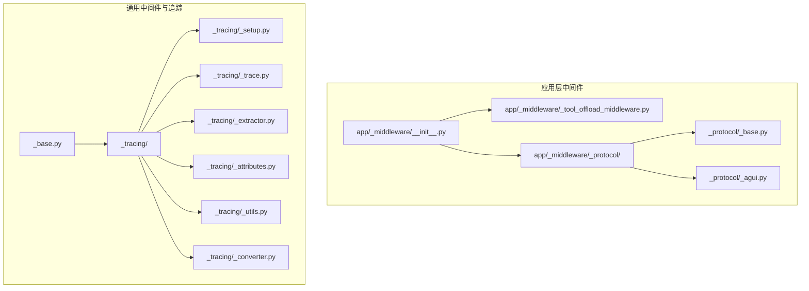
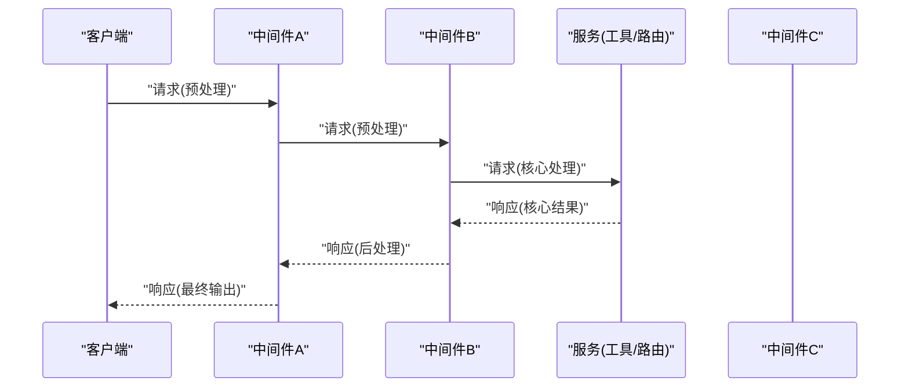
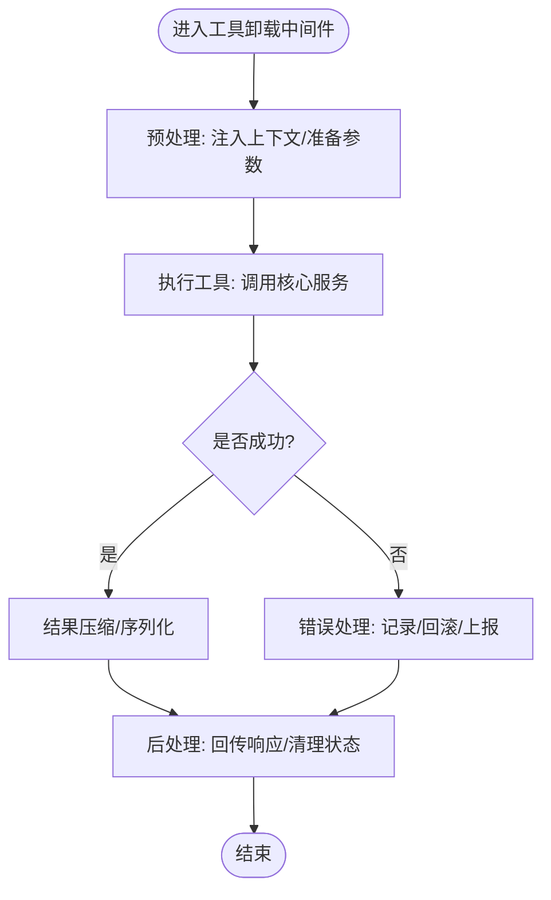
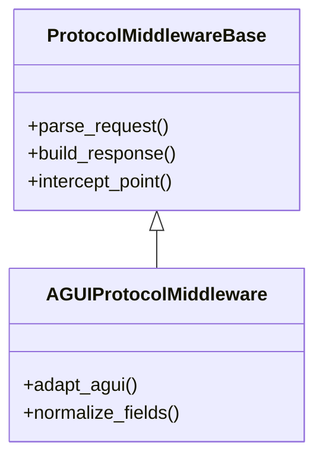
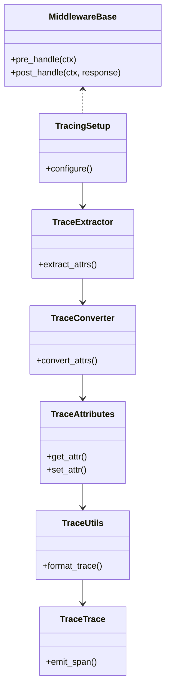
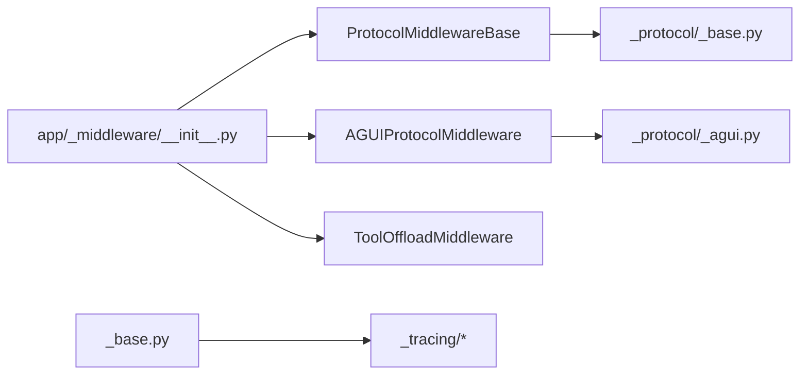

# 中间件机制

<cite>
**本文引用的文件**
- [src/agentscope/app/_middleware/__init__.py](file://src/agentscope/app/_middleware/__init__.py)
- [src/agentscope/app/_middleware/_tool_offload_middleware.py](file://src/agentscope/app/_middleware/_tool_offload_middleware.py)
- [src/agentscope/app/_middleware/_protocol/_base.py](file://src/agentscope/app/_middleware/_protocol/_base.py)
- [src/agentscope/app/_middleware/_protocol/_agui.py](file://src/agentscope/app/_middleware/_protocol/_agui.py)
- [src/agentscope/middleware/_base.py](file://src/agentscope/middleware/_base.py)
- [src/agentscope/middleware/_tracing/_setup.py](file://src/agentscope/middleware/_tracing/_setup.py)
- [src/agentscope/middleware/_tracing/_trace.py](file://src/agentscope/middleware/_tracing/_trace.py)
- [src/agentscope/middleware/_tracing/_extractor.py](file://src/agentscope/middleware/_tracing/_extractor.py)
- [src/agentscope/middleware/_tracing/_attributes.py](file://src/agentscope/middleware/_tracing/_attributes.py)
- [src/agentscope/middleware/_tracing/_utils.py](file://src/agentscope/middleware/_tracing/_utils.py)
- [src/agentscope/middleware/_tracing/_converter.py](file://src/agentscope/middleware/_tracing/_converter.py)
- [tests/tool_offload_middleware_test.py](file://tests/tool_offload_middleware_test.py)
- [tests/middleware_test.py](file://tests/middleware_test.py)
</cite>

## 目录
1. [引言](#引言)
2. [项目结构](#项目结构)
3. [核心组件](#核心组件)
4. [架构总览](#架构总览)
5. [详细组件分析](#详细组件分析)
6. [依赖关系分析](#依赖关系分析)
7. [性能考量](#性能考量)
8. [故障排查指南](#故障排查指南)
9. [结论](#结论)
10. [附录](#附录)

## 引言
本文件系统性阐述 AgentScope 的中间件机制，覆盖工具卸载中间件、协议中间件（含 AGUI 协议）以及通用中间件基类的设计与执行流程。文档重点说明中间件的注册机制、执行顺序与拦截点配置，以及中间件与请求/响应管道的集成方式、上下文传递与状态管理。同时提供中间件链路图与执行时序图，给出开发指南、调试技巧与性能优化建议，并记录配置选项与安全注意事项。

## 项目结构
AgentScope 将中间件分为两类：
- 应用层中间件：位于 app/_middleware 下，包含工具卸载中间件与协议中间件族（如 AGUI 协议）。
- 通用中间件与追踪：位于 middleware 下，提供通用中间件基类与追踪能力（属性提取、转换、设置等）。

**图表来源**
- [src/agentscope/app/_middleware/__init__.py:1-12](file://src/agentscope/app/_middleware/__init__.py#L1-L12)
- [src/agentscope/app/_middleware/_tool_offload_middleware.py](file://src/agentscope/app/_middleware/_tool_offload_middleware.py)
- [src/agentscope/app/_middleware/_protocol/_base.py](file://src/agentscope/app/_middleware/_protocol/_base.py)
- [src/agentscope/app/_middleware/_protocol/_agui.py](file://src/agentscope/app/_middleware/_protocol/_agui.py)
- [src/agentscope/middleware/_base.py](file://src/agentscope/middleware/_base.py)
- [src/agentscope/middleware/_tracing/_setup.py](file://src/agentscope/middleware/_tracing/_setup.py)
- [src/agentscope/middleware/_tracing/_trace.py](file://src/agentscope/middleware/_tracing/_trace.py)
- [src/agentscope/middleware/_tracing/_extractor.py](file://src/agentscope/middleware/_tracing/_extractor.py)
- [src/agentscope/middleware/_tracing/_attributes.py](file://src/agentscope/middleware/_tracing/_attributes.py)
- [src/agentscope/middleware/_tracing/_utils.py](file://src/agentscope/middleware/_tracing/_utils.py)
- [src/agentscope/middleware/_tracing/_converter.py](file://src/agentscope/middleware/_tracing/_converter.py)

**章节来源**
- [src/agentscope/app/_middleware/__init__.py:1-12](file://src/agentscope/app/_middleware/__init__.py#L1-L12)

## 核心组件
- 工具卸载中间件（ToolOffloadMiddleware）
  - 职责：在工具调用前后进行上下文切换、结果压缩与回传，支持工具执行的卸载与恢复。
  - 关键点：拦截工具调用，注入上下文，处理结果序列化与压缩，确保跨进程/跨环境的可移植性。
- 协议中间件（ProtocolMiddlewareBase 及其派生）
  - 职责：封装请求/响应协议的适配与转换，统一协议入口与出口格式。
  - 典型实现：AGUIProtocolMiddleware，面向特定前端或协议栈的适配器。
- 通用中间件基类（MiddlewareBase）
  - 职责：提供通用中间件接口规范、生命周期钩子与上下文管理能力。
- 追踪中间件（Tracing）
  - 职责：提供属性提取、转换、追踪设置与工具函数，支撑可观测性与调试。

**章节来源**
- [src/agentscope/app/_middleware/_tool_offload_middleware.py](file://src/agentscope/app/_middleware/_tool_offload_middleware.py)
- [src/agentscope/app/_middleware/_protocol/_base.py](file://src/agentscope/app/_middleware/_protocol/_base.py)
- [src/agentscope/app/_middleware/_protocol/_agui.py](file://src/agentscope/app/_middleware/_protocol/_agui.py)
- [src/agentscope/middleware/_base.py](file://src/agentscope/middleware/_base.py)
- [src/agentscope/middleware/_tracing/_setup.py](file://src/agentscope/middleware/_tracing/_setup.py)
- [src/agentscope/middleware/_tracing/_trace.py](file://src/agentscope/middleware/_tracing/_trace.py)
- [src/agentscope/middleware/_tracing/_extractor.py](file://src/agentscope/middleware/_tracing/_extractor.py)
- [src/agentscope/middleware/_tracing/_attributes.py](file://src/agentscope/middleware/_tracing/_attributes.py)
- [src/agentscope/middleware/_tracing/_utils.py](file://src/agentscope/middleware/_tracing/_utils.py)
- [src/agentscope/middleware/_tracing/_converter.py](file://src/agentscope/middleware/_tracing/_converter.py)

## 架构总览
中间件以“管道”形式串联在请求/响应路径中，形成可插拔的处理链。典型链路如下：
- 请求进入后，按注册顺序依次通过各中间件的预处理阶段。
- 到达核心服务（如工具执行）后，返回响应，再按逆序通过各中间件的后处理阶段。
- 每个中间件可选择修改请求/响应内容、注入上下文、记录日志或触发追踪。

[此图为概念性时序图，不直接映射具体源码文件，故无图表来源]

## 详细组件分析

### 工具卸载中间件（ToolOffloadMiddleware）
- 设计要点
  - 预处理：在工具调用前注入上下文，准备卸载所需的运行环境与参数。
  - 执行：调用工具并捕获结果，进行必要的序列化与压缩。
  - 后处理：将结果回传给上游中间件或客户端，清理临时状态。
- 上下文与状态管理
  - 使用上下文对象承载工具执行所需的状态信息，避免全局变量污染。
  - 状态在中间件链中逐级传递，确保每个中间件可见并可修改。
- 性能与可靠性
  - 结果压缩减少传输开销；失败重试与超时控制提升鲁棒性。
  - 与追踪模块结合，记录工具调用耗时与关键指标。

**图表来源**
- [src/agentscope/app/_middleware/_tool_offload_middleware.py](file://src/agentscope/app/_middleware/_tool_offload_middleware.py)

**章节来源**
- [src/agentscope/app/_middleware/_tool_offload_middleware.py](file://src/agentscope/app/_middleware/_tool_offload_middleware.py)
- [tests/tool_offload_middleware_test.py](file://tests/tool_offload_middleware_test.py)

### 协议中间件（ProtocolMiddlewareBase 与 AGUIProtocolMiddleware）
- 基类职责
  - 定义协议适配的统一接口，包括请求解析、响应封装、错误映射等。
  - 提供拦截点配置，允许在进入核心服务前/后插入处理逻辑。
- AGUI 协议适配
  - 面向 AGUI 前端或特定协议栈，负责消息格式转换与字段映射。
  - 在预处理阶段完成协议校验与参数标准化，在后处理阶段生成符合协议的响应。

**图表来源**
- [src/agentscope/app/_middleware/_protocol/_base.py](file://src/agentscope/app/_middleware/_protocol/_base.py)
- [src/agentscope/app/_middleware/_protocol/_agui.py](file://src/agentscope/app/_middleware/_protocol/_agui.py)

**章节来源**
- [src/agentscope/app/_middleware/_protocol/_base.py](file://src/agentscope/app/_middleware/_protocol/_base.py)
- [src/agentscope/app/_middleware/_protocol/_agui.py](file://src/agentscope/app/_middleware/_protocol/_agui.py)

### 通用中间件基类（MiddlewareBase）与追踪（Tracing）
- 通用中间件基类
  - 提供标准的中间件生命周期钩子（如 pre_handle、post_handle），便于扩展。
  - 统一上下文传递模型，支持中间件间的数据共享与状态更新。
- 追踪模块
  - 属性提取：从请求/响应中抽取关键属性，用于追踪与监控。
  - 转换与设置：将属性转换为标准格式并写入追踪上下文。
  - 工具函数：提供便捷方法辅助中间件实现观测性功能。

**图表来源**
- [src/agentscope/middleware/_base.py](file://src/agentscope/middleware/_base.py)
- [src/agentscope/middleware/_tracing/_setup.py](file://src/agentscope/middleware/_tracing/_setup.py)
- [src/agentscope/middleware/_tracing/_extractor.py](file://src/agentscope/middleware/_tracing/_extractor.py)
- [src/agentscope/middleware/_tracing/_converter.py](file://src/agentscope/middleware/_tracing/_converter.py)
- [src/agentscope/middleware/_tracing/_attributes.py](file://src/agentscope/middleware/_tracing/_attributes.py)
- [src/agentscope/middleware/_tracing/_utils.py](file://src/agentscope/middleware/_tracing/_utils.py)
- [src/agentscope/middleware/_tracing/_trace.py](file://src/agentscope/middleware/_tracing/_trace.py)

**章节来源**
- [src/agentscope/middleware/_base.py](file://src/agentscope/middleware/_base.py)
- [src/agentscope/middleware/_tracing/_setup.py](file://src/agentscope/middleware/_tracing/_setup.py)
- [src/agentscope/middleware/_tracing/_trace.py](file://src/agentscope/middleware/_tracing/_trace.py)
- [src/agentscope/middleware/_tracing/_extractor.py](file://src/agentscope/middleware/_tracing/_extractor.py)
- [src/agentscope/middleware/_tracing/_attributes.py](file://src/agentscope/middleware/_tracing/_attributes.py)
- [src/agentscope/middleware/_tracing/_utils.py](file://src/agentscope/middleware/_tracing/_utils.py)
- [src/agentscope/middleware/_tracing/_converter.py](file://src/agentscope/middleware/_tracing/_converter.py)

## 依赖关系分析
- 应用层中间件导出入口
  - app/_middleware/__init__.py 汇总导出协议中间件与工具卸载中间件，作为外部使用者的统一入口。
- 协议中间件族
  - 协议基类定义通用接口，AGUI 实现具体适配逻辑，二者通过继承关系解耦。
- 通用中间件与追踪
  - 通用中间件基类为所有中间件提供一致的生命周期与上下文模型；追踪模块围绕属性提取、转换与设置形成闭环。

**图表来源**
- [src/agentscope/app/_middleware/__init__.py:1-12](file://src/agentscope/app/_middleware/__init__.py#L1-L12)
- [src/agentscope/app/_middleware/_protocol/_base.py](file://src/agentscope/app/_middleware/_protocol/_base.py)
- [src/agentscope/app/_middleware/_protocol/_agui.py](file://src/agentscope/app/_middleware/_protocol/_agui.py)
- [src/agentscope/middleware/_base.py](file://src/agentscope/middleware/_base.py)
- [src/agentscope/middleware/_tracing/_setup.py](file://src/agentscope/middleware/_tracing/_setup.py)
- [src/agentscope/middleware/_tracing/_trace.py](file://src/agentscope/middleware/_tracing/_trace.py)
- [src/agentscope/middleware/_tracing/_extractor.py](file://src/agentscope/middleware/_tracing/_extractor.py)
- [src/agentscope/middleware/_tracing/_attributes.py](file://src/agentscope/middleware/_tracing/_attributes.py)
- [src/agentscope/middleware/_tracing/_utils.py](file://src/agentscope/middleware/_tracing/_utils.py)
- [src/agentscope/middleware/_tracing/_converter.py](file://src/agentscope/middleware/_tracing/_converter.py)

**章节来源**
- [src/agentscope/app/_middleware/__init__.py:1-12](file://src/agentscope/app/_middleware/__init__.py#L1-L12)

## 性能考量
- 中间件顺序与开销
  - 将高开销操作（如压缩、序列化、网络调用）置于链路靠后位置，减少对后续中间件的影响。
  - 避免重复计算：利用上下文缓存常用数据，降低重复解析与转换成本。
- 资源管理
  - 在后处理阶段及时释放资源（如临时文件句柄、连接池），防止内存泄漏。
- 并发与超时
  - 对外部依赖调用设置合理超时与重试策略，避免阻塞整个中间件链。
- 追踪与采样
  - 使用追踪模块对关键路径进行采样记录，平衡可观测性与性能。

[本节为通用指导，无需章节来源]

## 故障排查指南
- 常见问题定位
  - 中间件未生效：检查导出入口与注册顺序，确认中间件是否被正确导入与实例化。
  - 上下文丢失：核对中间件在预处理与后处理阶段是否正确传递 ctx。
  - 协议不匹配：验证 AGUI 或其他协议中间件的字段映射与版本兼容性。
- 调试技巧
  - 使用追踪模块记录关键事件与耗时，结合日志定位瓶颈。
  - 在工具卸载中间件中开启详细日志，观察上下文注入与结果回传过程。
- 测试参考
  - 工具卸载中间件测试与通用中间件测试提供了行为验证示例，可对照复用。

**章节来源**
- [tests/tool_offload_middleware_test.py](file://tests/tool_offload_middleware_test.py)
- [tests/middleware_test.py](file://tests/middleware_test.py)

## 结论
AgentScope 的中间件机制通过清晰的分层与统一的接口，实现了协议适配、工具卸载与通用处理的可插拔组合。借助追踪模块与严格的上下文管理，中间件链在保证灵活性的同时兼顾了可观测性与稳定性。开发者可基于通用基类快速扩展新中间件，并通过测试与追踪工具保障质量与性能。

## 附录
- 开发指南
  - 继承通用中间件基类，实现预处理与后处理钩子。
  - 在协议中间件中明确请求/响应的字段映射与错误处理。
  - 在工具卸载中间件中关注上下文注入与结果回传的完整性。
- 配置选项
  - 中间件注册顺序：通过导出入口集中管理，确保链路可控。
  - 协议适配参数：在协议中间件中提供可配置的字段映射与默认值。
  - 追踪开关：根据需要启用/禁用追踪与采样策略。
- 安全注意事项
  - 严格校验输入参数，避免注入攻击与越权访问。
  - 对敏感上下文数据进行脱敏处理，限制日志输出范围。
  - 在工具卸载场景中，确保执行环境隔离与权限最小化。

[本节为通用指导，无需章节来源]