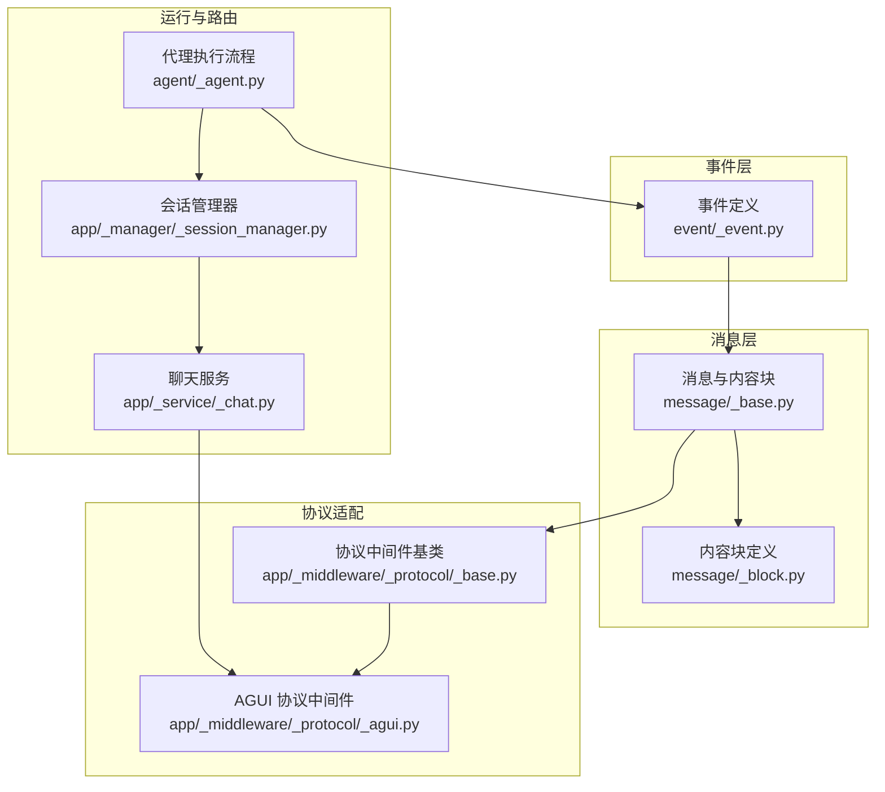
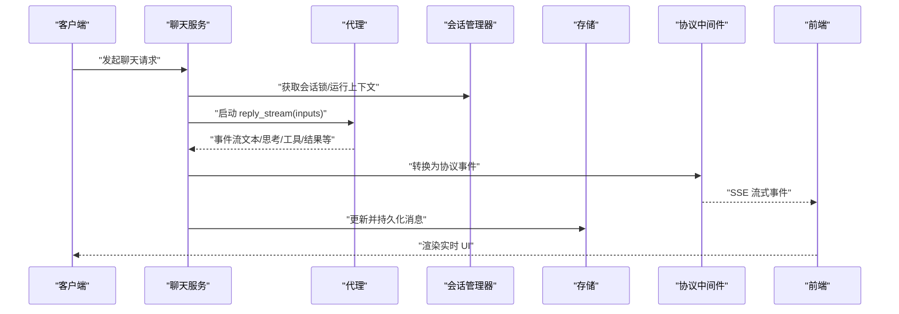
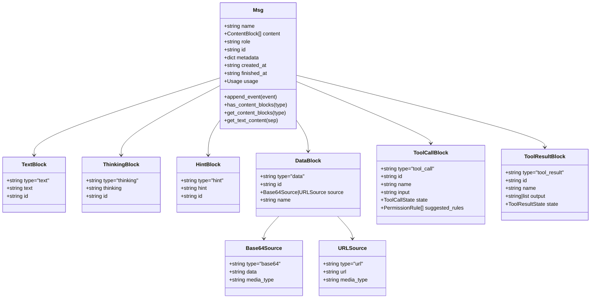
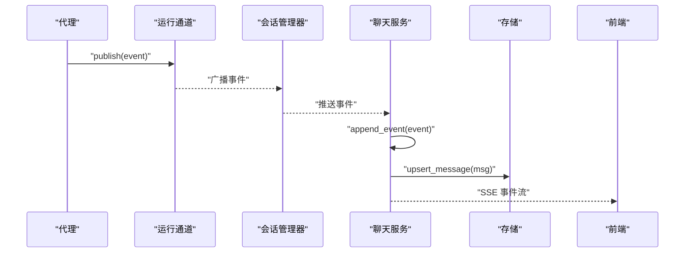
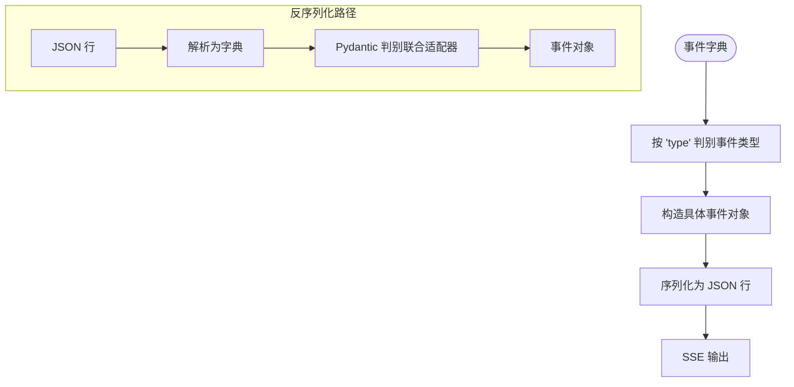
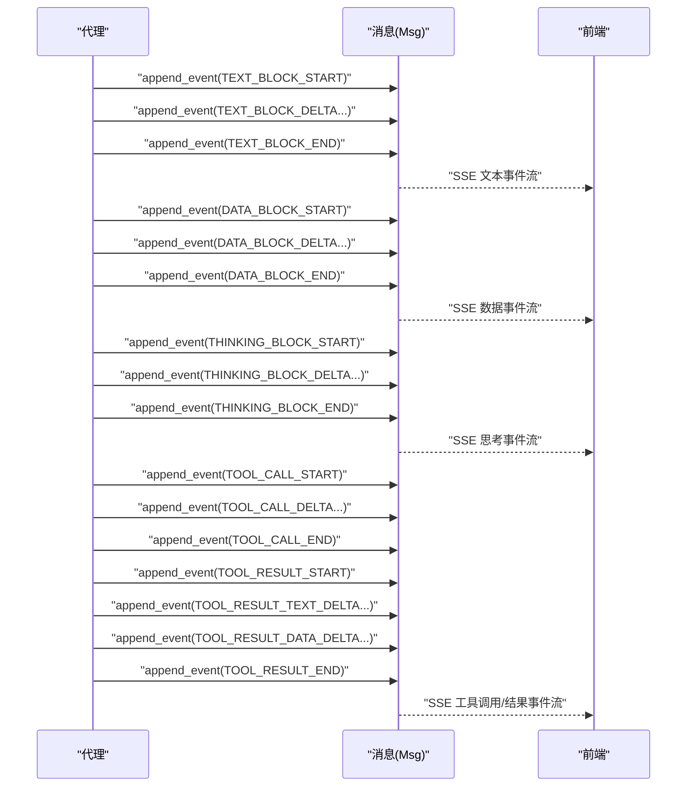
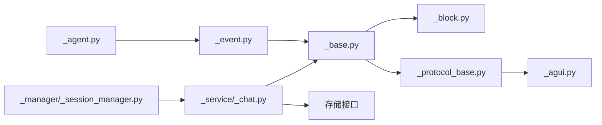

# 事件与消息系统

<cite>
**本文引用的文件**
- [事件定义 _event.py](file://src/agentscope/event/_event.py)
- [消息与内容块 _base.py](file://src/agentscope/message/_base.py)
- [内容块定义 _block.py](file://src/agentscope/message/_block.py)
- [协议中间件基类 _protocol_base.py](file://src/agentscope/app/_middleware/_protocol/_base.py)
- [AGUI 协议中间件 _agui.py](file://src/agentscope/app/_middleware/_protocol/_agui.py)
- [会话管理器 _session_manager.py](file://src/agentscope/app/_manager/_session_manager.py)
- [聊天服务 _chat.py](file://src/agentscope/app/_service/_chat.py)
- [代理回复流程 _agent.py](file://src/agentscope/agent/_agent.py)
- [事件单元测试 event_test.py](file://tests/event_test.py)
- [消息单元测试 message_test.py](file://tests/message_test.py)
- [事件转消息测试 event_to_message_test.py](file://tests/event_to_message_test.py)
- [AGUI 协议测试 agui_protocol_test.py](file://tests/agui_protocol_test.py)
- [追踪序列化工具 _tracing_utils.py](file://src/agentscope/middleware/_tracing/_utils.py)
</cite>

## 目录
1. [引言](#引言)
2. [项目结构](#项目结构)
3. [核心组件](#核心组件)
4. [架构总览](#架构总览)
5. [详细组件分析](#详细组件分析)
6. [依赖分析](#依赖分析)
7. [性能考虑](#性能考虑)
8. [故障排查指南](#故障排查指南)
9. [结论](#结论)
10. [附录](#附录)

## 引言
本文件系统性阐述 AgentScope 的事件与消息系统：事件驱动架构、消息传递机制、事件类型与消息格式、消息块设计与使用场景、事件发布订阅与消息路由策略、消息序列化与反序列化流程、事件流与时序图、最佳实践、性能优化与故障排查，以及消息协议版本兼容性与迁移策略。

## 项目结构
围绕事件与消息系统的关键模块分布如下：
- 事件定义：定义所有 AgentScope 事件类型与基础模型
- 消息与内容块：定义消息 Msg 与多模态内容块（文本、思考、提示、数据、工具调用、工具结果）
- 协议中间件：将 AgentScope 事件转换为外部协议（如 AGUI）
- 会话管理与服务：事件的订阅、缓冲、持久化与消息回放
- 代理执行：在推理过程中产生事件流并通过中间件与服务进行传播

图表来源
- [事件定义 _event.py:14-431](file://src/agentscope/event/_event.py#L14-L431)
- [消息与内容块 _base.py:65-574](file://src/agentscope/message/_base.py#L65-L574)
- [内容块定义 _block.py:11-197](file://src/agentscope/message/_block.py#L11-L197)
- [协议中间件基类 _protocol_base.py:39-169](file://src/agentscope/app/_middleware/_protocol/_base.py#L39-L169)
- [AGUI 协议中间件 _agui.py:43-258](file://src/agentscope/app/_middleware/_protocol/_agui.py#L43-L258)
- [会话管理器 _session_manager.py:49-178](file://src/agentscope/app/_manager/_session_manager.py#L49-L178)
- [聊天服务 _chat.py:192-221](file://src/agentscope/app/_service/_chat.py#L192-L221)
- [代理回复流程 _agent.py:506-542](file://src/agentscope/agent/_agent.py#L506-L542)

章节来源
- [事件定义 _event.py:14-431](file://src/agentscope/event/_event.py#L14-L431)
- [消息与内容块 _base.py:65-574](file://src/agentscope/message/_base.py#L65-L574)
- [内容块定义 _block.py:11-197](file://src/agentscope/message/_block.py#L11-L197)
- [协议中间件基类 _protocol_base.py:39-169](file://src/agentscope/app/_middleware/_protocol/_base.py#L39-L169)
- [AGUI 协议中间件 _agui.py:43-258](file://src/agentscope/app/_middleware/_protocol/_agui.py#L43-L258)
- [会话管理器 _session_manager.py:49-178](file://src/agentscope/app/_manager/_session_manager.py#L49-L178)
- [聊天服务 _chat.py:192-221](file://src/agentscope/app/_service/_chat.py#L192-L221)
- [代理回复流程 _agent.py:506-542](file://src/agentscope/agent/_agent.py#L506-L542)

## 核心组件
- 事件类型与模型
  - 事件枚举：包含回复开始/结束、模型调用开始/结束、文本/数据/思考块开始/增量/结束、工具调用开始/增量/结束、工具结果开始/文本增量/数据增量/结束、超出最大迭代、需要用户确认、需要外部执行、用户确认结果、外部执行结果等
  - 基类：统一 id 与时间戳字段
- 消息与内容块
  - 消息 Msg：包含发送者名称、角色、内容块列表、元数据、时间戳、用量统计等；提供按类型筛选、拼接文本、追加事件等能力
  - 内容块：文本、思考、提示、数据（支持 base64 或 URL）、工具调用（含状态机）、工具结果（含状态）
- 协议中间件
  - 将 AgentScope 事件转换为外部协议（如 AGUI），并负责序列化与流式输出
- 会话与服务
  - 会话管理器：串行化同一会话内的运行、事件缓冲、订阅分发
  - 聊天服务：接收输入事件或消息，驱动代理流式产出事件，同时更新并持久化消息

章节来源
- [事件定义 _event.py:14-431](file://src/agentscope/event/_event.py#L14-L431)
- [消息与内容块 _base.py:65-574](file://src/agentscope/message/_base.py#L65-L574)
- [内容块定义 _block.py:11-197](file://src/agentscope/message/_block.py#L11-L197)
- [协议中间件基类 _protocol_base.py:112-148](file://src/agentscope/app/_middleware/_protocol/_base.py#L112-L148)
- [AGUI 协议中间件 _agui.py:43-258](file://src/agentscope/app/_middleware/_protocol/_agui.py#L43-L258)
- [会话管理器 _session_manager.py:49-178](file://src/agentscope/app/_manager/_session_manager.py#L49-L178)
- [聊天服务 _chat.py:192-221](file://src/agentscope/app/_service/_chat.py#L192-L221)

## 架构总览
AgentScope 的事件与消息系统采用“事件驱动 + 多模态消息”的架构：
- 代理在推理过程中产生事件流（如文本增量、工具调用、工具结果等）
- 事件被转换为协议格式（如 AGUI）后通过 SSE 流式传输到前端
- 同时，事件被应用到消息对象中，累积生成最终消息；消息可被持久化与回放
- 会话管理器确保同一会话内串行化运行，并对新订阅者回放历史事件

图表来源
- [聊天服务 _chat.py:192-221](file://src/agentscope/app/_service/_chat.py#L192-L221)
- [会话管理器 _session_manager.py:104-178](file://src/agentscope/app/_manager/_session_manager.py#L104-L178)
- [协议中间件基类 _protocol_base.py:39-78](file://src/agentscope/app/_middleware/_protocol/_base.py#L39-L78)
- [AGUI 协议中间件 _agui.py:60-93](file://src/agentscope/app/_middleware/_protocol/_agui.py#L60-L93)
- [代理回复流程 _agent.py:506-542](file://src/agentscope/agent/_agent.py#L506-L542)

## 详细组件分析

### 事件类型与模型
- 事件类型覆盖完整推理链路：回复生命周期、模型调用、多模态块流式、工具调用与结果、权限与外部执行、异常与中断
- 使用 Pydantic 模型与枚举值，保证类型安全与序列化一致性
- 事件携带 reply_id 与 block_id 等标识，用于与消息内容块建立映射关系

```mermaid
classDiagram
class EventBase {
+string id
+string created_at
}
class ReplyStartEvent
class ReplyEndEvent
class ModelCallStartEvent
class ModelCallEndEvent
class TextBlockStartEvent
class TextBlockDeltaEvent
class TextBlockEndEvent
class DataBlockStartEvent
class DataBlockDeltaEvent
class DataBlockEndEvent
class ThinkingBlockStartEvent
class ThinkingBlockDeltaEvent
class ThinkingBlockEndEvent
class ToolCallStartEvent
class ToolCallDeltaEvent
class ToolCallEndEvent
class ToolResultStartEvent
class ToolResultTextDeltaEvent
class ToolResultDataDeltaEvent
class ToolResultEndEvent
class RequireUserConfirmEvent
class UserConfirmResultEvent
class RequireExternalExecutionEvent
class ExternalExecutionResultEvent
class ExceedMaxItersEvent
EventBase <|-- ReplyStartEvent
EventBase <|-- ReplyEndEvent
EventBase <|-- ModelCallStartEvent
EventBase <|-- ModelCallEndEvent
EventBase <|-- TextBlockStartEvent
EventBase <|-- TextBlockDeltaEvent
EventBase <|-- TextBlockEndEvent
EventBase <|-- DataBlockStartEvent
EventBase <|-- DataBlockDeltaEvent
EventBase <|-- DataBlockEndEvent
EventBase <|-- ThinkingBlockStartEvent
EventBase <|-- ThinkingBlockDeltaEvent
EventBase <|-- ThinkingBlockEndEvent
EventBase <|-- ToolCallStartEvent
EventBase <|-- ToolCallDeltaEvent
EventBase <|-- ToolCallEndEvent
EventBase <|-- ToolResultStartEvent
EventBase <|-- ToolResultTextDeltaEvent
EventBase <|-- ToolResultDataDeltaEvent
EventBase <|-- ToolResultEndEvent
EventBase <|-- RequireUserConfirmEvent
EventBase <|-- UserConfirmResultEvent
EventBase <|-- RequireExternalExecutionEvent
EventBase <|-- ExternalExecutionResultEvent
EventBase <|-- ExceedMaxItersEvent
```

图表来源
- [事件定义 _event.py:53-431](file://src/agentscope/event/_event.py#L53-L431)

章节来源
- [事件定义 _event.py:14-431](file://src/agentscope/event/_event.py#L14-L431)

### 消息与内容块
- 消息 Msg
  - 角色校验：不同角色允许的内容块集合不同（用户仅允许文本/数据；系统仅允许文本；助理不限）
  - 追加事件：根据事件类型更新内容块、完成时间戳与用量统计
  - 工具调用状态：根据权限与外部执行事件更新 ToolCallBlock 状态
- 内容块
  - 文本/思考/提示：纯文本容器
  - 数据：支持 base64 或 URL 两种来源
  - 工具调用：带状态机（待定/询问/允许/提交/完成）
  - 工具结果：带状态（成功/错误/中断/拒绝/运行中）

图表来源
- [消息与内容块 _base.py:65-574](file://src/agentscope/message/_base.py#L65-L574)
- [内容块定义 _block.py:11-197](file://src/agentscope/message/_block.py#L11-L197)

章节来源
- [消息与内容块 _base.py:65-574](file://src/agentscope/message/_base.py#L65-L574)
- [内容块定义 _block.py:11-197](file://src/agentscope/message/_block.py#L11-L197)

### 事件发布订阅与消息路由
- 发布：代理在推理过程中产生事件流
- 订阅：会话管理器维护订阅队列，新订阅者可回放历史事件
- 路由：聊天服务将事件写入运行通道，同时应用到当前回复消息；协议中间件将事件转换为外部协议格式

图表来源
- [会话管理器 _session_manager.py:104-178](file://src/agentscope/app/_manager/_session_manager.py#L104-L178)
- [聊天服务 _chat.py:192-221](file://src/agentscope/app/_service/_chat.py#L192-L221)
- [消息与内容块 _base.py:210-428](file://src/agentscope/message/_base.py#L210-L428)

章节来源
- [会话管理器 _session_manager.py:49-178](file://src/agentscope/app/_manager/_session_manager.py#L49-L178)
- [聊天服务 _chat.py:192-221](file://src/agentscope/app/_service/_chat.py#L192-L221)
- [消息与内容块 _base.py:210-428](file://src/agentscope/message/_base.py#L210-L428)

### 消息序列化与反序列化
- 序列化：协议中间件将事件对象转换为字典并以 UTF-8 编码的 JSON 行输出
- 反序列化：中间件基类使用 Pydantic 的判别联合类型，基于事件 type 字段自动反序列化为具体事件类型
- 追踪与日志：通用序列化工具将复杂对象转换为可记录形式

图表来源
- [协议中间件基类 _protocol_base.py:112-148](file://src/agentscope/app/_middleware/_protocol/_base.py#L112-L148)
- [AGUI 协议中间件 _agui.py:60-93](file://src/agentscope/app/_middleware/_protocol/_agui.py#L60-L93)
- [追踪序列化工具 _tracing_utils.py:15-54](file://src/agentscope/middleware/_tracing/_utils.py#L15-L54)

章节来源
- [协议中间件基类 _protocol_base.py:112-148](file://src/agentscope/app/_middleware/_protocol/_base.py#L112-L148)
- [AGUI 协议中间件 _agui.py:60-93](file://src/agentscope/app/_middleware/_protocol/_agui.py#L60-L93)
- [追踪序列化工具 _tracing_utils.py:15-54](file://src/agentscope/middleware/_tracing/_utils.py#L15-L54)

### 事件流与消息传递时序
- 文本块流式：开始 → 增量多次 → 结束
- 数据块流式：开始 → base64 增量多次 → 结束
- 思考块流式：开始 → 增量多次 → 结束
- 工具调用与结果：开始 → 参数增量 → 结束；结果开始 → 文本/数据增量 → 结束
- 权限与外部执行：触发确认/外部执行事件，后续收到结果事件后更新消息

图表来源
- [消息与内容块 _base.py:210-428](file://src/agentscope/message/_base.py#L210-L428)
- [事件定义 _event.py:114-326](file://src/agentscope/event/_event.py#L114-L326)

章节来源
- [消息与内容块 _base.py:210-428](file://src/agentscope/message/_base.py#L210-L428)
- [事件定义 _event.py:114-326](file://src/agentscope/event/_event.py#L114-L326)

### 消息块（MessageBlock）设计理念与使用场景
- 设计理念
  - 多模态：统一抽象文本、数据、思考、提示、工具调用与工具结果
  - 流式：支持增量事件，逐步构建内容块
  - 状态机：工具调用具备明确的状态流转，便于权限控制与外部执行
- 数据结构
  - 文本/思考/提示：轻量文本容器
  - 数据：二进制数据可通过 base64 或 URL 指向，减少大对象直接内联
  - 工具调用/结果：携带名称、输入、输出与状态，支持权限建议与结果聚合
- 使用场景
  - 代理回复：文本增量、思考过程、多模态输出
  - 工具链：参数增量、结果文本/数据增量、状态收敛
  - 权限与外部执行：在确认/提交阶段保持状态一致

章节来源
- [内容块定义 _block.py:11-197](file://src/agentscope/message/_block.py#L11-L197)
- [消息与内容块 _base.py:65-574](file://src/agentscope/message/_base.py#L65-L574)

### 事件发布订阅模式与消息路由策略
- 发布订阅
  - 会话管理器作为事件总线：每个会话一个运行上下文，事件写入缓冲区并广播给订阅队列
  - 新订阅者先回放历史事件，再接收实时事件，保证一致性
- 路由策略
  - 聊天服务：将事件写入运行通道，同时应用到当前回复消息；必要时合并/覆盖持久化消息
  - 协议中间件：将事件转换为外部协议格式，供前端消费

章节来源
- [会话管理器 _session_manager.py:104-178](file://src/agentscope/app/_manager/_session_manager.py#L104-L178)
- [聊天服务 _chat.py:192-221](file://src/agentscope/app/_service/_chat.py#L192-L221)
- [协议中间件基类 _protocol_base.py:39-78](file://src/agentscope/app/_middleware/_protocol/_base.py#L39-L78)

### 单元测试与行为验证
- 事件模型：验证序列化/反序列化与字段一致性
- 消息模型：验证内容块合法性、角色约束、文本拼接与类型筛选
- 事件转消息：验证文本/思考/数据块增量事件如何累积为消息
- 协议转换：验证 AGUI 中间件对各类事件的转换行为

章节来源
- [事件单元测试 event_test.py:14-47](file://tests/event_test.py#L14-L47)
- [消息单元测试 message_test.py:25-267](file://tests/message_test.py#L25-L267)
- [事件转消息测试 event_to_message_test.py:192-274](file://tests/event_to_message_test.py#L192-L274)
- [AGUI 协议测试 agui_protocol_test.py:148-220](file://tests/agui_protocol_test.py#L148-L220)

## 依赖分析
- 组件耦合
  - 事件与消息：事件驱动消息累积，消息依赖事件中的块级标识
  - 协议中间件：依赖事件类型集合，输出协议字典
  - 会话与服务：服务负责事件与消息的持久化与回放
- 外部依赖
  - Pydantic：事件与消息模型的序列化/反序列化
  - Starlette：ASGI 中间件框架，用于协议转换与流式响应
  - ag_ui：AGUI 事件类型，用于协议映射

图表来源
- [事件定义 _event.py:14-431](file://src/agentscope/event/_event.py#L14-L431)
- [消息与内容块 _base.py:65-574](file://src/agentscope/message/_base.py#L65-L574)
- [内容块定义 _block.py:11-197](file://src/agentscope/message/_block.py#L11-L197)
- [协议中间件基类 _protocol_base.py:39-169](file://src/agentscope/app/_middleware/_protocol/_base.py#L39-L169)
- [AGUI 协议中间件 _agui.py:43-258](file://src/agentscope/app/_middleware/_protocol/_agui.py#L43-L258)
- [会话管理器 _session_manager.py:49-178](file://src/agentscope/app/_manager/_session_manager.py#L49-L178)
- [聊天服务 _chat.py:192-221](file://src/agentscope/app/_service/_chat.py#L192-L221)
- [代理回复流程 _agent.py:506-542](file://src/agentscope/agent/_agent.py#L506-L542)

章节来源
- [事件定义 _event.py:14-431](file://src/agentscope/event/_event.py#L14-L431)
- [消息与内容块 _base.py:65-574](file://src/agentscope/message/_base.py#L65-L574)
- [协议中间件基类 _protocol_base.py:39-169](file://src/agentscope/app/_middleware/_protocol/_base.py#L39-L169)
- [AGUI 协议中间件 _agui.py:43-258](file://src/agentscope/app/_middleware/_protocol/_agui.py#L43-L258)
- [会话管理器 _session_manager.py:49-178](file://src/agentscope/app/_manager/_session_manager.py#L49-L178)
- [聊天服务 _chat.py:192-221](file://src/agentscope/app/_service/_chat.py#L192-L221)
- [代理回复流程 _agent.py:506-542](file://src/agentscope/agent/_agent.py#L506-L542)

## 性能考虑
- 流式增量：文本/数据/思考/工具结果均采用增量事件，降低单次传输负载
- 内容块去重与定位：通过 block_id 快速定位目标块，避免全量扫描
- 并发串行化：会话管理器对同一会话串行化运行，避免竞态与内存膨胀
- 序列化开销：协议中间件使用判别联合与最小字段输出，减少 JSON 体积
- 存储合并：消息持久化采用 upsert 策略，避免重复写入

## 故障排查指南
- 事件未生效
  - 检查事件 reply_id 是否与消息 id 匹配，不匹配会被跳过并记录警告
  - 检查 block_id 是否存在，缺失块会被跳过并记录警告
- 协议转换异常
  - 确认事件 type 字段正确，反序列化失败会抛出异常
  - 检查协议中间件是否正确实现转换逻辑
- 工具调用状态异常
  - 确认权限事件与结果事件顺序正确，状态机应从 PENDING → ASKING → ALLOWED/FINISHED
  - 外部执行完成后需收到结果事件以收敛状态
- 前端未显示
  - 确认 SSE 流是否正常，检查协议中间件输出编码与换行符
  - 检查订阅是否正确回放历史事件

章节来源
- [消息与内容块 _base.py:210-428](file://src/agentscope/message/_base.py#L210-L428)
- [协议中间件基类 _protocol_base.py:112-148](file://src/agentscope/app/_middleware/_protocol/_base.py#L112-L148)
- [内容块定义 _block.py:105-178](file://src/agentscope/message/_block.py#L105-L178)

## 结论
AgentScope 的事件与消息系统以事件驱动为核心，结合多模态内容块与流式增量，实现了高扩展、可观测、可协议化的消息传递机制。通过会话管理器与协议中间件，系统在一致性、性能与可维护性之间取得平衡。建议在生产环境中严格遵循事件/消息契约、完善权限与外部执行流程，并持续优化序列化与流式输出策略。

## 附录

### 消息协议版本兼容性与迁移策略
- 版本策略
  - 事件/消息采用 Pydantic 模型与判别联合，新增字段建议设置默认值并保持向后兼容
  - 协议中间件输出字段建议保留关键字段并增加可选字段，避免破坏现有消费者
- 迁移建议
  - 新增事件类型时，优先在协议中间件中提供兼容映射
  - 对于破坏性变更，提供过渡期的双格式输出与消费者适配逻辑
  - 在追踪与日志中记录版本信息，便于问题定位与回滚

[本节为通用指导，无需特定文件引用]