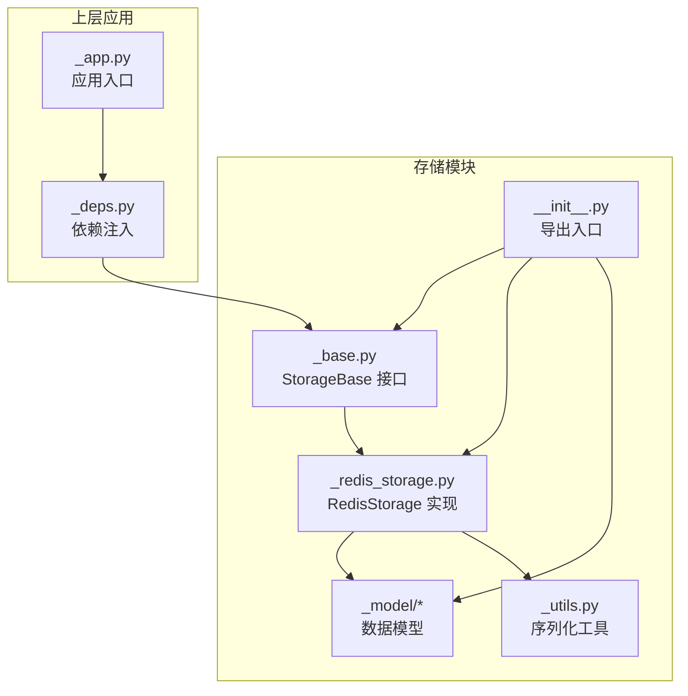
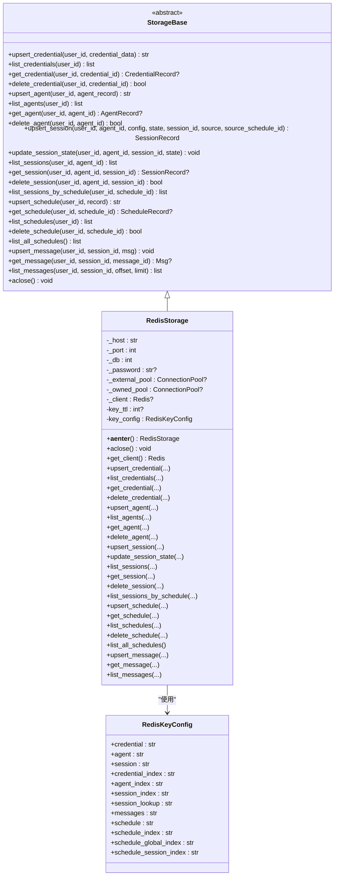
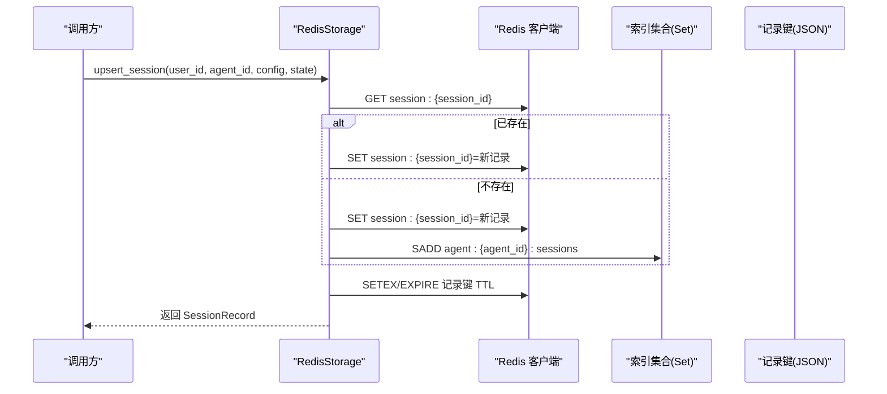
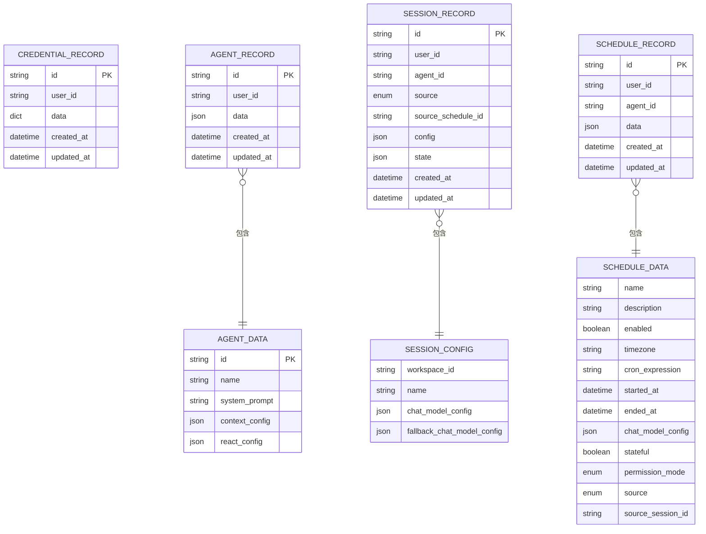
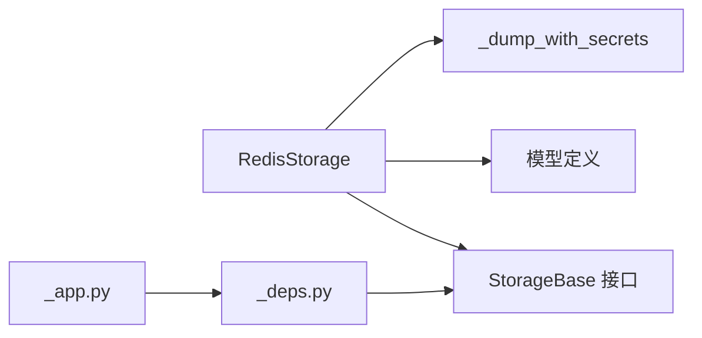

# 存储与数据层

<cite>
**本文引用的文件**
- [src/agentscope/app/storage/__init__.py](file://src/agentscope/app/storage/__init__.py)
- [src/agentscope/app/storage/_base.py](file://src/agentscope/app/storage/_base.py)
- [src/agentscope/app/storage/_redis_storage.py](file://src/agentscope/app/storage/_redis_storage.py)
- [src/agentscope/app/storage/_utils.py](file://src/agentscope/app/storage/_utils.py)
- [src/agentscope/app/storage/_model/__init__.py](file://src/agentscope/app/storage/_model/__init__.py)
- [_model/_base.py](file://src/agentscope/app/storage/_model/_base.py)
- [_model/_agent.py](file://src/agentscope/app/storage/_model/_agent.py)
- [_model/_credential.py](file://src/agentscope/app/storage/_model/_credential.py)
- [_model/_schedule.py](file://src/agentscope/app/storage/_model/_schedule.py)
- [_model/_session.py](file://src/agentscope/app/storage/_model/_session.py)
- [tests/storage_redis_test.py](file://tests/storage_redis_test.py)
- [src/agentscope/app/_app.py](file://src/agentscope/app/_app.py)
- [src/agentscope/app/_deps.py](file://src/agentscope/app/_deps.py)
</cite>

## 目录
1. [简介](#简介)
2. [项目结构](#项目结构)
3. [核心组件](#核心组件)
4. [架构总览](#架构总览)
5. [组件详解](#组件详解)
6. [依赖关系分析](#依赖关系分析)
7. [性能考量](#性能考量)
8. [故障排查指南](#故障排查指南)
9. [结论](#结论)
10. [附录](#附录)

## 简介
本文件系统性阐述 AgentScope 的存储与数据层设计，重点覆盖：
- 存储抽象层与接口设计
- Redis 存储实现（键空间设计、连接池管理、滑动过期）
- 数据模型定义与访问模式
- 序列化策略、缓存机制与一致性保障
- 存储架构图与数据模型关系图
- 配置指南、性能调优与容量规划
- 备份恢复与迁移方案

## 项目结构
存储模块位于 agentscope.app.storage 包内，采用“抽象接口 + 具体实现 + 模型定义 + 工具函数”的分层组织方式：
- 抽象层：StorageBase 定义统一异步接口
- 实现层：RedisStorage 提供 Redis 后端实现
- 模型层：各资源的 Pydantic 模型用于序列化与校验
- 工具层：序列化工具与键模板配置

图表来源
- [src/agentscope/app/storage/_base.py:21-426](file://src/agentscope/app/storage/_base.py#L21-L426)
- [src/agentscope/app/storage/_redis_storage.py:58-178](file://src/agentscope/app/storage/_redis_storage.py#L58-L178)
- [src/agentscope/app/storage/_model/__init__.py:1-28](file://src/agentscope/app/storage/_model/__init__.py#L1-L28)
- [src/agentscope/app/storage/_utils.py:7-30](file://src/agentscope/app/storage/_utils.py#L7-L30)
- [src/agentscope/app/storage/__init__.py:1-36](file://src/agentscope/app/storage/__init__.py#L1-L36)
- [src/agentscope/app/_app.py:43-72](file://src/agentscope/app/_app.py#L43-L72)
- [src/agentscope/app/_deps.py:44-53](file://src/agentscope/app/_deps.py#L44-L53)

章节来源
- [src/agentscope/app/storage/__init__.py:1-36](file://src/agentscope/app/storage/__init__.py#L1-L36)
- [src/agentscope/app/storage/_base.py:21-426](file://src/agentscope/app/storage/_base.py#L21-L426)
- [src/agentscope/app/storage/_redis_storage.py:58-178](file://src/agentscope/app/storage/_redis_storage.py#L58-L178)
- [src/agentscope/app/storage/_model/__init__.py:1-28](file://src/agentscope/app/storage/_model/__init__.py#L1-L28)
- [src/agentscope/app/storage/_utils.py:7-30](file://src/agentscope/app/storage/_utils.py#L7-L30)
- [src/agentscope/app/_app.py:43-72](file://src/agentscope/app/_app.py#L43-L72)
- [src/agentscope/app/_deps.py:44-53](file://src/agentscope/app/_deps.py#L44-L53)

## 核心组件
- 存储抽象接口：StorageBase 定义了凭证、代理、会话、调度、消息等资源的增删改查与状态更新接口，并支持异步生命周期管理。
- Redis 实现：RedisStorage 基于 aioredis 提供异步连接池、键模板、滑动过期与集合/列表等 Redis 数据结构的组合使用。
- 数据模型：基于 Pydantic 的模型体系，统一序列化与反序列化，SecretStr 字段在存储时保留明文值。
- 序列化工具：_dump_with_secrets 将 SecretStr 字段还原为明文再写入，确保安全存储与检索。

章节来源
- [src/agentscope/app/storage/_base.py:21-426](file://src/agentscope/app/storage/_base.py#L21-L426)
- [src/agentscope/app/storage/_redis_storage.py:58-178](file://src/agentscope/app/storage/_redis_storage.py#L58-L178)
- [src/agentscope/app/storage/_utils.py:7-30](file://src/agentscope/app/storage/_utils.py#L7-L30)

## 架构总览
下图展示存储抽象层与 Redis 实现的关系，以及与上层应用的集成点。

图表来源
- [src/agentscope/app/storage/_base.py:21-426](file://src/agentscope/app/storage/_base.py#L21-L426)
- [src/agentscope/app/storage/_redis_storage.py:58-178](file://src/agentscope/app/storage/_redis_storage.py#L58-L178)
- [src/agentscope/app/storage/_redis_storage.py:31-56](file://src/agentscope/app/storage/_redis_storage.py#L31-L56)

章节来源
- [src/agentscope/app/storage/_base.py:21-426](file://src/agentscope/app/storage/_base.py#L21-L426)
- [src/agentscope/app/storage/_redis_storage.py:58-178](file://src/agentscope/app/storage/_redis_storage.py#L58-L178)

## 组件详解

### 存储接口设计（StorageBase）
- 资源接口：凭证、代理、会话、调度、消息的创建/更新/查询/删除
- 会话状态：支持仅更新可变状态（热路径）
- 调度与会话关联：按调度维度查询会话历史
- 异步生命周期：支持 with-as 上下文管理，自动释放连接资源

章节来源
- [src/agentscope/app/storage/_base.py:21-426](file://src/agentscope/app/storage/_base.py#L21-L426)

### Redis 存储实现（RedisStorage）
- 连接池管理
  - 支持外部传入连接池（不托管生命周期）
  - 内部创建连接池时可透传参数（如最大连接数、超时等）
  - 异步上下文进入/退出时创建/关闭连接池
- 键模板与命名空间
  - 使用 RedisKeyConfig 统一管理键模板，涵盖记录键、索引集合、查找映射、消息列表、全局索引等
  - 用户/代理/会话/调度维度隔离，避免跨用户冲突
- 滑动过期（TTL）
  - 写入后刷新记录键 TTL，实现“最近使用时间”驱动的回收
  - 消息列表键随会话 TTL 自动过期，降低冷数据占用
- 访问模式
  - 索引集合（Set）维护资源 ID 列表，读取时批量获取详情
  - 消息列表（List）按插入顺序保存消息，支持分页查询
  - 调度与会话建立双向索引，便于按调度查询或级联删除
- 级联删除
  - 删除代理时级联删除其会话与调度
  - 删除调度时级联删除其执行产生的会话并清理索引

图表来源
- [src/agentscope/app/storage/_redis_storage.py:463-523](file://src/agentscope/app/storage/_redis_storage.py#L463-L523)
- [src/agentscope/app/storage/_redis_storage.py:525-548](file://src/agentscope/app/storage/_redis_storage.py#L525-L548)

章节来源
- [src/agentscope/app/storage/_redis_storage.py:58-178](file://src/agentscope/app/storage/_redis_storage.py#L58-L178)
- [src/agentscope/app/storage/_redis_storage.py:111-124](file://src/agentscope/app/storage/_redis_storage.py#L111-L124)
- [src/agentscope/app/storage/_redis_storage.py:463-523](file://src/agentscope/app/storage/_redis_storage.py#L463-L523)
- [src/agentscope/app/storage/_redis_storage.py:525-548](file://src/agentscope/app/storage/_redis_storage.py#L525-L548)
- [src/agentscope/app/storage/_redis_storage.py:589-604](file://src/agentscope/app/storage/_redis_storage.py#L589-L604)
- [src/agentscope/app/storage/_redis_storage.py:606-646](file://src/agentscope/app/storage/_redis_storage.py#L606-L646)
- [src/agentscope/app/storage/_redis_storage.py:674-693](file://src/agentscope/app/storage/_redis_storage.py#L674-L693)
- [src/agentscope/app/storage/_redis_storage.py:731-770](file://src/agentscope/app/storage/_redis_storage.py#L731-L770)

### 数据模型与序列化
- 基类字段：统一包含 id、created_at、updated_at
- 资源模型
  - 凭证：CredentialRecord，data 为字典，存储各类凭据配置
  - 代理：AgentRecord，data 包含名称、系统提示、上下文与 ReAct 配置
  - 会话：SessionRecord，包含配置、来源、来源调度、运行时状态
  - 调度：ScheduleRecord，包含 cron 表达式、时区、启用状态、权限模式等
- 序列化策略
  - 使用 Pydantic model_dump(mode="json") 将非 JSON 可序列化类型转换
  - SecretStr 字段在存储前还原为明文值，确保安全存储与检索

图表来源
- [src/agentscope/app/storage/_model/_base.py:9-26](file://src/agentscope/app/storage/_model/_base.py#L9-L26)
- [src/agentscope/app/storage/_model/_agent.py:11-53](file://src/agentscope/app/storage/_model/_agent.py#L11-L53)
- [src/agentscope/app/storage/_model/_credential.py:10-19](file://src/agentscope/app/storage/_model/_credential.py#L10-L19)
- [src/agentscope/app/storage/_model/_session.py:19-75](file://src/agentscope/app/storage/_model/_session.py#L19-L75)
- [src/agentscope/app/storage/_model/_schedule.py:25-102](file://src/agentscope/app/storage/_model/_schedule.py#L25-L102)

章节来源
- [src/agentscope/app/storage/_model/__init__.py:1-28](file://src/agentscope/app/storage/_model/__init__.py#L1-L28)
- [src/agentscope/app/storage/_model/_base.py:9-26](file://src/agentscope/app/storage/_model/_base.py#L9-L26)
- [src/agentscope/app/storage/_model/_agent.py:11-53](file://src/agentscope/app/storage/_model/_agent.py#L11-L53)
- [src/agentscope/app/storage/_model/_credential.py:10-19](file://src/agentscope/app/storage/_model/_credential.py#L10-L19)
- [src/agentscope/app/storage/_model/_session.py:19-75](file://src/agentscope/app/storage/_model/_session.py#L19-L75)
- [src/agentscope/app/storage/_model/_schedule.py:25-102](file://src/agentscope/app/storage/_model/_schedule.py#L25-L102)
- [src/agentscope/app/storage/_utils.py:7-30](file://src/agentscope/app/storage/_utils.py#L7-L30)

### 访问模式与事务处理
- 访问模式
  - 索引集合（Set）：维护资源 ID 列表，读取时批量获取详情，跳过已过期或被外部删除的键
  - 消息列表（List）：按插入顺序保存消息，支持 offset/limit 分页
  - 查找映射：(user_id, agent_id) -> session_id 的映射键，便于快速定位最新会话
- 事务处理
  - 当前实现未显式使用 MULTI/EXEC；对多键操作采用顺序执行，未保证原子性
  - 级联删除通过多次独立命令完成，存在竞态风险；建议在需要强一致的场景引入 Lua 脚本或单命令原子操作

章节来源
- [src/agentscope/app/storage/_redis_storage.py:279-308](file://src/agentscope/app/storage/_redis_storage.py#L279-L308)
- [src/agentscope/app/storage/_redis_storage.py:550-587](file://src/agentscope/app/storage/_redis_storage.py#L550-L587)
- [src/agentscope/app/storage/_redis_storage.py:648-672](file://src/agentscope/app/storage/_redis_storage.py#L648-L672)
- [src/agentscope/app/storage/_redis_storage.py:711-729](file://src/agentscope/app/storage/_redis_storage.py#L711-L729)
- [src/agentscope/app/storage/_redis_storage.py:772-797](file://src/agentscope/app/storage/_redis_storage.py#L772-L797)

### 缓存机制与一致性
- 缓存策略
  - 记录键具备滑动过期，减少长期不活跃数据占用
  - 消息列表键随会话 TTL 自动过期，避免冷数据膨胀
- 一致性
  - 通过索引集合与记录键配合，读取时跳过缺失项，保证返回结果一致性
  - 级联删除流程中先删除会话/调度再清理索引，避免悬挂引用

章节来源
- [src/agentscope/app/storage/_redis_storage.py:115-124](file://src/agentscope/app/storage/_redis_storage.py#L115-L124)
- [src/agentscope/app/storage/_redis_storage.py:425-461](file://src/agentscope/app/storage/_redis_storage.py#L425-L461)
- [src/agentscope/app/storage/_redis_storage.py:731-770](file://src/agentscope/app/storage/_redis_storage.py#L731-L770)

## 依赖关系分析
- 模块耦合
  - RedisStorage 依赖 StorageBase 接口与各模型定义
  - 序列化工具与模型紧密耦合，确保 SecretStr 明文存储
- 外部依赖
  - aioredis 异步客户端
  - Pydantic 模型与序列化
- 上层集成
  - 应用通过依赖注入获取 StorageBase 实例，生命周期由应用生命周期管理

图表来源
- [src/agentscope/app/storage/_redis_storage.py:10-22](file://src/agentscope/app/storage/_redis_storage.py#L10-L22)
- [src/agentscope/app/storage/_utils.py:7-30](file://src/agentscope/app/storage/_utils.py#L7-L30)
- [src/agentscope/app/_app.py:43-72](file://src/agentscope/app/_app.py#L43-L72)
- [src/agentscope/app/_deps.py:44-53](file://src/agentscope/app/_deps.py#L44-L53)

章节来源
- [src/agentscope/app/storage/_redis_storage.py:10-22](file://src/agentscope/app/storage/_redis_storage.py#L10-L22)
- [src/agentscope/app/_app.py:43-72](file://src/agentscope/app/_app.py#L43-L72)
- [src/agentscope/app/_deps.py:44-53](file://src/agentscope/app/_deps.py#L44-L53)

## 性能考量
- 连接池参数
  - max_connections：根据并发请求数设置，避免连接不足或过多导致开销
  - socket_connect_timeout/socket_timeout：控制网络超时，提升稳定性
  - retry_on_timeout/health_check_interval：在高延迟网络中提升可用性
- 键空间设计
  - 使用 Set 维护索引，批量读取时减少 RTT
  - 消息列表使用 List，避免频繁扩容带来的内存抖动
- TTL 策略
  - 合理设置 key_ttl，平衡内存占用与数据新鲜度
  - 对高频更新的会话，建议缩短 TTL 以回收资源
- 读写优化
  - 批量读取时优先使用 SMEMBERS + MGET，减少网络往返
  - 消息写入采用 LPUSH/RPUSH + TRIM 控制长度，避免无限增长

## 故障排查指南
- 连接问题
  - ImportError：缺少 redis[async] 包，安装后重试
  - 连接池未正确关闭：确认在应用生命周期结束时调用 aclose
- 数据不一致
  - 级联删除未生效：检查索引键是否存在，确认删除顺序
  - 会话查找映射异常：确认 session_lookup 是否被清理
- 消息丢失
  - TTL 导致消息过期：调整 key_ttl 或在写入后刷新过期时间
  - 分页偏移错误：核对 offset/limit 参数与实际消息数量

章节来源
- [src/agentscope/app/storage/_redis_storage.py:133-139](file://src/agentscope/app/storage/_redis_storage.py#L133-L139)
- [src/agentscope/app/storage/_redis_storage.py:157-165](file://src/agentscope/app/storage/_redis_storage.py#L157-L165)
- [tests/storage_redis_test.py:293-481](file://tests/storage_redis_test.py#L293-L481)

## 结论
AgentScope 的存储层通过清晰的抽象接口与 Redis 实现，提供了高扩展性的数据持久化能力。键空间设计合理，结合滑动 TTL 与集合/列表结构，满足会话与消息的高频读写需求。建议在关键路径引入原子化脚本与更严格的事务语义，以进一步提升一致性与可靠性。

## 附录

### 存储配置指南
- 连接参数
  - host/port/db/password：标准 Redis 连接信息
  - connection_pool：外部连接池（可选），避免重复创建
  - key_ttl：记录键滑动过期时间（秒）
  - key_config：自定义键模板（可选）
- 连接池参数示例
  - max_connections、socket_connect_timeout、socket_timeout、retry_on_timeout、health_check_interval

章节来源
- [src/agentscope/app/storage/_redis_storage.py:61-105](file://src/agentscope/app/storage/_redis_storage.py#L61-L105)
- [src/agentscope/app/storage/_redis_storage.py:144-151](file://src/agentscope/app/storage/_redis_storage.py#L144-L151)

### 性能调优方法
- 调整连接池大小与超时参数
- 合理设置 key_ttl，避免过短导致频繁刷新，过长导致内存压力
- 使用批量读取与分页查询，减少单次请求负载
- 对高频写入的会话消息，控制列表长度并定期清理

章节来源
- [src/agentscope/app/storage/_redis_storage.py:115-124](file://src/agentscope/app/storage/_redis_storage.py#L115-L124)
- [src/agentscope/app/storage/_redis_storage.py:800-857](file://src/agentscope/app/storage/_redis_storage.py#L800-L857)

### 容量规划建议
- 会话与消息
  - 按日均活跃会话数 × 平均消息条数 × 单条消息大小估算内存占用
  - 设置合理的 key_ttl 与列表长度上限，控制峰值内存
- 索引集合
  - 代理/凭证/调度数量增长趋势决定 Set 的规模，需关注内存与查询延迟
- 过期与回收
  - 结合业务特性设置 TTL，定期清理过期键，保持键空间整洁

### 备份与恢复策略
- 备份
  - 使用 Redis RDB 快照或 AOF 持久化策略
  - 定期导出关键索引（SMEMBERS）与记录键（GET）到离线存储
- 恢复
  - 从快照恢复后，重建索引集合与记录键映射
  - 校验消息列表完整性，必要时回放增量变更

### 迁移方案
- 版本升级
  - 新增字段时采用向后兼容的默认值策略，避免破坏现有记录
  - 迁移期间保留旧键一段时间，逐步切换读写路径
- 存储后端替换
  - 通过 StorageBase 抽象层解耦，实现新后端时仅替换 RedisStorage
  - 迁移过程中双写验证，确保数据一致性