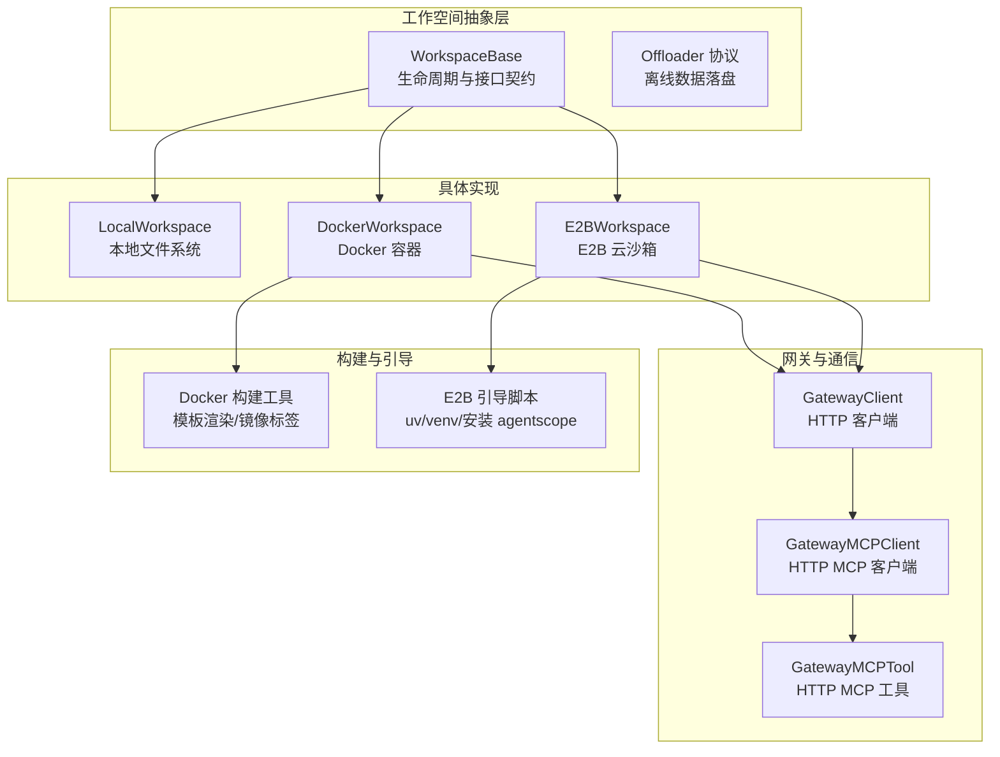
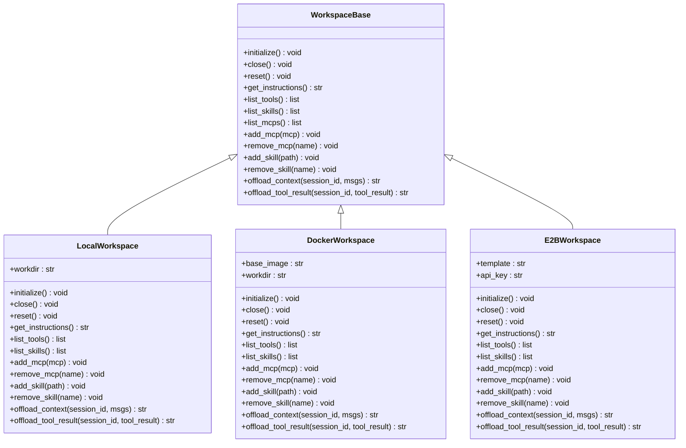
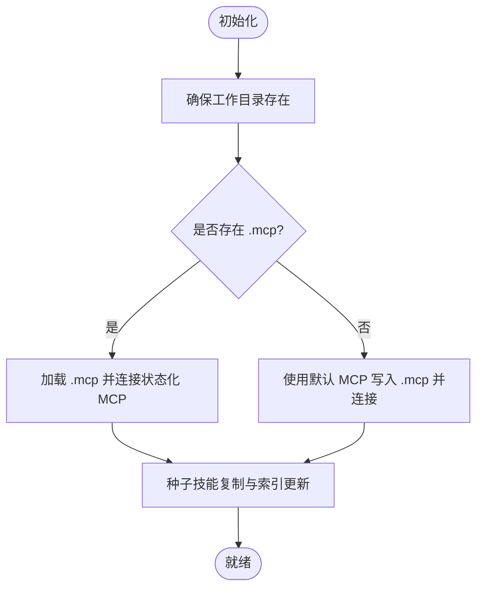
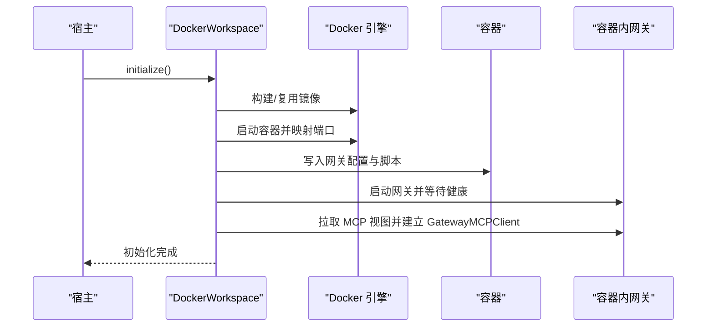
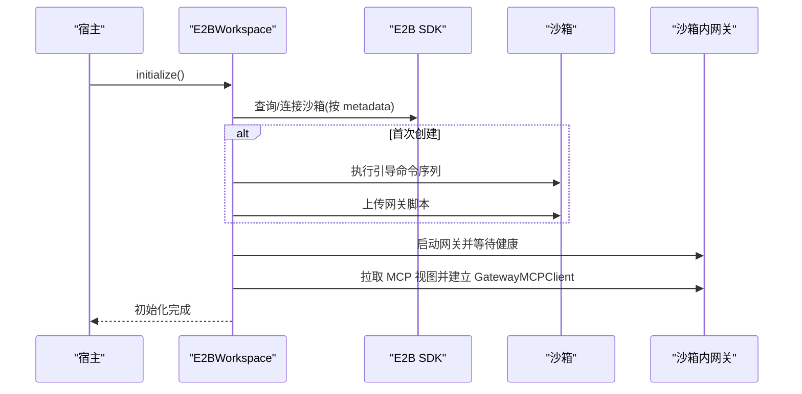
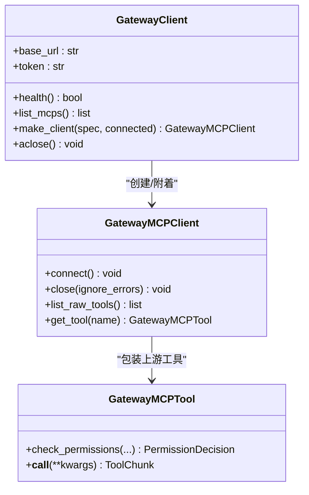
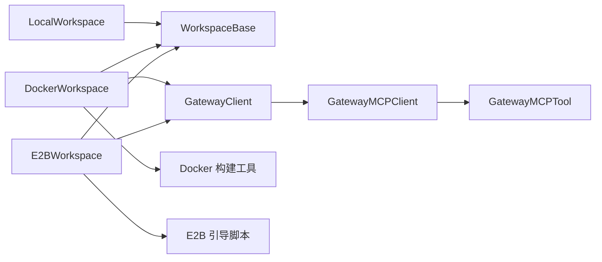

# 工作空间管理

<cite>
**本文档引用的文件**
- [workspace/__init__.py](file://src/agentscope/workspace/__init__.py)
- [workspace/_base.py](file://src/agentscope/workspace/_base.py)
- [workspace/_local_workspace.py](file://src/agentscope/workspace/_local_workspace.py)
- [workspace/_docker/_docker_workspace.py](file://src/agentscope/workspace/_docker/_docker_workspace.py)
- [workspace/_docker/_make_dockerfile.py](file://src/agentscope/workspace/_docker/_make_dockerfile.py)
- [workspace/_e2b/_e2b_workspace.py](file://src/agentscope/workspace/_e2b/_e2b_workspace.py)
- [workspace/_e2b/_bootstrap.py](file://src/agentscope/workspace/_e2b/_bootstrap.py)
- [workspace/_gateway_client.py](file://src/agentscope/workspace/_gateway_client.py)
- [workspace/_offload_protocol.py](file://src/agentscope/workspace/_offload_protocol.py)
- [workspace_local_test.py](file://tests/workspace_local_test.py)
- [workspace_docker_test.py](file://tests/workspace_docker_test.py)
- [workspace_e2b_test.py](file://tests/workspace_e2b_test.py)
</cite>

## 目录
1. [简介](#简介)
2. [项目结构](#项目结构)
3. [核心组件](#核心组件)
4. [架构总览](#架构总览)
5. [详细组件分析](#详细组件分析)
6. [依赖关系分析](#依赖关系分析)
7. [性能考虑](#性能考虑)
8. [故障排除指南](#故障排除指南)
9. [结论](#结论)
10. [附录](#附录)

## 简介
本文件系统性阐述 AgentScope 的工作空间管理能力，覆盖多环境工作空间架构与容器化支持，包括本地工作空间、Docker 工作空间与 E2B 工作空间的实现差异；详细说明工作空间生命周期管理、资源隔离与权限控制机制；解释工作空间配置模板、环境变量注入与网络通信处理；提供工作空间拓扑图与资源分配图；给出部署指南、监控方法与故障排除技巧，并总结不同工作空间类型的适用场景与性能特征。

## 项目结构
工作空间模块位于 agentscope/workspace 下，采用“按功能分层 + 多后端实现”的组织方式：
- 抽象基类：定义统一的生命周期与接口契约（初始化、关闭、重置、工具与技能发现、动态 MCP/技能管理、离线数据落盘等）
- 具体实现：本地文件系统、Docker 容器、E2B 云沙箱
- 通用网关客户端：在容器或沙箱内运行的 MCP 网关，通过 HTTP 代理本地 MCP 客户端
- 配置与构建：Docker 镜像模板与构建上下文生成、E2B 首次引导命令序列
- 协议与工具：离线数据落盘协议、工具与权限策略

图表来源
- [workspace/_base.py:36-204](file://src/agentscope/workspace/_base.py#L36-L204)
- [workspace/_local_workspace.py:118-1068](file://src/agentscope/workspace/_local_workspace.py#L118-L1068)
- [workspace/_docker/_docker_workspace.py:127-1230](file://src/agentscope/workspace/_docker/_docker_workspace.py#L127-L1230)
- [workspace/_e2b/_e2b_workspace.py:143-1035](file://src/agentscope/workspace/_e2b/_e2b_workspace.py#L143-L1035)
- [workspace/_gateway_client.py:450-635](file://src/agentscope/workspace/_gateway_client.py#L450-L635)
- [workspace/_docker/_make_dockerfile.py:109-276](file://src/agentscope/workspace/_docker/_make_dockerfile.py#L109-L276)
- [workspace/_e2b/_bootstrap.py:122-195](file://src/agentscope/workspace/_e2b/_bootstrap.py#L122-L195)

章节来源
- [workspace/__init__.py:5-18](file://src/agentscope/workspace/__init__.py#L5-L18)
- [workspace/_base.py:36-204](file://src/agentscope/workspace/_base.py#L36-L204)

## 核心组件
- WorkspaceBase：定义工作空间生命周期（initialize/close/reset）、指令片段（get_instructions）、工具/技能/MCP 发现（list_tools/list_skills/list_mcps）、动态管理（add_mcp/remove_mcp/add_skill/remove_skill）与离线数据落盘（offload_context/offload_tool_result）的抽象接口
- LocalWorkspace：以本地文件系统为持久化后端，提供技能索引、数据块离线落盘、会话上下文与工具结果存储
- DockerWorkspace：基于 Docker 容器，通过网关进程暴露 MCP 服务，支持可选的宿主机目录绑定实现持久化
- E2BWorkspace：基于 E2B 云沙箱，通过 SDK 生命周期管理与引导命令序列完成首次安装，支持 MCP 网关与持久化
- GatewayClient/GatewayMCPClient/GatewayMCPTool：在宿主侧封装对容器/沙箱内 MCP 网关的 HTTP 调用，屏蔽底层传输细节
- Offloader 协议：统一的离线数据落盘接口，便于不同后端实现一致的检索与复用

章节来源
- [workspace/_base.py:36-204](file://src/agentscope/workspace/_base.py#L36-L204)
- [workspace/_local_workspace.py:118-1068](file://src/agentscope/workspace/_local_workspace.py#L118-L1068)
- [workspace/_docker/_docker_workspace.py:127-1230](file://src/agentscope/workspace/_docker/_docker_workspace.py#L127-L1230)
- [workspace/_e2b/_e2b_workspace.py:143-1035](file://src/agentscope/workspace/_e2b/_e2b_workspace.py#L143-L1035)
- [workspace/_gateway_client.py:450-635](file://src/agentscope/workspace/_gateway_client.py#L450-L635)
- [workspace/_offload_protocol.py:8-46](file://src/agentscope/workspace/_offload_protocol.py#L8-L46)

## 架构总览
工作空间的统一抽象通过 WorkspaceBase 暴露一致的 API，具体后端通过不同的执行与隔离边界实现差异化能力：
- 本地工作空间：直接文件系统访问，适合开发调试与轻量任务
- Docker 工作空间：容器隔离与可移植性，支持镜像缓存与持久化挂载
- E2B 工作空间：云端沙箱隔离，具备更强的可扩展性与稳定性

图表来源
- [workspace/_base.py:36-204](file://src/agentscope/workspace/_base.py#L36-L204)
- [workspace/_local_workspace.py:118-1068](file://src/agentscope/workspace/_local_workspace.py#L118-L1068)
- [workspace/_docker/_docker_workspace.py:127-1230](file://src/agentscope/workspace/_docker/_docker_workspace.py#L127-L1230)
- [workspace/_e2b/_e2b_workspace.py:143-1035](file://src/agentscope/workspace/_e2b/_e2b_workspace.py#L143-L1035)

## 详细组件分析

### 本地工作空间（LocalWorkspace）
- 持久化布局：工作目录下包含 .mcp（MCP 配置）、data（离线数据文件）、skills（技能目录）、sessions（会话上下文与工具结果）
- 初始化流程：确保工作目录存在；从 .mcp 恢复或写入默认 MCP 列表；种子技能复制与索引更新；并发安全的锁保护
- 离线数据落盘：将消息与工具结果序列化为 JSONL 或纯文本；对 Base64 数据块进行哈希去重并落盘到 data 目录，替换为 URLSource
- 动态管理：支持添加/移除 MCP 与技能；冲突检测与路径安全检查
- 生命周期：支持 reset 清理 sessions/data/skills；close 关闭状态化 MCP 连接

图表来源
- [workspace/_local_workspace.py:178-304](file://src/agentscope/workspace/_local_workspace.py#L178-L304)

章节来源
- [workspace/_local_workspace.py:118-1068](file://src/agentscope/workspace/_local_workspace.py#L118-L1068)

### Docker 工作空间（DockerWorkspace）
- 架构要点：通过 aiodocker 管理镜像构建与容器生命周期；容器内运行 MCP 网关，宿主侧通过 GatewayClient 以 HTTP 访问
- 镜像构建：模板渲染 + 内容哈希确定镜像标签；支持发布版与源码版两种安装模式；可选 Node.js 版本与额外 pip 包
- 持久化：可选宿主机目录绑定；重启时恢复 MCP 列表与技能；reset 清理 sessions/data/skills
- 网络与安全：每次初始化生成一次性网关令牌；容器端口映射到宿主随机端口；HTTP 请求携带 Authorization: Bearer
- 离线数据落盘：与本地工作空间一致的数据块落盘策略，但返回的是容器内路径

图表来源
- [workspace/_docker/_docker_workspace.py:230-293](file://src/agentscope/workspace/_docker/_docker_workspace.py#L230-L293)
- [workspace/_docker/_make_dockerfile.py:196-276](file://src/agentscope/workspace/_docker/_make_dockerfile.py#L196-L276)
- [workspace/_gateway_client.py:523-591](file://src/agentscope/workspace/_gateway_client.py#L523-L591)

章节来源
- [workspace/_docker/_docker_workspace.py:127-1230](file://src/agentscope/workspace/_docker/_docker_workspace.py#L127-L1230)
- [workspace/_docker/_make_dockerfile.py:109-276](file://src/agentscope/workspace/_docker/_make_dockerfile.py#L109-L276)
- [workspace/_gateway_client.py:450-635](file://src/agentscope/workspace/_gateway_client.py#L450-L635)

### E2B 工作空间（E2BWorkspace）
- 架构要点：通过 e2b.AsyncSandbox 管理沙箱生命周期；首次创建时执行引导命令序列安装 uv/venv/agentscope；后续通过 metadata 重新附加
- 引导流程：根据是否发布版选择安装策略；上传网关脚本；启动网关并等待健康；通过 X-Access-Token 代理访问
- 持久化：沙箱文件系统即持久化层；pause 保留状态，resume 自动恢复
- 网络与安全：使用 E2B 边缘代理与自定义头部；网关令牌仅在内存中传递
- 离线数据落盘：与 Docker 工作空间一致的数据块落盘策略，返回沙箱内路径

图表来源
- [workspace/_e2b/_e2b_workspace.py:244-328](file://src/agentscope/workspace/_e2b/_e2b_workspace.py#L244-L328)
- [workspace/_e2b/_bootstrap.py:122-195](file://src/agentscope/workspace/_e2b/_bootstrap.py#L122-L195)
- [workspace/_gateway_client.py:523-591](file://src/agentscope/workspace/_gateway_client.py#L523-L591)

章节来源
- [workspace/_e2b/_e2b_workspace.py:143-1035](file://src/agentscope/workspace/_e2b/_e2b_workspace.py#L143-L1035)
- [workspace/_e2b/_bootstrap.py:122-195](file://src/agentscope/workspace/_e2b/_bootstrap.py#L122-L195)
- [workspace/_gateway_client.py:450-635](file://src/agentscope/workspace/_gateway_client.py#L450-L635)

### 网关客户端与 MCP 工具
- GatewayClient：共享 httpx.AsyncClient，负责 /health 与 /mcps 等端点调用；支持额外请求头（如 E2B 的 X-Access-Token）
- GatewayMCPClient：将本地 MCPClient 的生命周期与工具发现转发至容器/沙箱内的网关；connect/delete 注册/注销上游 MCP 会话
- GatewayMCPTool：将工具调用转换为对 /mcps/{name}/tools/{tool} 的 HTTP POST，自动处理只读工具的权限策略

图表来源
- [workspace/_gateway_client.py:450-635](file://src/agentscope/workspace/_gateway_client.py#L450-L635)

章节来源
- [workspace/_gateway_client.py:43-635](file://src/agentscope/workspace/_gateway_client.py#L43-L635)

### 离线数据落盘协议
- Offloader 协议定义了 offload_context 与 offload_tool_result 的异步接口，用于将对话上下文与工具结果持久化到工作空间可访问的存储中
- 不同后端实现遵循同一协议，保证上层逻辑一致性

章节来源
- [workspace/_offload_protocol.py:8-46](file://src/agentscope/workspace/_offload_protocol.py#L8-L46)

## 依赖关系分析
- 组件耦合
  - WorkspaceBase 作为抽象契约，被 Local/Docker/E2B 三种实现继承
  - Docker/E2B 通过 GatewayClient 与容器/沙箱内的网关交互，解耦了 MCP 的传输细节
  - DockerWorkspace 依赖 Docker 构建工具生成镜像；E2BWorkspace 依赖引导脚本完成首次安装
- 外部依赖
  - DockerWorkspace 依赖 aiodocker；E2BWorkspace 依赖 e2b SDK；两者均通过 HTTP 与网关通信
- 循环依赖
  - 未见循环导入；各模块职责清晰，通过协议与接口解耦

图表来源
- [workspace/_base.py:36-204](file://src/agentscope/workspace/_base.py#L36-L204)
- [workspace/_docker/_docker_workspace.py:127-1230](file://src/agentscope/workspace/_docker/_docker_workspace.py#L127-L1230)
- [workspace/_e2b/_e2b_workspace.py:143-1035](file://src/agentscope/workspace/_e2b/_e2b_workspace.py#L143-L1035)
- [workspace/_gateway_client.py:450-635](file://src/agentscope/workspace/_gateway_client.py#L450-L635)
- [workspace/_docker/_make_dockerfile.py:109-276](file://src/agentscope/workspace/_docker/_make_dockerfile.py#L109-L276)
- [workspace/_e2b/_bootstrap.py:122-195](file://src/agentscope/workspace/_e2b/_bootstrap.py#L122-L195)

章节来源
- [workspace/_base.py:36-204](file://src/agentscope/workspace/_base.py#L36-L204)
- [workspace/_docker/_docker_workspace.py:127-1230](file://src/agentscope/workspace/_docker/_docker_workspace.py#L127-L1230)
- [workspace/_e2b/_e2b_workspace.py:143-1035](file://src/agentscope/workspace/_e2b/_e2b_workspace.py#L143-L1035)
- [workspace/_gateway_client.py:450-635](file://src/agentscope/workspace/_gateway_client.py#L450-L635)
- [workspace/_docker/_make_dockerfile.py:109-276](file://src/agentscope/workspace/_docker/_make_dockerfile.py#L109-L276)
- [workspace/_e2b/_bootstrap.py:122-195](file://src/agentscope/workspace/_e2b/_bootstrap.py#L122-L195)

## 性能考虑
- 镜像与构建缓存
  - DockerWorkspace 通过内容哈希确定镜像标签，命中缓存可显著减少构建时间
  - 发布版与源码版安装路径分别优化，避免不必要的源树拷贝
- 连接池与超时
  - GatewayClient 使用共享 httpx.AsyncClient，降低 TLS 握手开销
  - 支持全局与工具级超时设置，平衡响应性与稳定性
- 数据落盘与去重
  - 对 Base64 数据块进行哈希去重，减少重复 I/O 与存储占用
- 并发与锁
  - 本地工作空间对技能与 MCP 操作加锁，避免竞态条件
- 资源隔离
  - Docker/E2B 提供更强的资源隔离与依赖隔离，避免宿主污染

## 故障排除指南
- Docker 可用性
  - 若测试模块跳过，请确认 Docker 守护进程可达；可通过 docker info 验证
- 网关健康与认证
  - 网关 /health 返回非 200 时，检查令牌与端口映射；容器内日志输出可用于定位
- 权限与只读策略
  - 只读 MCP 工具默认允许；非只读工具需用户显式授权
- E2B API 密钥
  - 缺少 E2B_API_KEY 将导致测试跳过；请正确配置密钥与域名参数
- 文件系统权限（Linux Docker）
  - 容器内 root 写入可能导致宿主权限问题；代码已尝试 chown 修正，必要时手动调整权限

章节来源
- [workspace_docker_test.py:65-86](file://tests/workspace_docker_test.py#L65-L86)
- [workspace/_gateway_client.py:116-135](file://src/agentscope/workspace/_gateway_client.py#L116-L135)
- [workspace_e2b_test.py:17-19](file://tests/workspace_e2b_test.py#L17-L19)
- [workspace/_docker/_docker_workspace.py:358-375](file://src/agentscope/workspace/_docker/_docker_workspace.py#L358-L375)

## 结论
AgentScope 的工作空间管理通过统一抽象与多后端实现，为不同场景提供了灵活且安全的执行环境。本地工作空间适合快速迭代，Docker 工作空间强调可移植与缓存，E2B 工作空间强调云端隔离与弹性。配合网关与协议层，实现了跨后端的一致体验与可扩展的 MCP 生态集成。

## 附录

### 工作空间类型对比与适用场景
- 本地工作空间
  - 适用：开发调试、小规模任务、无需隔离的场景
  - 特征：零外部依赖、启动快、数据驻留本地
- Docker 工作空间
  - 适用：需要可复现环境、跨平台部署、缓存加速
  - 特征：镜像缓存、可选持久化挂载、容器隔离
- E2B 工作空间
  - 适用：需要云端弹性、强隔离、稳定运行时
  - 特征：首次引导成本低、暂停/恢复、边缘代理访问

### 部署与监控建议
- 部署
  - Docker：预热镜像缓存，合理设置 extra_pip 与 node_version
  - E2B：提前准备 API 密钥与模板，关注引导日志
- 监控
  - 网关健康：定期探测 /health
  - 离线数据：校验 sessions/data 目录大小与增长趋势
  - 日志：容器/沙箱日志与宿主侧日志联动排查