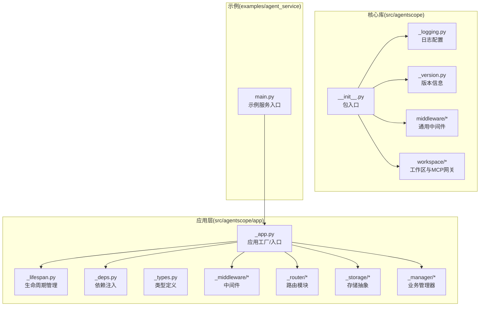
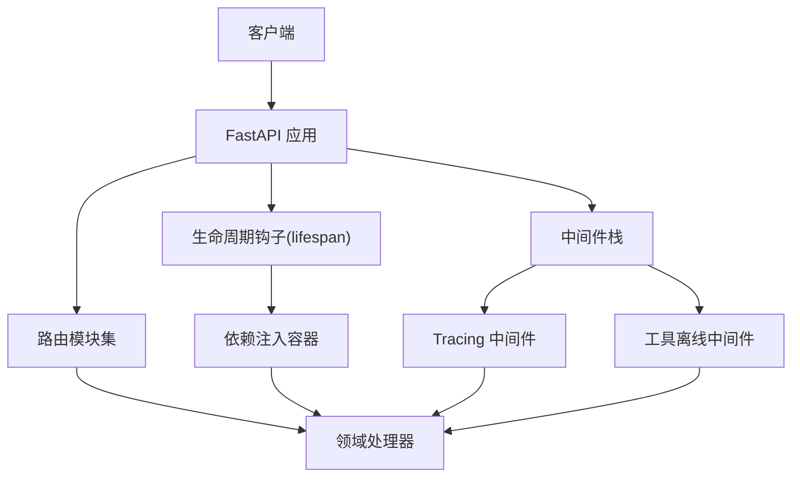
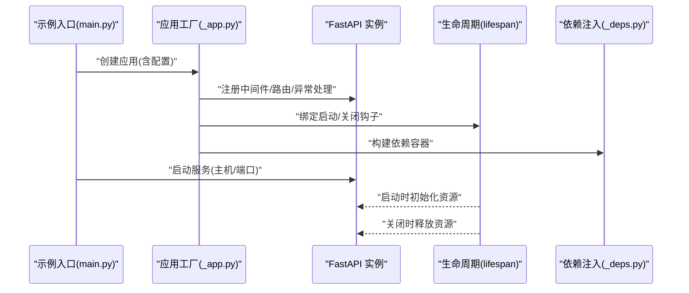
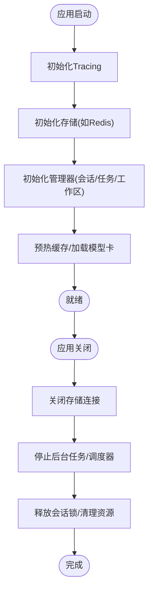
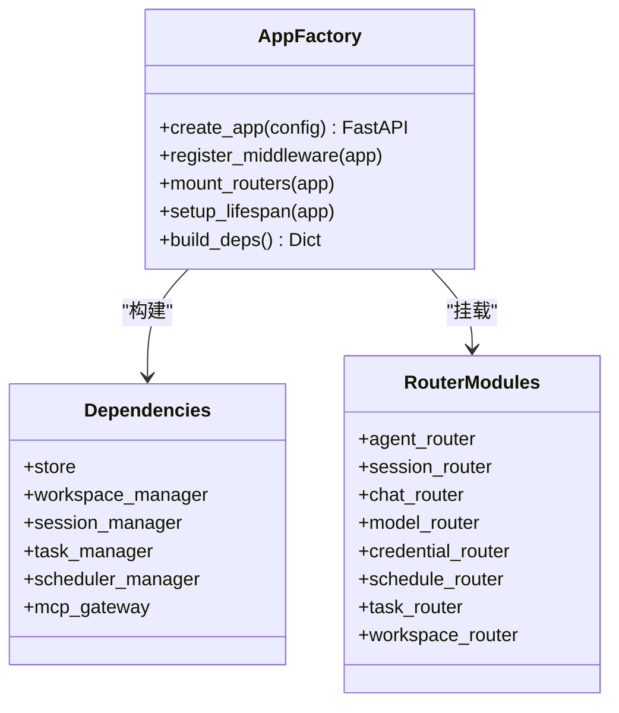
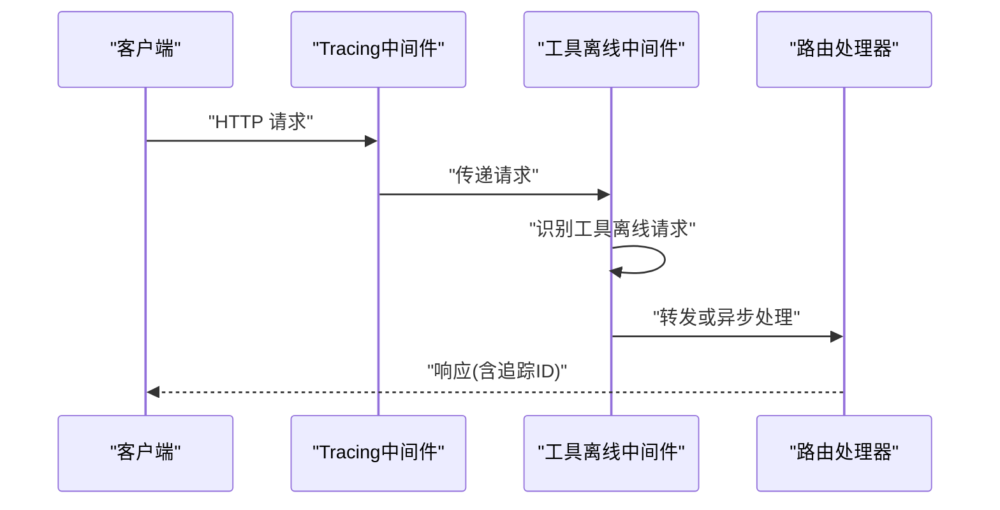
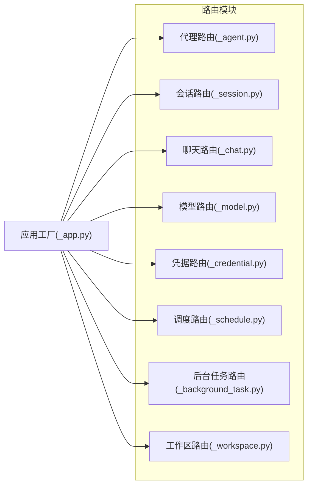
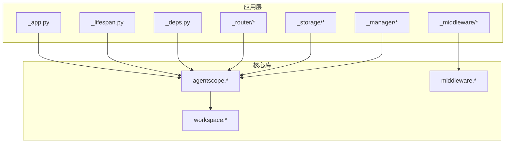

# 应用架构

<cite>
**本文引用的文件**
- [examples/agent_service/main.py](file://examples/agent_service/main.py)
- [src/agentscope/__init__.py](file://src/agentscope/__init__.py)
- [src/agentscope/_version.py](file://src/agentscope/_version.py)
- [src/agentscope/_logging.py](file://src/agentscope/_logging.py)
- [src/agentscope/app/__init__.py](file://src/agentscope/app/__init__.py)
- [src/agentscope/app/_app.py](file://src/agentscope/app/_app.py)
- [src/agentscope/app/_deps.py](file://src/agentscope/app/_deps.py)
- [src/agentscope/app/_lifespan.py](file://src/agentscope/app/_lifespan.py)
- [src/agentscope/app/_types.py](file://src/agentscope/app/_types.py)
- [src/agentscope/app/_middleware/__init__.py](file://src/agentscope/app/_middleware/__init__.py)
- [src/agentscope/app/_middleware/_tool_offload_middleware.py](file://src/agentscope/app/_middleware/_tool_offload_middleware.py)
- [src/agentscope/app/_router/__init__.py](file://src/agentscope/app/_router/__init__.py)
- [src/agentscope/app/_router/_agent.py](file://src/agentscope/app/_router/_agent.py)
- [src/agentscope/app/_router/_background_task.py](file://src/agentscope/app/_router/_background_task.py)
- [src/agentscope/app/_router/_chat.py](file://src/agentscope/app/_router/_chat.py)
- [src/agentscope/app/_router/_credential.py](file://src/agentscope/app/_router/_credential.py)
- [src/agentscope/app/_router/_model.py](file://src/agentscope/app/_router/_model.py)
- [src/agentscope/app/_router/_schedule.py](file://src/agentscope/app/_router/_schedule.py)
- [src/agentscope/app/_router/_session.py](file://src/agentscope/app/_router/_session.py)
- [src/agentscope/app/_router/_workspace.py](file://src/agentscope/app/_router/_workspace.py)
- [src/agentscope/app/storage/__init__.py](file://src/agentscope/app/storage/__init__.py)
- [src/agentscope/app/storage/_base.py](file://src/agentscope/app/storage/_base.py)
- [src/agentscope/app/storage/_redis_storage.py](file://src/agentscope/app/storage/_redis_storage.py)
- [src/agentscope/app/_manager/__init__.py](file://src/agentscope/app/_manager/__init__.py)
- [src/agentscope/app/_manager/_background_task_manager.py](file://src/agentscope/app/_manager/_background_task_manager.py)
- [src/agentscope/app/_manager/_docker_workspace_manager.py](file://src/agentscope/app/_manager/_docker_workspace_manager.py)
- [src/agentscope/app/_manager/_e2b_workspace_manager.py](file://src/agentscope/app/_manager/_e2b_workspace_manager.py)
- [src/agentscope/app/_manager/_session_manager.py](file://src/agentscope/app/_manager/_session_manager.py)
- [src/agentscope/app/_manager/_workspace_manager.py](file://src/agentscope/app/_manager/_workspace_manager.py)
- [src/agentscope/app/_manager/_scheduler/__init__.py](file://src/agentscope/app/_manager/_scheduler/__init__.py)
- [src/agentscope/app/_manager/_scheduler/_scheduler_manager.py](file://src/agentscope/app/_manager/_scheduler/_scheduler_manager.py)
- [src/agentscope/app/_manager/_scheduler/_tools/__init__.py](file://src/agentscope/app/_manager/_scheduler/_tools/__init__.py)
- [src/agentscope/app/_manager/_scheduler/_tools/_schedule_create.py](file://src/agentscope/app/_manager/_scheduler/_tools/_schedule_create.py)
- [src/agentscope/app/_manager/_scheduler/_tools/_schedule_list.py](file://src/agentscope/app/_manager/_scheduler/_tools/_schedule_list.py)
- [src/agentscope/app/_manager/_scheduler/_tools/_schedule_stop.py](file://src/agentscope/app/_manager/_scheduler/_tools/_schedule_stop.py)
- [src/agentscope/app/_manager/_scheduler/_tools/_schedule_view.py](file://src/agentscope/app/_manager/_scheduler/_tools/_schedule_view.py)
- [src/agentscope/middleware/__init__.py](file://src/agentscope/middleware/__init__.py)
- [src/agentscope/middleware/_base.py](file://src/agentscope/middleware/_base.py)
- [src/agentscope/middleware/_tracing/__init__.py](file://src/agentscope/middleware/_tracing/__init__.py)
- [src/agentscope/middleware/_tracing/_setup.py](file://src/agentscope/middleware/_tracing/_setup.py)
- [src/agentscope/middleware/_tracing/_trace.py](file://src/agentscope/middleware/_tracing/_trace.py)
- [src/agentscope/middleware/_tracing/_attributes.py](file://src/agentscope/middleware/_tracing/_attributes.py)
- [src/agentscope/middleware/_tracing/_extractor.py](file://src/agentscope/middleware/_tracing/_extractor.py)
- [src/agentscope/middleware/_tracing/_converter.py](file://src/agentscope/middleware/_tracing/_converter.py)
- [src/agentscope/middleware/_tracing/_utils.py](file://src/agentscope/middleware/_tracing/_utils.py)
- [src/agentscope/workspace/_mcp_gateway/__main__.py](file://src/agentscope/workspace/_mcp_gateway/__main__.py)
- [src/agentscope/workspace/_mcp_gateway/_mcp_gateway_app.py](file://src/agentscope/workspace/_mcp_gateway/_mcp_gateway_app.py)
- [src/agentscope/workspace/_mcp_gateway/Dockerfile.template](file://src/agentscope/workspace/_mcp_gateway/Dockerfile.template)
- [src/agentscope/workspace/_mcp_gateway/Dockerfile.install_pypi.template](file://src/agentscope/workspace/_mcp_gateway/Dockerfile.install_pypi.template)
- [src/agentscope/workspace/_mcp_gateway/Dockerfile.install_src.template](file://src/agentscope/workspace/_mcp_gateway/Dockerfile.install_src.template)
- [src/agentscope/workspace/_mcp_gateway/Dockerfile.node_copy.template](file://src/agentscope/workspace/_mcp_gateway/Dockerfile.node_copy.template)
- [src/agentscope/workspace/_mcp_gateway/Dockerfile.node_from.template](file://src/agentscope/workspace/_mcp_gateway/Dockerfile.node_from.template)
- [pyproject.toml](file://pyproject.toml)
- [README.md](file://README.md)
- [README_zh.md](file://README_zh.md)
</cite>

## 目录
1. [简介](#简介)
2. [项目结构](#项目结构)
3. [核心组件](#核心组件)
4. [架构总览](#架构总览)
5. [详细组件分析](#详细组件分析)
6. [依赖分析](#依赖分析)
7. [性能考虑](#性能考虑)
8. [故障排查指南](#故障排查指南)
9. [结论](#结论)
10. [附录](#附录)

## 简介
本文件面向AgentScope应用架构，聚焦基于FastAPI的应用设计与实现，系统阐述应用工厂模式、生命周期管理、依赖注入机制、启动流程、中间件注册、路由组织与错误处理策略，并给出配置管理、环境变量处理与运行时参数设置方法。文档同时提供架构图与组件关系图，以及部署配置示例与性能优化建议，帮助开发者快速理解并扩展该应用。

## 项目结构
AgentScope采用模块化分层设计：核心库位于src/agentscope，应用层位于src/agentscope/app，示例服务位于examples/agent_service。应用层以FastAPI为核心，通过应用工厂函数创建应用实例，按功能域划分中间件、路由器与存储层，并通过依赖注入在生命周期内管理资源。

**图表来源**
- [src/agentscope/app/_app.py](file://src/agentscope/app/_app.py)
- [src/agentscope/app/_lifespan.py](file://src/agentscope/app/_lifespan.py)
- [src/agentscope/app/_deps.py](file://src/agentscope/app/_deps.py)
- [src/agentscope/app/_router/__init__.py](file://src/agentscope/app/_router/__init__.py)
- [src/agentscope/app/_middleware/__init__.py](file://src/agentscope/app/_middleware/__init__.py)
- [src/agentscope/app/storage/__init__.py](file://src/agentscope/app/storage/__init__.py)
- [src/agentscope/app/_manager/__init__.py](file://src/agentscope/app/_manager/__init__.py)
- [src/agentscope/__init__.py](file://src/agentscope/__init__.py)
- [src/agentscope/_logging.py](file://src/agentscope/_logging.py)
- [src/agentscope/_version.py](file://src/agentscope/_version.py)
- [src/agentscope/middleware/__init__.py](file://src/agentscope/middleware/__init__.py)
- [examples/agent_service/main.py](file://examples/agent_service/main.py)

**章节来源**
- [src/agentscope/app/_app.py](file://src/agentscope/app/_app.py)
- [src/agentscope/app/_lifespan.py](file://src/agentscope/app/_lifespan.py)
- [src/agentscope/app/_deps.py](file://src/agentscope/app/_deps.py)
- [src/agentscope/app/_router/__init__.py](file://src/agentscope/app/_router/__init__.py)
- [src/agentscope/app/_middleware/__init__.py](file://src/agentscope/app/_middleware/__init__.py)
- [src/agentscope/app/storage/__init__.py](file://src/agentscope/app/storage/__init__.py)
- [src/agentscope/app/_manager/__init__.py](file://src/agentscope/app/_manager/__init__.py)
- [src/agentscope/__init__.py](file://src/agentscope/__init__.py)
- [src/agentscope/_logging.py](file://src/agentscope/_logging.py)
- [src/agentscope/_version.py](file://src/agentscope/_version.py)
- [src/agentscope/middleware/__init__.py](file://src/agentscope/middleware/__init__.py)
- [examples/agent_service/main.py](file://examples/agent_service/main.py)

## 核心组件
- 应用工厂与入口
  - 应用工厂函数负责创建FastAPI实例、注册中间件、挂载路由、配置生命周期钩子与依赖注入容器。
  - 示例入口通过调用工厂函数启动服务，支持命令行参数与环境变量驱动的配置覆盖。
- 生命周期管理
  - 使用FastAPI lifespan钩子在应用启动前初始化资源（如数据库连接、缓存、外部服务客户端），在关闭时释放资源，确保资源安全回收。
- 依赖注入
  - 在应用启动阶段解析全局依赖（如存储后端、工作区管理器、会话管理器等），并通过依赖函数在路由处理器中按需注入，降低耦合度。
- 中间件体系
  - 提供工具离线执行中间件与通用Tracing中间件，用于增强请求处理能力与可观测性。
- 路由组织
  - 按领域拆分路由模块（代理、会话、聊天、模型、凭据、调度、后台任务、工作区），每个模块独立定义路径前缀与处理器，便于维护与扩展。
- 存储抽象
  - 定义统一存储接口与Redis实现，屏蔽底层差异，支持多后端切换。
- 业务管理器
  - 管理会话、后台任务、工作区与调度等业务实体，封装复杂状态与并发控制逻辑。

**章节来源**
- [src/agentscope/app/_app.py](file://src/agentscope/app/_app.py)
- [src/agentscope/app/_lifespan.py](file://src/agentscope/app/_lifespan.py)
- [src/agentscope/app/_deps.py](file://src/agentscope/app/_deps.py)
- [src/agentscope/app/_middleware/_tool_offload_middleware.py](file://src/agentscope/app/_middleware/_tool_offload_middleware.py)
- [src/agentscope/middleware/_tracing/_setup.py](file://src/agentscope/middleware/_tracing/_setup.py)
- [src/agentscope/app/_router/_agent.py](file://src/agentscope/app/_router/_agent.py)
- [src/agentscope/app/_router/_session.py](file://src/agentscope/app/_router/_session.py)
- [src/agentscope/app/_router/_chat.py](file://src/agentscope/app/_router/_chat.py)
- [src/agentscope/app/_router/_model.py](file://src/agentscope/app/_router/_model.py)
- [src/agentscope/app/_router/_credential.py](file://src/agentscope/app/_router/_credential.py)
- [src/agentscope/app/_router/_schedule.py](file://src/agentscope/app/_router/_schedule.py)
- [src/agentscope/app/_router/_background_task.py](file://src/agentscope/app/_router/_background_task.py)
- [src/agentscope/app/_router/_workspace.py](file://src/agentscope/app/_router/_workspace.py)
- [src/agentscope/app/storage/_base.py](file://src/agentscope/app/storage/_base.py)
- [src/agentscope/app/storage/_redis_storage.py](file://src/agentscope/app/storage/_redis_storage.py)
- [src/agentscope/app/_manager/_session_manager.py](file://src/agentscope/app/_manager/_session_manager.py)
- [src/agentscope/app/_manager/_background_task_manager.py](file://src/agentscope/app/_manager/_background_task_manager.py)
- [src/agentscope/app/_manager/_workspace_manager.py](file://src/agentscope/app/_manager/_workspace_manager.py)
- [src/agentscope/app/_manager/_scheduler/_scheduler_manager.py](file://src/agentscope/app/_manager/_scheduler/_scheduler_manager.py)

## 架构总览
下图展示应用启动到请求处理的关键交互：示例入口调用应用工厂，工厂注册中间件与路由，lifespan初始化依赖，随后进入请求生命周期；Tracing中间件与工具离线中间件贯穿请求链路，路由模块根据路径前缀分发至对应处理器。

**图表来源**
- [examples/agent_service/main.py](file://examples/agent_service/main.py)
- [src/agentscope/app/_app.py](file://src/agentscope/app/_app.py)
- [src/agentscope/app/_lifespan.py](file://src/agentscope/app/_lifespan.py)
- [src/agentscope/app/_deps.py](file://src/agentscope/app/_deps.py)
- [src/agentscope/app/_middleware/_tool_offload_middleware.py](file://src/agentscope/app/_middleware/_tool_offload_middleware.py)
- [src/agentscope/middleware/_tracing/_setup.py](file://src/agentscope/middleware/_tracing/_setup.py)
- [src/agentscope/app/_router/__init__.py](file://src/agentscope/app/_router/__init__.py)

## 详细组件分析

### 应用工厂与启动流程
- 工厂职责
  - 创建FastAPI实例，设置标题、版本、文档路径等元数据。
  - 注册中间件（Tracing、工具离线）与异常处理器。
  - 挂载各领域路由模块，统一前缀与标签。
  - 配置lifespan钩子，集中初始化/清理资源。
  - 构建依赖注入容器，暴露全局依赖供路由使用。
- 启动入口
  - 示例入口通过命令行参数或环境变量决定监听地址、端口与调试模式，随后调用工厂函数创建应用并启动。

**图表来源**
- [examples/agent_service/main.py](file://examples/agent_service/main.py)
- [src/agentscope/app/_app.py](file://src/agentscope/app/_app.py)
- [src/agentscope/app/_lifespan.py](file://src/agentscope/app/_lifespan.py)
- [src/agentscope/app/_deps.py](file://src/agentscope/app/_deps.py)

**章节来源**
- [examples/agent_service/main.py](file://examples/agent_service/main.py)
- [src/agentscope/app/_app.py](file://src/agentscope/app/_app.py)
- [src/agentscope/app/_lifespan.py](file://src/agentscope/app/_lifespan.py)
- [src/agentscope/app/_deps.py](file://src/agentscope/app/_deps.py)

### 生命周期管理
- 启动阶段
  - 初始化Tracing配置与追踪器。
  - 建立存储连接（如Redis）、工作区管理器、会话与后台任务管理器。
  - 预热缓存、加载模型卡信息、准备MCP网关。
- 关闭阶段
  - 有序关闭存储连接、释放会话锁、停止后台任务与调度器。
  - 记录应用退出事件，确保无资源泄漏。

**图表来源**
- [src/agentscope/app/_lifespan.py](file://src/agentscope/app/_lifespan.py)
- [src/agentscope/app/storage/_redis_storage.py](file://src/agentscope/app/storage/_redis_storage.py)
- [src/agentscope/app/_manager/_session_manager.py](file://src/agentscope/app/_manager/_session_manager.py)
- [src/agentscope/app/_manager/_background_task_manager.py](file://src/agentscope/app/_manager/_background_task_manager.py)
- [src/agentscope/app/_manager/_scheduler/_scheduler_manager.py](file://src/agentscope/app/_manager/_scheduler/_scheduler_manager.py)

**章节来源**
- [src/agentscope/app/_lifespan.py](file://src/agentscope/app/_lifespan.py)
- [src/agentscope/app/storage/_redis_storage.py](file://src/agentscope/app/storage/_redis_storage.py)
- [src/agentscope/app/_manager/_session_manager.py](file://src/agentscope/app/_manager/_session_manager.py)
- [src/agentscope/app/_manager/_background_task_manager.py](file://src/agentscope/app/_manager/_background_task_manager.py)
- [src/agentscope/app/_manager/_scheduler/_scheduler_manager.py](file://src/agentscope/app/_manager/_scheduler/_scheduler_manager.py)

### 依赖注入机制
- 全局依赖
  - 存储后端、工作区管理器、会话管理器、后台任务管理器、调度器、MCP网关等。
- 注入方式
  - 在应用启动时解析并缓存依赖实例，通过依赖函数在路由处理器中按需注入，避免全局状态污染。
- 作用
  - 降低模块间耦合，提升可测试性与可替换性。

**图表来源**
- [src/agentscope/app/_app.py](file://src/agentscope/app/_app.py)
- [src/agentscope/app/_deps.py](file://src/agentscope/app/_deps.py)
- [src/agentscope/app/_router/__init__.py](file://src/agentscope/app/_router/__init__.py)

**章节来源**
- [src/agentscope/app/_deps.py](file://src/agentscope/app/_deps.py)
- [src/agentscope/app/_app.py](file://src/agentscope/app/_app.py)
- [src/agentscope/app/_router/__init__.py](file://src/agentscope/app/_router/__init__.py)

### 中间件注册与链路
- Tracing中间件
  - 从请求中提取上下文属性，生成/传播追踪ID，记录处理耗时与状态码，便于问题定位。
- 工具离线中间件
  - 将高开销工具调用重定向至后台任务或专用执行器，减少请求阻塞，提升吞吐。
- 中间件顺序
  - Tracing置于上游，确保完整链路追踪；工具离线中间件在路由前拦截特定工具请求。

**图表来源**
- [src/agentscope/middleware/_tracing/_setup.py](file://src/agentscope/middleware/_tracing/_setup.py)
- [src/agentscope/middleware/_tracing/_trace.py](file://src/agentscope/middleware/_tracing/_trace.py)
- [src/agentscope/app/_middleware/_tool_offload_middleware.py](file://src/agentscope/app/_middleware/_tool_offload_middleware.py)
- [src/agentscope/app/_router/_agent.py](file://src/agentscope/app/_router/_agent.py)

**章节来源**
- [src/agentscope/middleware/_tracing/_setup.py](file://src/agentscope/middleware/_tracing/_setup.py)
- [src/agentscope/middleware/_tracing/_trace.py](file://src/agentscope/middleware/_tracing/_trace.py)
- [src/agentscope/app/_middleware/_tool_offload_middleware.py](file://src/agentscope/app/_middleware/_tool_offload_middleware.py)
- [src/agentscope/app/_router/_agent.py](file://src/agentscope/app/_router/_agent.py)

### 路由组织与领域划分
- 路由模块
  - 代理、会话、聊天、模型、凭据、调度、后台任务、工作区等，每个模块独立定义路径前缀与处理器。
- 统一规范
  - 所有路由模块在应用工厂中统一挂载，保证前缀一致与文档聚合。
- 处理器职责
  - 负责参数校验、权限检查、调用业务管理器与存储层，返回标准化响应。

**图表来源**
- [src/agentscope/app/_router/_agent.py](file://src/agentscope/app/_router/_agent.py)
- [src/agentscope/app/_router/_session.py](file://src/agentscope/app/_router/_session.py)
- [src/agentscope/app/_router/_chat.py](file://src/agentscope/app/_router/_chat.py)
- [src/agentscope/app/_router/_model.py](file://src/agentscope/app/_router/_model.py)
- [src/agentscope/app/_router/_credential.py](file://src/agentscope/app/_router/_credential.py)
- [src/agentscope/app/_router/_schedule.py](file://src/agentscope/app/_router/_schedule.py)
- [src/agentscope/app/_router/_background_task.py](file://src/agentscope/app/_router/_background_task.py)
- [src/agentscope/app/_router/_workspace.py](file://src/agentscope/app/_router/_workspace.py)
- [src/agentscope/app/_app.py](file://src/agentscope/app/_app.py)

**章节来源**
- [src/agentscope/app/_router/_agent.py](file://src/agentscope/app/_router/_agent.py)
- [src/agentscope/app/_router/_session.py](file://src/agentscope/app/_router/_session.py)
- [src/agentscope/app/_router/_chat.py](file://src/agentscope/app/_router/_chat.py)
- [src/agentscope/app/_router/_model.py](file://src/agentscope/app/_router/_model.py)
- [src/agentscope/app/_router/_credential.py](file://src/agentscope/app/_router/_credential.py)
- [src/agentscope/app/_router/_schedule.py](file://src/agentscope/app/_router/_schedule.py)
- [src/agentscope/app/_router/_background_task.py](file://src/agentscope/app/_router/_background_task.py)
- [src/agentscope/app/_router/_workspace.py](file://src/agentscope/app/_router/_workspace.py)
- [src/agentscope/app/_app.py](file://src/agentscope/app/_app.py)

### 错误处理策略
- 异常分类
  - 业务异常：参数校验失败、权限不足、资源不存在等。
  - 运行时异常：网络超时、存储不可用、外部服务错误等。
- 处理机制
  - 在应用工厂中注册全局异常处理器，捕获未处理异常并返回统一格式的错误响应。
  - Tracing中间件记录异常上下文，便于定位问题。
- 最佳实践
  - 区分客户端错误与服务器错误，设置合适的HTTP状态码。
  - 对敏感信息进行脱敏，避免泄露内部细节。

**章节来源**
- [src/agentscope/app/_app.py](file://src/agentscope/app/_app.py)
- [src/agentscope/middleware/_tracing/_setup.py](file://src/agentscope/middleware/_tracing/_setup.py)

### 配置管理、环境变量与运行时参数
- 配置来源
  - 默认配置文件、命令行参数、环境变量与运行时参数合并，形成最终配置。
- 环境变量
  - 支持监听地址、端口、调试模式、存储连接字符串、Tracing采样率等关键参数。
- 运行时参数
  - 通过示例入口传入，优先级高于默认值，便于容器化与云平台部署。
- 版本与日志
  - 版本信息在包入口导出，日志配置在应用启动时初始化，确保可观测性。

**章节来源**
- [examples/agent_service/main.py](file://examples/agent_service/main.py)
- [src/agentscope/__init__.py](file://src/agentscope/__init__.py)
- [src/agentscope/_version.py](file://src/agentscope/_version.py)
- [src/agentscope/_logging.py](file://src/agentscope/_logging.py)

## 依赖分析
应用层与核心库之间存在清晰的依赖边界：应用层依赖核心库提供的中间件、工作区与MCP网关能力；核心库不直接依赖应用层，保持低耦合与高内聚。

**图表来源**
- [src/agentscope/app/_app.py](file://src/agentscope/app/_app.py)
- [src/agentscope/app/_lifespan.py](file://src/agentscope/app/_lifespan.py)
- [src/agentscope/app/_deps.py](file://src/agentscope/app/_deps.py)
- [src/agentscope/middleware/__init__.py](file://src/agentscope/middleware/__init__.py)
- [src/agentscope/workspace/_mcp_gateway/__main__.py](file://src/agentscope/workspace/_mcp_gateway/__main__.py)

**章节来源**
- [src/agentscope/app/_app.py](file://src/agentscope/app/_app.py)
- [src/agentscope/middleware/__init__.py](file://src/agentscope/middleware/__init__.py)
- [src/agentscope/workspace/_mcp_gateway/__main__.py](file://src/agentscope/workspace/_mcp_gateway/__main__.py)

## 性能考虑
- 并发与限流
  - 在Tracing中间件中启用采样策略，避免高流量场景下的追踪开销过大。
  - 对高频路由（如模型推理）实施速率限制与队列缓冲，防止下游过载。
- 缓存与预热
  - 利用Redis缓存常用模型卡与会话状态，启动时预热热点数据。
- 异步与离线
  - 工具离线中间件将CPU密集型或长耗时操作转为后台任务，缩短请求延迟。
- 存储优化
  - 使用连接池与批量写入，减少存储往返次数；对只读数据采用只读副本。
- 监控与告警
  - 结合Tracing指标（P95/P99延迟、错误率）建立告警阈值，及时发现性能瓶颈。

## 故障排查指南
- 启动失败
  - 检查环境变量与配置文件是否正确；查看日志初始化是否成功。
- 路由异常
  - 确认路由前缀与处理器映射；检查Tracing是否正常生成追踪ID。
- 存储问题
  - 核对存储连接字符串与网络连通性；确认Redis可用性与键空间。
- 工作区与MCP
  - 检查工作区管理器初始化状态与Docker/E2B环境；验证MCP网关进程健康。
- 后台任务
  - 查看任务队列积压与失败重试次数；核对调度器状态。

**章节来源**
- [src/agentscope/app/_lifespan.py](file://src/agentscope/app/_lifespan.py)
- [src/agentscope/app/storage/_redis_storage.py](file://src/agentscope/app/storage/_redis_storage.py)
- [src/agentscope/app/_manager/_scheduler/_scheduler_manager.py](file://src/agentscope/app/_manager/_scheduler/_scheduler_manager.py)
- [src/agentscope/workspace/_mcp_gateway/__main__.py](file://src/agentscope/workspace/_mcp_gateway/__main__.py)

## 结论
AgentScope应用以FastAPI为基础，采用工厂模式、生命周期管理与依赖注入，实现了高内聚、低耦合的模块化架构。通过中间件链路增强可观测性与吞吐能力，路由按领域拆分便于维护与扩展。结合配置管理与性能优化策略，可在生产环境中稳定运行并持续演进。

## 附录
- 部署配置示例（环境变量）
  - 服务监听：HOST=0.0.0.0, PORT=8000
  - 调试模式：DEBUG=false
  - 存储连接：REDIS_URL=redis://localhost:6379/0
  - Tracing采样：TRACE_SAMPLE_RATIO=0.1
  - MCP网关：MCP_GATEWAY_PORT=8001
- Docker镜像模板
  - 提供安装PyPI与源码两种模板，支持Node复制与基础镜像选择，便于构建MCP网关与工作区容器。

**章节来源**
- [src/agentscope/workspace/_mcp_gateway/Dockerfile.template](file://src/agentscope/workspace/_mcp_gateway/Dockerfile.template)
- [src/agentscope/workspace/_mcp_gateway/Dockerfile.install_pypi.template](file://src/agentscope/workspace/_mcp_gateway/Dockerfile.install_pypi.template)
- [src/agentscope/workspace/_mcp_gateway/Dockerfile.install_src.template](file://src/agentscope/workspace/_mcp_gateway/Dockerfile.install_src.template)
- [src/agentscope/workspace/_mcp_gateway/Dockerfile.node_copy.template](file://src/agentscope/workspace/_mcp_gateway/Dockerfile.node_copy.template)
- [src/agentscope/workspace/_mcp_gateway/Dockerfile.node_from.template](file://src/agentscope/workspace/_mcp_gateway/Dockerfile.node_from.template)