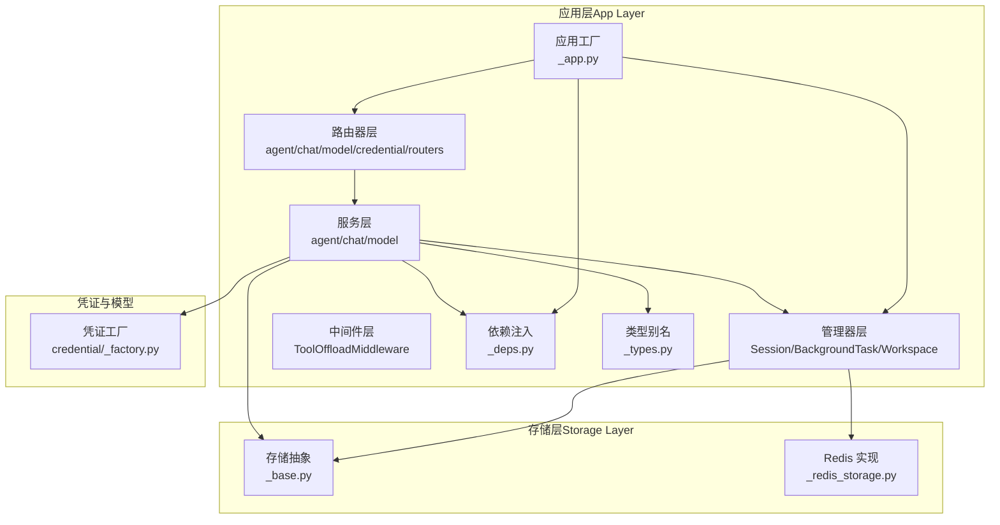
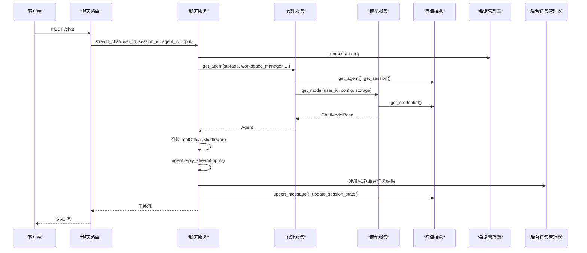
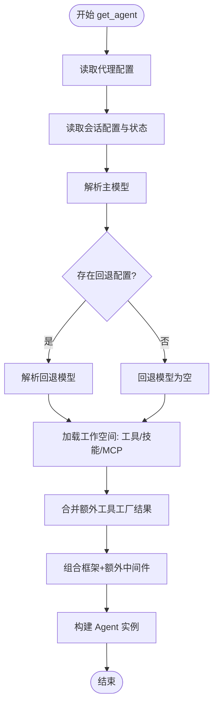
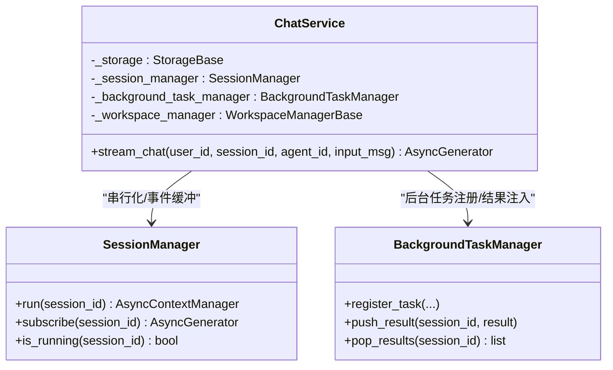
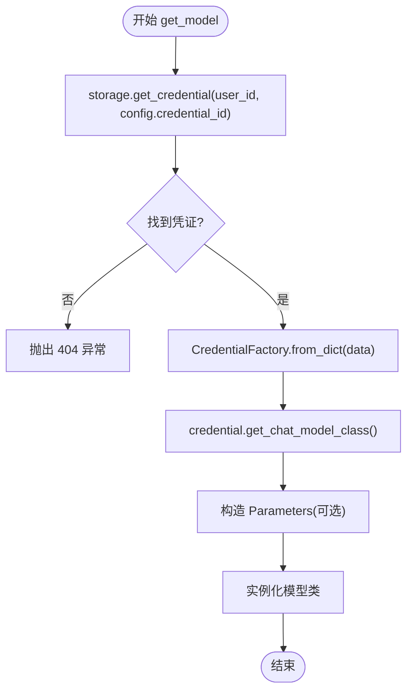
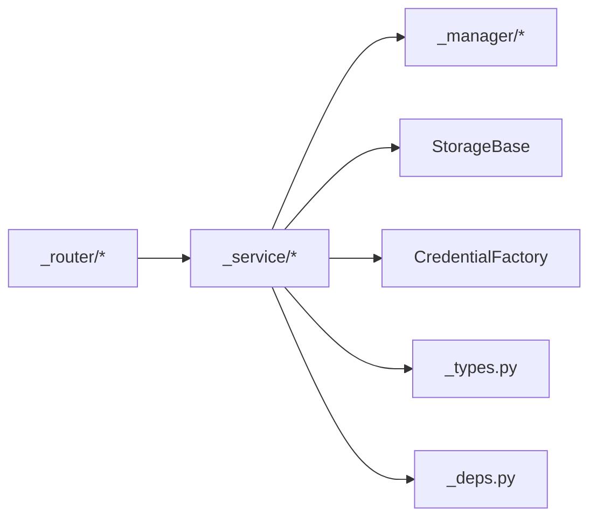

# 服务层设计

<cite>
**本文引用的文件**
- [服务层入口](file://src/agentscope/app/_service/__init__.py)
- [代理服务](file://src/agentscope/app/_service/_agent.py)
- [聊天服务](file://src/agentscope/app/_service/_chat.py)
- [模型服务](file://src/agentscope/app/_service/_model.py)
- [应用工厂](file://src/agentscope/app/_app.py)
- [依赖注入](file://src/agentscope/app/_deps.py)
- [类型别名](file://src/agentscope/app/_types.py)
- [会话管理器](file://src/agentscope/app/_manager/_session_manager.py)
- [后台任务管理器](file://src/agentscope/app/_manager/_background_task_manager.py)
- [工具卸载中间件](file://src/agentscope/app/_middleware/_tool_offload_middleware.py)
- [代理路由](file://src/agentscope/app/_router/_agent.py)
- [聊天路由](file://src/agentscope/app/_router/_chat.py)
- [模型路由](file://src/agentscope/app/_router/_model.py)
- [凭证路由](file://src/agentscope/app/_router/_credential.py)
- [存储抽象](file://src/agentscope/app/storage/_base.py)
- [Redis 存储实现](file://src/agentscope/app/storage/_redis_storage.py)
- [凭证工厂](file://src/agentscope/credential/_factory.py)
</cite>

## 目录
1. [简介](#简介)
2. [项目结构](#项目结构)
3. [核心组件](#核心组件)
4. [架构总览](#架构总览)
5. [详细组件分析](#详细组件分析)
6. [依赖分析](#依赖分析)
7. [性能考虑](#性能考虑)
8. [故障排查指南](#故障排查指南)
9. [结论](#结论)
10. [附录](#附录)

## 简介
本文件面向 AgentScope 的服务层设计，系统化阐述其分层架构与职责分离：代理服务、聊天服务、模型服务与凭证服务。文档覆盖服务接口定义、业务逻辑封装、数据访问模式、服务间通信机制、事务处理与异常管理，并提供 UML 类图与调用关系图、扩展指南与最佳实践，以及配置选项与性能调优建议。

## 项目结构
服务层位于应用层（app）内部，围绕“服务层”“管理器层（Manager）”“中间件层（Middleware）”“路由器层（Router）”“存储层（Storage）”构建，形成清晰的职责边界与依赖方向。

图表来源
- [应用工厂:29-130](file://src/agentscope/app/_app.py#L29-L130)
- [服务层入口:1-8](file://src/agentscope/app/_service/__init__.py#L1-L8)
- [存储抽象:21-426](file://src/agentscope/app/storage/_base.py#L21-L426)
- [Redis 存储实现:58-800](file://src/agentscope/app/storage/_redis_storage.py#L58-L800)
- [凭证工厂:18-115](file://src/agentscope/credential/_factory.py#L18-L115)

章节来源
- [应用工厂:29-130](file://src/agentscope/app/_app.py#L29-L130)
- [服务层入口:1-8](file://src/agentscope/app/_service/__init__.py#L1-L8)

## 核心组件
- 代理服务（Agent Service）
  - 职责：从存储加载代理配置与会话状态，解析聊天模型，构建工作空间（工具/技能/MCP），装配中间件与额外工具，返回可执行的 Agent 实例。
  - 关键点：模型回退配置、会话状态注入、工作空间聚合、工厂式中间件与工具注入。
- 聊天服务（Chat Service）
  - 职责：统一的聊天执行入口，负责消息持久化、事件流式输出、会话串行化、状态更新与后台任务结果注入。
  - 关键点：ToolOffloadMiddleware 集成、SessionManager 串行化、消息追加/覆盖策略、事件缓冲与重放。
- 模型服务（Model Service）
  - 职责：根据 ChatModelConfig 与存储中的凭证，动态构建 ChatModelBase 实例。
  - 关键点：凭证反序列化、参数校验、模型类选择。
- 凭证服务（Credential Service）
  - 职责：提供凭证 CRUD、Schema 列表、模型列表查询等能力。
  - 关键点：CredentialFactory 动态分发、前端表单 Schema、模型清单。

章节来源
- [代理服务:14-153](file://src/agentscope/app/_service/_agent.py#L14-L153)
- [聊天服务:30-239](file://src/agentscope/app/_service/_chat.py#L30-L239)
- [模型服务:10-51](file://src/agentscope/app/_service/_model.py#L10-L51)
- [凭证路由:23-165](file://src/agentscope/app/_router/_credential.py#L23-L165)
- [模型路由:16-41](file://src/agentscope/app/_router/_model.py#L16-L41)

## 架构总览
服务层通过依赖注入与工厂模式解耦外部组件，统一由应用工厂集中装配。聊天请求经路由进入聊天服务，后者在会话管理器的串行化上下文中运行代理回复，期间通过工具卸载中间件处理长耗时工具，后台任务管理器负责结果收集与注入；代理服务负责组装 Agent 并与工作空间交互；模型服务与凭证服务分别负责模型实例化与凭证/模型清单管理；存储层以抽象接口屏蔽具体实现。

图表来源
- [聊天路由:34-131](file://src/agentscope/app/_router/_chat.py#L34-L131)
- [聊天服务:76-239](file://src/agentscope/app/_service/_chat.py#L76-L239)
- [代理服务:14-153](file://src/agentscope/app/_service/_agent.py#L14-L153)
- [模型服务:10-51](file://src/agentscope/app/_service/_model.py#L10-L51)
- [会话管理器:83-113](file://src/agentscope/app/_manager/_session_manager.py#L83-L113)
- [后台任务管理器:214-303](file://src/agentscope/app/_manager/_background_task_manager.py#L214-L303)
- [存储抽象:108-222](file://src/agentscope/app/storage/_base.py#L108-L222)

## 详细组件分析

### 代理服务（Agent Service）
- 输入：StorageBase、WorkspaceManagerBase、用户ID、代理ID、会话ID、可选中间件工厂与工具工厂
- 输出：装配完成的 Agent 实例
- 关键流程
  - 加载代理配置与会话记录
  - 解析主模型与可选回退模型
  - 从工作空间列出工具/技能/MCP，并合并额外工具
  - 组装 Agent（含中间件、工具包、上下文/反应配置、回退模型）

图表来源
- [代理服务:65-153](file://src/agentscope/app/_service/_agent.py#L65-L153)

章节来源
- [代理服务:14-153](file://src/agentscope/app/_service/_agent.py#L14-L153)

### 聊天服务（Chat Service）
- 职责：统一聊天执行路径，保证相同的消息持久化、事件流与状态处理
- 关键点
  - ToolOffloadMiddleware：超时后将工具执行转后台，返回占位响应并在下次推理前注入结果
  - SessionManager：同一会话串行化，事件缓冲与订阅重放
  - 消息持久化：新输入追加或同 reply_id 合并覆盖
  - 会话状态更新：每次聊天回合结束后写回

图表来源
- [聊天服务:30-239](file://src/agentscope/app/_service/_chat.py#L30-L239)
- [会话管理器:49-198](file://src/agentscope/app/_manager/_session_manager.py#L49-L198)
- [后台任务管理器:151-335](file://src/agentscope/app/_manager/_background_task_manager.py#L151-L335)

章节来源
- [聊天服务:30-239](file://src/agentscope/app/_service/_chat.py#L30-L239)
- [会话管理器:49-198](file://src/agentscope/app/_manager/_session_manager.py#L49-L198)
- [后台任务管理器:151-335](file://src/agentscope/app/_manager/_background_task_manager.py#L151-L335)

### 模型服务（Model Service）
- 输入：用户ID、ChatModelConfig、StorageBase
- 输出：ChatModelBase 实例
- 关键点：从存储读取凭证记录，反序列化为具体凭证类型，选择对应模型类并构造实例

图表来源
- [模型服务:29-51](file://src/agentscope/app/_service/_model.py#L29-L51)

章节来源
- [模型服务:10-51](file://src/agentscope/app/_service/_model.py#L10-L51)
- [凭证工厂:72-115](file://src/agentscope/credential/_factory.py#L72-L115)

### 凭证服务（Credential Service）
- 路由能力：凭证 CRUD、Schema 列表、模型清单查询
- 关键点：使用 CredentialFactory 动态分发到具体凭证类型，支持前端表单 Schema 与模型清单

章节来源
- [凭证路由:23-165](file://src/agentscope/app/_router/_credential.py#L23-L165)
- [模型路由:16-41](file://src/agentscope/app/_router/_model.py#L16-L41)
- [凭证工厂:18-115](file://src/agentscope/credential/_factory.py#L18-L115)

### 数据访问模式（StorageBase）
- 抽象接口：凭证/代理/会话/计划/消息的增删改查与分页
- Redis 实现：基于键模板与集合/列表/过期策略的高性能实现，支持滑动 TTL 与级联删除

章节来源
- [存储抽象:21-426](file://src/agentscope/app/storage/_base.py#L21-L426)
- [Redis 存储实现:58-800](file://src/agentscope/app/storage/_redis_storage.py#L58-L800)

## 依赖分析
- 低耦合高内聚
  - 服务层仅依赖抽象接口（StorageBase、WorkspaceManagerBase 等），便于替换实现
  - 中间件与管理器通过依赖注入传入，避免硬编码
- 关键依赖链
  - 路由 → 服务 → 管理器/存储/凭证工厂
  - 服务之间通过共享状态（app.state）与依赖注入协作
- 可能的循环依赖
  - 当前结构未见直接循环；若自定义中间件/管理器引入回调，请确保不形成闭合依赖

图表来源
- [聊天路由:1-131](file://src/agentscope/app/_router/_chat.py#L1-L131)
- [聊天服务:1-239](file://src/agentscope/app/_service/_chat.py#L1-L239)
- [会话管理器:1-198](file://src/agentscope/app/_manager/_session_manager.py#L1-L198)
- [后台任务管理器:1-335](file://src/agentscope/app/_manager/_background_task_manager.py#L1-L335)
- [存储抽象:1-426](file://src/agentscope/app/storage/_base.py#L1-L426)
- [凭证工厂:1-115](file://src/agentscope/credential/_factory.py#L1-L115)
- [类型别名:1-22](file://src/agentscope/app/_types.py#L1-L22)
- [依赖注入:1-143](file://src/agentscope/app/_deps.py#L1-L143)

章节来源
- [聊天路由:1-131](file://src/agentscope/app/_router/_chat.py#L1-L131)
- [聊天服务:1-239](file://src/agentscope/app/_service/_chat.py#L1-L239)
- [会话管理器:1-198](file://src/agentscope/app/_manager/_session_manager.py#L1-L198)
- [后台任务管理器:1-335](file://src/agentscope/app/_manager/_background_task_manager.py#L1-L335)
- [存储抽象:1-426](file://src/agentscope/app/storage/_base.py#L1-L426)
- [凭证工厂:1-115](file://src/agentscope/credential/_factory.py#L1-L115)
- [类型别名:1-22](file://src/agentscope/app/_types.py#L1-L22)
- [依赖注入:1-143](file://src/agentscope/app/_deps.py#L1-L143)

## 性能考虑
- 会话串行化
  - 使用 asyncio.Lock 保证同一会话并发安全，避免竞态；建议合理设置超时与重试策略
- 事件缓冲与订阅
  - SessionManager 缓冲事件并 fan-out 至订阅队列，注意内存占用；可结合 TTL 与清理策略
- 后台任务
  - ToolOffloadMiddleware 将超时工具转后台执行，避免阻塞主线程；建议监控任务数量与失败率
- 存储优化
  - RedisStorage 支持滑动 TTL 与集合索引，建议按用户维度拆分键空间，减少热点
- 模型实例化
  - 复用已构建的模型实例（如按用户/凭证维度缓存），降低初始化开销

## 故障排查指南
- 常见异常与定位
  - 凭证缺失：模型服务在找不到凭证时抛出 404，检查存储中凭证是否存在与归属是否正确
  - 会话不存在：聊天服务在更新状态前需确保会话存在，检查 session_id 与用户绑定
  - 工作空间未配置：依赖注入返回 None 时会触发 503，确认 workspace_manager 初始化
- 日志与可观测性
  - 后台任务注册/取消/完成均有日志，便于追踪任务生命周期
  - ToolOffloadMiddleware 在超时/注入/重触发时记录详细上下文
- 排查步骤
  - 确认路由到服务的输入参数（user_id/session_id/agent_id）
  - 检查存储层键空间与索引是否一致
  - 观察会话管理器是否正确释放锁与队列

章节来源
- [模型服务:33-37](file://src/agentscope/app/_service/_model.py#L33-L37)
- [聊天服务:233-239](file://src/agentscope/app/_service/_chat.py#L233-L239)
- [依赖注入:92-98](file://src/agentscope/app/_deps.py#L92-L98)
- [后台任务管理器:253-303](file://src/agentscope/app/_manager/_background_task_manager.py#L253-L303)
- [工具卸载中间件:291-407](file://src/agentscope/app/_middleware/_tool_offload_middleware.py#L291-L407)

## 结论
服务层通过清晰的分层与职责分离，实现了代理装配、聊天执行、模型实例化与凭证管理的模块化与可扩展性。配合会话串行化、事件缓冲、后台任务与存储抽象，整体具备良好的并发控制、可观测性与性能弹性。建议在生产环境关注会话锁粒度、后台任务治理与存储键空间规划。

## 附录

### 服务扩展指南
- 扩展代理中间件
  - 定义异步工厂函数，返回 MiddlewareBase 列表；在应用工厂中注入 extra_agent_middlewares
- 扩展代理工具
  - 定义异步工厂函数，返回 ToolBase 列表；在应用工厂中注入 extra_agent_tools
- 自定义凭证类型
  - 新建 CredentialBase 子类并注册到 CredentialFactory；前端 Schema 将自动可用
- 自定义存储实现
  - 实现 StorageBase 抽象方法；在应用工厂中注入自定义实现

章节来源
- [应用工厂:56-90](file://src/agentscope/app/_app.py#L56-L90)
- [类型别名:9-22](file://src/agentscope/app/_types.py#L9-L22)
- [凭证工厂:58-70](file://src/agentscope/credential/_factory.py#L58-L70)

### 最佳实践
- 明确职责边界：服务层只做编排与协调，不做重计算
- 严格异常处理：对 404/503 等场景明确返回码与错误信息
- 事件驱动：优先使用 SSE 事件流，减少轮询与状态膨胀
- 任务治理：对后台任务进行限流、告警与回收
- 配置即代码：通过 app.state 注入可插拔组件，保持启动配置简洁

### 配置选项与性能调优
- 应用级配置
  - extra_credentials：启动前注册自定义凭证类型
  - extra_middlewares：附加 ASGI 中间件（如鉴权/审计）
  - extra_agent_middlewares/tools：按用户/会话动态注入中间件与工具
- 运行时参数
  - ToolOffloadMiddleware.timeout_secs：工具超时阈值
  - SessionManager/BackgroundTaskManager 生命周期：在应用关闭时清理资源
- 存储层调优
  - RedisStorage.key_ttl：记录滑动过期时间
  - 键模板与索引：按用户/代理维度拆分，避免热键

章节来源
- [应用工厂:56-90](file://src/agentscope/app/_app.py#L56-L90)
- [工具卸载中间件:68-101](file://src/agentscope/app/_middleware/_tool_offload_middleware.py#L68-L101)
- [会话管理器:190-198](file://src/agentscope/app/_manager/_session_manager.py#L190-L198)
- [后台任务管理器:314-335](file://src/agentscope/app/_manager/_background_task_manager.py#L314-L335)
- [Redis 存储实现:61-106](file://src/agentscope/app/storage/_redis_storage.py#L61-L106)