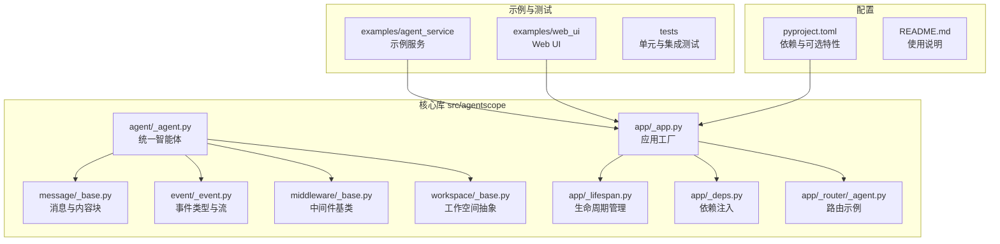
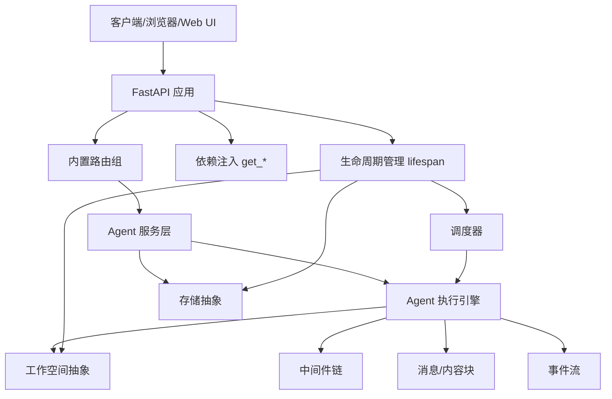
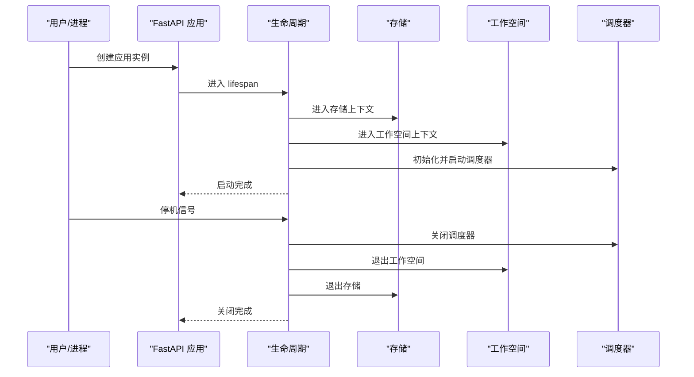
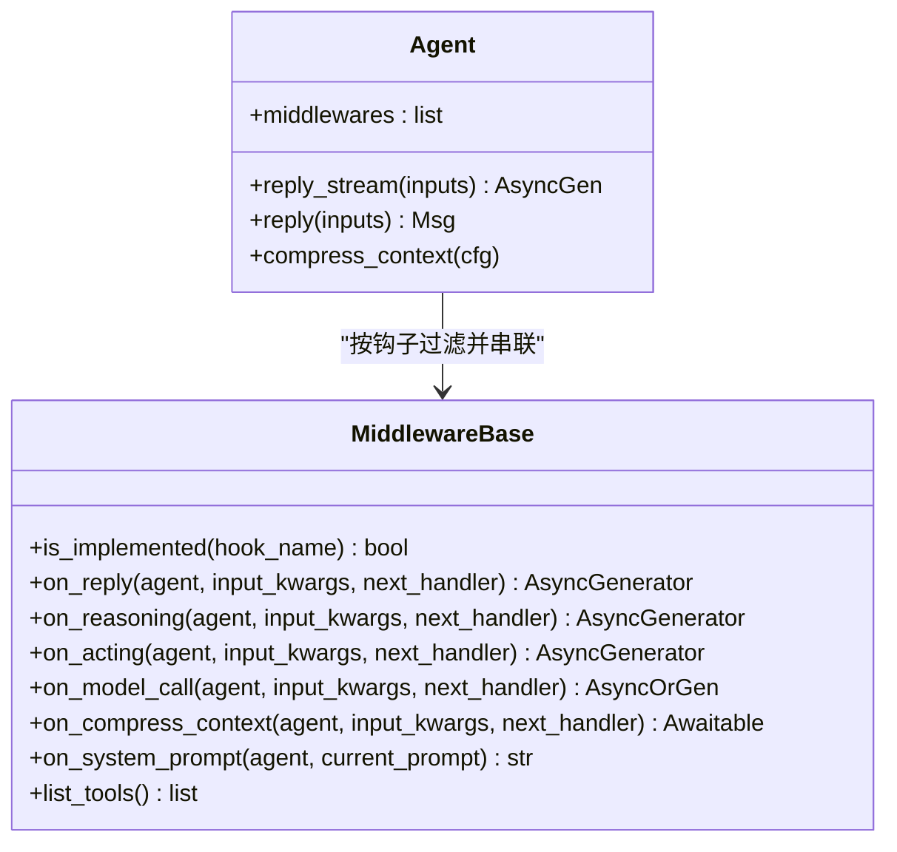
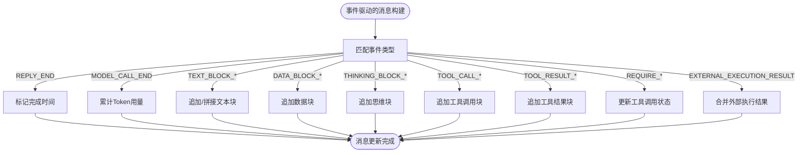
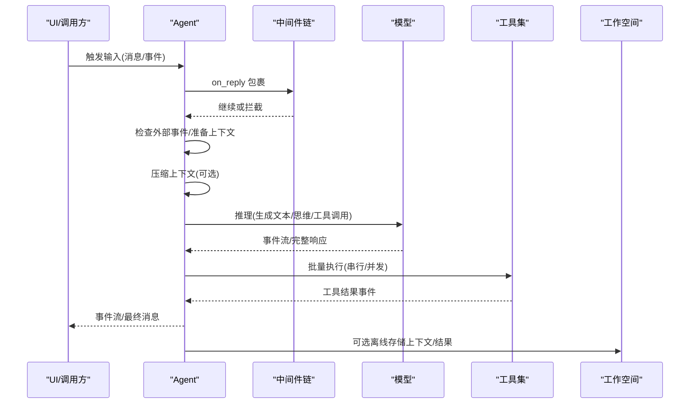
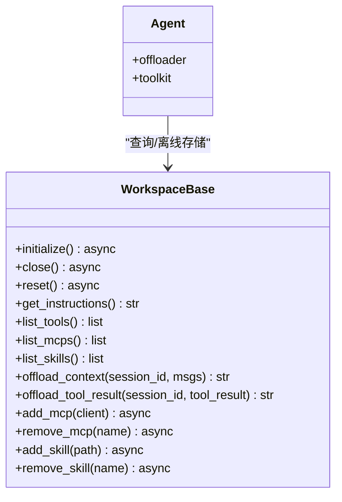
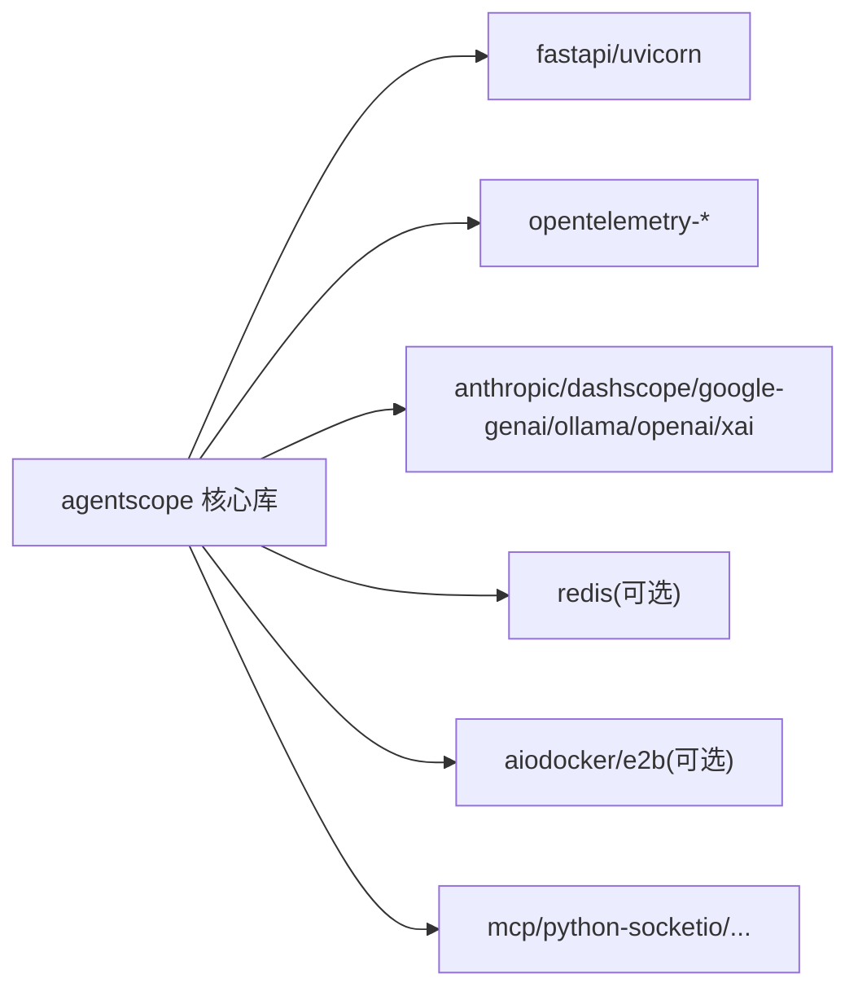

# 架构概览

<cite>
**本文引用的文件**
- [README.md](file://README.md)
- [pyproject.toml](file://pyproject.toml)
- [src/agentscope/__init__.py](file://src/agentscope/__init__.py)
- [_version.py](file://src/agentscope/_version.py)
- [src/agentscope/app/_app.py](file://src/agentscope/app/_app.py)
- [src/agentscope/app/_lifespan.py](file://src/agentscope/app/_lifespan.py)
- [src/agentscope/app/_deps.py](file://src/agentscope/app/_deps.py)
- [src/agentscope/middleware/_base.py](file://src/agentscope/middleware/_base.py)
- [src/agentscope/event/_event.py](file://src/agentscope/event/_event.py)
- [src/agentscope/message/_base.py](file://src/agentscope/message/_base.py)
- [src/agentscope/agent/_agent.py](file://src/agentscope/agent/_agent.py)
- [src/agentscope/workspace/_base.py](file://src/agentscope/workspace/_base.py)
- [src/agentscope/app/_router/_agent.py](file://src/agentscope/app/_router/_agent.py)
</cite>

## 目录
1. [引言](#引言)
2. [项目结构](#项目结构)
3. [核心组件](#核心组件)
4. [架构总览](#架构总览)
5. [详细组件分析](#详细组件分析)
6. [依赖关系分析](#依赖关系分析)
7. [性能考量](#性能考量)
8. [故障排查指南](#故障排查指南)
9. [结论](#结论)
10. [附录](#附录)

## 引言
本文件面向 AgentScope 2.0 的架构与实现，聚焦于高层设计模式、系统边界、组件交互、数据流与集成方式，系统化阐述应用架构、服务层设计、中间件机制、事件系统与消息传递机制，并给出技术决策、权衡与约束、基础设施与可扩展性、部署拓扑、安全与可观测性等横切关注点。目标是帮助开发者与运维人员快速理解 AgentScope 2.0 的整体设计与落地路径。

## 项目结构
AgentScope 2.0 采用模块化分层组织：核心库位于 src/agentscope 下，提供 Agent、消息、事件、工具、权限、工作空间、模型适配、中间件与存储抽象；examples 提供示例服务与 Web UI；tests 覆盖关键功能与集成场景；pyproject.toml 定义依赖与可选特性集。

图表来源
- [src/agentscope/app/_app.py:29-130](file://src/agentscope/app/_app.py#L29-L130)
- [src/agentscope/app/_lifespan.py:14-64](file://src/agentscope/app/_lifespan.py#L14-L64)
- [src/agentscope/app/_deps.py:15-143](file://src/agentscope/app/_deps.py#L15-L143)
- [src/agentscope/app/_router/_agent.py:1-210](file://src/agentscope/app/_router/_agent.py#L1-L210)
- [src/agentscope/agent/_agent.py:94-800](file://src/agentscope/agent/_agent.py#L94-L800)
- [src/agentscope/message/_base.py:65-574](file://src/agentscope/message/_base.py#L65-L574)
- [src/agentscope/event/_event.py:14-432](file://src/agentscope/event/_event.py#L14-L432)
- [src/agentscope/middleware/_base.py:12-241](file://src/agentscope/middleware/_base.py#L12-L241)
- [src/agentscope/workspace/_base.py:36-204](file://src/agentscope/workspace/_base.py#L36-L204)
- [pyproject.toml:1-122](file://pyproject.toml#L1-L122)
- [README.md:58-260](file://README.md#L58-L260)

章节来源
- [README.md:58-260](file://README.md#L58-L260)
- [pyproject.toml:1-122](file://pyproject.toml#L1-L122)

## 核心组件
- 应用工厂与生命周期
  - 应用工厂负责注册内置路由、注入共享状态（存储、工作空间、中间件工厂、工具工厂）、挂载可选中间件，并返回 FastAPI 实例。
  - 生命周期管理负责启动时初始化存储、工作空间、会话与任务管理器、调度器，并在关闭时清理资源。
- 中间件系统
  - 提供洋葱式拦截点（on_reply、on_reasoning、on_acting、on_model_call）与变换式钩子（on_system_prompt），支持按需实现特定钩子。
- 事件与消息
  - 事件体系覆盖回复、模型调用、文本/思维/数据块增量、工具调用与结果、用户确认与外部执行等全链路事件。
  - 消息模型抽象多模态内容块（文本、思维、工具调用/结果、数据），并支持从事件增量构建最终消息。
- Agent 统一执行引擎
  - 支持推理-行动循环、上下文压缩、权限校验、工具批处理与并发执行、外部交互与中断恢复。
- 工作空间抽象
  - 抽象本地/容器/沙箱三种后端，提供 MCP/技能发现、工具列表、上下文与工具结果离线存储能力。
- 路由与依赖注入
  - 示例路由展示多租户/多会话的 CRUD 与业务流程入口；依赖注入提供用户标识、存储、会话、调度、工作空间、额外中间件与工具工厂的访问。

章节来源
- [src/agentscope/app/_app.py:29-130](file://src/agentscope/app/_app.py#L29-L130)
- [src/agentscope/app/_lifespan.py:14-64](file://src/agentscope/app/_lifespan.py#L14-L64)
- [src/agentscope/middleware/_base.py:12-241](file://src/agentscope/middleware/_base.py#L12-L241)
- [src/agentscope/event/_event.py:14-432](file://src/agentscope/event/_event.py#L14-L432)
- [src/agentscope/message/_base.py:65-574](file://src/agentscope/message/_base.py#L65-L574)
- [src/agentscope/agent/_agent.py:94-800](file://src/agentscope/agent/_agent.py#L94-L800)
- [src/agentscope/workspace/_base.py:36-204](file://src/agentscope/workspace/_base.py#L36-L204)
- [src/agentscope/app/_router/_agent.py:1-210](file://src/agentscope/app/_router/_agent.py#L1-L210)
- [src/agentscope/app/_deps.py:15-143](file://src/agentscope/app/_deps.py#L15-L143)

## 架构总览
AgentScope 2.0 以“应用工厂 + 生命周期 + 路由层”为核心，向上提供多租户、多会话的 Agent 服务；向下通过中间件、事件与消息解耦执行逻辑与外部系统；通过工作空间抽象屏蔽不同执行后端差异；通过存储抽象与调度器支撑持久化与异步任务编排。

图表来源
- [src/agentscope/app/_app.py:29-130](file://src/agentscope/app/_app.py#L29-L130)
- [src/agentscope/app/_lifespan.py:14-64](file://src/agentscope/app/_lifespan.py#L14-L64)
- [src/agentscope/app/_deps.py:15-143](file://src/agentscope/app/_deps.py#L15-L143)
- [src/agentscope/agent/_agent.py:94-800](file://src/agentscope/agent/_agent.py#L94-L800)
- [src/agentscope/event/_event.py:14-432](file://src/agentscope/event/_event.py#L14-L432)
- [src/agentscope/message/_base.py:65-574](file://src/agentscope/message/_base.py#L65-L574)
- [src/agentscope/workspace/_base.py:36-204](file://src/agentscope/workspace/_base.py#L36-L204)

## 详细组件分析

### 应用工厂与生命周期
- 应用工厂 create_app
  - 注册内置路由（agent、background_task、chat、credential、schedule、session、workspace、model）
  - 注入共享状态：storage、workspace_manager、extra_agent_middlewares、extra_agent_tools
  - 可选挂载额外 ASGI 中间件
- 生命周期 lifespan
  - 启动：进入 storage 与 workspace 上下文；初始化 SessionManager、BackgroundTaskManager；启动 SchedulerManager 并恢复持久化计划
  - 关闭：取消进行中的会话与后台任务；优雅关闭调度器；退出 workspace 管理器

图表来源
- [src/agentscope/app/_app.py:29-130](file://src/agentscope/app/_app.py#L29-L130)
- [src/agentscope/app/_lifespan.py:14-64](file://src/agentscope/app/_lifespan.py#L14-L64)

章节来源
- [src/agentscope/app/_app.py:29-130](file://src/agentscope/app/_app.py#L29-L130)
- [src/agentscope/app/_lifespan.py:14-64](file://src/agentscope/app/_lifespan.py#L14-L64)

### 中间件机制
- 钩子类型
  - 洋葱式：on_reply、on_reasoning、on_acting、on_model_call
  - 变换式：on_system_prompt
- 执行模型
  - 按实现过滤中间件，按顺序构建链式调用；on_acting 与 on_model_call 支持对纯 I/O 层的隔离与可后台卸载
- 工厂注入
  - 支持按用户/会话动态生成中间件与工具，实现租户隔离、鉴权审计与按需工具装配

图表来源
- [src/agentscope/middleware/_base.py:12-241](file://src/agentscope/middleware/_base.py#L12-L241)
- [src/agentscope/agent/_agent.py:94-800](file://src/agentscope/agent/_agent.py#L94-L800)

章节来源
- [src/agentscope/middleware/_base.py:12-241](file://src/agentscope/middleware/_base.py#L12-L241)
- [src/agentscope/agent/_agent.py:94-800](file://src/agentscope/agent/_agent.py#L94-L800)

### 事件系统与消息传递
- 事件类型
  - 回复开始/结束、模型调用开始/结束、文本/思维/数据块增量、工具调用与结果、用户确认、外部执行、最大迭代等
- 消息模型
  - Msg 封装发送者、角色、内容块列表、元数据、时间戳与用量；支持从事件增量更新消息
- 流程要点
  - Agent 在推理与工具执行过程中持续产生事件；UI 或上游消费者订阅事件流并渲染

图表来源
- [src/agentscope/message/_base.py:210-429](file://src/agentscope/message/_base.py#L210-L429)
- [src/agentscope/event/_event.py:14-432](file://src/agentscope/event/_event.py#L14-L432)

章节来源
- [src/agentscope/event/_event.py:14-432](file://src/agentscope/event/_event.py#L14-L432)
- [src/agentscope/message/_base.py:65-574](file://src/agentscope/message/_base.py#L65-L574)

### Agent 执行引擎
- 核心流程
  - 输入预处理与外部事件检查
  - 推理-行动循环：上下文压缩 → 推理（模型调用）→ 工具批处理（串行/并发）→ 外部交互（用户确认/外部执行）
  - 最大迭代保护与异常事件
- 关键能力
  - 上下文压缩：基于阈值与保留比例，生成结构化摘要并可选离线存储
  - 权限与规则：基于 PermissionEngine 的许可决策
  - 事件流：全程以事件形式输出，便于 UI 与可观测性

图表来源
- [src/agentscope/agent/_agent.py:497-800](file://src/agentscope/agent/_agent.py#L497-L800)
- [src/agentscope/event/_event.py:14-432](file://src/agentscope/event/_event.py#L14-L432)
- [src/agentscope/workspace/_base.py:123-155](file://src/agentscope/workspace/_base.py#L123-L155)

章节来源
- [src/agentscope/agent/_agent.py:94-800](file://src/agentscope/agent/_agent.py#L94-L800)
- [src/agentscope/event/_event.py:14-432](file://src/agentscope/event/_event.py#L14-L432)
- [src/agentscope/workspace/_base.py:36-204](file://src/agentscope/workspace/_base.py#L36-L204)

### 工作空间抽象与工具/技能/MCP
- 抽象职责
  - 资源与工具发现：list_tools/list_mcps/list_skills
  - 离线存储：offload_context/offload_tool_result
  - 动态管理：add_mcp/remove_mcp、add_skill/remove_skill
- 与 Agent 的协作
  - Agent 通过工作空间获取工具与资源，必要时将压缩上下文与工具结果离线存储以便后续检索

图表来源
- [src/agentscope/workspace/_base.py:36-204](file://src/agentscope/workspace/_base.py#L36-L204)
- [src/agentscope/agent/_agent.py:94-800](file://src/agentscope/agent/_agent.py#L94-L800)

章节来源
- [src/agentscope/workspace/_base.py:36-204](file://src/agentscope/workspace/_base.py#L36-L204)
- [src/agentscope/agent/_agent.py:94-800](file://src/agentscope/agent/_agent.py#L94-L800)

### 路由与依赖注入（示例）
- 路由示例
  - 提供 Agent 配置的 JSON Schema、列表、创建、更新、删除等端点
- 依赖注入
  - get_current_user_id：从请求头提取用户标识
  - get_storage/get_session_manager/get_scheduler_manager/get_workspace_manager/get_background_task_manager/get_extra_agent_middlewares/get_extra_agent_tools：从 app.state 获取全局单例

章节来源
- [src/agentscope/app/_router/_agent.py:1-210](file://src/agentscope/app/_router/_agent.py#L1-L210)
- [src/agentscope/app/_deps.py:15-143](file://src/agentscope/app/_deps.py#L15-L143)

## 依赖关系分析
- 技术栈与版本
  - Python ≥ 3.11
  - FastAPI/uvicorn（服务层）
  - Redis（可选存储）
  - OpenTelemetry（可观测性）
  - MCP、Anthropic、DashScope、Google GenAI、Ollama、OpenAI、xAI 等模型与生态 SDK
- 可选特性集
  - models：集成多模型生态
  - service：提供 Web 服务能力
  - storage：Redis 存储
  - workspace：Docker/E2B 执行后端
  - full：聚合以上全部可选依赖

图表来源
- [pyproject.toml:22-82](file://pyproject.toml#L22-L82)

章节来源
- [pyproject.toml:1-122](file://pyproject.toml#L1-L122)

## 性能考量
- 事件驱动与增量渲染
  - 文本/数据/思维块增量事件减少 UI 重绘成本，提升交互体验
- 上下文压缩
  - 基于阈值与保留比例的结构化摘要生成，降低长对话 Token 压力
- 工具批处理
  - 支持串行/并发批量执行，提高工具利用率
- 中间件隔离
  - on_acting 对纯 I/O 层隔离，便于后台卸载与并发安全
- 可观测性
  - 内置 OpenTelemetry 依赖，建议在生产环境启用导出器与追踪

## 故障排查指南
- 认证与授权
  - 当前依赖注入使用 X-User-ID 请求头作为临时身份标识，建议尽快替换为 JWT/会话令牌
- 工作空间未配置
  - 访问需要工作空间的接口时若未配置工作空间管理器，将返回 503
- 事件不匹配
  - 消息更新时若事件 reply_id 与消息 id 不一致，将记录警告并跳过该事件
- 最大迭代限制
  - 达到最大迭代次数将触发 ExceedMaxIters 事件，需检查工具调用策略与权限配置

章节来源
- [src/agentscope/app/_deps.py:15-143](file://src/agentscope/app/_deps.py#L15-L143)
- [src/agentscope/message/_base.py:210-429](file://src/agentscope/message/_base.py#L210-L429)
- [src/agentscope/agent/_agent.py:674-686](file://src/agentscope/agent/_agent.py#L674-L686)

## 结论
AgentScope 2.0 通过“应用工厂 + 生命周期 + 路由层”的清晰分层，结合事件驱动的消息模型、可插拔中间件与工作空间抽象，实现了从开发体验到生产部署的全链路能力。其模块化设计与可选依赖使其具备良好的扩展性与可移植性，适合在本地、云端与容器环境中灵活部署。

## 附录
- 版本信息
  - 包版本：2.0.0
  - 初始化入口：agentscope.__init__ 暴露 logger/setup_logger/__version__
- 快速开始与示例
  - README 提供安装、Hello World 与示例服务启动说明

章节来源
- [src/agentscope/_version.py:4-5](file://src/agentscope/_version.py#L4-L5)
- [src/agentscope/__init__.py:15-19](file://src/agentscope/__init__.py#L15-L19)
- [README.md:106-260](file://README.md#L106-L260)