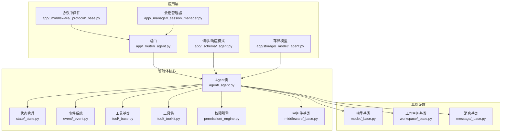
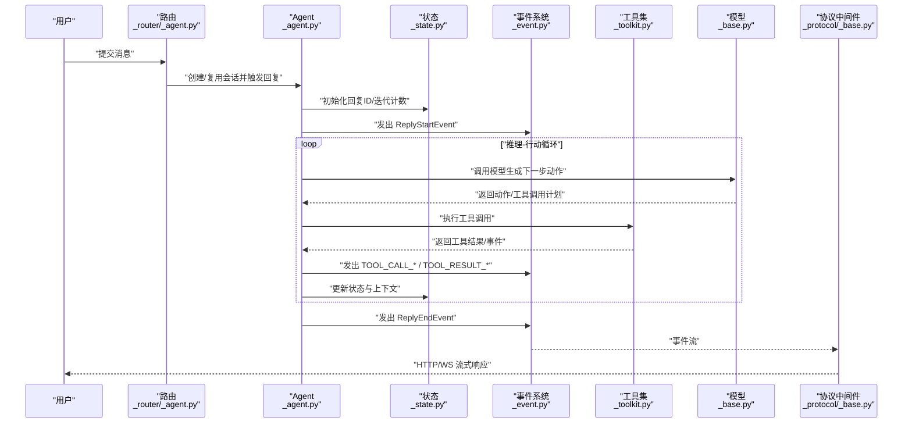
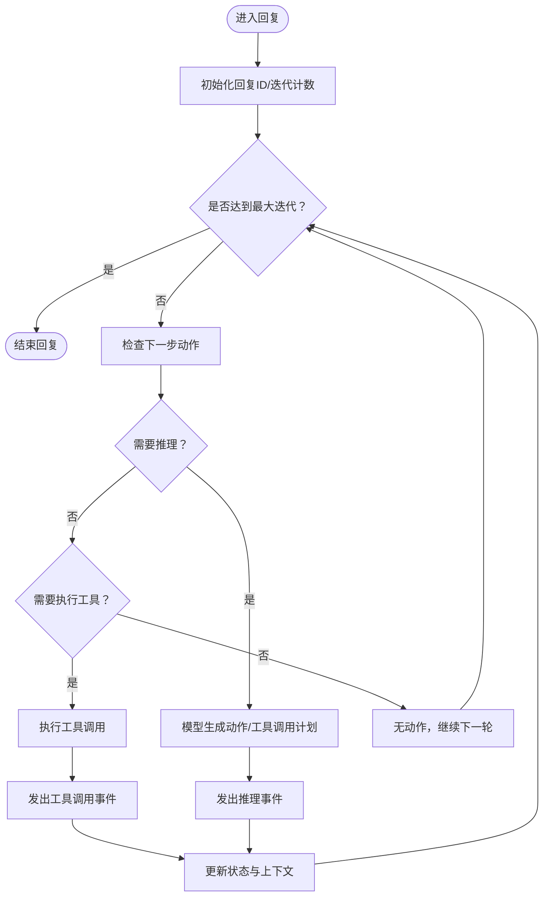
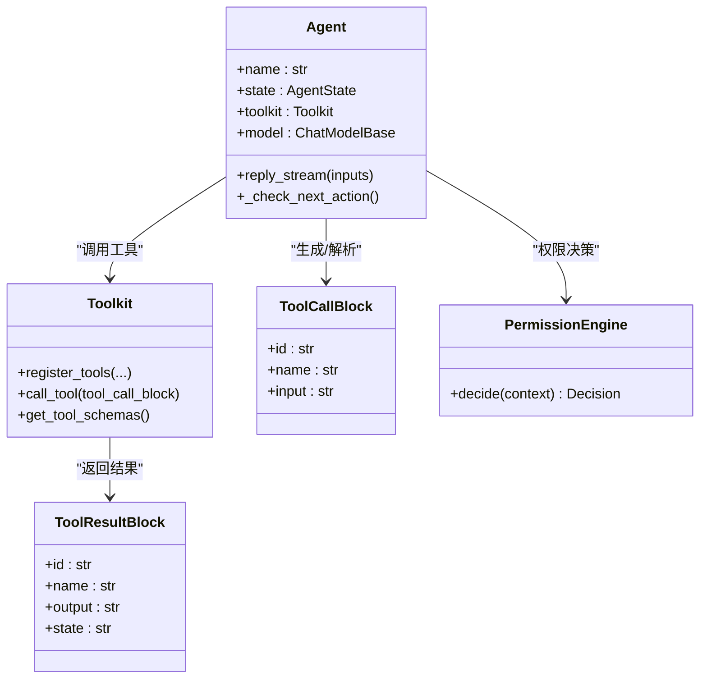
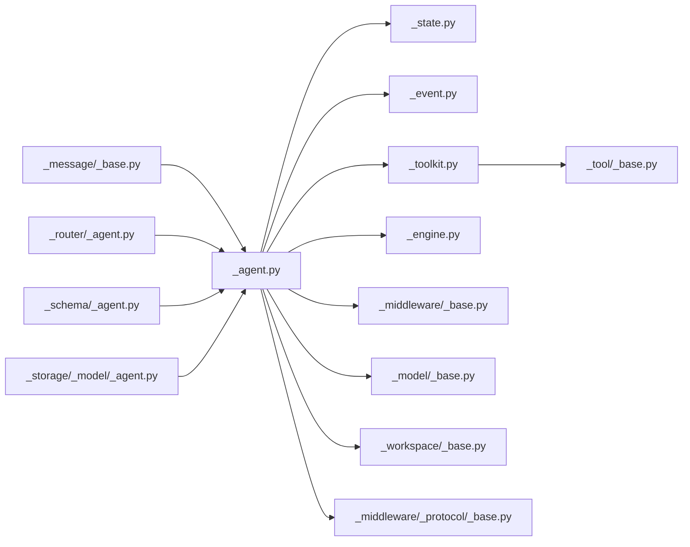

# ReAct智能体

<cite>
**本文引用的文件**
- [src/agentscope/agent/_agent.py](file://src/agentscope/agent/_agent.py)
- [src/agentscope/agent/_config.py](file://src/agentscope/agent/_config.py)
- [src/agentscope/state/_state.py](file://src/agentscope/state/_state.py)
- [src/agentscope/event/_event.py](file://src/agentscope/event/_event.py)
- [src/agentscope/tool/_base.py](file://src/agentscope/tool/_base.py)
- [src/agentscope/tool/_toolkit.py](file://src/agentscope/tool/_toolkit.py)
- [src/agentscope/app/_schema/_agent.py](file://src/agentscope/app/_schema/_agent.py)
- [src/agentscope/app/storage/_model/_agent.py](file://src/agentscope/app/storage/_model/_agent.py)
- [src/agentscope/app/_middleware/_protocol/_base.py](file://src/agentscope/app/_middleware/_protocol/_base.py)
- [src/agentscope/app/_manager/_session_manager.py](file://src/agentscope/app/_manager/_session_manager.py)
- [src/agentscope/middleware/_base.py](file://src/agentscope/middleware/_base.py)
- [src/agentscope/model/_base.py](file://src/agentscope/model/_base.py)
- [src/agentscope/workspace/_base.py](file://src/agentscope/workspace/_base.py)
- [src/agentscope/permission/_engine.py](file://src/agentscope/permission/_engine.py)
- [src/agentscope/message/_base.py](file://src/agentscope/message/_base.py)
- [tests/agent_basic_test.py](file://tests/agent_basic_test.py)
- [tests/hitl_external_execution_test.py](file://tests/hitl_external_execution_test.py)
- [tests/hitl_mixed_interrupt.py](file://tests/hitl_mixed_interrupt.py)
- [tests/tracing_test.py](file://tests/tracing_test.py)
</cite>

## 目录
1. [简介](#简介)
2. [项目结构](#项目结构)
3. [核心组件](#核心组件)
4. [架构总览](#架构总览)
5. [详细组件分析](#详细组件分析)
6. [依赖关系分析](#依赖关系分析)
7. [性能考量](#性能考量)
8. [故障排查指南](#故障排查指南)
9. [结论](#结论)
10. [附录](#附录)

## 简介
本技术文档围绕AgentScope中的ReAct（Reasoning and Acting）智能体系统展开，系统性阐述其核心架构设计与运行机制，包括推理-行动循环、行动执行流程、状态管理、初始化配置、消息处理、事件驱动与流式响应等关键主题。文档同时给出与外部系统的集成方式（模型服务、工具系统、工作空间），并提供可直接定位到源码位置的“代码片段路径”，便于读者在仓库中快速查阅实现细节。

## 项目结构
ReAct智能体位于Agent模块内，围绕Agent类为核心，配合状态、事件、工具、权限、中间件、模型与工作空间等子系统协同工作。应用层通过路由、存储模型与协议中间件提供HTTP/WS流式事件输出能力；测试用例覆盖事件顺序、外部执行与混合中断等典型场景。

图表来源
- [src/agentscope/agent/_agent.py](file://src/agentscope/agent/_agent.py)
- [src/agentscope/state/_state.py](file://src/agentscope/state/_state.py)
- [src/agentscope/event/_event.py](file://src/agentscope/event/_event.py)
- [src/agentscope/tool/_base.py](file://src/agentscope/tool/_base.py)
- [src/agentscope/tool/_toolkit.py](file://src/agentscope/tool/_toolkit.py)
- [src/agentscope/permission/_engine.py](file://src/agentscope/permission/_engine.py)
- [src/agentscope/middleware/_base.py](file://src/agentscope/middleware/_base.py)
- [src/agentscope/model/_base.py](file://src/agentscope/model/_base.py)
- [src/agentscope/workspace/_base.py](file://src/agentscope/workspace/_base.py)
- [src/agentscope/message/_base.py](file://src/agentscope/message/_base.py)
- [src/agentscope/app/_schema/_agent.py](file://src/agentscope/app/_schema/_agent.py)
- [src/agentscope/app/storage/_model/_agent.py](file://src/agentscope/app/storage/_model/_agent.py)
- [src/agentscope/app/_middleware/_protocol/_base.py](file://src/agentscope/app/_middleware/_protocol/_base.py)
- [src/agentscope/app/_manager/_session_manager.py](file://src/agentscope/app/_manager/_session_manager.py)

章节来源
- [src/agentscope/agent/_agent.py](file://src/agentscope/agent/_agent.py)
- [src/agentscope/app/_schema/_agent.py](file://src/agentscope/app/_schema/_agent.py)
- [src/agentscope/app/storage/_model/_agent.py](file://src/agentscope/app/storage/_model/_agent.py)

## 核心组件
- Agent：ReAct智能体主体，负责初始化、推理-行动循环、事件处理与状态更新。
- ReActConfig：控制ReAct循环迭代次数、是否等待外部确认/执行等行为。
- AgentState：维护会话ID、回复ID、当前迭代计数、权限上下文、工具调用历史等。
- 事件系统：统一的事件类型（如开始/增量/结束）用于流式输出与外部交互。
- 工具系统：工具注册、调用、结果封装与权限校验。
- 权限引擎：基于规则的工具调用决策。
- 中间件：在关键钩子点（推理、行动、模型调用、回复生成等）注入横切逻辑。
- 模型服务：抽象的聊天模型接口，支持不同厂商适配。
- 工作空间：隔离执行环境（本地/容器/MCP网关等）。
- 应用层：路由、存储、协议中间件与会话管理器，支撑HTTP流式事件输出。

章节来源
- [src/agentscope/agent/_agent.py](file://src/agentscope/agent/_agent.py)
- [src/agentscope/agent/_config.py](file://src/agentscope/agent/_config.py)
- [src/agentscope/state/_state.py](file://src/agentscope/state/_state.py)
- [src/agentscope/event/_event.py](file://src/agentscope/event/_event.py)
- [src/agentscope/tool/_base.py](file://src/agentscope/tool/_base.py)
- [src/agentscope/tool/_toolkit.py](file://src/agentscope/tool/_toolkit.py)
- [src/agentscope/permission/_engine.py](file://src/agentscope/permission/_engine.py)
- [src/agentscope/middleware/_base.py](file://src/agentscope/middleware/_base.py)
- [src/agentscope/model/_base.py](file://src/agentscope/model/_base.py)
- [src/agentscope/workspace/_base.py](file://src/agentscope/workspace/_base.py)
- [src/agentscope/message/_base.py](file://src/agentscope/message/_base.py)

## 架构总览
ReAct智能体采用“事件驱动 + 流式响应”的架构。Agent接收用户消息后，进入推理-行动循环：先进行内部思考（推理阶段），再根据计划调用工具（行动阶段），并在每次迭代后更新状态与上下文。中间件可在关键阶段注入横切逻辑；协议中间件将事件流转换为HTTP/WS可消费的协议格式；会话管理器负责事件缓冲与重放。

图表来源
- [src/agentscope/agent/_agent.py](file://src/agentscope/agent/_agent.py)
- [src/agentscope/state/_state.py](file://src/agentscope/state/_state.py)
- [src/agentscope/event/_event.py](file://src/agentscope/event/_event.py)
- [src/agentscope/tool/_toolkit.py](file://src/agentscope/tool/_toolkit.py)
- [src/agentscope/model/_base.py](file://src/agentscope/model/_base.py)
- [src/agentscope/app/_middleware/_protocol/_base.py](file://src/agentscope/app/_middleware/_protocol/_base.py)

## 详细组件分析

### 推理-行动循环与状态管理
- 初始化与配置
  - Agent构造函数接收系统提示词、模型、工具集、中间件、状态、上下文压缩配置、ReAct配置等参数，并建立权限引擎与离线卸载器。
  - ReActConfig包含最大迭代次数、是否需要外部确认/执行等开关，决定循环终止条件与交互策略。
- 循环控制
  - 进入循环前，Agent发出ReplyStartEvent并初始化回复ID与迭代计数。
  - 每次迭代通过_check_next_action确定下一步动作（继续推理或执行工具调用）。
  - 当存在待决事件时，优先处理事件（例如RequireUserConfirm/RequireExternalExecution），否则处理新消息。
- 状态更新
  - AgentState维护会话ID、回复ID、当前迭代计数、权限上下文、工具调用历史等，确保跨轮对话的一致性与可追踪性。

图表来源
- [src/agentscope/agent/_agent.py](file://src/agentscope/agent/_agent.py)
- [src/agentscope/state/_state.py](file://src/agentscope/state/_state.py)
- [src/agentscope/event/_event.py](file://src/agentscope/event/_event.py)

章节来源
- [src/agentscope/agent/_agent.py](file://src/agentscope/agent/_agent.py)
- [src/agentscope/agent/_config.py](file://src/agentscope/agent/_config.py)
- [src/agentscope/state/_state.py](file://src/agentscope/state/_state.py)

### 消息处理与事件驱动
- 消息输入
  - 支持单轮或多轮对话，Agent根据会话ID与回复ID区分不同回复过程。
  - 消息类型由消息基类定义，支持文本、工具调用块等。
- 事件驱动
  - Agent在关键节点发出事件（如ReplyStart/ReplyEnd、TOOL_CALL_*、TOOL_RESULT_*、RequireUserConfirm、RequireExternalExecution等）。
  - 外部系统可通过事件订阅/回调接入，实现人机协作与外部执行。
- 流式响应
  - 协议中间件将事件流转换为标准协议格式，前端可实时渲染。

章节来源
- [src/agentscope/message/_base.py](file://src/agentscope/message/_base.py)
- [src/agentscope/event/_event.py](file://src/agentscope/event/_event.py)
- [src/agentscope/app/_middleware/_protocol/_base.py](file://src/agentscope/app/_middleware/_protocol/_base.py)

### 工具调用与权限控制
- 工具注册与调用
  - Toolkit集中管理工具，支持内置工具（如读写文件、搜索、编辑）与MCP工具。
  - 工具调用以ToolCallBlock描述，结果以ToolResultBlock封装。
- 权限引擎
  - 基于规则的权限决策，支持对工具调用的允许/拒绝与外部执行需求。
- 外部执行与混合中断
  - 当工具调用需要外部执行或用户确认时，Agent发出RequireExternalExecution/RequireUserConfirm事件，等待外部注入结果后再继续。

图表来源
- [src/agentscope/agent/_agent.py](file://src/agentscope/agent/_agent.py)
- [src/agentscope/tool/_toolkit.py](file://src/agentscope/tool/_toolkit.py)
- [src/agentscope/tool/_base.py](file://src/agentscope/tool/_base.py)
- [src/agentscope/permission/_engine.py](file://src/agentscope/permission/_engine.py)

章节来源
- [src/agentscope/tool/_toolkit.py](file://src/agentscope/tool/_toolkit.py)
- [src/agentscope/tool/_base.py](file://src/agentscope/tool/_base.py)
- [src/agentscope/permission/_engine.py](file://src/agentscope/permission/_engine.py)
- [tests/hitl_external_execution_test.py](file://tests/hitl_external_execution_test.py)
- [tests/hitl_mixed_interrupt.py](file://tests/hitl_mixed_interrupt.py)

### 中间件与扩展点
- 中间件钩子
  - 支持在推理、行动、模型调用、回复生成等阶段注入横切逻辑（如日志、指标、限流、脱敏等）。
- 配置与过滤
  - 中间件按实现的钩子点进行筛选，避免不必要开销。

章节来源
- [src/agentscope/middleware/_base.py](file://src/agentscope/middleware/_base.py)
- [src/agentscope/agent/_agent.py](file://src/agentscope/agent/_agent.py)

### 与外部系统的集成
- 模型服务
  - 通过模型基类抽象不同厂商的聊天模型，Agent仅依赖统一接口。
- 工具系统
  - 内置工具与MCP工具统一接入Toolkit，支持本地与远程工具。
- 工作空间
  - 提供本地、容器与MCP网关等执行环境，支持工具与脚本的安全隔离执行。
- 应用层
  - 路由与协议中间件将事件流暴露为HTTP/WS，前端可实时渲染；会话管理器支持事件缓冲与重放。

章节来源
- [src/agentscope/model/_base.py](file://src/agentscope/model/_base.py)
- [src/agentscope/workspace/_base.py](file://src/agentscope/workspace/_base.py)
- [src/agentscope/app/_middleware/_protocol/_base.py](file://src/agentscope/app/_middleware/_protocol/_base.py)
- [src/agentscope/app/_manager/_session_manager.py](file://src/agentscope/app/_manager/_session_manager.py)

## 依赖关系分析
- 组件耦合
  - Agent与状态、事件、工具、权限、中间件、模型、工作空间存在强关联，但通过抽象接口降低耦合度。
  - 应用层（路由/存储/协议中间件/会话管理器）与Agent解耦，通过事件与HTTP接口交互。
- 关键依赖链
  - 输入消息 → Agent → 权限引擎 → 工具集 → 结果事件 → 协议中间件 → 客户端。
- 外部依赖
  - 模型服务、工具系统、工作空间均通过统一接口接入，便于替换与扩展。

图表来源
- [src/agentscope/message/_base.py](file://src/agentscope/message/_base.py)
- [src/agentscope/agent/_agent.py](file://src/agentscope/agent/_agent.py)
- [src/agentscope/state/_state.py](file://src/agentscope/state/_state.py)
- [src/agentscope/event/_event.py](file://src/agentscope/event/_event.py)
- [src/agentscope/tool/_toolkit.py](file://src/agentscope/tool/_toolkit.py)
- [src/agentscope/tool/_base.py](file://src/agentscope/tool/_base.py)
- [src/agentscope/permission/_engine.py](file://src/agentscope/permission/_engine.py)
- [src/agentscope/middleware/_base.py](file://src/agentscope/middleware/_base.py)
- [src/agentscope/model/_base.py](file://src/agentscope/model/_base.py)
- [src/agentscope/workspace/_base.py](file://src/agentscope/workspace/_base.py)
- [src/agentscope/app/_middleware/_protocol/_base.py](file://src/agentscope/app/_middleware/_protocol/_base.py)
- [src/agentscope/app/_router/_agent.py](file://src/agentscope/app/_router/_agent.py)
- [src/agentscope/app/_schema/_agent.py](file://src/agentscope/app/_schema/_agent.py)
- [src/agentscope/app/storage/_model/_agent.py](file://src/agentscope/app/storage/_model/_agent.py)

## 性能考量
- 上下文压缩与工具结果压缩：通过上下文配置减少模型输入规模，提升吞吐与降低成本。
- 迭代上限：ReActConfig限制最大迭代次数，防止无限循环与资源耗尽。
- 异步事件流：协议中间件与会话管理器支持异步流式输出，降低前端等待时间。
- 中间件过滤：仅启用必要的中间件钩子，减少额外开销。
- 工具调用批量化：在权限允许的前提下合并工具调用，减少往返次数。

## 故障排查指南
- 事件顺序异常
  - 使用测试用例中的期望事件序列比对，确认事件顺序与并发行为符合预期。
- 外部执行未注入
  - 检查RequireExternalExecution事件是否被正确发出与处理，确保外部执行结果回注后继续循环。
- 用户确认未触发
  - 检查权限引擎决策与RequireUserConfirm事件生成逻辑，确认前端交互流程。
- 流式响应格式错误
  - 核对协议中间件的事件序列化与换行符处理，确保客户端可正确解析。

章节来源
- [tests/agent_basic_test.py](file://tests/agent_basic_test.py)
- [tests/hitl_external_execution_test.py](file://tests/hitl_external_execution_test.py)
- [tests/hitl_mixed_interrupt.py](file://tests/hitl_mixed_interrupt.py)
- [tests/tracing_test.py](file://tests/tracing_test.py)
- [src/agentscope/app/_middleware/_protocol/_base.py](file://src/agentscope/app/_middleware/_protocol/_base.py)

## 结论
AgentScope的ReAct智能体通过清晰的事件驱动与流式响应机制，实现了“推理-行动”闭环。其模块化设计与抽象接口使得模型、工具与工作空间易于替换与扩展；权限引擎与中间件提供了强大的治理与可观测能力。结合应用层的协议中间件与会话管理器，ReAct智能体能够稳定地支撑多轮对话与复杂工具编排场景。

## 附录

### 如何创建、配置与使用ReAct智能体（代码片段路径）
- 创建Agent与ReAct配置
  - 参考：[src/agentscope/agent/_agent.py](file://src/agentscope/agent/_agent.py)
  - 参考：[src/agentscope/agent/_config.py](file://src/agentscope/agent/_config.py)
- 设置系统提示词与上下文配置
  - 参考：[src/agentscope/app/_schema/_agent.py](file://src/agentscope/app/_schema/_agent.py)
  - 参考：[src/agentscope/app/storage/_model/_agent.py](file://src/agentscope/app/storage/_model/_agent.py)
- 注册工具与MCP
  - 参考：[src/agentscope/tool/_toolkit.py](file://src/agentscope/tool/_toolkit.py)
  - 参考：[src/agentscope/tool/_base.py](file://src/agentscope/tool/_base.py)
- 启动回复与流式响应
  - 参考：[src/agentscope/agent/_agent.py](file://src/agentscope/agent/_agent.py)
  - 参考：[src/agentscope/app/_middleware/_protocol/_base.py](file://src/agentscope/app/_middleware/_protocol/_base.py)
- 多轮对话与事件处理
  - 参考：[src/agentscope/state/_state.py](file://src/agentscope/state/_state.py)
  - 参考：[src/agentscope/event/_event.py](file://src/agentscope/event/_event.py)
- 与工作空间集成
  - 参考：[src/agentscope/workspace/_base.py](file://src/agentscope/workspace/_base.py)