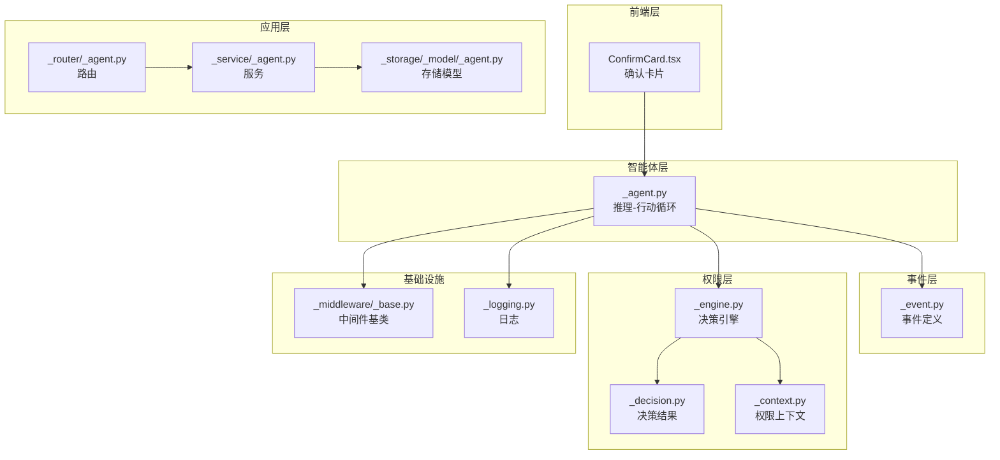
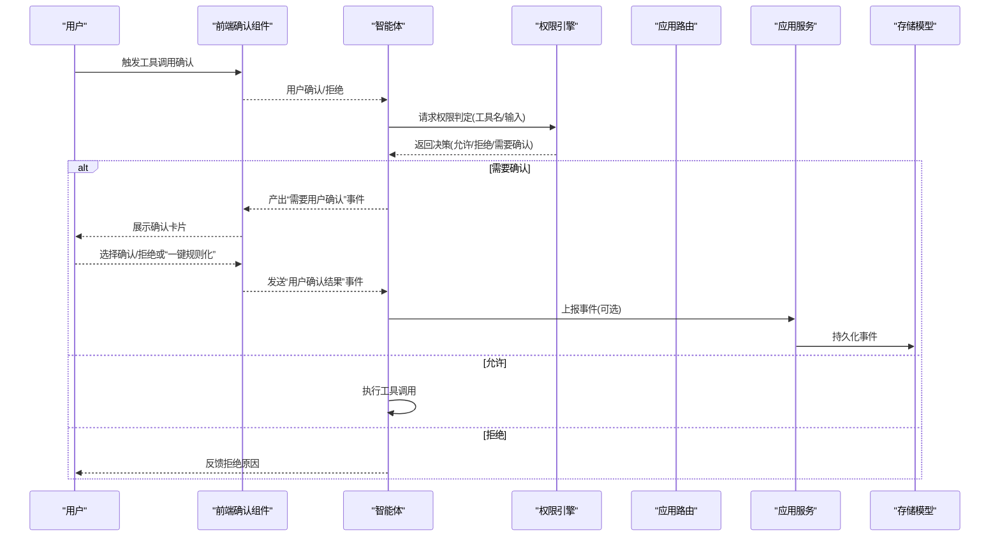
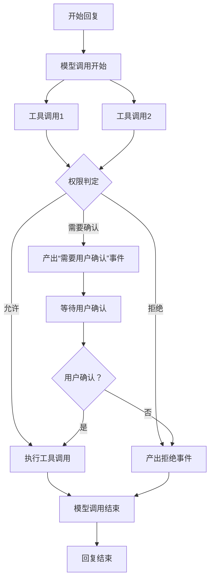
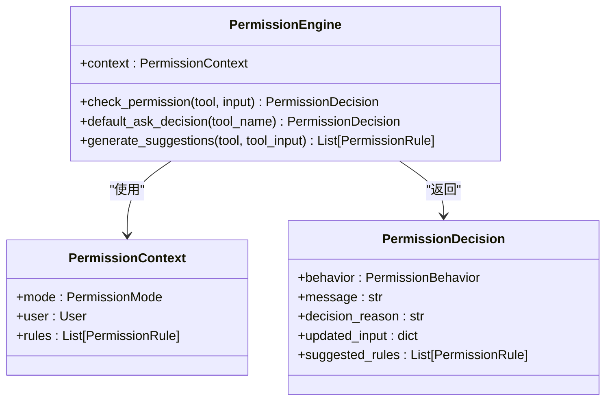
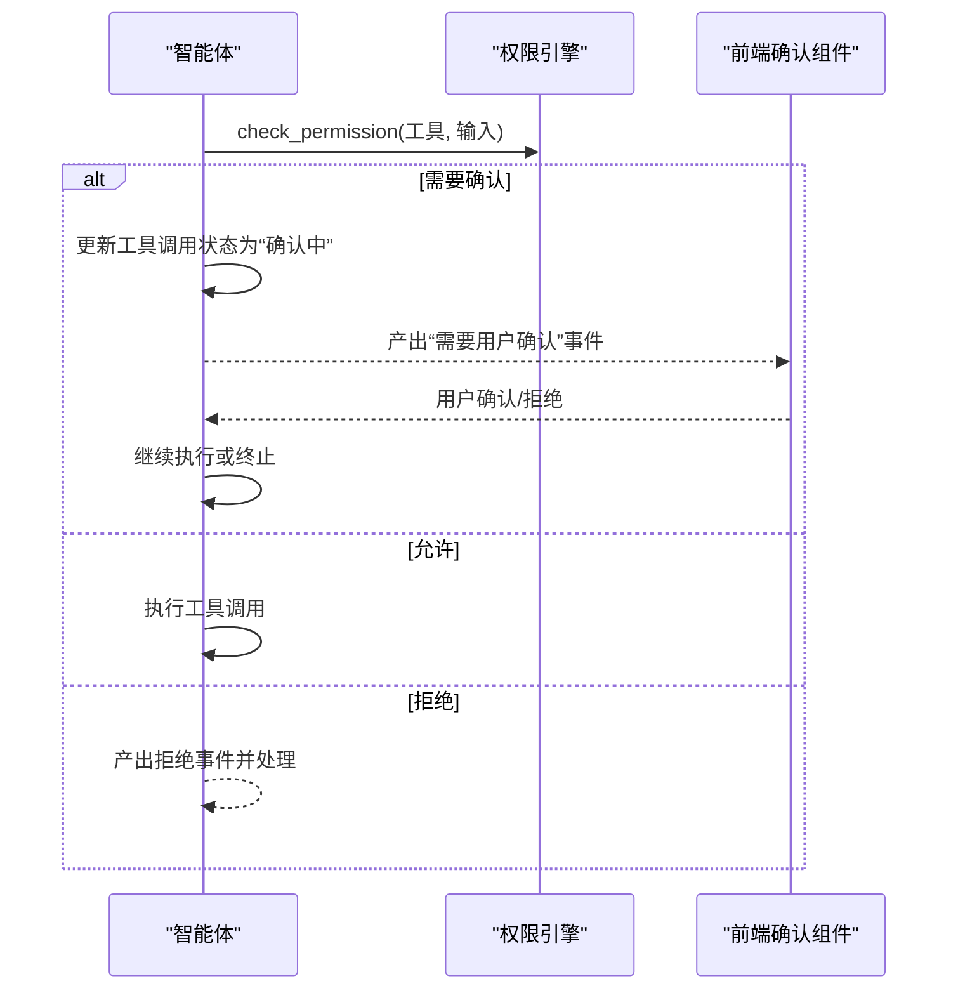
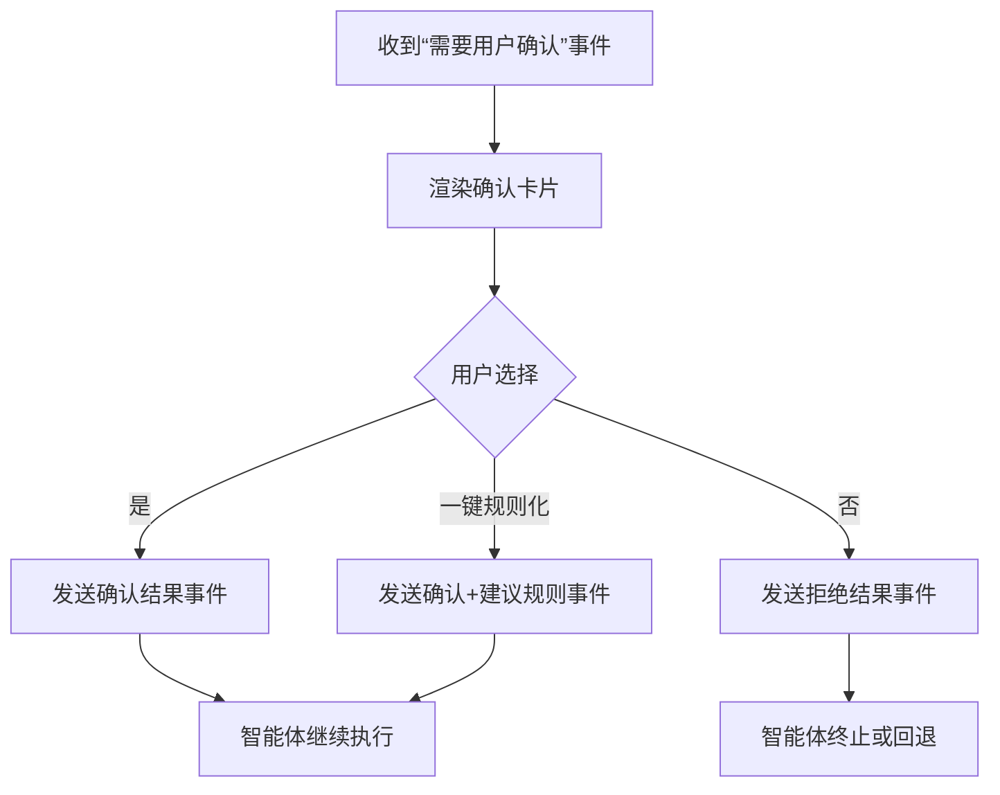
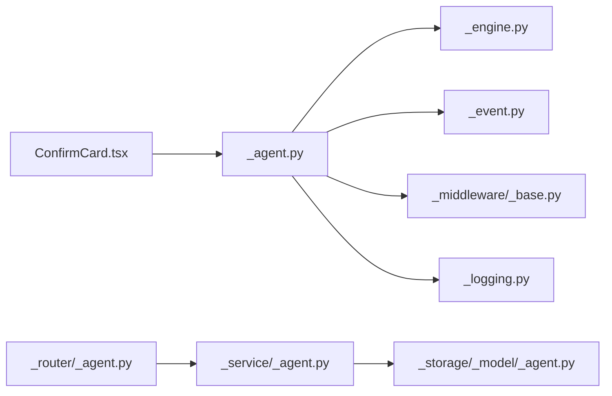

# 人机协作控制

<cite>
**本文引用的文件**
- [src/agentscope/event/_event.py](file://src/agentscope/event/_event.py)
- [src/agentscope/permission/_engine.py](file://src/agentscope/permission/_engine.py)
- [src/agentscope/permission/_decision.py](file://src/agentscope/permission/_decision.py)
- [src/agentscope/permission/_context.py](file://src/agentscope/permission/_context.py)
- [src/agentscope/agent/_agent.py](file://src/agentscope/agent/_agent.py)
- [examples/web_ui/frontend/src/components/chat/ConfirmCard.tsx](file://examples/web_ui/frontend/src/components/chat/ConfirmCard.tsx)
- [tests/hitl_user_confirmation_test.py](file://tests/hitl_user_confirmation_test.py)
- [tests/tracing_test.py](file://tests/tracing_test.py)
- [src/agentscope/app/_router/_agent.py](file://src/agentscope/app/_router/_agent.py)
- [src/agentscope/app/_service/_agent.py](file://src/agentscope/app/_service/_agent.py)
- [src/agentscope/app/storage/_model/_agent.py](file://src/agentscope/app/storage/_model/_agent.py)
- [src/agentscope/middleware/_base.py](file://src/agentscope/middleware/_base.py)
- [src/agentscope/_logging.py](file://src/agentscope/_logging.py)
</cite>

## 目录
1. [引言](#引言)
2. [项目结构](#项目结构)
3. [核心组件](#核心组件)
4. [架构总览](#架构总览)
5. [详细组件分析](#详细组件分析)
6. [依赖关系分析](#依赖关系分析)
7. [性能考虑](#性能考虑)
8. [故障排查指南](#故障排查指南)
9. [结论](#结论)
10. [附录](#附录)

## 引言
本技术文档围绕 AgentScope 的“人机协作控制”体系，系统阐述其设计理念、控制机制与交互模式。重点包括：
- 事件驱动的协作流程：从模型推理到工具调用，再到用户确认与后续执行的完整闭环。
- 权限决策引擎：基于上下文与规则的行为判定（允许/拒绝/需要确认），以及建议规则生成。
- 用户确认机制：通过统一事件与前端组件完成交互确认，并支持“一键规则化”等增强体验。
- 事件类型与中断响应：区分顺序与并发事件，支持在等待用户确认时的中断与恢复。
- 协作状态管理：贯穿一次对话回复的会话、回复、迭代与工具调用状态。
- 安全控制策略、审计日志与异常处理：确保可追溯、可审计、可恢复。

## 项目结构
AgentScope 将“人机协作控制”能力分布在多个层次：
- 事件层：定义协作过程中的各类事件类型，如“需要用户确认”“用户确认结果”等。
- 权限层：提供决策引擎、上下文与规则抽象，支撑行为判定与建议生成。
- 智能体层：在推理-行动循环中接入权限检查与事件产出，实现协作式执行。
- 前端层：提供确认卡片组件，承载用户交互与快捷键支持。
- 应用层：路由、服务与存储模型负责事件的传输、持久化与查询。
- 中间件与日志：提供链路追踪与日志记录，便于审计与问题定位。

**图表来源**
- [src/agentscope/event/_event.py](file://src/agentscope/event/_event.py)
- [src/agentscope/permission/_engine.py](file://src/agentscope/permission/_engine.py)
- [src/agentscope/permission/_decision.py](file://src/agentscope/permission/_decision.py)
- [src/agentscope/permission/_context.py](file://src/agentscope/permission/_context.py)
- [src/agentscope/agent/_agent.py](file://src/agentscope/agent/_agent.py)
- [examples/web_ui/frontend/src/components/chat/ConfirmCard.tsx](file://examples/web_ui/frontend/src/components/chat/ConfirmCard.tsx)
- [src/agentscope/app/_router/_agent.py](file://src/agentscope/app/_router/_agent.py)
- [src/agentscope/app/_service/_agent.py](file://src/agentscope/app/_service/_agent.py)
- [src/agentscope/app/storage/_model/_agent.py](file://src/agentscope/app/storage/_model/_agent.py)
- [src/agentscope/middleware/_base.py](file://src/agentscope/middleware/_base.py)
- [src/agentscope/_logging.py](file://src/agentscope/_logging.py)

**章节来源**
- [src/agentscope/event/_event.py](file://src/agentscope/event/_event.py)
- [src/agentscope/permission/_engine.py](file://src/agentscope/permission/_engine.py)
- [src/agentscope/permission/_decision.py](file://src/agentscope/permission/_decision.py)
- [src/agentscope/permission/_context.py](file://src/agentscope/permission/_context.py)
- [src/agentscope/agent/_agent.py](file://src/agentscope/agent/_agent.py)
- [examples/web_ui/frontend/src/components/chat/ConfirmCard.tsx](file://examples/web_ui/frontend/src/components/chat/ConfirmCard.tsx)
- [src/agentscope/app/_router/_agent.py](file://src/agentscope/app/_router/_agent.py)
- [src/agentscope/app/_service/_agent.py](file://src/agentscope/app/_service/_agent.py)
- [src/agentscope/app/storage/_model/_agent.py](file://src/agentscope/app/storage/_model/_agent.py)
- [src/agentscope/middleware/_base.py](file://src/agentscope/middleware/_base.py)
- [src/agentscope/_logging.py](file://src/agentscope/_logging.py)

## 核心组件
- 事件系统：定义协作过程中的关键事件，如“需要用户确认”“用户确认结果”“回复开始/结束”“模型调用开始/结束”等，用于驱动前后端与智能体之间的状态同步。
- 权限决策引擎：根据当前权限上下文与规则，对工具调用进行判定（允许/拒绝/需要确认），并可生成建议规则以减少未来确认次数。
- 智能体协作执行：在推理-行动循环中插入权限检查与事件产出，支持并发工具调用与顺序消息流，实现“先确认后执行”的协作模式。
- 前端确认组件：提供键盘导航、选项高亮与一键规则化的交互体验，保证用户在多工具调用场景下的高效确认。
- 应用层编排：路由、服务与存储模型负责事件的接收、转发与持久化，保障协作状态的可恢复性与一致性。
- 中间件与日志：提供链路追踪与日志记录，便于审计协作过程中的关键节点与异常。

**章节来源**
- [src/agentscope/event/_event.py](file://src/agentscope/event/_event.py)
- [src/agentscope/permission/_engine.py](file://src/agentscope/permission/_engine.py)
- [src/agentscope/permission/_decision.py](file://src/agentscope/permission/_decision.py)
- [src/agentscope/agent/_agent.py](file://src/agentscope/agent/_agent.py)
- [examples/web_ui/frontend/src/components/chat/ConfirmCard.tsx](file://examples/web_ui/frontend/src/components/chat/ConfirmCard.tsx)
- [src/agentscope/app/_router/_agent.py](file://src/agentscope/app/_router/_agent.py)
- [src/agentscope/app/_service/_agent.py](file://src/agentscope/app/_service/_agent.py)
- [src/agentscope/app/storage/_model/_agent.py](file://src/agentscope/app/storage/_model/_agent.py)
- [src/agentscope/middleware/_base.py](file://src/agentscope/middleware/_base.py)
- [src/agentscope/_logging.py](file://src/agentscope/_logging.py)

## 架构总览
下图展示了从智能体推理到用户确认再到后续执行的事件驱动协作流程，以及权限决策引擎在其中的关键作用。

**图表来源**
- [src/agentscope/agent/_agent.py](file://src/agentscope/agent/_agent.py)
- [src/agentscope/permission/_engine.py](file://src/agentscope/permission/_engine.py)
- [examples/web_ui/frontend/src/components/chat/ConfirmCard.tsx](file://examples/web_ui/frontend/src/components/chat/ConfirmCard.tsx)
- [src/agentscope/app/_router/_agent.py](file://src/agentscope/app/_router/_agent.py)
- [src/agentscope/app/_service/_agent.py](file://src/agentscope/app/_service/_agent.py)
- [src/agentscope/app/storage/_model/_agent.py](file://src/agentscope/app/storage/_model/_agent.py)

## 详细组件分析

### 事件系统与协作流程
- 事件类型：包含“回复开始/结束”“模型调用开始/结束”“需要用户确认”“用户确认结果”等，用于描述协作阶段与状态。
- 事件顺序与并发：测试用例表明，模型调用与工具调用可能并发发生，但“需要用户确认”事件作为关键分界点，确保用户在合适时机介入。
- 事件携带信息：事件包含回复标识、工具调用列表、建议规则等，保证前后端与智能体的一致性与可恢复性。

**图表来源**
- [src/agentscope/event/_event.py](file://src/agentscope/event/_event.py)
- [src/agentscope/agent/_agent.py](file://src/agentscope/agent/_agent.py)
- [tests/hitl_user_confirmation_test.py](file://tests/hitl_user_confirmation_test.py)

**章节来源**
- [src/agentscope/event/_event.py](file://src/agentscope/event/_event.py)
- [src/agentscope/agent/_agent.py](file://src/agentscope/agent/_agent.py)
- [tests/hitl_user_confirmation_test.py](file://tests/hitl_user_confirmation_test.py)

### 权限决策引擎工作原理
- 决策输入：工具名称、工具输入、权限上下文（含模式如“默认/不询问/严格”）。
- 决策输出：行为（允许/拒绝/需要确认）、人类可读消息、决策原因、可选修改后的输入与建议规则。
- 默认策略：当处于“不询问”模式且无用户可用时，将“需要确认”转换为“拒绝”，避免阻塞。
- 建议规则：基于工具调用生成更广泛的规则建议，帮助用户在未来减少确认次数。

**图表来源**
- [src/agentscope/permission/_engine.py](file://src/agentscope/permission/_engine.py)
- [src/agentscope/permission/_decision.py](file://src/agentscope/permission/_decision.py)
- [src/agentscope/permission/_context.py](file://src/agentscope/permission/_context.py)

**章节来源**
- [src/agentscope/permission/_engine.py](file://src/agentscope/permission/_engine.py)
- [src/agentscope/permission/_decision.py](file://src/agentscope/permission/_decision.py)
- [src/agentscope/permission/_context.py](file://src/agentscope/permission/_context.py)

### 智能体协作执行与状态管理
- 协作入口：智能体在推理-行动循环中接入权限检查；当需要用户确认时，更新工具调用状态为“确认中”，并产出“需要用户确认”事件。
- 等待与恢复：若智能体处于等待状态，收到“用户确认结果”事件后，继续执行后续逻辑；否则进入新的回复流程并重置回复标识。
- 并发与顺序：并发工具调用在模型调用阶段并行，但在“需要用户确认”阶段按序处理，确保用户明确每个工具调用的上下文。
- 错误处理：当权限拒绝时，智能体会产出拒绝事件并进入错误处理流程，保证协作过程的健壮性。

**图表来源**
- [src/agentscope/agent/_agent.py](file://src/agentscope/agent/_agent.py)
- [src/agentscope/permission/_engine.py](file://src/agentscope/permission/_engine.py)
- [examples/web_ui/frontend/src/components/chat/ConfirmCard.tsx](file://examples/web_ui/frontend/src/components/chat/ConfirmCard.tsx)

**章节来源**
- [src/agentscope/agent/_agent.py](file://src/agentscope/agent/_agent.py)
- [examples/web_ui/frontend/src/components/chat/ConfirmCard.tsx](file://examples/web_ui/frontend/src/components/chat/ConfirmCard.tsx)

### 用户确认机制与前端交互
- 确认卡片：提供“是/否/一键规则化”选项，支持键盘上下导航与回车确认，提升交互效率。
- 建议规则：当存在建议规则时，提供“一键规则化”选项，将本次确认转化为长期规则，减少重复确认。
- 事件绑定：前端组件通过回调向智能体发送“用户确认结果”事件，事件包含回复标识与工具调用信息，确保后续执行的正确性。

**图表来源**
- [examples/web_ui/frontend/src/components/chat/ConfirmCard.tsx](file://examples/web_ui/frontend/src/components/chat/ConfirmCard.tsx)
- [src/agentscope/agent/_agent.py](file://src/agentscope/agent/_agent.py)

**章节来源**
- [examples/web_ui/frontend/src/components/chat/ConfirmCard.tsx](file://examples/web_ui/frontend/src/components/chat/ConfirmCard.tsx)
- [src/agentscope/agent/_agent.py](file://src/agentscope/agent/_agent.py)

### 应用层编排与事件持久化
- 路由与服务：应用层路由负责接收事件请求，服务层负责业务编排与事件转发。
- 存储模型：存储模型负责事件的持久化，支持查询与回放，便于审计与调试。
- 事件一致性：通过回复标识与事件类型，确保同一轮协作的事件序列一致且可追踪。

**章节来源**
- [src/agentscope/app/_router/_agent.py](file://src/agentscope/app/_router/_agent.py)
- [src/agentscope/app/_service/_agent.py](file://src/agentscope/app/_service/_agent.py)
- [src/agentscope/app/storage/_model/_agent.py](file://src/agentscope/app/storage/_model/_agent.py)

### 安全控制策略、审计日志与异常处理
- 安全控制：权限引擎支持多种模式（默认/不询问/严格），在“不询问”模式下自动拒绝，避免潜在风险。
- 审计日志：中间件与日志模块提供链路追踪与日志记录，事件中包含回复标识与事件类型，便于审计。
- 异常处理：智能体在权限拒绝时产出拒绝事件并进入错误处理流程，前端与服务层可据此进行降级或提示。

**章节来源**
- [src/agentscope/permission/_engine.py](file://src/agentscope/permission/_engine.py)
- [src/agentscope/middleware/_base.py](file://src/agentscope/middleware/_base.py)
- [src/agentscope/_logging.py](file://src/agentscope/_logging.py)
- [src/agentscope/agent/_agent.py](file://src/agentscope/agent/_agent.py)

## 依赖关系分析
- 智能体依赖权限引擎与事件系统，以实现协作式执行。
- 前端确认组件依赖事件系统与智能体交互协议，提供用户确认体验。
- 应用层路由、服务与存储模型依赖事件系统，实现事件的接收、转发与持久化。
- 中间件与日志模块为协作流程提供可观测性与可审计性。

**图表来源**
- [src/agentscope/agent/_agent.py](file://src/agentscope/agent/_agent.py)
- [src/agentscope/permission/_engine.py](file://src/agentscope/permission/_engine.py)
- [src/agentscope/event/_event.py](file://src/agentscope/event/_event.py)
- [examples/web_ui/frontend/src/components/chat/ConfirmCard.tsx](file://examples/web_ui/frontend/src/components/chat/ConfirmCard.tsx)
- [src/agentscope/app/_router/_agent.py](file://src/agentscope/app/_router/_agent.py)
- [src/agentscope/app/_service/_agent.py](file://src/agentscope/app/_service/_agent.py)
- [src/agentscope/app/storage/_model/_agent.py](file://src/agentscope/app/storage/_model/_agent.py)
- [src/agentscope/middleware/_base.py](file://src/agentscope/middleware/_base.py)
- [src/agentscope/_logging.py](file://src/agentscope/_logging.py)

**章节来源**
- [src/agentscope/agent/_agent.py](file://src/agentscope/agent/_agent.py)
- [src/agentscope/permission/_engine.py](file://src/agentscope/permission/_engine.py)
- [src/agentscope/event/_event.py](file://src/agentscope/event/_event.py)
- [examples/web_ui/frontend/src/components/chat/ConfirmCard.tsx](file://examples/web_ui/frontend/src/components/chat/ConfirmCard.tsx)
- [src/agentscope/app/_router/_agent.py](file://src/agentscope/app/_router/_agent.py)
- [src/agentscope/app/_service/_agent.py](file://src/agentscope/app/_service/_agent.py)
- [src/agentscope/app/storage/_model/_agent.py](file://src/agentscope/app/storage/_model/_agent.py)
- [src/agentscope/middleware/_base.py](file://src/agentscope/middleware/_base.py)
- [src/agentscope/_logging.py](file://src/agentscope/_logging.py)

## 性能考虑
- 并发工具调用：在模型调用阶段允许多个工具并发执行，缩短整体延迟。
- 事件序列优化：通过顺序与并发事件的合理划分，减少不必要的等待与重试。
- 日志与追踪：中间件与日志模块应按需开启，避免对高频协作场景造成额外开销。
- 建议规则：通过生成建议规则减少重复确认，降低用户交互成本与系统往返次数。

## 故障排查指南
- 事件缺失或顺序异常：检查“需要用户确认”事件是否正确产出与传递，确认前端组件是否正确订阅事件。
- 权限判定异常：核对权限上下文与规则配置，确认在“不询问”模式下的自动拒绝逻辑是否符合预期。
- 前端确认无响应：检查键盘事件与点击事件绑定，确认回调函数是否正确发送“用户确认结果”事件。
- 审计与追踪：利用中间件与日志模块，结合事件中的回复标识与事件类型，定位协作过程中的异常节点。
- 测试验证：参考测试用例中的事件序列断言，确保协作流程在并发与顺序场景下均能正确执行。

**章节来源**
- [tests/hitl_user_confirmation_test.py](file://tests/hitl_user_confirmation_test.py)
- [tests/tracing_test.py](file://tests/tracing_test.py)
- [src/agentscope/middleware/_base.py](file://src/agentscope/middleware/_base.py)
- [src/agentscope/_logging.py](file://src/agentscope/_logging.py)

## 结论
AgentScope 的人机协作控制系统通过事件驱动与权限决策引擎，实现了从模型推理到工具执行再到用户确认的完整闭环。该体系在保证安全性的同时，提供了高效的交互体验与完善的审计能力，适用于复杂的人机协作场景。通过合理的并发设计、事件序列管理与前端交互优化，系统能够在高负载下保持稳定与可维护性。

## 附录
- 实现示例路径（代码片段路径）
  - [事件定义](file://src/agentscope/event/_event.py)
  - [权限决策引擎](file://src/agentscope/permission/_engine.py)
  - [权限决策结果](file://src/agentscope/permission/_decision.py)
  - [权限上下文](file://src/agentscope/permission/_context.py)
  - [智能体协作执行](file://src/agentscope/agent/_agent.py)
  - [前端确认卡片](file://examples/web_ui/frontend/src/components/chat/ConfirmCard.tsx)
  - [应用路由](file://src/agentscope/app/_router/_agent.py)
  - [应用服务](file://src/agentscope/app/_service/_agent.py)
  - [存储模型](file://src/agentscope/app/storage/_model/_agent.py)
  - [中间件基类](file://src/agentscope/middleware/_base.py)
  - [日志模块](file://src/agentscope/_logging.py)
  - [用户确认测试](file://tests/hitl_user_confirmation_test.py)
  - [链路追踪测试](file://tests/tracing_test.py)