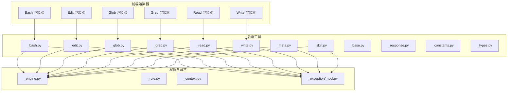
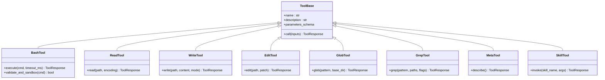
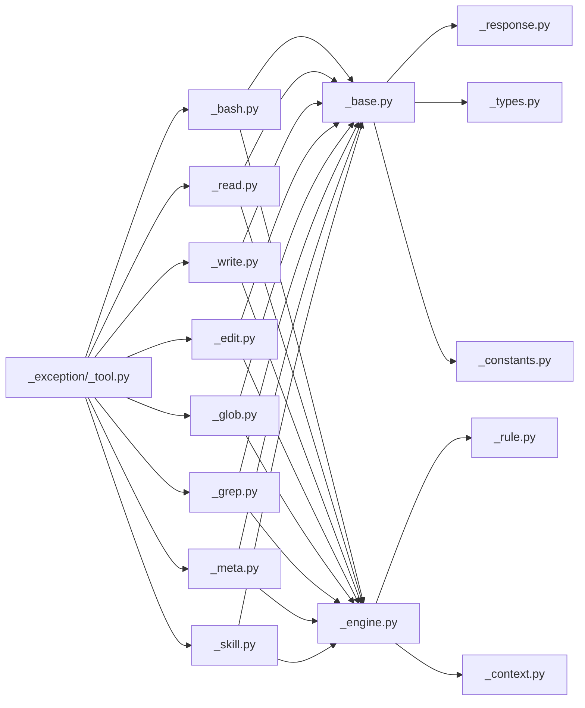

# 内置工具集

<cite>
**本文引用的文件**
- [src/agentscope/tool/_builtin/_bash.py](file://src/agentscope/tool/_builtin/_bash.py)
- [src/agentscope/tool/_builtin/_bash_parser.py](file://src/agentscope/tool/_builtin/_bash_parser.py)
- [src/agentscope/tool/_builtin/_edit.py](file://src/agentscope/tool/_builtin/_edit.py)
- [src/agentscope/tool/_builtin/_glob.py](file://src/agentscope/tool/_builtin/_glob.py)
- [src/agentscope/tool/_builtin/_grep.py](file://src/agentscope/tool/_builtin/_grep.py)
- [src/agentscope/tool/_builtin/_read.py](file://src/agentscope/tool/_builtin/_read.py)
- [src/agentscope/tool/_builtin/_write.py](file://src/agentscope/tool/_builtin/_write.py)
- [src/agentscope/tool/_builtin/_meta.py](file://src/agentscope/tool/_builtin/_meta.py)
- [src/agentscope/tool/_builtin/_skill.py](file://src/agentscope/tool/_builtin/_skill.py)
- [src/agentscope/tool/_base.py](file://src/agentscope/tool/_base.py)
- [src/agentscope/tool/_response.py](file://src/agentscope/tool/_response.py)
- [src/agentscope/tool/_constants.py](file://src/agentscope/tool/_constants.py)
- [src/agentscope/tool/_types.py](file://src/agentscope/tool/_types.py)
- [src/agentscope/permission/_engine.py](file://src/agentscope/permission/_engine.py)
- [src/agentscope/permission/_rule.py](file://src/agentscope/permission/_rule.py)
- [src/agentscope/permission/_context.py](file://src/agentscope/permission/_context.py)
- [src/agentscope/exception/_tool.py](file://src/agentscope/exception/_tool.py)
- [tests/builtin_bash_test.py](file://tests/builtin_bash_test.py)
- [tests/builtin_edit_test.py](file://tests/builtin_edit_test.py)
- [tests/builtin_glob_test.py](file://tests/builtin_glob_test.py)
- [tests/builtin_grep_test.py](file://tests/builtin_grep_test.py)
- [tests/builtin_read_test.py](file://tests/builtin_read_test.py)
- [tests/builtin_write_test.py](file://tests/builtin_write_test.py)
- [examples/web_ui/frontend/src/components/chat/tool-renderers/BashRenderer.tsx](file://examples/web_ui/frontend/src/components/chat/tool-renderers/BashRenderer.tsx)
- [examples/web_ui/frontend/src/components/chat/tool-renderers/EditRenderer.tsx](file://examples/web_ui/frontend/src/components/chat/tool-renderers/EditRenderer.tsx)
- [examples/web_ui/frontend/src/components/chat/tool-renderers/GlobRenderer.tsx](file://examples/web_ui/frontend/src/components/chat/tool-renderers/GlobRenderer.tsx)
- [examples/web_ui/frontend/src/components/chat/tool-renderers/GrepRenderer.tsx](file://examples/web_ui/frontend/src/components/chat/tool-renderers/GrepRenderer.tsx)
- [examples/web_ui/frontend/src/components/chat/tool-renderers/ReadRenderer.tsx](file://examples/web_ui/frontend/src/components/chat/tool-renderers/ReadRenderer.tsx)
- [examples/web_ui/frontend/src/components/chat/tool-renderers/WriteRenderer.tsx](file://examples/web_ui/frontend/src/components/chat/tool-renderers/WriteRenderer.tsx)
</cite>

## 目录
1. [简介](#简介)
2. [项目结构](#项目结构)
3. [核心组件](#核心组件)
4. [架构总览](#架构总览)
5. [详细组件分析](#详细组件分析)
6. [依赖关系分析](#依赖关系分析)
7. [性能考量](#性能考量)
8. [故障排查指南](#故障排查指南)
9. [结论](#结论)
10. [附录](#附录)

## 简介
本文件为 AgentScope 内置工具系统的权威技术文档，覆盖以下内容：
- 工具集合与职责：Bash 命令执行、文件读写、编辑、查找、文本搜索、元信息与技能封装等。
- 安全与权限：权限引擎、规则与上下文，以及 Bash 的安全沙箱约束。
- API 参考：参数、返回值、错误处理与调用约定。
- 使用示例：在智能体中集成工具的最佳实践与常见场景。
- 性能与调试：性能优化建议与调试技巧。

## 项目结构
内置工具位于 Python 包内，前端 Web UI 提供对应的可视化渲染器，测试用例验证各工具行为。

图表来源
- [src/agentscope/tool/_builtin/_bash.py](file://src/agentscope/tool/_builtin/_bash.py)
- [src/agentscope/tool/_builtin/_edit.py](file://src/agentscope/tool/_builtin/_edit.py)
- [src/agentscope/tool/_builtin/_glob.py](file://src/agentscope/tool/_builtin/_glob.py)
- [src/agentscope/tool/_builtin/_grep.py](file://src/agentscope/tool/_builtin/_grep.py)
- [src/agentscope/tool/_builtin/_read.py](file://src/agentscope/tool/_builtin/_read.py)
- [src/agentscope/tool/_builtin/_write.py](file://src/agentscope/tool/_builtin/_write.py)
- [src/agentscope/tool/_builtin/_meta.py](file://src/agentscope/tool/_builtin/_meta.py)
- [src/agentscope/tool/_builtin/_skill.py](file://src/agentscope/tool/_builtin/_skill.py)
- [src/agentscope/tool/_base.py](file://src/agentscope/tool/_base.py)
- [src/agentscope/tool/_response.py](file://src/agentscope/tool/_response.py)
- [src/agentscope/tool/_constants.py](file://src/agentscope/tool/_constants.py)
- [src/agentscope/tool/_types.py](file://src/agentscope/tool/_types.py)
- [src/agentscope/permission/_engine.py](file://src/agentscope/permission/_engine.py)
- [src/agentscope/permission/_rule.py](file://src/agentscope/permission/_rule.py)
- [src/agentscope/permission/_context.py](file://src/agentscope/permission/_context.py)
- [src/agentscope/exception/_tool.py](file://src/agentscope/exception/_tool.py)
- [examples/web_ui/frontend/src/components/chat/tool-renderers/BashRenderer.tsx](file://examples/web_ui/frontend/src/components/chat/tool-renderers/BashRenderer.tsx)
- [examples/web_ui/frontend/src/components/chat/tool-renderers/EditRenderer.tsx](file://examples/web_ui/frontend/src/components/chat/tool-renderers/EditRenderer.tsx)
- [examples/web_ui/frontend/src/components/chat/tool-renderers/GlobRenderer.tsx](file://examples/web_ui/frontend/src/components/chat/tool-renderers/GlobRenderer.tsx)
- [examples/web_ui/frontend/src/components/chat/tool-renderers/GrepRenderer.tsx](file://examples/web_ui/frontend/src/components/chat/tool-renderers/GrepRenderer.tsx)
- [examples/web_ui/frontend/src/components/chat/tool-renderers/ReadRenderer.tsx](file://examples/web_ui/frontend/src/components/chat/tool-renderers/ReadRenderer.tsx)
- [examples/web_ui/frontend/src/components/chat/tool-renderers/WriteRenderer.tsx](file://examples/web_ui/frontend/src/components/chat/tool-renderers/WriteRenderer.tsx)

章节来源
- [src/agentscope/tool/_builtin/_bash.py](file://src/agentscope/tool/_builtin/_bash.py)
- [src/agentscope/tool/_builtin/_edit.py](file://src/agentscope/tool/_builtin/_edit.py)
- [src/agentscope/tool/_builtin/_glob.py](file://src/agentscope/tool/_builtin/_glob.py)
- [src/agentscope/tool/_builtin/_grep.py](file://src/agentscope/tool/_builtin/_grep.py)
- [src/agentscope/tool/_builtin/_read.py](file://src/agentscope/tool/_builtin/_read.py)
- [src/agentscope/tool/_builtin/_write.py](file://src/agentscope/tool/_builtin/_write.py)
- [src/agentscope/tool/_builtin/_meta.py](file://src/agentscope/tool/_builtin/_meta.py)
- [src/agentscope/tool/_builtin/_skill.py](file://src/agentscope/tool/_builtin/_skill.py)
- [src/agentscope/tool/_base.py](file://src/agentscope/tool/_base.py)
- [src/agentscope/tool/_response.py](file://src/agentscope/tool/_response.py)
- [src/agentscope/tool/_constants.py](file://src/agentscope/tool/_constants.py)
- [src/agentscope/tool/_types.py](file://src/agentscope/tool/_types.py)
- [src/agentscope/permission/_engine.py](file://src/agentscope/permission/_engine.py)
- [src/agentscope/permission/_rule.py](file://src/agentscope/permission/_rule.py)
- [src/agentscope/permission/_context.py](file://src/agentscope/permission/_context.py)
- [src/agentscope/exception/_tool.py](file://src/agentscope/exception/_tool.py)
- [examples/web_ui/frontend/src/components/chat/tool-renderers/BashRenderer.tsx](file://examples/web_ui/frontend/src/components/chat/tool-renderers/BashRenderer.tsx)
- [examples/web_ui/frontend/src/components/chat/tool-renderers/EditRenderer.tsx](file://examples/web_ui/frontend/src/components/chat/tool-renderers/EditRenderer.tsx)
- [examples/web_ui/frontend/src/components/chat/tool-renderers/GlobRenderer.tsx](file://examples/web_ui/frontend/src/components/chat/tool-renderers/GlobRenderer.tsx)
- [examples/web_ui/frontend/src/components/chat/tool-renderers/GrepRenderer.tsx](file://examples/web_ui/frontend/src/components/chat/tool-renderers/GrepRenderer.tsx)
- [examples/web_ui/frontend/src/components/chat/tool-renderers/ReadRenderer.tsx](file://examples/web_ui/frontend/src/components/chat/tool-renderers/ReadRenderer.tsx)
- [examples/web_ui/frontend/src/components/chat/tool-renderers/WriteRenderer.tsx](file://examples/web_ui/frontend/src/components/chat/tool-renderers/WriteRenderer.tsx)

## 核心组件
- Bash 命令执行工具：提供受限的 shell 能力，强调优先使用专用工具以提升用户体验与可审核性，并内置安全约束与超时控制。
- 文件系统工具：读取、写入、编辑、查找与文本搜索，均受权限引擎控制并返回标准化结果。
- 元信息与技能封装：用于描述工具能力与桥接外部技能。
- 基础类型与响应模型：统一工具输入输出结构，便于前端渲染与后端处理。

章节来源
- [src/agentscope/tool/_builtin/_bash.py](file://src/agentscope/tool/_builtin/_bash.py)
- [src/agentscope/tool/_builtin/_read.py](file://src/agentscope/tool/_builtin/_read.py)
- [src/agentscope/tool/_builtin/_write.py](file://src/agentscope/tool/_builtin/_write.py)
- [src/agentscope/tool/_builtin/_edit.py](file://src/agentscope/tool/_builtin/_edit.py)
- [src/agentscope/tool/_builtin/_glob.py](file://src/agentscope/tool/_builtin/_glob.py)
- [src/agentscope/tool/_builtin/_grep.py](file://src/agentscope/tool/_builtin/_grep.py)
- [src/agentscope/tool/_builtin/_meta.py](file://src/agentscope/tool/_builtin/_meta.py)
- [src/agentscope/tool/_builtin/_skill.py](file://src/agentscope/tool/_builtin/_skill.py)
- [src/agentscope/tool/_base.py](file://src/agentscope/tool/_base.py)
- [src/agentscope/tool/_response.py](file://src/agentscope/tool/_response.py)

## 架构总览
内置工具通过统一的基类与类型体系组织，权限引擎贯穿所有工具调用，异常模块提供一致的错误语义，前端渲染器负责将工具结果可视化呈现。

图表来源
- [src/agentscope/tool/_builtin/_bash.py](file://src/agentscope/tool/_builtin/_bash.py)
- [src/agentscope/tool/_builtin/_read.py](file://src/agentscope/tool/_builtin/_read.py)
- [src/agentscope/tool/_builtin/_write.py](file://src/agentscope/tool/_builtin/_write.py)
- [src/agentscope/tool/_builtin/_edit.py](file://src/agentscope/tool/_builtin/_edit.py)
- [src/agentscope/tool/_builtin/_glob.py](file://src/agentscope/tool/_builtin/_glob.py)
- [src/agentscope/tool/_builtin/_grep.py](file://src/agentscope/tool/_builtin/_grep.py)
- [src/agentscope/tool/_builtin/_meta.py](file://src/agentscope/tool/_builtin/_meta.py)
- [src/agentscope/tool/_builtin/_skill.py](file://src/agentscope/tool/_builtin/_skill.py)
- [src/agentscope/tool/_base.py](file://src/agentscope/tool/_base.py)

## 详细组件分析

### Bash 命令执行工具
- 功能特性
  - 执行受限的 shell 命令，支持超时控制与工作目录维护建议。
  - 强制优先使用专用工具（如 Glob、Grep、Read、Edit、Write），避免重复造轮子。
  - 提供安全约束与路径处理建议，减少误操作风险。
- 参数与返回
  - 输入：命令字符串、可选超时毫秒数。
  - 返回：标准化工具响应对象，包含状态、输出与错误信息。
- 错误处理
  - 解析失败、执行超时、权限不足或命令不被允许时，抛出工具异常模块定义的错误类型。
- 安全考虑
  - 权限引擎对命令进行评估；建议使用绝对路径、避免危险字符与破坏性操作。
  - 建议在用户明确授权下运行高风险命令。
- 使用示例
  - 在智能体对话中，先通过专用工具完成常见任务；仅当确需时才调用 Bash 工具。
  - 对于需要创建新文件/目录的操作，先使用 Bash 列出父目录确认位置。
- 最佳实践
  - 将 Bash 作为“最后手段”，优先采用更精确、可审计的专用工具。
  - 明确设置超时，避免长时间阻塞。
  - 对含空格的路径使用双引号包裹。

章节来源
- [src/agentscope/tool/_builtin/_bash.py](file://src/agentscope/tool/_builtin/_bash.py)
- [src/agentscope/exception/_tool.py](file://src/agentscope/exception/_tool.py)
- [src/agentscope/permission/_engine.py](file://src/agentscope/permission/_engine.py)
- [tests/builtin_bash_test.py](file://tests/builtin_bash_test.py)
- [examples/web_ui/frontend/src/components/chat/tool-renderers/BashRenderer.tsx](file://examples/web_ui/frontend/src/components/chat/tool-renderers/BashRenderer.tsx)

### 文件读取工具
- 功能特性
  - 按指定编码读取单个文件内容，支持常见文本编码。
- 参数与返回
  - 输入：文件路径、可选编码。
  - 返回：包含内容与元数据的工具响应对象。
- 错误处理
  - 文件不存在、无权限、编码错误等触发工具异常。
- 使用示例
  - 读取配置文件、日志文件或源代码片段。
- 最佳实践
  - 显式指定编码，避免默认编码差异导致的乱码。
  - 对大文件谨慎使用，必要时配合分块读取策略。

章节来源
- [src/agentscope/tool/_builtin/_read.py](file://src/agentscope/tool/_builtin/_read.py)
- [src/agentscope/tool/_response.py](file://src/agentscope/tool/_response.py)
- [tests/builtin_read_test.py](file://tests/builtin_read_test.py)

### 文件写入工具
- 功能特性
  - 将内容写入指定文件，支持覆盖与追加模式。
- 参数与返回
  - 输入：目标路径、内容、写入模式（覆盖/追加）。
  - 返回：包含写入结果与元数据的工具响应对象。
- 错误处理
  - 目标路径不可写、磁盘空间不足、权限不足等触发工具异常。
- 使用示例
  - 生成报告、更新配置或保存中间结果。
- 最佳实践
  - 先读取再比较，避免不必要的覆盖。
  - 对敏感文件使用最小权限原则。

章节来源
- [src/agentscope/tool/_builtin/_write.py](file://src/agentscope/tool/_builtin/_write.py)
- [src/agentscope/tool/_response.py](file://src/agentscope/tool/_response.py)
- [tests/builtin_write_test.py](file://tests/builtin_write_test.py)

### 文件编辑工具
- 功能特性
  - 基于补丁（patch）对文件进行增量修改，避免整文件替换。
- 参数与返回
  - 输入：目标路径、补丁内容。
  - 返回：包含编辑结果与差异摘要的工具响应对象。
- 错误处理
  - 补丁格式错误、目标文件不存在、应用失败等触发工具异常。
- 使用示例
  - 修改函数签名、调整注释或小范围重构。
- 最佳实践
  - 生成精确补丁，确保上下文行正确。
  - 编辑前备份重要文件。

章节来源
- [src/agentscope/tool/_builtin/_edit.py](file://src/agentscope/tool/_builtin/_edit.py)
- [src/agentscope/tool/_response.py](file://src/agentscope/tool/_response.py)
- [tests/builtin_edit_test.py](file://tests/builtin_edit_test.py)

### 文件查找工具（Glob）
- 功能特性
  - 基于通配符模式在指定目录下递归查找文件与目录。
- 参数与返回
  - 输入：模式字符串、基准目录。
  - 返回：包含匹配结果列表与统计信息的工具响应对象。
- 错误处理
  - 模式非法、目录不存在、权限不足等触发工具异常。
- 使用示例
  - 查找所有 .py/.md 文件、定位构建产物或日志文件。
- 最佳实践
  - 使用具体模式缩小范围，避免根目录全量扫描。
  - 结合 Bash 或其他工具进行二次过滤。

章节来源
- [src/agentscope/tool/_builtin/_glob.py](file://src/agentscope/tool/_builtin/_glob.py)
- [src/agentscope/tool/_response.py](file://src/agentscope/tool/_response.py)
- [tests/builtin_glob_test.py](file://tests/builtin_glob_test.py)

### 文本搜索工具（Grep）
- 功能特性
  - 在一个或多个文件中按正则表达式搜索匹配行，支持多文件与标志位。
- 参数与返回
  - 输入：正则表达式、文件路径列表、可选标志（大小写、多行等）。
  - 返回：包含匹配行、上下文与统计信息的工具响应对象。
- 错误处理
  - 正则非法、文件不可读、权限不足等触发工具异常。
- 使用示例
  - 查找特定函数调用、错误日志或配置项。
- 最佳实践
  - 使用锚点与边界限定提高准确性。
  - 对大文件集合分批处理，避免内存压力。

章节来源
- [src/agentscope/tool/_builtin/_grep.py](file://src/agentscope/tool/_builtin/_grep.py)
- [src/agentscope/tool/_response.py](file://src/agentscope/tool/_response.py)
- [tests/builtin_grep_test.py](file://tests/builtin_grep_test.py)

### 元信息与技能封装工具
- 功能特性
  - 描述工具自身能力与参数，或桥接外部技能执行。
- 参数与返回
  - 输入：描述请求或技能调用参数。
  - 返回：包含描述信息或技能执行结果的工具响应对象。
- 错误处理
  - 描述信息缺失、技能名称未知、参数不合法等触发工具异常。
- 使用示例
  - 在智能体对话中动态暴露工具能力，或调用外部技能完成复杂任务。
- 最佳实践
  - 保持描述信息简洁准确，便于权限审核与用户理解。

章节来源
- [src/agentscope/tool/_builtin/_meta.py](file://src/agentscope/tool/_builtin/_meta.py)
- [src/agentscope/tool/_builtin/_skill.py](file://src/agentscope/tool/_builtin/_skill.py)
- [src/agentscope/tool/_response.py](file://src/agentscope/tool/_response.py)

## 依赖关系分析
- 组件耦合
  - 所有工具均继承自统一基类，遵循相同的调用协议与响应模型。
  - 权限引擎在调用前进行规则评估，上下文提供调用环境信息。
  - 异常模块统一错误类型，便于上层捕获与处理。
- 外部依赖
  - 前端渲染器依赖后端工具响应结构，确保一致的交互体验。
- 潜在循环依赖
  - 当前设计通过基类与响应模块解耦，未见循环导入迹象。

图表来源
- [src/agentscope/tool/_base.py](file://src/agentscope/tool/_base.py)
- [src/agentscope/tool/_response.py](file://src/agentscope/tool/_response.py)
- [src/agentscope/tool/_types.py](file://src/agentscope/tool/_types.py)
- [src/agentscope/tool/_constants.py](file://src/agentscope/tool/_constants.py)
- [src/agentscope/tool/_builtin/_bash.py](file://src/agentscope/tool/_builtin/_bash.py)
- [src/agentscope/tool/_builtin/_read.py](file://src/agentscope/tool/_builtin/_read.py)
- [src/agentscope/tool/_builtin/_write.py](file://src/agentscope/tool/_builtin/_write.py)
- [src/agentscope/tool/_builtin/_edit.py](file://src/agentscope/tool/_builtin/_edit.py)
- [src/agentscope/tool/_builtin/_glob.py](file://src/agentscope/tool/_builtin/_glob.py)
- [src/agentscope/tool/_builtin/_grep.py](file://src/agentscope/tool/_builtin/_grep.py)
- [src/agentscope/tool/_builtin/_meta.py](file://src/agentscope/tool/_builtin/_meta.py)
- [src/agentscope/tool/_builtin/_skill.py](file://src/agentscope/tool/_builtin/_skill.py)
- [src/agentscope/permission/_engine.py](file://src/agentscope/permission/_engine.py)
- [src/agentscope/permission/_rule.py](file://src/agentscope/permission/_rule.py)
- [src/agentscope/permission/_context.py](file://src/agentscope/permission/_context.py)
- [src/agentscope/exception/_tool.py](file://src/agentscope/exception/_tool.py)

章节来源
- [src/agentscope/tool/_base.py](file://src/agentscope/tool/_base.py)
- [src/agentscope/tool/_response.py](file://src/agentscope/tool/_response.py)
- [src/agentscope/tool/_types.py](file://src/agentscope/tool/_types.py)
- [src/agentscope/tool/_constants.py](file://src/agentscope/tool/_constants.py)
- [src/agentscope/tool/_builtin/_bash.py](file://src/agentscope/tool/_builtin/_bash.py)
- [src/agentscope/tool/_builtin/_read.py](file://src/agentscope/tool/_builtin/_read.py)
- [src/agentscope/tool/_builtin/_write.py](file://src/agentscope/tool/_builtin/_write.py)
- [src/agentscope/tool/_builtin/_edit.py](file://src/agentscope/tool/_builtin/_edit.py)
- [src/agentscope/tool/_builtin/_glob.py](file://src/agentscope/tool/_builtin/_glob.py)
- [src/agentscope/tool/_builtin/_grep.py](file://src/agentscope/tool/_builtin/_grep.py)
- [src/agentscope/tool/_builtin/_meta.py](file://src/agentscope/tool/_builtin/_meta.py)
- [src/agentscope/tool/_builtin/_skill.py](file://src/agentscope/tool/_builtin/_skill.py)
- [src/agentscope/permission/_engine.py](file://src/agentscope/permission/_engine.py)
- [src/agentscope/permission/_rule.py](file://src/agentscope/permission/_rule.py)
- [src/agentscope/permission/_context.py](file://src/agentscope/permission/_context.py)
- [src/agentscope/exception/_tool.py](file://src/agentscope/exception/_tool.py)

## 性能考量
- I/O 优化
  - 读取/写入/编辑：对大文件采用流式处理与分块读取，避免一次性加载到内存。
  - 查找与搜索：使用精确模式与目录限制，减少扫描范围。
- 并发与超时
  - Bash 工具显式设置超时，防止长时间阻塞。
  - 搜索工具对多文件集合分批处理，降低峰值内存占用。
- 前端渲染
  - 渲染器按需显示关键字段，避免冗余信息造成卡顿。

## 故障排查指南
- 常见问题
  - 权限不足：检查调用上下文与规则配置，确保具备相应权限。
  - 路径错误：确认使用绝对路径或在 Bash 中保持当前工作目录一致性。
  - 正则/模式非法：检查正则语法与通配符格式，必要时简化模式。
  - 超时与阻塞：调整 Bash 超时时间，或改用专用工具替代长耗时命令。
- 调试技巧
  - 启用详细日志，记录工具调用参数与返回状态。
  - 使用前端渲染器快速核对工具输出结构是否符合预期。
  - 在测试用例中复现问题，逐步缩小范围。

章节来源
- [src/agentscope/exception/_tool.py](file://src/agentscope/exception/_tool.py)
- [src/agentscope/permission/_engine.py](file://src/agentscope/permission/_engine.py)
- [src/agentscope/permission/_rule.py](file://src/agentscope/permission/_rule.py)
- [src/agentscope/permission/_context.py](file://src/agentscope/permission/_context.py)
- [examples/web_ui/frontend/src/components/chat/tool-renderers/BashRenderer.tsx](file://examples/web_ui/frontend/src/components/chat/tool-renderers/BashRenderer.tsx)
- [examples/web_ui/frontend/src/components/chat/tool-renderers/EditRenderer.tsx](file://examples/web_ui/frontend/src/components/chat/tool-renderers/EditRenderer.tsx)
- [examples/web_ui/frontend/src/components/chat/tool-renderers/GlobRenderer.tsx](file://examples/web_ui/frontend/src/components/chat/tool-renderers/GlobRenderer.tsx)
- [examples/web_ui/frontend/src/components/chat/tool-renderers/GrepRenderer.tsx](file://examples/web_ui/frontend/src/components/chat/tool-renderers/GrepRenderer.tsx)
- [examples/web_ui/frontend/src/components/chat/tool-renderers/ReadRenderer.tsx](file://examples/web_ui/frontend/src/components/chat/tool-renderers/ReadRenderer.tsx)
- [examples/web_ui/frontend/src/components/chat/tool-renderers/WriteRenderer.tsx](file://examples/web_ui/frontend/src/components/chat/tool-renderers/WriteRenderer.tsx)

## 结论
AgentScope 内置工具体系以统一的基类与响应模型为基础，结合权限引擎与异常处理，提供了安全、可审计且易扩展的工具集。通过优先使用专用工具与合理的超时与权限控制，可在保证安全性的同时提升智能体的任务完成效率与用户体验。

## 附录
- API 参考与参数说明
  - 所有工具均遵循统一的调用协议：接收结构化参数，返回结构化响应，错误通过统一异常类型抛出。
  - 详见各工具实现文件与响应模型定义。
- 实际使用示例
  - 在智能体对话中，优先使用 Read/Write/Edit/Glob/Grep 等专用工具；仅在确需时使用 Bash 工具，并严格遵守安全约束与超时设置。
  - 借助前端渲染器直观展示工具结果，便于用户确认与二次操作。