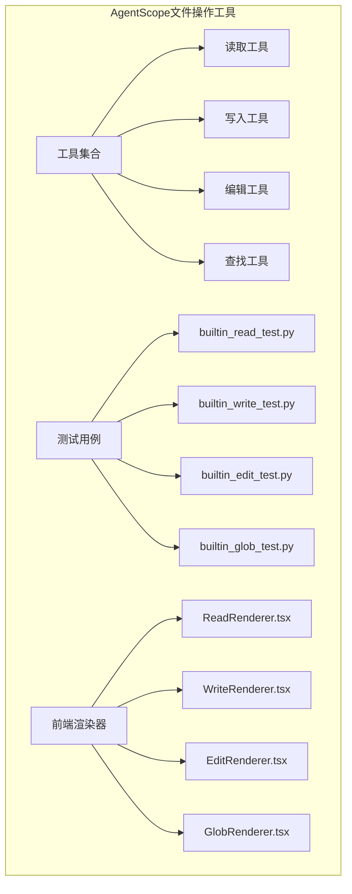
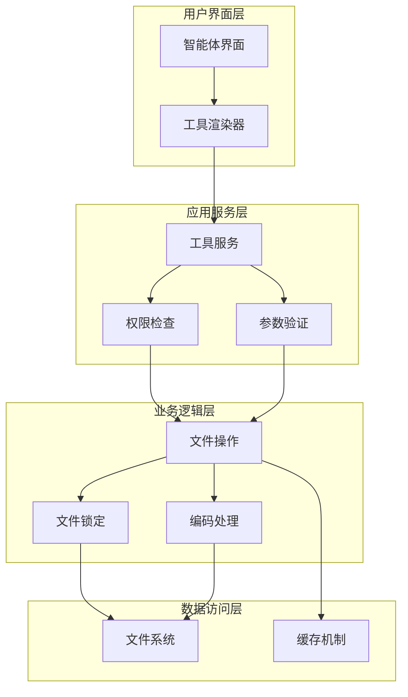
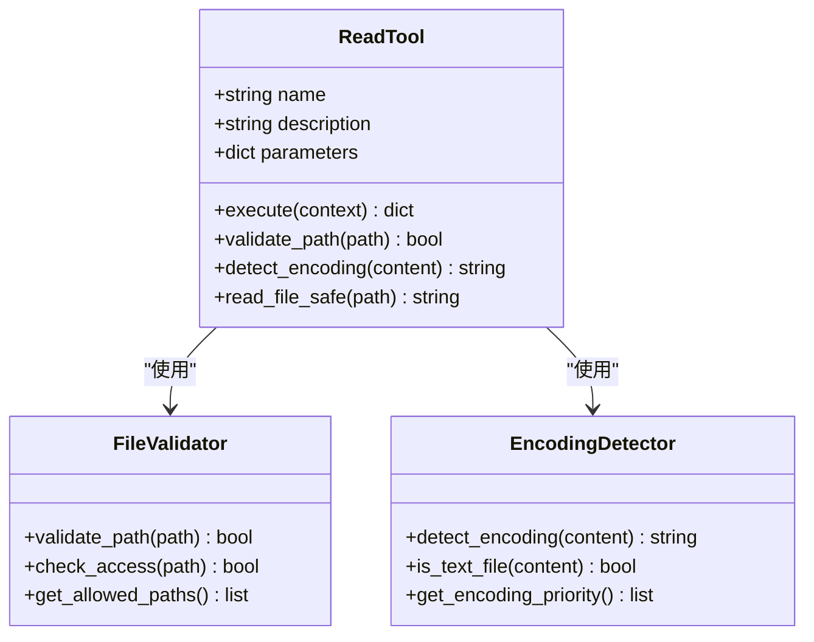
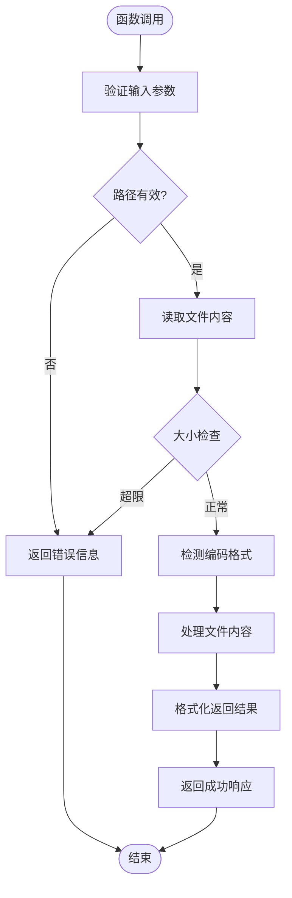
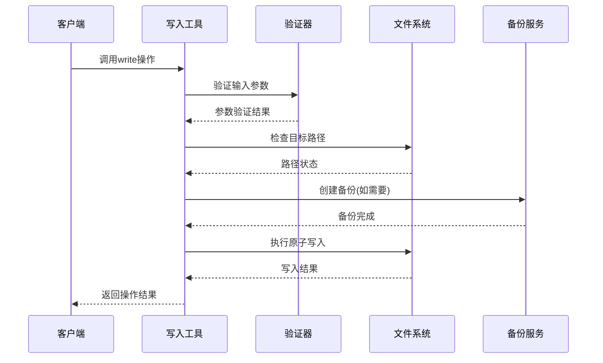
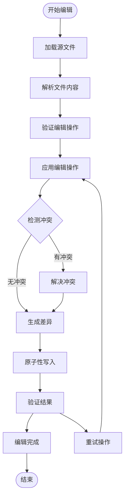
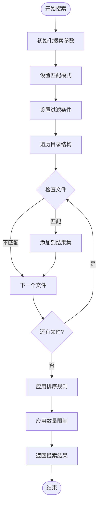
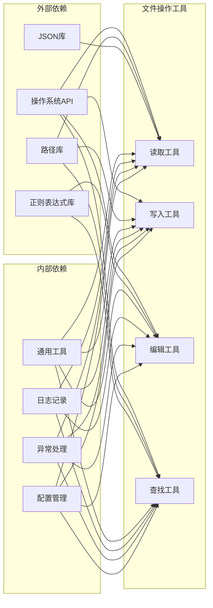

# 文件操作工具

<cite>
**本文档引用的文件**
- [_read.py](file://src/agentscope/tool/_builtin/_read.py)
- [_write.py](file://src/agentscope/tool/_builtin/_write.py)
- [_edit.py](file://src/agentscope/tool/_builtin/_edit.py)
- [_glob.py](file://src/agentscope/tool/_builtin/_glob.py)
- [builtin_read_test.py](file://tests/builtin_read_test.py)
- [builtin_write_test.py](file://tests/builtin_write_test.py)
- [builtin_edit_test.py](file://tests/builtin_edit_test.py)
- [builtin_glob_test.py](file://tests/builtin_glob_test.py)
- [ReadRenderer.tsx](file://examples/web_ui/frontend/src/components/chat/tool-renderers/ReadRenderer.tsx)
- [WriteRenderer.tsx](file://examples/web_ui/frontend/src/components/chat/tool-renderers/WriteRenderer.tsx)
- [EditRenderer.tsx](file://examples/web_ui/frontend/src/components/chat/tool-renderers/EditRenderer.tsx)
- [GlobRenderer.tsx](file://examples/web_ui/frontend/src/components/chat/tool-renderers/GlobRenderer.tsx)
</cite>

## 目录
1. [简介](#简介)
2. [项目结构](#项目结构)
3. [核心组件](#核心组件)
4. [架构概览](#架构概览)
5. [详细组件分析](#详细组件分析)
6. [依赖关系分析](#依赖关系分析)
7. [性能考虑](#性能考虑)
8. [故障排除指南](#故障排除指南)
9. [结论](#结论)

## 简介
AgentScope的文件操作工具集提供了智能体在受控环境中安全执行文件读取、写入、编辑和查找操作的能力。这些工具通过严格的权限控制、路径验证和错误处理机制，确保文件操作的安全性和可靠性。

## 项目结构
文件操作工具位于AgentScope的核心模块中，采用模块化设计，每个工具都有独立的实现文件和对应的测试用例。

**图表来源**
- [src/agentscope/tool/_builtin/_read.py](file://src/agentscope/tool/_builtin/_read.py)
- [src/agentscope/tool/_builtin/_write.py](file://src/agentscope/tool/_builtin/_write.py)
- [src/agentscope/tool/_builtin/_edit.py](file://src/agentscope/tool/_builtin/_edit.py)
- [src/agentscope/tool/_builtin/_glob.py](file://src/agentscope/tool/_builtin/_glob.py)

**章节来源**
- [src/agentscope/tool/_builtin/_read.py](file://src/agentscope/tool/_builtin/_read.py)
- [src/agentscope/tool/_builtin/_write.py](file://src/agentscope/tool/_builtin/_write.py)
- [src/agentscope/tool/_builtin/_edit.py](file://src/agentscope/tool/_builtin/_edit.py)
- [src/agentscope/tool/_builtin/_glob.py](file://src/agentscope/tool/_builtin/_glob.py)

## 核心组件
文件操作工具集包含四个核心组件：读取工具、写入工具、编辑工具和查找工具。每个工具都实现了统一的接口规范，支持异步操作和错误处理。

### 工具特性概述
- **安全性**：所有文件操作都在受控工作空间内执行
- **权限控制**：基于路径白名单的访问控制机制
- **错误处理**：完整的异常捕获和错误信息反馈
- **编码支持**：多字符编码格式自动检测和处理
- **并发安全**：线程安全的文件操作实现

**章节来源**
- [src/agentscope/tool/_builtin/_read.py](file://src/agentscope/tool/_builtin/_read.py)
- [src/agentscope/tool/_builtin/_write.py](file://src/agentscope/tool/_builtin/_write.py)
- [src/agentscope/tool/_builtin/_edit.py](file://src/agentscope/tool/_builtin/_edit.py)
- [src/agentscope/tool/_builtin/_glob.py](file://src/agentscope/tool/_builtin/_glob.py)

## 架构概览
文件操作工具采用分层架构设计，从底层文件系统操作到上层业务逻辑封装，形成了清晰的职责分离。

**图表来源**
- [src/agentscope/tool/_builtin/_read.py](file://src/agentscope/tool/_builtin/_read.py)
- [src/agentscope/tool/_builtin/_write.py](file://src/agentscope/tool/_builtin/_write.py)
- [src/agentscope/tool/_builtin/_edit.py](file://src/agentscope/tool/_builtin/_edit.py)
- [src/agentscope/tool/_builtin/_glob.py](file://src/agentscope/tool/_builtin/_glob.py)

## 详细组件分析

### 读取工具（Read）
读取工具负责从指定路径安全地读取文件内容，支持多种文件格式和编码方式。

#### 核心功能特性
- **多格式支持**：文本文件、JSON、CSV、XML等格式自动识别
- **编码检测**：UTF-8、GBK、GB2312等编码自动检测
- **大小限制**：防止大文件读取导致内存溢出
- **路径验证**：严格的工作空间路径限制

#### API接口定义

**图表来源**
- [src/agentscope/tool/_builtin/_read.py](file://src/agentscope/tool/_builtin/_read.py)

#### 参数配置说明
- **path**：必需参数，要读取的文件绝对路径
- **max_size**：可选参数，最大允许读取大小（字节）
- **encoding**：可选参数，指定文件编码格式
- **return_format**：可选参数，返回数据格式类型

#### 返回值格式

**图表来源**
- [src/agentscope/tool/_builtin/_read.py](file://src/agentscope/tool/_builtin/_read.py)

**章节来源**
- [src/agentscope/tool/_builtin/_read.py](file://src/agentscope/tool/_builtin/_read.py)
- [builtin_read_test.py](file://tests/builtin_read_test.py)

### 写入工具（Write）
写入工具提供安全的文件创建和内容写入功能，支持原子性写入和备份机制。

#### 核心功能特性
- **原子写入**：避免部分写入导致的数据损坏
- **备份机制**：重要文件修改前自动备份
- **权限管理**：基于工作空间的写入权限控制
- **冲突检测**：检测并处理文件写入冲突

#### API接口流程

**图表来源**
- [src/agentscope/tool/_builtin/_write.py](file://src/agentscope/tool/_builtin/_write.py)

#### 参数配置
- **path**：必需参数，目标文件路径
- **content**：必需参数，要写入的内容
- **mode**：可选参数，文件打开模式（覆盖/追加）
- **encoding**：可选参数，指定编码格式
- **backup**：可选参数，是否启用备份机制

#### 错误处理机制
- **路径错误**：路径不存在或无权限访问
- **磁盘空间不足**：可用空间小于文件大小
- **编码错误**：内容编码与指定格式不匹配
- **原子性失败**：写入过程中断导致的恢复

**章节来源**
- [src/agentscope/tool/_builtin/_write.py](file://src/agentscope/tool/_builtin/_write.py)
- [builtin_write_test.py](file://tests/builtin_write_test.py)

### 编辑工具（Edit）
编辑工具提供文件内容的精确修改能力，支持行级编辑和块级替换。

#### 核心功能特性
- **行级编辑**：支持插入、删除、替换特定行
- **块级操作**：批量内容替换和格式化
- **正则表达式**：支持复杂的模式匹配和替换
- **差异显示**：显示编辑前后的文件差异

#### 编辑操作流程

**图表来源**
- [src/agentscope/tool/_builtin/_edit.py](file://src/agentscope/tool/_builtin/_edit.py)

#### 支持的编辑操作
- **insert_line**：在指定位置插入新行
- **delete_line**：删除指定行
- **replace_content**：替换文件内容
- **regex_replace**：基于正则表达式的批量替换
- **format_code**：代码格式化和美化

**章节来源**
- [src/agentscope/tool/_builtin/_edit.py](file://src/agentscope/tool/_builtin/_edit.py)
- [builtin_edit_test.py](file://tests/builtin_edit_test.py)

### 查找工具（Glob）
查找工具提供强大的文件搜索和匹配功能，支持复杂的通配符模式和过滤条件。

#### 核心功能特性
- **通配符支持**：支持*, ?, [], **等高级通配符
- **递归搜索**：深度遍历目录结构
- **过滤条件**：按文件类型、大小、时间等条件过滤
- **结果排序**：支持多种排序方式和自定义排序规则

#### 搜索算法实现

**图表来源**
- [src/agentscope/tool/_builtin/_glob.py](file://src/agentscope/tool/_builtin/_glob.py)

#### 搜索模式语法
- **通配符**：`*` 匹配任意字符序列，`?` 匹配单个字符
- **字符类**：`[abc]` 匹配方括号内的任一字符
- **范围匹配**：`[a-z]` 匹配指定范围内的字符
- **递归匹配**：`**` 匹配任意目录层级

#### 过滤选项
- **file_types**：文件类型过滤（如txt, py, json）
- **min_size/max_size**：文件大小范围过滤
- **modified_after/modified_before**：修改时间范围过滤
- **case_sensitive**：大小写敏感性控制

**章节来源**
- [src/agentscope/tool/_builtin/_glob.py](file://src/agentscope/tool/_builtin/_glob.py)
- [builtin_glob_test.py](file://tests/builtin_glob_test.py)

## 依赖关系分析

**图表来源**
- [src/agentscope/tool/_builtin/_read.py](file://src/agentscope/tool/_builtin/_read.py)
- [src/agentscope/tool/_builtin/_write.py](file://src/agentscope/tool/_builtin/_write.py)
- [src/agentscope/tool/_builtin/_edit.py](file://src/agentscope/tool/_builtin/_edit.py)
- [src/agentscope/tool/_builtin/_glob.py](file://src/agentscope/tool/_builtin/_glob.py)

**章节来源**
- [src/agentscope/tool/_builtin/_read.py](file://src/agentscope/tool/_builtin/_read.py)
- [src/agentscope/tool/_builtin/_write.py](file://src/agentscope/tool/_builtin/_write.py)
- [src/agentscope/tool/_builtin/_edit.py](file://src/agentscope/tool/_builtin/_edit.py)
- [src/agentscope/tool/_builtin/_glob.py](file://src/agentscope/tool/_builtin/_glob.py)

## 性能考虑
文件操作工具在设计时充分考虑了性能优化，采用了多种策略来提升执行效率。

### 缓存机制
- **文件内容缓存**：频繁访问的文件内容缓存在内存中
- **路径解析缓存**：路径验证结果缓存减少重复计算
- **编码检测缓存**：文件编码信息缓存避免重复检测

### 异步处理
- **非阻塞I/O**：使用异步文件操作避免主线程阻塞
- **并发控制**：限制同时进行的文件操作数量
- **资源池管理**：文件句柄和连接池的高效管理

### 内存优化
- **流式处理**：大文件采用流式读取避免内存溢出
- **分块处理**：大数据量操作分块处理降低内存占用
- **及时释放**：及时释放不再使用的资源和缓冲区

## 故障排除指南

### 常见错误类型及解决方案

#### 权限相关错误
- **错误现象**：文件无法读取或写入
- **可能原因**：工作空间外路径访问、权限不足
- **解决方案**：检查路径是否在允许范围内，确认文件权限设置

#### 编码相关错误
- **错误现象**：文件内容显示乱码或解析失败
- **可能原因**：编码格式不匹配、BOM标记问题
- **解决方案**：指定正确的编码格式，使用编码检测功能

#### 磁盘空间错误
- **错误现象**：写入操作失败
- **可能原因**：磁盘空间不足、存储权限问题
- **解决方案**：清理磁盘空间，检查存储权限

#### 文件锁定错误
- **错误现象**：文件被其他进程占用
- **可能原因**：文件正在被其他程序使用
- **解决方案**：等待文件释放，或重启相关服务

### 调试技巧
- **启用详细日志**：查看文件操作的详细执行过程
- **监控资源使用**：观察内存和磁盘使用情况
- **测试环境隔离**：在独立环境中测试文件操作

**章节来源**
- [builtin_read_test.py](file://tests/builtin_read_test.py)
- [builtin_write_test.py](file://tests/builtin_write_test.py)
- [builtin_edit_test.py](file://tests/builtin_edit_test.py)
- [builtin_glob_test.py](file://tests/builtin_glob_test.py)

## 结论
AgentScope的文件操作工具集通过精心设计的安全机制、完善的错误处理和高效的性能优化，为智能体提供了可靠、安全的文件操作能力。这些工具不仅满足了基本的文件读写需求，还提供了高级的编辑和查找功能，适用于各种复杂的文件操作场景。

工具的设计充分考虑了生产环境的需求，包括权限控制、资源管理、错误恢复等多个方面，确保了系统的稳定性和可靠性。通过合理的使用方式和最佳实践，可以充分发挥这些工具的潜力，为智能体应用提供强大的文件操作支持。