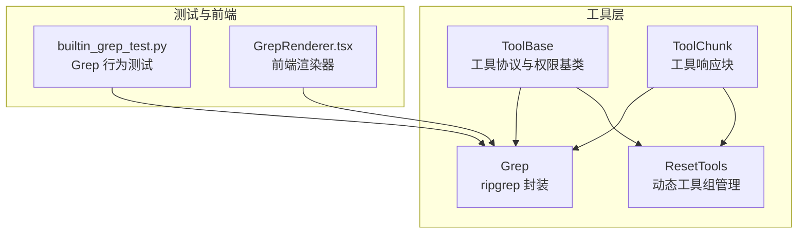
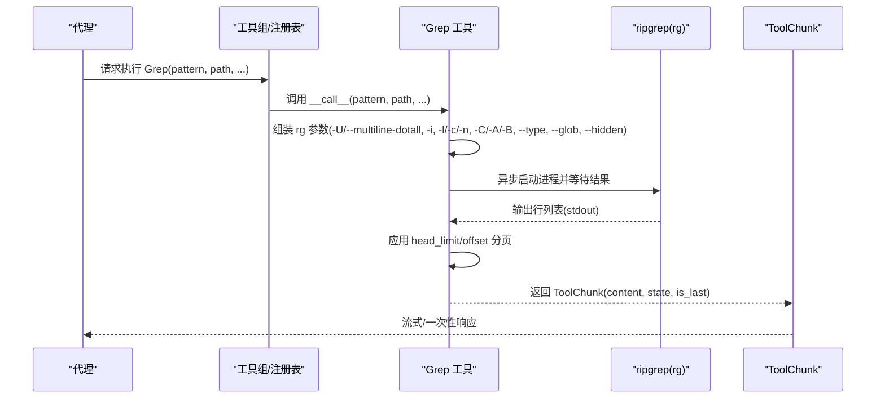
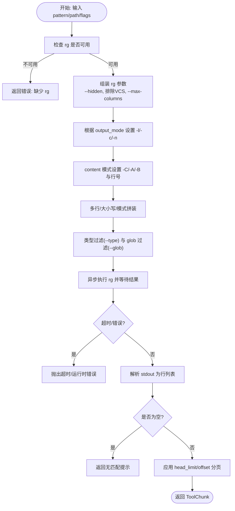
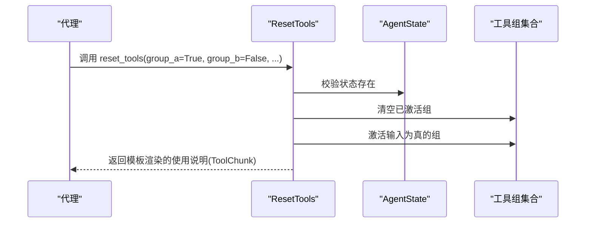
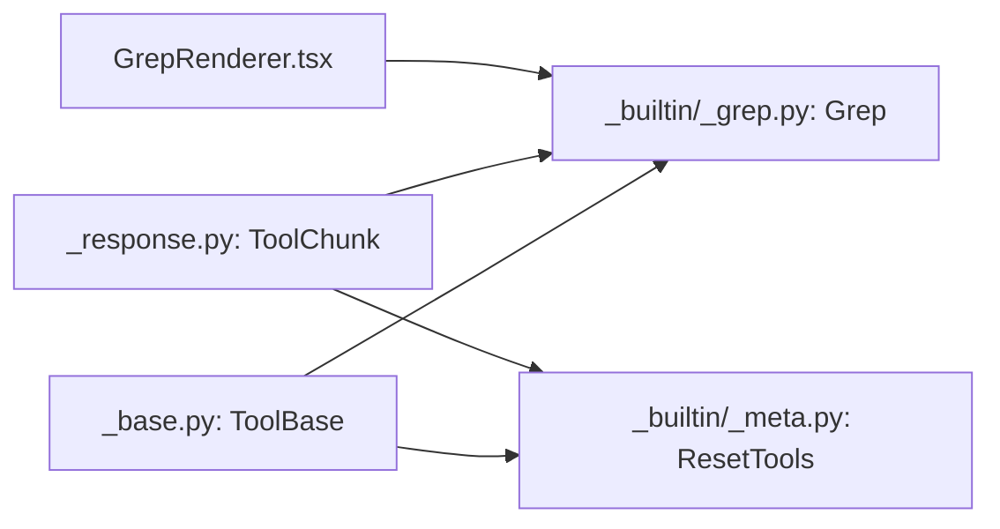

# 文本搜索工具

<cite>
**本文引用的文件**
- [src/agentscope/tool/_builtin/_grep.py](file://src/agentscope/tool/_builtin/_grep.py)
- [src/agentscope/tool/_builtin/_meta.py](file://src/agentscope/tool/_builtin/_meta.py)
- [src/agentscope/tool/_base.py](file://src/agentscope/tool/_base.py)
- [src/agentscope/tool/_response.py](file://src/agentscope/tool/_response.py)
- [tests/builtin_grep_test.py](file://tests/builtin_grep_test.py)
- [examples/web_ui/frontend/src/components/chat/tool-renderers/GrepRenderer.tsx](file://examples/web_ui/frontend/src/components/chat/tool-renderers/GrepRenderer.tsx)
</cite>

## 目录
1. [简介](#简介)
2. [项目结构](#项目结构)
3. [核心组件](#核心组件)
4. [架构总览](#架构总览)
5. [详细组件分析](#详细组件分析)
6. [依赖关系分析](#依赖关系分析)
7. [性能考量](#性能考量)
8. [故障排查指南](#故障排查指南)
9. [结论](#结论)
10. [附录：API 参考与最佳实践](#附录api-参考与最佳实践)

## 简介
本文件面向 AgentScope 的文本搜索工具，系统性阐述以下内容：
- Grep 文本搜索工具：功能特性、正则表达式支持、搜索算法实现（基于 ripgrep）、输出模式与结果过滤、权限控制与路径匹配建议。
- Meta 元数据工具：动态管理工具组的能力、输入模式、响应模板与状态注入。
- 完整 API 参考：参数、输出格式、错误处理与流式响应。
- 性能优化策略：索引构建思路、缓存机制、超时与限流、并行处理建议。
- 正则表达式语法支持、特殊字符转义与性能考虑。
- 实际使用示例：简单文本匹配、复杂模式搜索、大规模文件处理的最佳实践。
- 调试技巧、性能调优与常见问题解决方案。

## 项目结构
围绕文本搜索与工具组管理的关键文件组织如下：
- 工具基类与协议：定义工具的统一接口、权限模型、响应结构与危险路径检测。
- Grep 搜索工具：封装 ripgrep 的调用、参数映射、超时与错误处理、输出模式与分页。
- Meta 工具：动态激活/停用工具组，返回使用说明模板。
- 测试与前端渲染：验证 Grep 行为、在 Web UI 中渲染 Grep 调用参数。

图表来源
- [src/agentscope/tool/_base.py:35-212](file://src/agentscope/tool/_base.py#L35-L212)
- [src/agentscope/tool/_builtin/_grep.py:42-465](file://src/agentscope/tool/_builtin/_grep.py#L42-L465)
- [src/agentscope/tool/_builtin/_meta.py:21-129](file://src/agentscope/tool/_builtin/_meta.py#L21-L129)
- [src/agentscope/tool/_response.py:11-145](file://src/agentscope/tool/_response.py#L11-L145)
- [tests/builtin_grep_test.py:15-254](file://tests/builtin_grep_test.py#L15-L254)
- [examples/web_ui/frontend/src/components/chat/tool-renderers/GrepRenderer.tsx:1-30](file://examples/web_ui/frontend/src/components/chat/tool-renderers/GrepRenderer.tsx#L1-L30)

章节来源
- [src/agentscope/tool/_base.py:35-212](file://src/agentscope/tool/_base.py#L35-L212)
- [src/agentscope/tool/_builtin/_grep.py:42-465](file://src/agentscope/tool/_builtin/_grep.py#L42-L465)
- [src/agentscope/tool/_builtin/_meta.py:21-129](file://src/agentscope/tool/_builtin/_meta.py#L21-L129)
- [src/agentscope/tool/_response.py:11-145](file://src/agentscope/tool/_response.py#L11-L145)
- [tests/builtin_grep_test.py:15-254](file://tests/builtin_grep_test.py#L15-L254)
- [examples/web_ui/frontend/src/components/chat/tool-renderers/GrepRenderer.tsx:1-30](file://examples/web_ui/frontend/src/components/chat/tool-renderers/GrepRenderer.tsx#L1-L30)

## 核心组件
- Grep 工具：基于 ripgrep 的高性能全文检索，支持正则、大小写不敏感、多行模式、上下文行、类型过滤、glob 过滤、隐藏文件与 VCS 排除、最大列宽限制、超时控制与结果分页。
- Meta 工具（ResetTools）：根据输入布尔值动态激活/停用工具组，并返回模板化的使用说明；要求注入 AgentState。
- 工具基类与响应：统一的工具协议、权限检查钩子、建议规则生成、危险路径检测；ToolChunk 提供流式响应与聚合。

章节来源
- [src/agentscope/tool/_builtin/_grep.py:42-465](file://src/agentscope/tool/_builtin/_grep.py#L42-L465)
- [src/agentscope/tool/_builtin/_meta.py:21-129](file://src/agentscope/tool/_builtin/_meta.py#L21-L129)
- [src/agentscope/tool/_base.py:35-212](file://src/agentscope/tool/_base.py#L35-L212)
- [src/agentscope/tool/_response.py:11-145](file://src/agentscope/tool/_response.py#L11-L145)

## 架构总览
Grep 通过异步子进程调用 ripgrep，将参数映射到 rg 命令行选项；Meta 工具接收 AgentState 并更新工具组集合，随后返回模板化说明。两者均遵循 ToolBase 协议，具备权限检查与规则建议能力。

图表来源
- [src/agentscope/tool/_builtin/_grep.py:258-465](file://src/agentscope/tool/_builtin/_grep.py#L258-L465)
- [src/agentscope/tool/_response.py:11-145](file://src/agentscope/tool/_response.py#L11-L145)

## 详细组件分析

### Grep 文本搜索工具
- 功能特性
  - 支持完整正则语法（含多行模式），大小写不敏感，上下文行展示，类型过滤与 glob 过滤，隐藏文件与 VCS 目录排除，最大列宽限制，超时控制与错误传播。
  - 输出模式：仅文件路径、匹配计数、内容（可带行号与上下文）。
  - 结果分页：head_limit 与 offset 控制返回数量与偏移。
- 正则表达式支持
  - 多行模式：启用 -U 与 --multiline-dotall，使 . 匹配换行符，支持跨行模式。
  - 特殊字符转义：当 pattern 以负号开头时使用 -e 明确传递，避免被误认为命令行选项。
  - 错误处理：ripgrep 解析错误由外部返回，捕获后转换为 ToolChunk 错误状态。
- 搜索算法实现
  - 基于 ripgrep 的二进制实现，具备高性能与丰富的正则能力；Grep 仅负责参数拼装与结果整形。
- 权限与路径匹配
  - 读操作，权限检查直接放行；提供 match_rule 用于按路径 glob 匹配，generate_suggestions 生成基于绝对路径的 “/**” 规则建议。
- 输出与过滤
  - 根据 output_mode 决定 -l/-c/-n；content 模式下支持 -C/-A/-B 与行号；head_limit/offset 与默认上限配合实现分页提示。

图表来源
- [src/agentscope/tool/_builtin/_grep.py:338-465](file://src/agentscope/tool/_builtin/_grep.py#L338-L465)
- [src/agentscope/tool/_builtin/_grep.py:258-298](file://src/agentscope/tool/_builtin/_grep.py#L258-L298)

章节来源
- [src/agentscope/tool/_builtin/_grep.py:42-465](file://src/agentscope/tool/_builtin/_grep.py#L42-L465)
- [tests/builtin_grep_test.py:81-201](file://tests/builtin_grep_test.py#L81-L201)

### Meta 元数据工具（ResetTools）
- 作用
  - 动态激活/停用工具组，输入为各工具组名称对应的布尔值；未显式置真者一律停用。
  - 需要注入 AgentState 才能执行；否则抛出开发者导向异常。
  - 使用模板渲染“已激活工具组”的使用说明，便于上下文管理与提示。
- 输入模式
  - 动态 JSON Schema：基于当前可用工具组生成字段，字段名为组名，类型为布尔，描述来自组描述。
- 响应
  - 返回 ToolChunk，内容为模板渲染后的文本，便于在对话中展示使用说明。

图表来源
- [src/agentscope/tool/_builtin/_meta.py:88-129](file://src/agentscope/tool/_builtin/_meta.py#L88-L129)

章节来源
- [src/agentscope/tool/_builtin/_meta.py:21-129](file://src/agentscope/tool/_builtin/_meta.py#L21-L129)
- [src/agentscope/tool/_base.py:78-144](file://src/agentscope/tool/_base.py#L78-L144)

### 工具基类与响应模型
- 工具基类
  - 定义工具名称、描述、输入模式、并发安全、只读标记、外部工具标记、状态注入标记等。
  - 提供权限检查钩子、规则匹配与建议生成的默认实现；具体工具可覆盖以实现细粒度控制。
  - 危险路径检测：对敏感文件与目录进行大小写不敏感匹配，防止误操作。
- 响应模型
  - ToolChunk：流式响应块，包含内容块、状态、是否最后一条、元数据与唯一标识。
  - ToolResponse：完整响应，支持累积多个 ToolChunk 并合并相邻文本块。

章节来源
- [src/agentscope/tool/_base.py:35-212](file://src/agentscope/tool/_base.py#L35-L212)
- [src/agentscope/tool/_response.py:11-145](file://src/agentscope/tool/_response.py#L11-L145)

## 依赖关系分析
- Grep 依赖 ripgrep 可执行文件；若缺失，直接返回错误响应。
- Grep 与 Meta 均继承自 ToolBase，复用权限与规则建议机制。
- 前端 GrepRenderer 从工具调用输入中解析 pattern 字段，用于聊天界面展示。

图表来源
- [src/agentscope/tool/_base.py:35-212](file://src/agentscope/tool/_base.py#L35-L212)
- [src/agentscope/tool/_builtin/_grep.py:42-465](file://src/agentscope/tool/_builtin/_grep.py#L42-L465)
- [src/agentscope/tool/_builtin/_meta.py:21-129](file://src/agentscope/tool/_builtin/_meta.py#L21-L129)
- [src/agentscope/tool/_response.py:11-145](file://src/agentscope/tool/_response.py#L11-L145)
- [examples/web_ui/frontend/src/components/chat/tool-renderers/GrepRenderer.tsx:1-30](file://examples/web_ui/frontend/src/components/chat/tool-renderers/GrepRenderer.tsx#L1-L30)

章节来源
- [src/agentscope/tool/_base.py:35-212](file://src/agentscope/tool/_base.py#L35-L212)
- [src/agentscope/tool/_builtin/_grep.py:42-465](file://src/agentscope/tool/_builtin/_grep.py#L42-L465)
- [src/agentscope/tool/_builtin/_meta.py:21-129](file://src/agentscope/tool/_builtin/_meta.py#L21-L129)
- [src/agentscope/tool/_response.py:11-145](file://src/agentscope/tool/_response.py#L11-L145)
- [examples/web_ui/frontend/src/components/chat/tool-renderers/GrepRenderer.tsx:1-30](file://examples/web_ui/frontend/src/components/chat/tool-renderers/GrepRenderer.tsx#L1-L30)

## 性能考量
- 索引构建与缓存
  - Grep 本身不维护本地索引；可通过上游工具链（如外部索引服务）与缓存策略结合使用，减少重复扫描。
  - 对于频繁访问的路径，可在上层实现结果缓存与失效策略。
- 并行处理
  - Grep 在单次调用内串行执行 ripgrep；对于多路径/多模式任务，建议在上层并发调度多个 Grep 实例并合并结果。
- 超时与限流
  - 内置超时控制与 head_limit/offset 分页，避免长时间阻塞与过量输出。
- 文件过滤
  - 利用 --type 与 --glob 精准缩小搜索范围；排除 VCS 目录与隐藏文件可显著降低 IO。
- 正则性能
  - 避免回溯灾难型正则；优先使用锚点、字符类与非贪婪量词；必要时拆分为多次小规模查询。

[本节为通用性能指导，无需特定文件来源]

## 故障排查指南
- ripgrep 不可用
  - 现象：直接返回错误响应，提示安装 rg。
  - 处理：确保系统 PATH 中存在 rg，或在容器/CI 环境中预装。
- 超时错误
  - 现象：抛出超时异常，建议缩小搜索路径或模式。
  - 处理：缩短路径、增加类型/glob 过滤、降低 head_limit 或提高超时阈值（如在上层调度）。
- 正则解析错误
  - 现象：ripgrep 返回解析错误消息，ToolChunk 状态为 error。
  - 处理：修正正则语法；必要时对特殊字符进行转义。
- 无匹配结果
  - 现象：返回“未找到匹配”提示。
  - 处理：检查大小写、路径与过滤条件；尝试放宽过滤或开启大小写不敏感。
- 权限与路径规则
  - Grep 提供路径匹配与建议规则生成；若受限，按建议创建允许规则。

章节来源
- [src/agentscope/tool/_builtin/_grep.py:338-465](file://src/agentscope/tool/_builtin/_grep.py#L338-L465)
- [tests/builtin_grep_test.py:147-156](file://tests/builtin_grep_test.py#L147-L156)

## 结论
Grep 工具通过与 ripgrep 的深度集成，提供了强大而高效的文本搜索能力，配合灵活的输出模式、结果分页与严格的权限控制，适用于大规模代码库与日志文件的检索场景。Meta 工具则为动态工具组管理提供了简洁而直观的入口，有助于在不同任务阶段按需启用/停用工具，从而优化上下文占用与执行效率。整体设计兼顾易用性与安全性，适合在智能体工作流中作为核心检索与工具编排组件。

[本节为总结性内容，无需特定文件来源]

## 附录：API 参考与最佳实践

### Grep API 参考
- 名称与用途
  - 名称：Grep
  - 描述：基于 ripgrep 的全文检索工具，支持正则、大小写不敏感、多行、上下文行、类型与 glob 过滤、隐藏文件/VCS 排除、最大列宽限制、超时与分页。
- 输入参数
  - pattern: 正则表达式字符串（必填）
  - path: 搜索路径（默认当前工作目录）
  - output_mode: 输出模式（content/files_with_matches/count，默认 files_with_matches）
  - glob: glob 过滤模式（如 *.js, *.{ts,tsx}）
  - type: 文件类型过滤（如 js/py/rust/go/java 等）
  - i/case_insensitive: 大小写不敏感（布尔）
  - context/-A/-B/-C: 上下文行数（content 模式有效）
  - n: 显示行号（content 模式默认 True）
  - multiline: 多行模式（布尔）
  - head_limit: 结果上限（默认 250，0 表示不限）
  - offset: 结果偏移（默认 0）
  - 其他：额外 rg 选项（如 -U/--multiline-dotall 等）
- 输出
  - ToolChunk：包含文本块内容、状态（running/error/denied/interrupted/success）、是否最后一条、元数据与唯一标识。
- 权限与规则
  - 读操作，权限检查直接放行；支持路径级规则匹配与建议规则生成（基于绝对路径的 “/**” 模式）。
- 错误处理
  - rg 不可用：返回 error 状态与安装指引。
  - 超时：抛出超时异常并返回 error 状态。
  - 正则解析错误：返回 error 状态与错误消息。
  - 无匹配：返回提示文本。

章节来源
- [src/agentscope/tool/_builtin/_grep.py:61-152](file://src/agentscope/tool/_builtin/_grep.py#L61-L152)
- [src/agentscope/tool/_builtin/_grep.py:300-465](file://src/agentscope/tool/_builtin/_grep.py#L300-L465)
- [src/agentscope/tool/_builtin/_grep.py:175-239](file://src/agentscope/tool/_builtin/_grep.py#L175-L239)
- [src/agentscope/tool/_response.py:11-145](file://src/agentscope/tool/_response.py#L11-L145)

### Meta（ResetTools）API 参考
- 名称与用途
  - 名称：reset_tools
  - 描述：动态激活/停用工具组，输入为各组名对应的布尔值；未显式置真者一律停用。
- 输入参数
  - 动态字段：每个工具组名对应一个布尔值（来自当前可用工具组集合）。
- 输出
  - ToolChunk：模板渲染后的使用说明文本。
- 状态注入
  - 需要注入 AgentState（_agent_state）。
- 权限
  - 默认允许调用。

章节来源
- [src/agentscope/tool/_builtin/_meta.py:57-129](file://src/agentscope/tool/_builtin/_meta.py#L57-L129)
- [src/agentscope/tool/_base.py:78-144](file://src/agentscope/tool/_base.py#L78-L144)

### 正则表达式语法与性能
- 语法支持
  - 完整正则语法（含多行模式），. 可匹配换行符（启用多行模式）。
- 特殊字符转义
  - 当 pattern 以负号开头时，使用 -e 明确传递，避免被误判为命令行选项。
- 性能考虑
  - 避免回溯灾难型正则；优先使用锚点、字符类与非贪婪量词；拆分复杂查询为多次小规模查询；利用类型与 glob 过滤缩小范围。

章节来源
- [src/agentscope/tool/_builtin/_grep.py:364-402](file://src/agentscope/tool/_builtin/_grep.py#L364-L402)

### 实际使用示例（最佳实践）
- 简单文本匹配
  - 使用 files_with_matches 模式，快速定位包含关键词的文件列表；必要时增加 head_limit 与 offset 实现分页。
- 复杂模式搜索
  - 启用 multiline 与大小写不敏感；结合 context/-A/-B/-C 展示上下文；使用 --type 与 --glob 精准过滤。
- 大规模文件处理
  - 排除 VCS 目录与隐藏文件；限制最大列宽；设置合理超时；对热点路径采用上层缓存；必要时并发调度多个 Grep 实例并合并结果。

章节来源
- [tests/builtin_grep_test.py:81-174](file://tests/builtin_grep_test.py#L81-L174)
- [src/agentscope/tool/_builtin/_grep.py:354-418](file://src/agentscope/tool/_builtin/_grep.py#L354-L418)

### 调试技巧与排错
- 前端渲染
  - GrepRenderer 从工具调用输入解析 pattern 字段，便于在聊天界面直观展示搜索意图。
- 日志与状态
  - 关注 ToolChunk 的 state 与 content，区分正常运行、错误与无匹配等情形。
- 规则建议
  - 使用 generate_suggestions 获取基于绝对路径的规则建议，快速授权。

章节来源
- [examples/web_ui/frontend/src/components/chat/tool-renderers/GrepRenderer.tsx:1-30](file://examples/web_ui/frontend/src/components/chat/tool-renderers/GrepRenderer.tsx#L1-L30)
- [src/agentscope/tool/_builtin/_grep.py:212-239](file://src/agentscope/tool/_builtin/_grep.py#L212-L239)