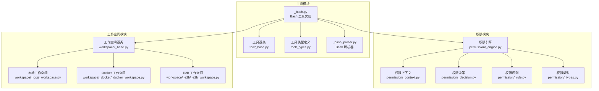
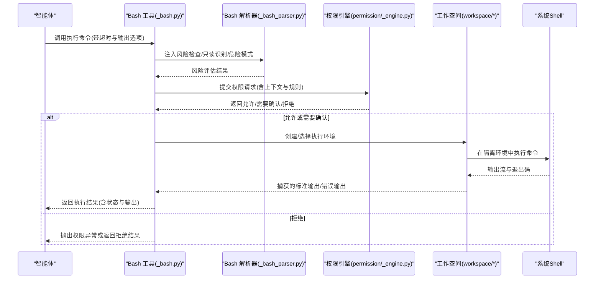
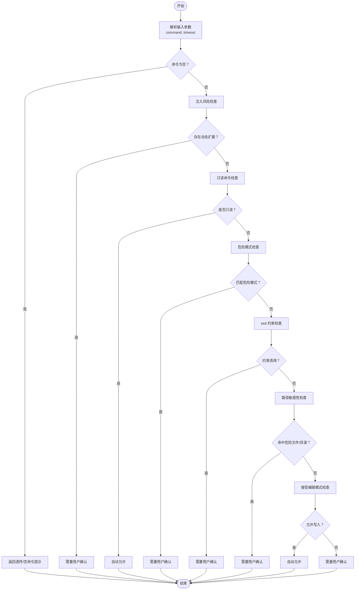
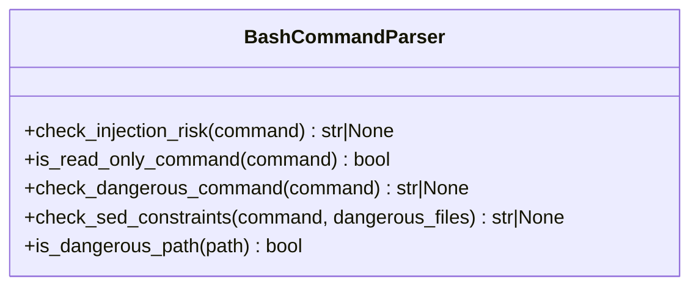
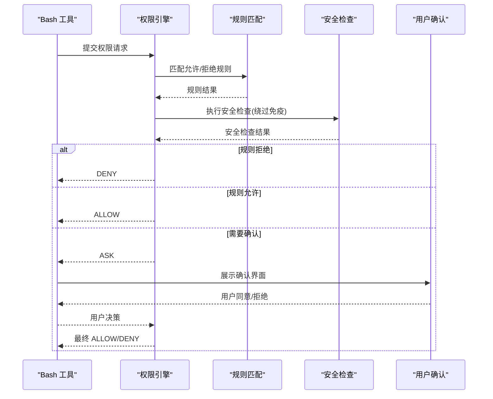
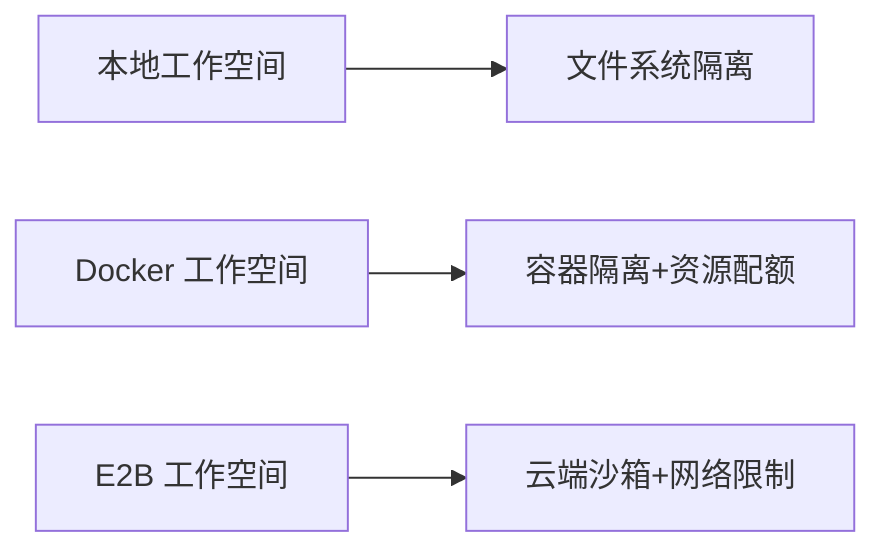
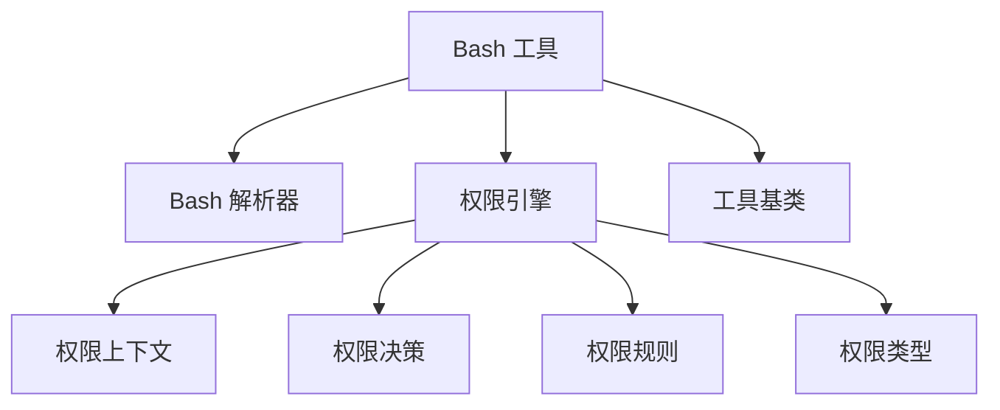

# 系统命令工具

<cite>
**本文引用的文件**
- [src/agentscope/tool/_builtin/_bash.py](file://src/agentscope/tool/_builtin/_bash.py)
- [src/agentscope/tool/_builtin/_bash_parser.py](file://src/agentscope/tool/_builtin/_bash_parser.py)
- [tests/builtin_bash_test.py](file://tests/builtin_bash_test.py)
- [tests/permission_bash_parser_test.py](file://tests/permission_bash_parser_test.py)
- [src/agentscope/permission/_engine.py](file://src/agentscope/permission/_engine.py)
- [src/agentscope/permission/_context.py](file://src/agentscope/permission/_context.py)
- [src/agentscope/permission/_decision.py](file://src/agentscope/permission/_decision.py)
- [src/agentscope/permission/_rule.py](file://src/agentscope/permission/_rule.py)
- [src/agentscope/permission/_types.py](file://src/agentscope/permission/_types.py)
- [src/agentscope/tool/_base.py](file://src/agentscope/tool/_base.py)
- [src/agentscope/tool/_types.py](file://src/agentscope/tool/_types.py)
- [src/agentscope/workspace/_base.py](file://src/agentscope/workspace/_base.py)
- [src/agentscope/workspace/_local_workspace.py](file://src/agentscope/workspace/_local_workspace.py)
- [src/agentscope/workspace/_docker/_docker_workspace.py](file://src/agentscope/workspace/_docker/_docker_workspace.py)
- [src/agentscope/workspace/_e2b/_e2b_workspace.py](file://src/agentscope/workspace/_e2b/_e2b_workspace.py)
</cite>

## 目录
1. [简介](#简介)
2. [项目结构](#项目结构)
3. [核心组件](#核心组件)
4. [架构总览](#架构总览)
5. [详细组件分析](#详细组件分析)
6. [依赖关系分析](#依赖关系分析)
7. [性能考虑](#性能考虑)
8. [故障排除指南](#故障排除指南)
9. [结论](#结论)
10. [附录](#附录)

## 简介
本文件为 AgentScope 的系统命令工具（Bash 工具）提供全面技术文档。重点覆盖以下方面：
- Bash 命令执行工具的功能特性与使用场景
- 安全沙箱机制与权限控制策略
- 命令解析器的工作原理、命令验证流程与参数过滤机制
- 完整的 API 参考：命令执行接口、输出捕获机制、错误处理与超时控制
- 安全限制措施：命令白名单、路径限制、资源使用监控与恶意命令检测
- 实际使用示例：基础命令执行、复杂脚本处理与交互式命令处理
- 性能优化建议、调试技巧与故障排除指南

## 项目结构
AgentScope 将系统命令工具作为内置工具之一，位于工具模块的内置工具包中，并与权限引擎、工作空间管理等模块协同工作。

**图表来源**
- [src/agentscope/tool/_builtin/_bash.py](file://src/agentscope/tool/_builtin/_bash.py)
- [src/agentscope/tool/_builtin/_bash_parser.py](file://src/agentscope/tool/_builtin/_bash_parser.py)
- [src/agentscope/tool/_base.py](file://src/agentscope/tool/_base.py)
- [src/agentscope/tool/_types.py](file://src/agentscope/tool/_types.py)
- [src/agentscope/permission/_engine.py](file://src/agentscope/permission/_engine.py)
- [src/agentscope/permission/_context.py](file://src/agentscope/permission/_context.py)
- [src/agentscope/permission/_decision.py](file://src/agentscope/permission/_decision.py)
- [src/agentscope/permission/_rule.py](file://src/agentscope/permission/_rule.py)
- [src/agentscope/permission/_types.py](file://src/agentscope/permission/_types.py)
- [src/agentscope/workspace/_base.py](file://src/agentscope/workspace/_base.py)
- [src/agentscope/workspace/_local_workspace.py](file://src/agentscope/workspace/_local_workspace.py)
- [src/agentscope/workspace/_docker/_docker_workspace.py](file://src/agentscope/workspace/_docker/_docker_workspace.py)
- [src/agentscope/workspace/_e2b/_e2b_workspace.py](file://src/agentscope/workspace/_e2b/_e2b_workspace.py)

**章节来源**
- [src/agentscope/tool/_builtin/_bash.py](file://src/agentscope/tool/_builtin/_bash.py)
- [src/agentscope/tool/_builtin/_bash_parser.py](file://src/agentscope/tool/_builtin/_bash_parser.py)
- [src/agentscope/tool/_base.py](file://src/agentscope/tool/_base.py)
- [src/agentscope/tool/_types.py](file://src/agentscope/tool/_types.py)
- [src/agentscope/permission/_engine.py](file://src/agentscope/permission/_engine.py)
- [src/agentscope/permission/_context.py](file://src/agentscope/permission/_context.py)
- [src/agentscope/permission/_decision.py](file://src/agentscope/permission/_decision.py)
- [src/agentscope/permission/_rule.py](file://src/agentscope/permission/_rule.py)
- [src/agentscope/permission/_types.py](file://src/agentscope/permission/_types.py)
- [src/agentscope/workspace/_base.py](file://src/agentscope/workspace/_base.py)
- [src/agentscope/workspace/_local_workspace.py](file://src/agentscope/workspace/_local_workspace.py)
- [src/agentscope/workspace/_docker/_docker_workspace.py](file://src/agentscope/workspace/_docker/_docker_workspace.py)
- [src/agentscope/workspace/_e2b/_e2b_workspace.py](file://src/agentscope/workspace/_e2b/_e2b_workspace.py)

## 核心组件
- Bash 工具：提供命令执行能力，支持超时控制、输出捕获与权限检查。
- Bash 解析器：负责命令注入风险检测、只读命令识别、危险模式匹配、sed 约束检查与路径敏感性判断。
- 权限引擎：统一协调权限决策流程，支持多种权限模式（默认、绕过、禁止询问、接受编辑）。
- 工作空间：提供隔离执行环境（本地、Docker、E2B），增强安全性与可移植性。
- 工具基类与类型：定义工具接口规范、输入输出结构与工具元数据。

**章节来源**
- [src/agentscope/tool/_builtin/_bash.py](file://src/agentscope/tool/_builtin/_bash.py)
- [src/agentscope/tool/_builtin/_bash_parser.py](file://src/agentscope/tool/_builtin/_bash_parser.py)
- [src/agentscope/tool/_base.py](file://src/agentscope/tool/_base.py)
- [src/agentscope/tool/_types.py](file://src/agentscope/tool/_types.py)
- [src/agentscope/permission/_engine.py](file://src/agentscope/permission/_engine.py)
- [src/agentscope/workspace/_base.py](file://src/agentscope/workspace/_base.py)

## 架构总览
下图展示了 Bash 工具在 AgentScope 中的整体调用链与安全控制点：

**图表来源**
- [src/agentscope/tool/_builtin/_bash.py](file://src/agentscope/tool/_builtin/_bash.py)
- [src/agentscope/tool/_builtin/_bash_parser.py](file://src/agentscope/tool/_builtin/_bash_parser.py)
- [src/agentscope/permission/_engine.py](file://src/agentscope/permission/_engine.py)
- [src/agentscope/workspace/_base.py](file://src/agentscope/workspace/_base.py)

## 详细组件分析

### Bash 工具实现
- 功能特性
  - 命令执行：支持传入命令字符串，自动进行注入风险与只读命令检查。
  - 超时控制：通过毫秒级超时参数限制命令执行时间，默认最大值可达数分钟。
  - 输出捕获：捕获标准输出与标准错误，便于后续处理与展示。
  - 权限检查：集成权限引擎，按顺序执行注入风险、只读命令、危险模式、sed 约束、路径敏感性等检查。
  - 危险文件与目录白名单：对敏感文件（如配置文件）与敏感目录（如 .ssh）进行强制确认。
  - 并发与外部工具标记：用于工具调度与生命周期管理。
- 关键接口
  - 输入参数：command（必填）、timeout（可选，毫秒）
  - 输出结果：包含执行状态、标准输出、标准错误、耗时等字段
  - 异常处理：针对空命令、权限拒绝、超时、执行失败等情况返回明确错误信息
- 安全策略
  - 注入风险优先检查：任何无法静态分析的动态扩展（如命令替换、进程替换、控制流）一律要求确认
  - 只读命令自动放行：仅读取操作（如 ls、cat、git status）自动允许
  - 危险模式阻断：包含 rm -rf、格式化磁盘等高危模式直接阻断
  - sed 约束：防止破坏性 sed 操作
  - 路径敏感性：对危险文件与目录的写入/删除操作强制确认
  - 绕过免疫：上述安全检查不可被 BYPASS 模式绕过

**图表来源**
- [src/agentscope/tool/_builtin/_bash.py](file://src/agentscope/tool/_builtin/_bash.py)

**章节来源**
- [src/agentscope/tool/_builtin/_bash.py](file://src/agentscope/tool/_builtin/_bash.py)

### Bash 解析器
- 注入风险检测：识别命令替换、进程替换、控制流等动态扩展，无法静态分析的结构一律视为高风险
- 只读命令识别：基于命令与参数集合判断是否仅进行读取操作
- 危险模式匹配：匹配 rm -rf、格式化磁盘、重定向到系统路径等高危模式
- sed 约束检查：防止破坏性 sed 操作（如删除、替换关键配置）
- 路径敏感性判断：根据危险文件列表与危险目录列表判断路径是否敏感

**图表来源**
- [src/agentscope/tool/_builtin/_bash_parser.py](file://src/agentscope/tool/_builtin/_bash_parser.py)

**章节来源**
- [src/agentscope/tool/_builtin/_bash_parser.py](file://src/agentscope/tool/_builtin/_bash_parser.py)

### 权限引擎与上下文
- 权限模式
  - 默认：遵循规则与安全检查，ASK 或 ALLOW/DENY
  - 绕过：忽略允许规则，但安全检查仍生效
  - 禁止询问：遇到需要确认的操作直接 DENY
  - 接受编辑：在工作目录内允许部分写入操作
- 决策流程
  - 规则匹配：允许/拒绝规则优先于安全检查
  - 安全检查：注入风险、危险模式、sed 约束、路径敏感性等为绕过免疫
  - 用户确认：ASK 模式下触发人机确认流程

**图表来源**
- [src/agentscope/permission/_engine.py](file://src/agentscope/permission/_engine.py)
- [src/agentscope/permission/_context.py](file://src/agentscope/permission/_context.py)
- [src/agentscope/permission/_decision.py](file://src/agentscope/permission/_decision.py)
- [src/agentscope/permission/_rule.py](file://src/agentscope/permission/_rule.py)
- [src/agentscope/permission/_types.py](file://src/agentscope/permission/_types.py)

**章节来源**
- [src/agentscope/permission/_engine.py](file://src/agentscope/permission/_engine.py)
- [src/agentscope/permission/_context.py](file://src/agentscope/permission/_context.py)
- [src/agentscope/permission/_decision.py](file://src/agentscope/permission/_decision.py)
- [src/agentscope/permission/_rule.py](file://src/agentscope/permission/_rule.py)
- [src/agentscope/permission/_types.py](file://src/agentscope/permission/_types.py)

### 工作空间与沙箱
- 本地工作空间：直接在宿主机执行，适合简单命令与快速测试
- Docker 工作空间：在容器内执行，提供更强隔离与依赖管理
- E2B 工作空间：云端沙箱执行，适合复杂脚本与高隔离需求
- 沙箱特性：网络限制、资源配额、文件系统隔离、进程树管理

**图表来源**
- [src/agentscope/workspace/_base.py](file://src/agentscope/workspace/_base.py)
- [src/agentscope/workspace/_local_workspace.py](file://src/agentscope/workspace/_local_workspace.py)
- [src/agentscope/workspace/_docker/_docker_workspace.py](file://src/agentscope/workspace/_docker/_docker_workspace.py)
- [src/agentscope/workspace/_e2b/_e2b_workspace.py](file://src/agentscope/workspace/_e2b/_e2b_workspace.py)

**章节来源**
- [src/agentscope/workspace/_base.py](file://src/agentscope/workspace/_base.py)
- [src/agentscope/workspace/_local_workspace.py](file://src/agentscope/workspace/_local_workspace.py)
- [src/agentscope/workspace/_docker/_docker_workspace.py](file://src/agentscope/workspace/_docker/_docker_workspace.py)
- [src/agentscope/workspace/_e2b/_e2b_workspace.py](file://src/agentscope/workspace/_e2b/_e2b_workspace.py)

## 依赖关系分析
- Bash 工具依赖
  - Bash 解析器：用于命令静态分析与安全判定
  - 权限引擎：统一权限决策入口
  - 工具基类与类型：规范工具接口与输入输出
  - 工作空间：提供执行环境
- 权限引擎依赖
  - 权限上下文：包含权限模式与规则
  - 权限决策：封装允许/拒绝/需要确认的状态
  - 权限规则：允许/拒绝规则集合
  - 权限类型：模式枚举与行为定义

**图表来源**
- [src/agentscope/tool/_builtin/_bash.py](file://src/agentscope/tool/_builtin/_bash.py)
- [src/agentscope/tool/_builtin/_bash_parser.py](file://src/agentscope/tool/_builtin/_bash_parser.py)
- [src/agentscope/tool/_base.py](file://src/agentscope/tool/_base.py)
- [src/agentscope/permission/_engine.py](file://src/agentscope/permission/_engine.py)
- [src/agentscope/permission/_context.py](file://src/agentscope/permission/_context.py)
- [src/agentscope/permission/_decision.py](file://src/agentscope/permission/_decision.py)
- [src/agentscope/permission/_rule.py](file://src/agentscope/permission/_rule.py)
- [src/agentscope/permission/_types.py](file://src/agentscope/permission/_types.py)

**章节来源**
- [src/agentscope/tool/_builtin/_bash.py](file://src/agentscope/tool/_builtin/_bash.py)
- [src/agentscope/tool/_builtin/_bash_parser.py](file://src/agentscope/tool/_builtin/_bash_parser.py)
- [src/agentscope/tool/_base.py](file://src/agentscope/tool/_base.py)
- [src/agentscope/permission/_engine.py](file://src/agentscope/permission/_engine.py)
- [src/agentscope/permission/_context.py](file://src/agentscope/permission/_context.py)
- [src/agentscope/permission/_decision.py](file://src/agentscope/permission/_decision.py)
- [src/agentscope/permission/_rule.py](file://src/agentscope/permission/_rule.py)
- [src/agentscope/permission/_types.py](file://src/agentscope/permission/_types.py)

## 性能考虑
- 超时设置：合理设置超时上限，避免长时间阻塞；对于复杂脚本建议开启日志与分段执行
- 输出捕获：大输出建议分块读取或重定向到临时文件，减少内存占用
- 并发控制：工具标记为非并发安全，避免在同一工作空间内并发执行高风险命令
- 工作空间选择：Docker/E2B 提供更好隔离，但启动成本较高；本地适合轻量命令
- 缓存与复用：对重复的只读命令（如 ls、git status）可缓存结果以提升响应速度

## 故障排除指南
- 常见问题
  - 权限拒绝：检查是否命中危险模式、sed 约束或路径敏感性；确认权限模式与规则
  - 注入风险阻断：避免命令替换、进程替换与控制流；拆分复杂命令
  - 超时失败：缩短命令执行时间或增加超时；检查工作空间资源限制
  - 输出缺失：确认输出捕获与重定向设置；检查工作空间权限
- 调试技巧
  - 使用最小化命令复现问题
  - 分步执行复杂脚本，定位具体失败步骤
  - 查看权限决策原因与安全检查提示
  - 在不同工作空间（本地/Docker/E2B）对比行为差异
- 测试参考
  - 注入风险与只读命令测试用例
  - 危险模式与路径敏感性测试用例
  - 权限引擎绕过免疫与模式切换测试用例

**章节来源**
- [tests/builtin_bash_test.py](file://tests/builtin_bash_test.py)
- [tests/permission_bash_parser_test.py](file://tests/permission_bash_parser_test.py)
- [src/agentscope/permission/_engine.py](file://src/agentscope/permission/_engine.py)

## 结论
AgentScope 的系统命令工具通过“解析器 + 权限引擎 + 工作空间”的组合，实现了在智能体环境中安全、可控且高效的命令执行。其严格的安全检查（注入风险、危险模式、sed 约束、路径敏感性）与绕过免疫设计，确保了高风险操作必须经过明确的人机确认。配合多样的工作空间选择与超时控制，既能满足日常开发需求，又能应对复杂与高风险场景。

## 附录

### API 参考（Bash 工具）
- 工具名称：Bash
- 输入参数
  - command（必填）：待执行的命令字符串
  - timeout（可选）：执行超时（毫秒），默认值与最大值由工具定义
- 输出结果
  - 执行状态（成功/失败/超时/权限拒绝）
  - 标准输出与标准错误
  - 执行耗时与附加元信息
- 错误处理
  - 空命令：返回透传或提示
  - 权限拒绝：抛出权限异常或返回拒绝结果
  - 超时：返回超时错误并终止进程
  - 执行失败：返回错误码与错误输出
- 超时控制
  - 支持毫秒级超时设置
  - 超时后自动终止命令执行
- 输出捕获
  - 自动捕获标准输出与标准错误
  - 支持重定向到安全路径（需确认）

**章节来源**
- [src/agentscope/tool/_builtin/_bash.py](file://src/agentscope/tool/_builtin/_bash.py)

### 安全限制清单
- 命令白名单：仅读命令（如 ls、cat、git status）自动允许
- 路径限制：危险文件与目录（如 ~/.bashrc、~/.ssh）写入/删除需确认
- 资源使用监控：工作空间可配置资源配额与网络限制
- 恶意命令检测：注入风险、危险模式、sed 约束、路径敏感性四层防护
- 绕过免疫：安全检查不可被 BYPASS 模式绕过

**章节来源**
- [src/agentscope/tool/_builtin/_bash.py](file://src/agentscope/tool/_builtin/_bash.py)
- [src/agentscope/tool/_builtin/_bash_parser.py](file://src/agentscope/tool/_builtin/_bash_parser.py)
- [src/agentscope/permission/_engine.py](file://src/agentscope/permission/_engine.py)

### 使用示例（概念性说明）
- 基础命令执行
  - 场景：列出当前目录内容
  - 方法：构造 { "command": "ls -la" }，调用 Bash 工具
  - 结果：自动放行，返回标准输出
- 复杂脚本处理
  - 场景：执行多步骤脚本，包含管道与重定向
  - 方法：拆分为多个命令或使用工作空间的脚本执行能力；必要时进行注入风险评估
  - 结果：根据安全检查决定是否需要确认
- 交互式命令
  - 场景：需要用户输入的命令（如 git commit）
  - 方法：在支持交互的工作空间中执行；注意超时与输出捕获
  - 结果：根据权限模式与安全检查决定行为

[本节为概念性说明，不直接分析具体文件]