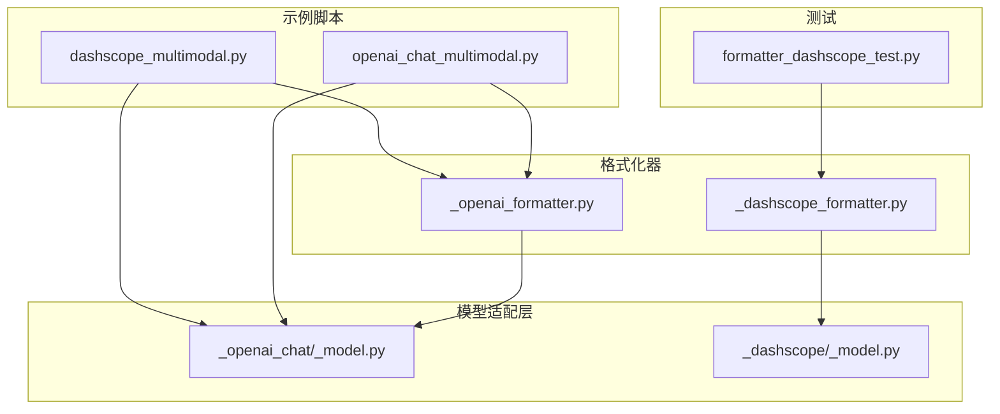
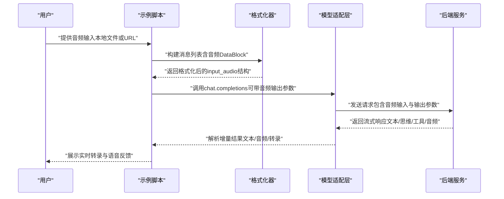
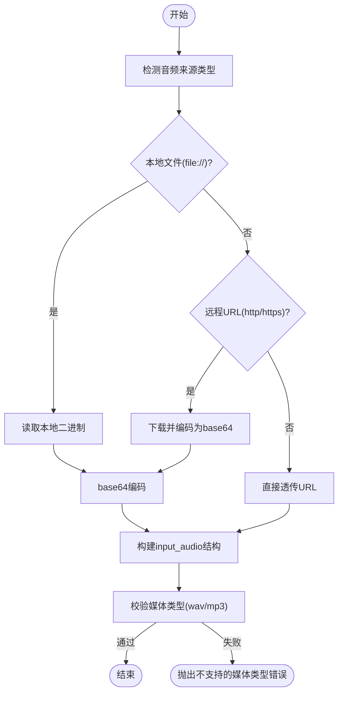
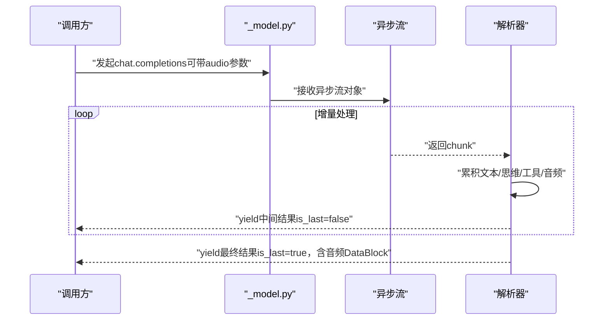
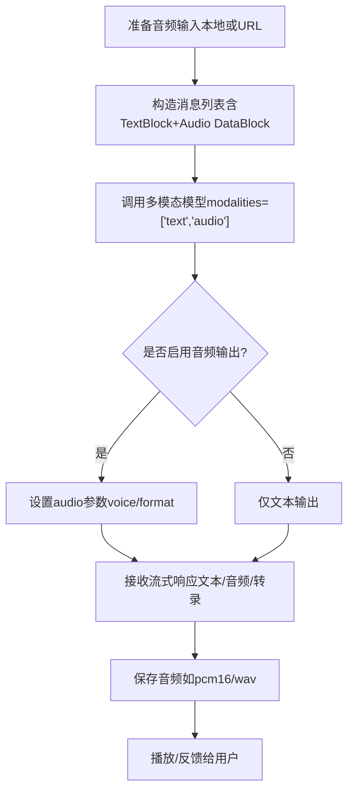
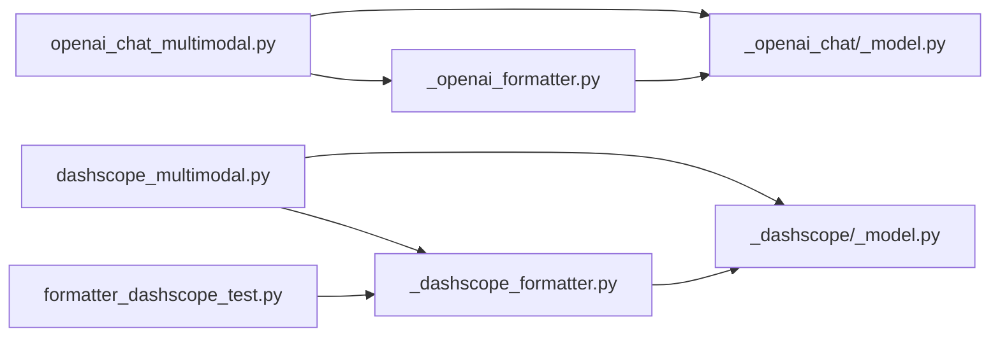

# 实时语音

<cite>
**本文引用的文件**
- [scripts/model_examples/dashscope_multimodal.py](file://scripts/model_examples/dashscope_multimodal.py)
- [scripts/model_examples/openai_chat_multimodal.py](file://scripts/model_examples/openai_chat_multimodal.py)
- [src/agentscope/formatter/_openai_formatter.py](file://src/agentscope/formatter/_openai_formatter.py)
- [src/agentscope/formatter/_dashscope_formatter.py](file://src/agentscope/formatter/_dashscope_formatter.py)
- [src/agentscope/model/_openai_chat/_model.py](file://src/agentscope/model/_openai_chat/_model.py)
- [src/agentscope/model/_dashscope/_model.py](file://src/agentscope/model/_dashscope/_model.py)
- [tests/formatter_dashscope_test.py](file://tests/formatter_dashscope_test.py)
</cite>

## 目录
1. [简介](#简介)
2. [项目结构](#项目结构)
3. [核心组件](#核心组件)
4. [架构总览](#架构总览)
5. [详细组件分析](#详细组件分析)
6. [依赖关系分析](#依赖关系分析)
7. [性能考虑](#性能考虑)
8. [故障排查指南](#故障排查指南)
9. [结论](#结论)
10. [附录](#附录)

## 简介
本技术文档围绕 AgentScope 的“实时语音”能力展开，重点解释以下方面：
- 语音处理的整体架构与模块职责
- 音频流管理与实时转录机制（基于多模态模型的流式响应）
- 语音识别、语音合成与音频编解码的技术实现路径
- 语音会话的状态管理、中断处理与质量控制策略
- 配置选项、性能优化与兼容性处理
- 完整的语音交互示例：语音唤醒、实时对话与语音反馈
- 语音数据的安全保护、隐私控制与网络传输优化

## 项目结构
与语音功能相关的关键位置集中在以下模块：
- 示例脚本：演示如何通过多模态模型调用音频输入与语音输出
- 格式化器：将本地或远程音频源转换为各平台 API 所需的输入格式
- 模型适配层：封装 OpenAI/DashScope 等后端的聊天补全接口，支持流式返回与音频输出参数
- 测试用例：验证音频输入在不同平台上的行为一致性

**图表来源**
- [scripts/model_examples/dashscope_multimodal.py](file://scripts/model_examples/dashscope_multimodal.py)
- [scripts/model_examples/openai_chat_multimodal.py](file://scripts/model_examples/openai_chat_multimodal.py)
- [src/agentscope/formatter/_openai_formatter.py](file://src/agentscope/formatter/_openai_formatter.py)
- [src/agentscope/formatter/_dashscope_formatter.py](file://src/agentscope/formatter/_dashscope_formatter.py)
- [src/agentscope/model/_openai_chat/_model.py](file://src/agentscope/model/_openai_chat/_model.py)
- [src/agentscope/model/_dashscope/_model.py](file://src/agentscope/model/_dashscope/_model.py)
- [tests/formatter_dashscope_test.py](file://tests/formatter_dashscope_test.py)

**章节来源**
- [scripts/model_examples/dashscope_multimodal.py](file://scripts/model_examples/dashscope_multimodal.py)
- [scripts/model_examples/openai_chat_multimodal.py](file://scripts/model_examples/openai_chat_multimodal.py)
- [src/agentscope/formatter/_openai_formatter.py](file://src/agentscope/formatter/_openai_formatter.py)
- [src/agentscope/formatter/_dashscope_formatter.py](file://src/agentscope/formatter/_dashscope_formatter.py)
- [src/agentscope/model/_openai_chat/_model.py](file://src/agentscope/model/_openai_chat/_model.py)
- [src/agentscope/model/_dashscope/_model.py](file://src/agentscope/model/_dashscope/_model.py)
- [tests/formatter_dashscope_test.py](file://tests/formatter_dashscope_test.py)

## 核心组件
- 音频输入格式化器
  - 将本地文件（file://）或远程 URL 转换为后端所需的输入结构；对不支持的媒体类型进行校验并抛出错误
  - 对于 OpenAI 兼容接口，要求音频媒体类型为 wav 或 mp3，并以 base64 数据形式传递
  - 对于 DashScope 兼容接口，允许直接传入 URL，本地文件仍需 base64 编码
- 多模态模型适配层
  - 统一封装 chat.completions 接口，支持流式返回与音频输出参数（如 voice、format）
  - 在流式场景下解析增量文本、思维块、工具调用以及音频数据与转录文本
- 示例脚本
  - 展示如何构造包含音频输入的消息列表，并请求音频理解与语音合成
  - 提供保存音频输出的示例逻辑

**章节来源**
- [src/agentscope/formatter/_openai_formatter.py:149-180](file://src/agentscope/formatter/_openai_formatter.py#L149-L180)
- [src/agentscope/formatter/_dashscope_formatter.py:183-220](file://src/agentscope/formatter/_dashscope_formatter.py#L183-L220)
- [src/agentscope/model/_openai_chat/_model.py:214-260](file://src/agentscope/model/_openai_chat/_model.py#L214-L260)
- [src/agentscope/model/_openai_chat/_model.py:255-292](file://src/agentscope/model/_openai_chat/_model.py#L255-L292)
- [src/agentscope/model/_dashscope/_model.py:216-251](file://src/agentscope/model/_dashscope/_model.py#L216-L251)
- [scripts/model_examples/dashscope_multimodal.py:185-230](file://scripts/model_examples/dashscope_multimodal.py#L185-L230)
- [scripts/model_examples/openai_chat_multimodal.py:139-183](file://scripts/model_examples/openai_chat_multimodal.py#L139-L183)

## 架构总览
AgentScope 的实时语音能力由“示例脚本 → 格式化器 → 模型适配层 → 后端服务”的链路构成。示例脚本负责组织用户意图与多媒体内容；格式化器负责将音频源转换为后端期望的输入结构；模型适配层负责调用后端 API 并处理流式响应；后端服务完成语音识别、语言理解和语音合成。

**图表来源**
- [scripts/model_examples/openai_chat_multimodal.py:139-183](file://scripts/model_examples/openai_chat_multimodal.py#L139-L183)
- [src/agentscope/formatter/_openai_formatter.py:149-180](file://src/agentscope/formatter/_openai_formatter.py#L149-L180)
- [src/agentscope/model/_openai_chat/_model.py:214-260](file://src/agentscope/model/_openai_chat/_model.py#L214-L260)
- [src/agentscope/model/_openai_chat/_model.py:255-292](file://src/agentscope/model/_openai_chat/_model.py#L255-L292)

## 详细组件分析

### 组件A：音频输入格式化器（OpenAI/DashScope）
- OpenAI 兼容格式化器
  - 支持 Base64Source 与 URLSource
  - 严格限制媒体类型为 wav 或 mp3；本地文件使用 file:// 前缀时，读取二进制并 base64 编码
  - 远程 URL 使用 http(s) 时，下载并 base64 编码
- DashScope 兼容格式化器
  - 支持 Base64Source 与 URLSource
  - 远程 URL 可直接透传到 data 字段（无需 base64），本地文件仍需 base64 编码

**图表来源**
- [src/agentscope/formatter/_openai_formatter.py:149-180](file://src/agentscope/formatter/_openai_formatter.py#L149-L180)
- [src/agentscope/formatter/_dashscope_formatter.py:183-220](file://src/agentscope/formatter/_dashscope_formatter.py#L183-L220)

**章节来源**
- [src/agentscope/formatter/_openai_formatter.py:149-180](file://src/agentscope/formatter/_openai_formatter.py#L149-L180)
- [src/agentscope/formatter/_dashscope_formatter.py:183-220](file://src/agentscope/formatter/_dashscope_formatter.py#L183-L220)

### 组件B：多模态模型适配层（OpenAI/DashScope）
- 请求封装
  - 统一设置工具函数、并行工具调用、流式选项等
  - 支持音频输出参数（如 voice、format），并在流式场景下按需解析
- 流式响应解析
  - 解析增量文本、思维块、工具调用
  - 累积音频数据与转录文本，最终生成包含音频的 DataBlock

**图表来源**
- [src/agentscope/model/_openai_chat/_model.py:214-260](file://src/agentscope/model/_openai_chat/_model.py#L214-L260)
- [src/agentscope/model/_openai_chat/_model.py:255-292](file://src/agentscope/model/_openai_chat/_model.py#L255-L292)
- [src/agentscope/model/_dashscope/_model.py:216-251](file://src/agentscope/model/_dashscope/_model.py#L216-L251)

**章节来源**
- [src/agentscope/model/_openai_chat/_model.py:214-260](file://src/agentscope/model/_openai_chat/_model.py#L214-L260)
- [src/agentscope/model/_openai_chat/_model.py:255-292](file://src/agentscope/model/_openai_chat/_model.py#L255-L292)
- [src/agentscope/model/_dashscope/_model.py:216-251](file://src/agentscope/model/_dashscope/_model.py#L216-L251)

### 组件C：示例脚本（语音交互流程）
- DashScope 示例
  - 构造包含音频 DataBlock 的消息列表，调用多模态模型，请求包含音频输出的响应
  - 提供保存音频输出的示例逻辑
- OpenAI 示例
  - 使用 gpt-audio-mini 等具备音频理解能力的模型
  - 通过 audio 参数指定语音合成的音色与格式，解析流式响应中的音频数据

**图表来源**
- [scripts/model_examples/dashscope_multimodal.py:185-230](file://scripts/model_examples/dashscope_multimodal.py#L185-L230)
- [scripts/model_examples/openai_chat_multimodal.py:139-183](file://scripts/model_examples/openai_chat_multimodal.py#L139-L183)

**章节来源**
- [scripts/model_examples/dashscope_multimodal.py:185-230](file://scripts/model_examples/dashscope_multimodal.py#L185-L230)
- [scripts/model_examples/openai_chat_multimodal.py:139-183](file://scripts/model_examples/openai_chat_multimodal.py#L139-L183)

### 组件D：测试用例（音频输入验证）
- 验证音频输入在不同平台上的行为一致性
- 包含 input_audio 结构与格式字段的断言

**章节来源**
- [tests/formatter_dashscope_test.py:148-190](file://tests/formatter_dashscope_test.py#L148-L190)

## 依赖关系分析
- 示例脚本依赖格式化器与模型适配层
- 格式化器依赖于后端 API 的输入规范（OpenAI/DashScope）
- 模型适配层依赖于第三方 SDK（OpenAI/DashScope）的 chat.completions 接口
- 测试用例依赖格式化器的行为

**图表来源**
- [scripts/model_examples/openai_chat_multimodal.py](file://scripts/model_examples/openai_chat_multimodal.py)
- [src/agentscope/formatter/_openai_formatter.py](file://src/agentscope/formatter/_openai_formatter.py)
- [src/agentscope/model/_openai_chat/_model.py](file://src/agentscope/model/_openai_chat/_model.py)
- [scripts/model_examples/dashscope_multimodal.py](file://scripts/model_examples/dashscope_multimodal.py)
- [src/agentscope/formatter/_dashscope_formatter.py](file://src/agentscope/formatter/_dashscope_formatter.py)
- [src/agentscope/model/_dashscope/_model.py](file://src/agentscope/model/_dashscope/_model.py)
- [tests/formatter_dashscope_test.py](file://tests/formatter_dashscope_test.py)

**章节来源**
- [scripts/model_examples/openai_chat_multimodal.py](file://scripts/model_examples/openai_chat_multimodal.py)
- [src/agentscope/formatter/_openai_formatter.py](file://src/agentscope/formatter/_openai_formatter.py)
- [src/agentscope/model/_openai_chat/_model.py](file://src/agentscope/model/_openai_chat/_model.py)
- [scripts/model_examples/dashscope_multimodal.py](file://scripts/model_examples/dashscope_multimodal.py)
- [src/agentscope/formatter/_dashscope_formatter.py](file://src/agentscope/formatter/_dashscope_formatter.py)
- [src/agentscope/model/_dashscope/_model.py](file://src/agentscope/model/_dashscope/_model.py)
- [tests/formatter_dashscope_test.py](file://tests/formatter_dashscope_test.py)

## 性能考虑
- 音频预处理
  - 优先使用本地文件（file://）以减少网络下载开销；远程 URL 建议缓存与复用
  - 控制音频采样率与比特率，避免过高的音频带宽占用
- 流式传输
  - 利用流式响应尽早输出文本与转录，降低端到端延迟
  - 合理设置音频输出格式（如 pcm16/wav），平衡质量与体积
- 并行与并发
  - 工具函数调用与音频合成可并行执行，但需注意资源竞争与队列长度
- 缓存与复用
  - 对常用音频片段进行缓存，减少重复传输与计算

## 故障排查指南
- 不支持的媒体类型
  - 现象：抛出“不支持的音频媒体类型”错误
  - 排查：确认媒体类型为 wav 或 mp3；DashScope 兼容接口可直接传入 URL
  - 参考
    - [src/agentscope/formatter/_openai_formatter.py:149-180](file://src/agentscope/formatter/_openai_formatter.py#L149-L180)
    - [src/agentscope/formatter/_dashscope_formatter.py:183-220](file://src/agentscope/formatter/_dashscope_formatter.py#L183-L220)
- 不支持的音频文件扩展名
  - 现象：抛出“不支持的音频文件扩展名”错误
  - 排查：确保扩展名为 wav 或 mp3
  - 参考
    - [src/agentscope/formatter/_openai_formatter.py:167-171](file://src/agentscope/formatter/_openai_formatter.py#L167-L171)
    - [src/agentscope/formatter/_openai_formatter.py:178-180](file://src/agentscope/formatter/_openai_formatter.py#L178-L180)
- 流式响应解析异常
  - 现象：中间结果缺失或最终结果缺少音频 DataBlock
  - 排查：确认后端支持流式音频输出；检查 audio 参数格式与 voice 设置
  - 参考
    - [src/agentscope/model/_openai_chat/_model.py:255-292](file://src/agentscope/model/_openai_chat/_model.py#L255-L292)
    - [src/agentscope/model/_dashscope/_model.py:239-251](file://src/agentscope/model/_dashscope/_model.py#L239-L251)
- 输入音频结构不正确
  - 现象：后端拒绝请求或返回空音频
  - 排查：核对 input_audio 的 data 与 format 字段；DashScope 可直接传 URL，OpenAI 需要 base64
  - 参考
    - [tests/formatter_dashscope_test.py:172-178](file://tests/formatter_dashscope_test.py#L172-L178)

**章节来源**
- [src/agentscope/formatter/_openai_formatter.py:149-180](file://src/agentscope/formatter/_openai_formatter.py#L149-L180)
- [src/agentscope/formatter/_openai_formatter.py:167-180](file://src/agentscope/formatter/_openai_formatter.py#L167-L180)
- [src/agentscope/model/_openai_chat/_model.py:255-292](file://src/agentscope/model/_openai_chat/_model.py#L255-L292)
- [src/agentscope/model/_dashscope/_model.py:239-251](file://src/agentscope/model/_dashscope/_model.py#L239-L251)
- [tests/formatter_dashscope_test.py:172-178](file://tests/formatter_dashscope_test.py#L172-L178)

## 结论
AgentScope 的实时语音能力通过“示例脚本 → 格式化器 → 模型适配层 → 后端服务”的清晰分层实现，既保证了跨平台兼容性（OpenAI/DashScope），又提供了灵活的音频输入与输出配置。结合流式响应与音频数据的增量解析，能够满足低延迟的实时语音交互需求。建议在生产环境中关注音频预处理、流式传输与缓存策略，以获得更优的用户体验。

## 附录
- 语音会话状态管理
  - 建议维护会话上下文（历史消息、音频索引、转录缓存），以便在中断后恢复
- 中断处理
  - 在用户打断或网络异常时，及时取消流式请求并清理临时音频文件
- 质量控制
  - 通过音频采样率、比特率与编码格式控制音质与带宽；对转录文本进行后处理（标点、大小写、停顿）
- 配置选项
  - 音频输入：媒体类型（wav/mp3）、来源（file:///http(s)）
  - 音频输出：voice（音色）、format（pcm16/wav/…）
- 兼容性处理
  - OpenAI 与 DashScope 在 input_audio 的 data 字段与格式上存在差异，需分别采用 base64 或直传 URL
- 安全与隐私
  - 本地音频优先使用 file://；远程 URL 仅在可信网络内使用
  - 对音频数据进行最小化收集与加密存储；传输过程使用 HTTPS
- 网络优化
  - 合理设置超时与重试；对大音频文件进行分片或压缩；利用 CDN 加速远程音频访问