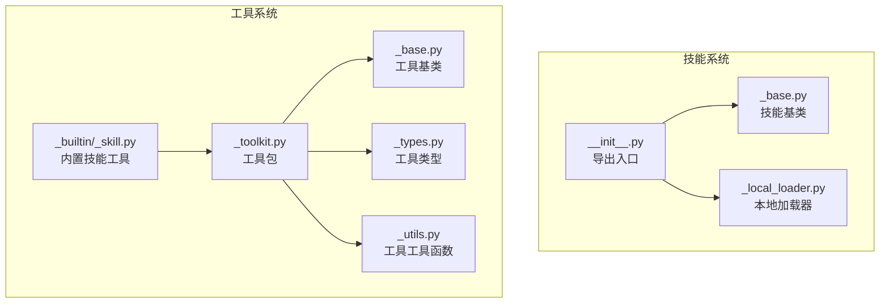
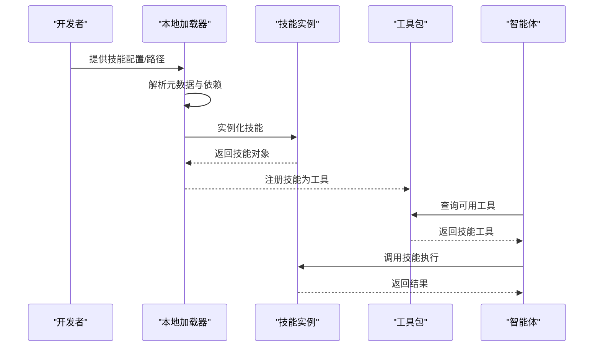
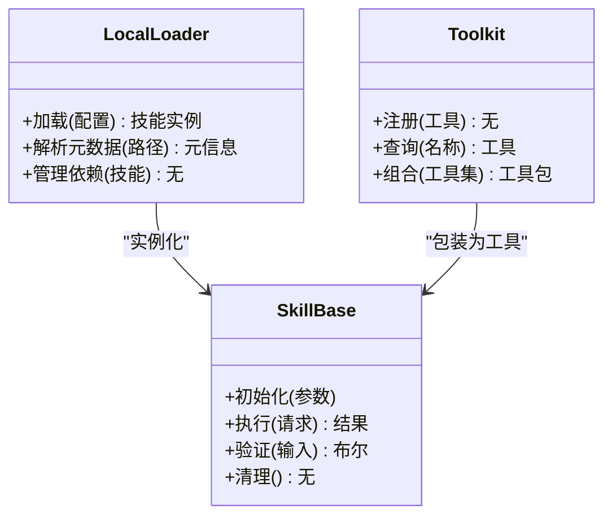
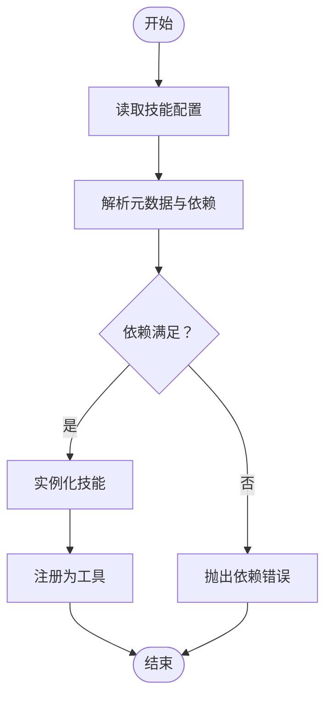
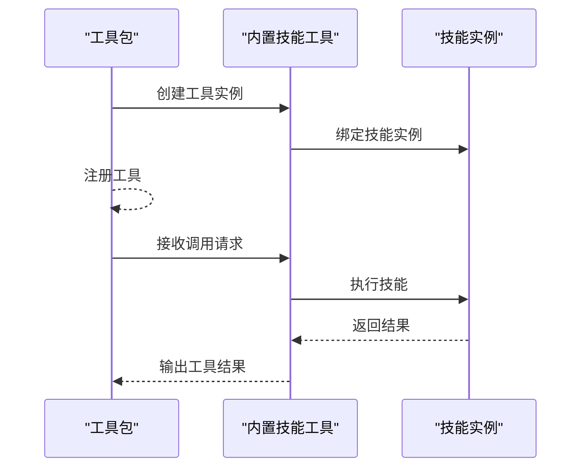
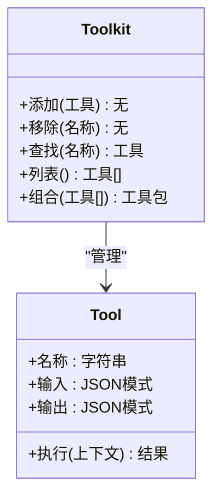
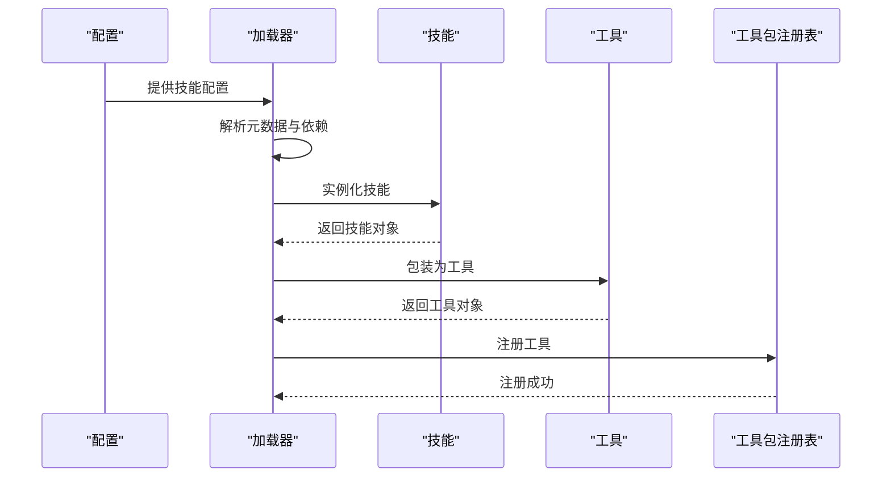
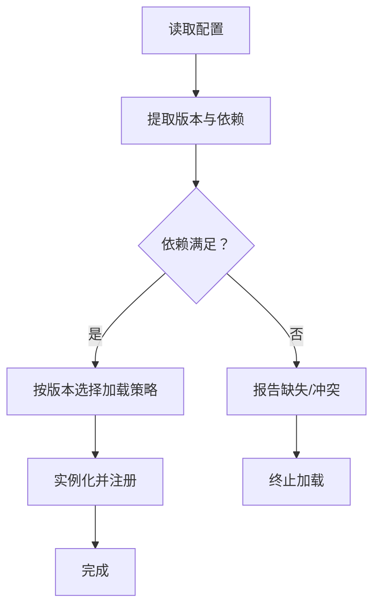
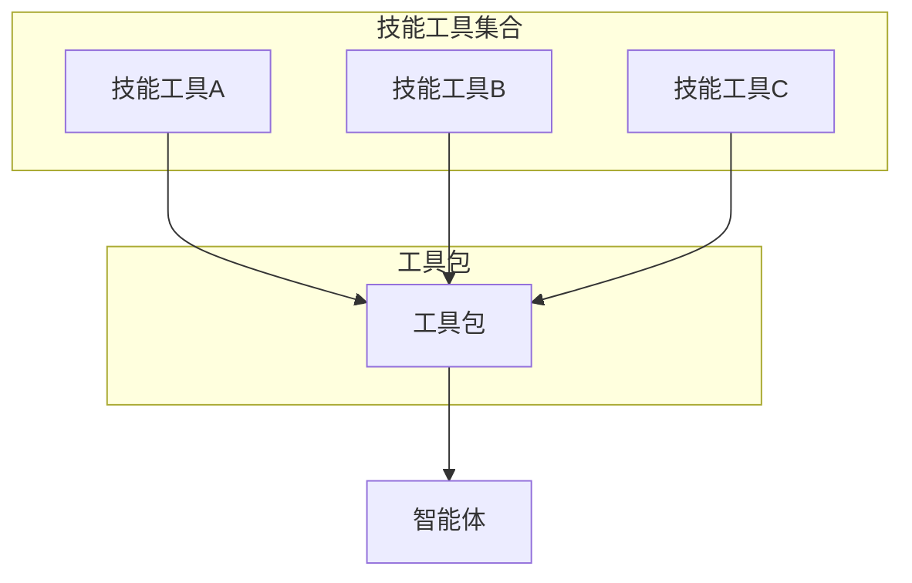
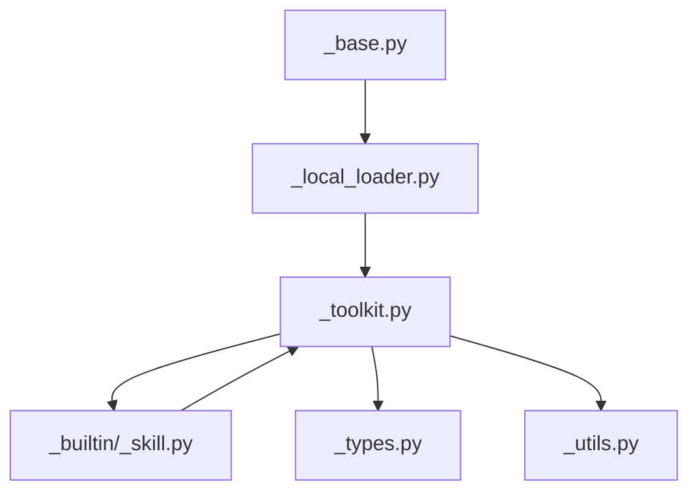

# 技能系统

<cite>
**本文引用的文件**
- [src/agentscope/skill/__init__.py](file://src/agentscope/skill/__init__.py)
- [src/agentscope/skill/_base.py](file://src/agentscope/skill/_base.py)
- [src/agentscope/skill/_local_loader.py](file://src/agentscope/skill/_local_loader.py)
- [src/agentscope/tool/_builtin/_skill.py](file://src/agentscope/tool/_builtin/_skill.py)
- [src/agentscope/tool/_toolkit.py](file://src/agentscope/tool/_toolkit.py)
- [src/agentscope/tool/_base.py](file://src/agentscope/tool/_base.py)
- [src/agentscope/tool/_types.py](file://src/agentscope/tool/_types.py)
- [src/agentscope/tool/_utils.py](file://src/agentscope/tool/_utils.py)
- [tests/skill_loader_test.py](file://tests/skill_loader_test.py)
- [tests/toolkit_skill_test.py](file://tests/toolkit_skill_test.py)
</cite>

## 目录
1. [简介](#简介)
2. [项目结构](#项目结构)
3. [核心组件](#核心组件)
4. [架构总览](#架构总览)
5. [详细组件分析](#详细组件分析)
6. [依赖关系分析](#依赖关系分析)
7. [性能考虑](#性能考虑)
8. [故障排查指南](#故障排查指南)
9. [结论](#结论)
10. [附录](#附录)

## 简介
本文件面向AgentScope的“技能系统”，系统性阐述技能的概念定义、设计原则与实现机制；覆盖技能的加载与注册流程、依赖管理与版本控制策略；解释技能与工具包（Toolkit）的关系、组合使用与动态加载能力；并提供技能开发最佳实践、API规范、测试方法与完整示例路径，以及安全机制、性能优化与调试方法。

## 项目结构
技能系统位于src/agentscope/skill目录下，并与工具系统紧密协作。关键文件包括：
- 技能基础与导出：src/agentscope/skill/__init__.py
- 技能基类：src/agentscope/skill/_base.py
- 本地加载器：src/agentscope/skill/_local_loader.py
- 内置技能工具：src/agentscope/tool/_builtin/_skill.py
- 工具包与工具：src/agentscope/tool/_toolkit.py、src/agentscope/tool/_base.py、src/agentscope/tool/_types.py、src/agentscope/tool/_utils.py
- 测试用例：tests/skill_loader_test.py、tests/toolkit_skill_test.py

**图示来源**
- [src/agentscope/skill/__init__.py](file://src/agentscope/skill/__init__.py)
- [src/agentscope/skill/_base.py](file://src/agentscope/skill/_base.py)
- [src/agentscope/skill/_local_loader.py](file://src/agentscope/skill/_local_loader.py)
- [src/agentscope/tool/_builtin/_skill.py](file://src/agentscope/tool/_builtin/_skill.py)
- [src/agentscope/tool/_toolkit.py](file://src/agentscope/tool/_toolkit.py)
- [src/agentscope/tool/_base.py](file://src/agentscope/tool/_base.py)
- [src/agentscope/tool/_types.py](file://src/agentscope/tool/_types.py)
- [src/agentscope/tool/_utils.py](file://src/agentscope/tool/_utils.py)

**章节来源**
- [src/agentscope/skill/__init__.py](file://src/agentscope/skill/__init__.py)
- [src/agentscope/skill/_base.py](file://src/agentscope/skill/_base.py)
- [src/agentscope/skill/_local_loader.py](file://src/agentscope/skill/_local_loader.py)
- [src/agentscope/tool/_builtin/_skill.py](file://src/agentscope/tool/_builtin/_skill.py)
- [src/agentscope/tool/_toolkit.py](file://src/agentscope/tool/_toolkit.py)
- [src/agentscope/tool/_base.py](file://src/agentscope/tool/_base.py)
- [src/agentscope/tool/_types.py](file://src/agentscope/tool/_types.py)
- [src/agentscope/tool/_utils.py](file://src/agentscope/tool/_utils.py)

## 核心组件
- 技能基类：定义技能的统一接口、生命周期钩子与调用约定，确保不同技能实现的一致性与可扩展性。
- 本地加载器：负责从本地路径或配置加载技能，解析元数据与依赖，构建技能实例。
- 内置技能工具：将技能封装为工具包中的工具，便于在智能体工作流中以工具形式调用。
- 工具包与工具：提供工具的组织、分组、类型与通用工具函数，支撑技能的组合与复用。

**章节来源**
- [src/agentscope/skill/_base.py](file://src/agentscope/skill/_base.py)
- [src/agentscope/skill/_local_loader.py](file://src/agentscope/skill/_local_loader.py)
- [src/agentscope/tool/_builtin/_skill.py](file://src/agentscope/tool/_builtin/_skill.py)
- [src/agentscope/tool/_toolkit.py](file://src/agentscope/tool/_toolkit.py)
- [src/agentscope/tool/_base.py](file://src/agentscope/tool/_base.py)
- [src/agentscope/tool/_types.py](file://src/agentscope/tool/_types.py)
- [src/agentscope/tool/_utils.py](file://src/agentscope/tool/_utils.py)

## 架构总览
技能系统围绕“技能基类 + 加载器 + 工具化”展开，形成“定义—加载—编排—执行”的闭环。技能通过本地加载器被发现与实例化，随后以工具的形式进入工具包，供智能体按需调用。

**图示来源**
- [src/agentscope/skill/_local_loader.py](file://src/agentscope/skill/_local_loader.py)
- [src/agentscope/skill/_base.py](file://src/agentscope/skill/_base.py)
- [src/agentscope/tool/_builtin/_skill.py](file://src/agentscope/tool/_builtin/_skill.py)
- [src/agentscope/tool/_toolkit.py](file://src/agentscope/tool/_toolkit.py)

## 详细组件分析

### 技能基类（Skill Base）
- 角色与职责
  - 定义技能的统一接口与生命周期钩子，确保调用一致性。
  - 提供输入输出规范、错误处理与状态管理的抽象。
- 关键点
  - 接口契约：明确入参、返回值与异常语义。
  - 可扩展性：支持插件式扩展与自定义行为。
  - 兼容性：与工具包的工具接口保持一致，便于编排。

**图示来源**
- [src/agentscope/skill/_base.py](file://src/agentscope/skill/_base.py)
- [src/agentscope/skill/_local_loader.py](file://src/agentscope/skill/_local_loader.py)
- [src/agentscope/tool/_toolkit.py](file://src/agentscope/tool/_toolkit.py)

**章节来源**
- [src/agentscope/skill/_base.py](file://src/agentscope/skill/_base.py)

### 本地加载器（Local Loader）
- 角色与职责
  - 从本地路径或配置加载技能，解析元数据与依赖，构建技能实例。
  - 支持版本控制与依赖解析，保证加载过程的稳定性与可追溯性。
- 关键点
  - 配置驱动：通过配置文件或字典描述技能路径、版本与依赖。
  - 依赖管理：解析并校验前置条件，避免循环依赖与缺失依赖。
  - 版本控制：基于版本号选择加载策略，支持灰度与回滚。

**图示来源**
- [src/agentscope/skill/_local_loader.py](file://src/agentscope/skill/_local_loader.py)

**章节来源**
- [src/agentscope/skill/_local_loader.py](file://src/agentscope/skill/_local_loader.py)

### 内置技能工具（Builtin Skill Tool）
- 角色与职责
  - 将技能封装为工具包中的工具，使技能具备工具的统一签名与调用方式。
- 关键点
  - 工具签名：遵循工具接口规范，确保与工具包生态兼容。
  - 包装策略：将技能的执行逻辑映射为工具的调用流程。
  - 组合能力：支持与其他工具组合，形成复合任务。

**图示来源**
- [src/agentscope/tool/_builtin/_skill.py](file://src/agentscope/tool/_builtin/_skill.py)
- [src/agentscope/tool/_toolkit.py](file://src/agentscope/tool/_toolkit.py)
- [src/agentscope/skill/_base.py](file://src/agentscope/skill/_base.py)

**章节来源**
- [src/agentscope/tool/_builtin/_skill.py](file://src/agentscope/tool/_builtin/_skill.py)

### 工具包与工具（Toolkit & Tools）
- 角色与职责
  - 工具包：对工具进行组织、分组与发布，提供查询与组合能力。
  - 工具：具体可执行的操作单元，具备输入输出规范与执行逻辑。
- 关键点
  - 类型体系：通过类型定义约束工具的输入输出与行为。
  - 工具工具函数：提供工具的通用操作与辅助能力。
  - 组合使用：支持多工具串联与并行，提升复杂任务的表达力。

**图示来源**
- [src/agentscope/tool/_toolkit.py](file://src/agentscope/tool/_toolkit.py)
- [src/agentscope/tool/_base.py](file://src/agentscope/tool/_base.py)
- [src/agentscope/tool/_types.py](file://src/agentscope/tool/_types.py)
- [src/agentscope/tool/_utils.py](file://src/agentscope/tool/_utils.py)

**章节来源**
- [src/agentscope/tool/_toolkit.py](file://src/agentscope/tool/_toolkit.py)
- [src/agentscope/tool/_base.py](file://src/agentscope/tool/_base.py)
- [src/agentscope/tool/_types.py](file://src/agentscope/tool/_types.py)
- [src/agentscope/tool/_utils.py](file://src/agentscope/tool/_utils.py)

### 技能与工具包的关系
- 技能通过内置技能工具被包装为工具，进入工具包生态，从而实现：
  - 统一的调用接口与生命周期管理。
  - 与其它工具的组合与编排。
  - 在智能体工作流中的动态加载与按需调用。

**图示来源**
- [src/agentscope/tool/_builtin/_skill.py](file://src/agentscope/tool/_builtin/_skill.py)
- [src/agentscope/tool/_toolkit.py](file://src/agentscope/tool/_toolkit.py)

**章节来源**
- [src/agentscope/tool/_builtin/_skill.py](file://src/agentscope/tool/_builtin/_skill.py)
- [src/agentscope/tool/_toolkit.py](file://src/agentscope/tool/_toolkit.py)

### 技能加载与注册流程
- 加载阶段
  - 读取配置，解析元数据与依赖。
  - 校验依赖是否满足，必要时报错或回退。
  - 实例化技能，准备执行环境。
- 注册阶段
  - 将技能封装为工具并注册到工具包。
  - 暴露查询接口，供智能体检索与调用。

**图示来源**
- [src/agentscope/skill/_local_loader.py](file://src/agentscope/skill/_local_loader.py)
- [src/agentscope/tool/_builtin/_skill.py](file://src/agentscope/tool/_builtin/_skill.py)
- [src/agentscope/tool/_toolkit.py](file://src/agentscope/tool/_toolkit.py)

**章节来源**
- [src/agentscope/skill/_local_loader.py](file://src/agentscope/skill/_local_loader.py)
- [src/agentscope/tool/_builtin/_skill.py](file://src/agentscope/tool/_builtin/_skill.py)
- [src/agentscope/tool/_toolkit.py](file://src/agentscope/tool/_toolkit.py)

### 依赖管理与版本控制
- 依赖管理
  - 在加载前解析并校验依赖，避免运行期失败。
  - 支持依赖冲突检测与回退策略。
- 版本控制
  - 通过版本号选择加载策略，支持灰度与回滚。
  - 记录版本变更与兼容性矩阵，便于追踪问题。

**图示来源**
- [src/agentscope/skill/_local_loader.py](file://src/agentscope/skill/_local_loader.py)

**章节来源**
- [src/agentscope/skill/_local_loader.py](file://src/agentscope/skill/_local_loader.py)

### 技能的组合使用与动态加载
- 组合使用
  - 通过工具包将多个技能工具组合为复合任务。
  - 支持顺序执行与条件分支，提升任务表达能力。
- 动态加载
  - 按需加载技能，减少启动开销。
  - 运行时热更新与版本切换，增强灵活性。

**图示来源**
- [src/agentscope/tool/_toolkit.py](file://src/agentscope/tool/_toolkit.py)
- [src/agentscope/tool/_builtin/_skill.py](file://src/agentscope/tool/_builtin/_skill.py)

**章节来源**
- [src/agentscope/tool/_toolkit.py](file://src/agentscope/tool/_toolkit.py)
- [src/agentscope/tool/_builtin/_skill.py](file://src/agentscope/tool/_builtin/_skill.py)

### 技能开发最佳实践、API规范与测试方法
- 最佳实践
  - 明确定义输入输出模式，保持接口稳定。
  - 将副作用最小化，提供幂等与可重试能力。
  - 分离业务逻辑与工具包装，便于测试与复用。
- API规范
  - 遵循工具接口规范，确保签名一致。
  - 使用类型定义约束输入输出，提升可维护性。
- 测试方法
  - 单元测试：覆盖正常路径、边界条件与异常路径。
  - 集成测试：验证加载、注册与调用链路。
  - 示例参考：
    - 技能加载测试：[tests/skill_loader_test.py](file://tests/skill_loader_test.py)
    - 工具包技能测试：[tests/toolkit_skill_test.py](file://tests/toolkit_skill_test.py)

**章节来源**
- [tests/skill_loader_test.py](file://tests/skill_loader_test.py)
- [tests/toolkit_skill_test.py](file://tests/toolkit_skill_test.py)

### 完整技能创建示例（步骤说明）
以下为创建一个新技能的步骤说明（不包含代码内容）：
- 步骤1：定义技能接口
  - 在技能基类上实现统一的执行接口，明确输入输出与异常语义。
  - 参考：[src/agentscope/skill/_base.py](file://src/agentscope/skill/_base.py)
- 步骤2：实现业务逻辑
  - 编写具体的执行逻辑，确保幂等与可重试。
  - 参考：[src/agentscope/skill/_base.py](file://src/agentscope/skill/_base.py)
- 步骤3：封装为工具
  - 使用内置技能工具将技能包装为工具，遵循工具接口规范。
  - 参考：[src/agentscope/tool/_builtin/_skill.py](file://src/agentscope/tool/_builtin/_skill.py)
- 步骤4：注册到工具包
  - 将工具注册到工具包，使其可被智能体检索与调用。
  - 参考：[src/agentscope/tool/_toolkit.py](file://src/agentscope/tool/_toolkit.py)
- 步骤5：编写测试
  - 编写单元与集成测试，覆盖加载、注册与调用链路。
  - 参考：[tests/skill_loader_test.py](file://tests/skill_loader_test.py)、[tests/toolkit_skill_test.py](file://tests/toolkit_skill_test.py)

**章节来源**
- [src/agentscope/skill/_base.py](file://src/agentscope/skill/_base.py)
- [src/agentscope/tool/_builtin/_skill.py](file://src/agentscope/tool/_builtin/_skill.py)
- [src/agentscope/tool/_toolkit.py](file://src/agentscope/tool/_toolkit.py)
- [tests/skill_loader_test.py](file://tests/skill_loader_test.py)
- [tests/toolkit_skill_test.py](file://tests/toolkit_skill_test.py)

### 安全机制、性能优化与调试方法
- 安全机制
  - 输入验证：在技能执行前严格校验输入，防止注入与越界。
  - 权限控制：结合权限引擎限制技能访问范围。
  - 审计日志：记录关键操作与异常，便于追踪。
- 性能优化
  - 缓存策略：对重复计算与外部调用结果进行缓存。
  - 异步执行：对耗时操作采用异步与并发策略。
  - 资源池：复用连接与线程，降低创建成本。
- 调试方法
  - 日志追踪：在关键节点输出上下文信息与时间戳。
  - 断点调试：在加载与执行的关键路径设置断点。
  - 回归测试：建立自动化测试矩阵，覆盖常见场景。

## 依赖关系分析
技能系统与工具系统的耦合度低，通过工具接口实现解耦；加载器与工具包之间存在直接依赖，用于完成技能到工具的转换与注册。

**图示来源**
- [src/agentscope/skill/_base.py](file://src/agentscope/skill/_base.py)
- [src/agentscope/skill/_local_loader.py](file://src/agentscope/skill/_local_loader.py)
- [src/agentscope/tool/_toolkit.py](file://src/agentscope/tool/_toolkit.py)
- [src/agentscope/tool/_builtin/_skill.py](file://src/agentscope/tool/_builtin/_skill.py)
- [src/agentscope/tool/_types.py](file://src/agentscope/tool/_types.py)
- [src/agentscope/tool/_utils.py](file://src/agentscope/tool/_utils.py)

**章节来源**
- [src/agentscope/skill/_base.py](file://src/agentscope/skill/_base.py)
- [src/agentscope/skill/_local_loader.py](file://src/agentscope/skill/_local_loader.py)
- [src/agentscope/tool/_toolkit.py](file://src/agentscope/tool/_toolkit.py)
- [src/agentscope/tool/_builtin/_skill.py](file://src/agentscope/tool/_builtin/_skill.py)
- [src/agentscope/tool/_types.py](file://src/agentscope/tool/_types.py)
- [src/agentscope/tool/_utils.py](file://src/agentscope/tool/_utils.py)

## 性能考虑
- 加载性能
  - 延迟加载：仅在首次调用时加载技能，减少启动时间。
  - 并行加载：对独立技能并行实例化，提升吞吐。
- 执行性能
  - 结果缓存：对相同输入的结果进行缓存，避免重复计算。
  - 超时与重试：为外部依赖设置超时与指数退避重试。
- 资源管理
  - 连接池：对外部服务使用连接池，降低握手开销。
  - 内存回收：及时释放临时资源，避免内存泄漏。

## 故障排查指南
- 常见问题
  - 依赖缺失：检查依赖解析与安装，确保前置条件满足。
  - 版本冲突：核对版本号与兼容性矩阵，必要时降级或升级。
  - 接口不匹配：对照工具接口规范修正输入输出签名。
- 排查步骤
  - 启用详细日志，定位加载与执行阶段。
  - 使用最小化配置复现问题，逐步缩小范围。
  - 对照测试用例，确认回归问题是否已覆盖。

**章节来源**
- [tests/skill_loader_test.py](file://tests/skill_loader_test.py)
- [tests/toolkit_skill_test.py](file://tests/toolkit_skill_test.py)

## 结论
AgentScope的技能系统通过“技能基类 + 本地加载器 + 工具化”的架构，实现了技能的标准化、可组合与可扩展。配合完善的依赖管理与版本控制策略，技能能够在智能体工作流中高效、安全地执行。建议在实际开发中遵循接口规范与测试策略，持续优化性能与可观测性。

## 附录
- 示例参考路径
  - 技能加载测试：[tests/skill_loader_test.py](file://tests/skill_loader_test.py)
  - 工具包技能测试：[tests/toolkit_skill_test.py](file://tests/toolkit_skill_test.py)
- 相关文件
  - 技能导出入口：[src/agentscope/skill/__init__.py](file://src/agentscope/skill/__init__.py)
  - 技能基类：[src/agentscope/skill/_base.py](file://src/agentscope/skill/_base.py)
  - 本地加载器：[src/agentscope/skill/_local_loader.py](file://src/agentscope/skill/_local_loader.py)
  - 内置技能工具：[src/agentscope/tool/_builtin/_skill.py](file://src/agentscope/tool/_builtin/_skill.py)
  - 工具包与工具：[src/agentscope/tool/_toolkit.py](file://src/agentscope/tool/_toolkit.py)、[src/agentscope/tool/_base.py](file://src/agentscope/tool/_base.py)、[src/agentscope/tool/_types.py](file://src/agentscope/tool/_types.py)、[src/agentscope/tool/_utils.py](file://src/agentscope/tool/_utils.py)