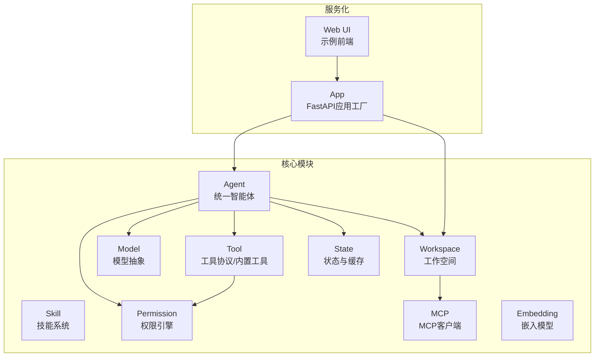
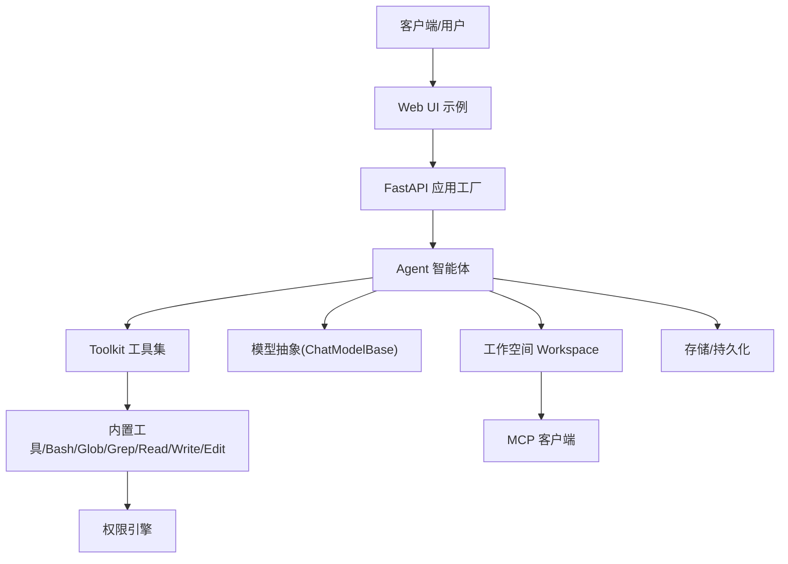
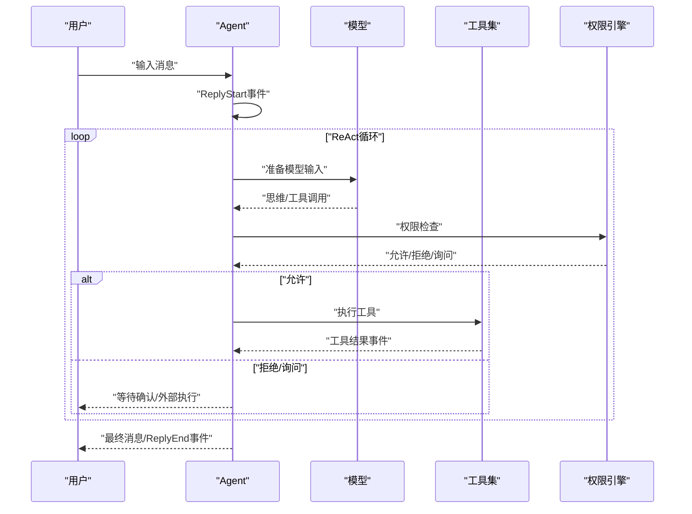
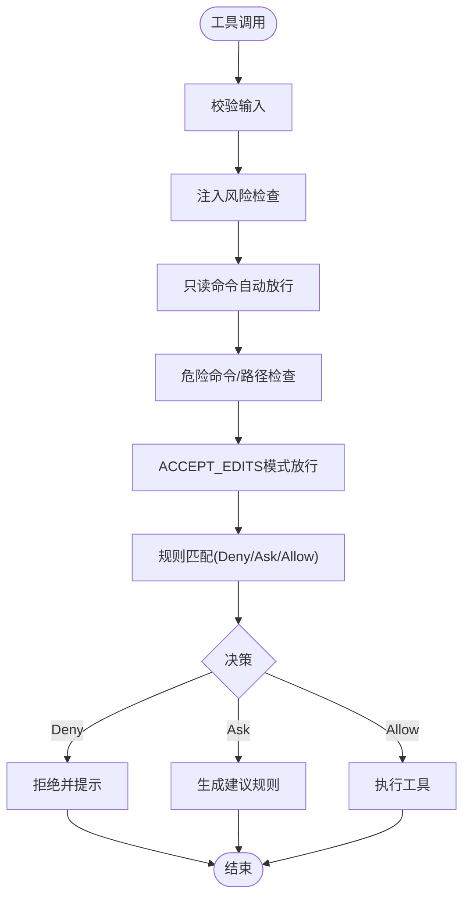
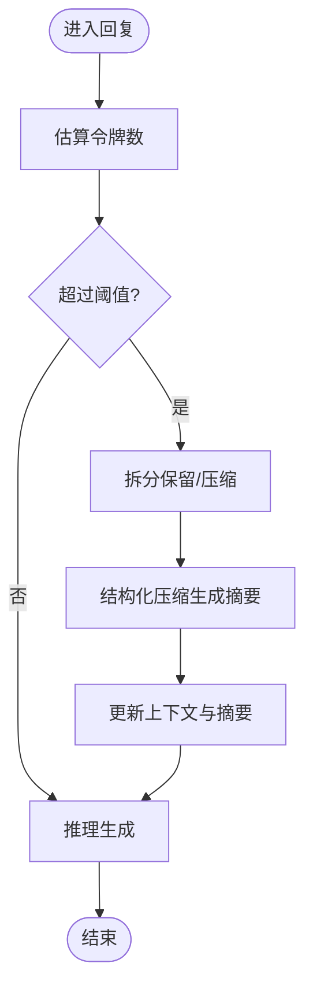
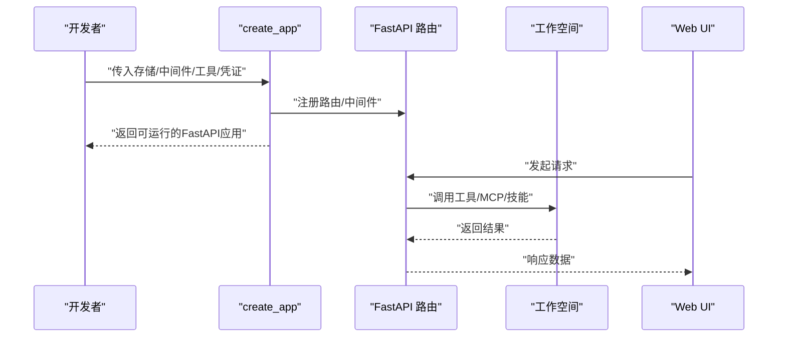
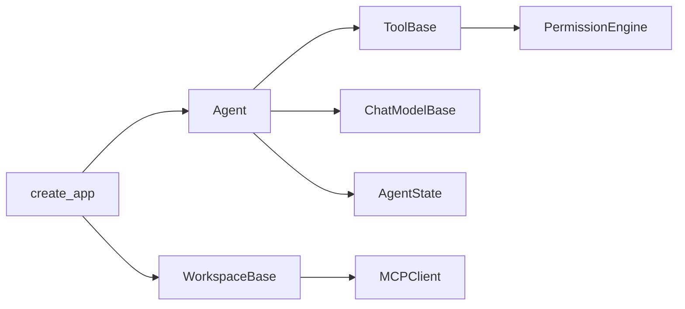

# 核心特性

<cite>
**本文引用的文件**
- [README.md](file://README.md)
- [src/agentscope/_version.py](file://src/agentscope/_version.py)
- [src/agentscope/agent/_agent.py](file://src/agentscope/agent/_agent.py)
- [src/agentscope/tool/_base.py](file://src/agentscope/tool/_base.py)
- [src/agentscope/tool/_builtin/_bash.py](file://src/agentscope/tool/_builtin/_bash.py)
- [src/agentscope/skill/_base.py](file://src/agentscope/skill/_base.py)
- [src/agentscope/model/_base.py](file://src/agentscope/model/_base.py)
- [src/agentscope/permission/_engine.py](file://src/agentscope/permission/_engine.py)
- [src/agentscope/workspace/_base.py](file://src/agentscope/workspace/_base.py)
- [src/agentscope/mcp/_mcp_client.py](file://src/agentscope/mcp/_mcp_client.py)
- [src/agentscope/embedding/_embedding_base.py](file://src/agentscope/embedding/_embedding_base.py)
- [src/agentscope/state/_state.py](file://src/agentscope/state/_state.py)
- [src/agentscope/app/_app.py](file://src/agentscope/app/_app.py)
- [examples/web_ui/backend/src/index.ts](file://examples/web_ui/backend/src/index.ts)
</cite>

## 目录
1. [简介](#简介)
2. [项目结构](#项目结构)
3. [核心组件](#核心组件)
4. [架构总览](#架构总览)
5. [详细组件分析](#详细组件分析)
6. [依赖分析](#依赖分析)
7. [性能考虑](#性能考虑)
8. [故障排查指南](#故障排查指南)
9. [结论](#结论)
10. [附录](#附录)

## 简介
本节面向AgentScope 2.0的核心特性进行系统化介绍，围绕“简单易用（5分钟启动第一个智能体）”“可扩展性（丰富的生态系统集成）”“生产就绪（支持多种部署方式）”三大优势展开，并深入解析ReAct智能体、内置工具、技能系统、人机协作控制、记忆机制、规划能力、实时语音、评估功能与模型微调等关键特性。文档同时提供设计理念、使用场景、实现原理与代码路径指引，帮助读者快速上手并深度掌握框架能力。

- 版本信息：AgentScope 2.0.0
- 快速启动：5分钟内完成首个智能体交互
- 生态集成：MCP、多厂商模型、权限控制、工作空间与工具链
- 部署形态：本地、云原生、Kubernetes、Serverless

章节来源
- [README.md: 58-71:58-71](file://README.md#L58-L71)
- [src/agentscope/_version.py: 1-5:1-5](file://src/agentscope/_version.py#L1-L5)

## 项目结构
AgentScope 2.0采用模块化分层设计，核心目录包含：
- agent：统一智能体抽象与ReAct循环实现
- tool：工具协议、内置工具与工具组
- skill：技能加载与管理
- model：模型抽象与多厂商适配
- permission：权限引擎与规则体系
- workspace：工作空间抽象与MCP集成
- mcp：MCP客户端与工具封装
- embedding：嵌入模型抽象
- state：状态与缓存上下文
- app：服务化入口与路由
- examples：Web UI与示例

图表来源
- [src/agentscope/agent/_agent.py: 94-150:94-150](file://src/agentscope/agent/_agent.py#L94-L150)
- [src/agentscope/tool/_base.py: 35-62:35-62](file://src/agentscope/tool/_base.py#L35-L62)
- [src/agentscope/skill/_base.py: 7-21:7-21](file://src/agentscope/skill/_base.py#L7-L21)
- [src/agentscope/model/_base.py: 35-96:35-96](file://src/agentscope/model/_base.py#L35-L96)
- [src/agentscope/permission/_engine.py: 16-51:16-51](file://src/agentscope/permission/_engine.py#L16-L51)
- [src/agentscope/workspace/_base.py: 36-50:36-50](file://src/agentscope/workspace/_base.py#L36-L50)
- [src/agentscope/mcp/_mcp_client.py: 23-66:23-66](file://src/agentscope/mcp/_mcp_client.py#L23-L66)
- [src/agentscope/embedding/_embedding_base.py: 8-35:8-35](file://src/agentscope/embedding/_embedding_base.py#L8-L35)
- [src/agentscope/state/_state.py: 140-177:140-177](file://src/agentscope/state/_state.py#L140-L177)
- [src/agentscope/app/_app.py: 29-96:29-96](file://src/agentscope/app/_app.py#L29-L96)
- [examples/web_ui/backend/src/index.ts: 1-17:1-17](file://examples/web_ui/backend/src/index.ts#L1-L17)

章节来源
- [README.md: 106-133:106-133](file://README.md#L106-L133)
- [src/agentscope/app/_app.py: 29-130:29-130](file://src/agentscope/app/_app.py#L29-L130)

## 核心组件
本节聚焦AgentScope 2.0的关键构件及其职责边界：
- Agent：统一智能体类，负责推理-行动循环、事件流、中间件与上下文压缩
- Tool：工具协议与内置工具（如Bash、Glob、Grep、Read、Write、Edit），支持权限检查与建议规则
- Skill：技能数据结构与加载器基类
- Model：模型抽象，统一计数令牌、重试、结构化输出与工具选择
- Permission：权限引擎，按规则与模式对工具调用进行决策
- Workspace：工作空间抽象，提供资源发现、工具/MCP/技能列表与离线存储
- MCP：MCP客户端，支持STDIO与HTTP传输，状态化/无状态连接
- Embedding：嵌入模型抽象
- State：会话、上下文、任务与工具缓存状态
- App：FastAPI应用工厂，注册路由与中间件，支持挂载与独立运行

章节来源
- [src/agentscope/agent/_agent.py: 94-150:94-150](file://src/agentscope/agent/_agent.py#L94-L150)
- [src/agentscope/tool/_base.py: 35-62:35-62](file://src/agentscope/tool/_base.py#L35-L62)
- [src/agentscope/skill/_base.py: 7-21:7-21](file://src/agentscope/skill/_base.py#L7-L21)
- [src/agentscope/model/_base.py: 35-96:35-96](file://src/agentscope/model/_base.py#L35-L96)
- [src/agentscope/permission/_engine.py: 16-51:16-51](file://src/agentscope/permission/_engine.py#L16-L51)
- [src/agentscope/workspace/_base.py: 36-50:36-50](file://src/agentscope/workspace/_base.py#L36-L50)
- [src/agentscope/mcp/_mcp_client.py: 23-66:23-66](file://src/agentscope/mcp/_mcp_client.py#L23-L66)
- [src/agentscope/embedding/_embedding_base.py: 8-35:8-35](file://src/agentscope/embedding/_embedding_base.py#L8-L35)
- [src/agentscope/state/_state.py: 140-177:140-177](file://src/agentscope/state/_state.py#L140-L177)
- [src/agentscope/app/_app.py: 29-96:29-96](file://src/agentscope/app/_app.py#L29-L96)

## 架构总览
AgentScope 2.0以“智能体-工具-模型-权限-工作空间”为核心闭环，配合MCP生态与多厂商模型适配，形成可扩展、可演进的智能体平台。服务化层通过FastAPI应用工厂提供多租户、多会话的Agent服务，并可与Web UI联动。

图表来源
- [src/agentscope/app/_app.py: 29-130:29-130](file://src/agentscope/app/_app.py#L29-L130)
- [src/agentscope/agent/_agent.py: 94-150:94-150](file://src/agentscope/agent/_agent.py#L94-L150)
- [src/agentscope/tool/_base.py: 35-62:35-62](file://src/agentscope/tool/_base.py#L35-L62)
- [src/agentscope/permission/_engine.py: 16-51:16-51](file://src/agentscope/permission/_engine.py#L16-L51)
- [src/agentscope/model/_base.py: 35-96:35-96](file://src/agentscope/model/_base.py#L35-L96)
- [src/agentscope/workspace/_base.py: 36-50:36-50](file://src/agentscope/workspace/_base.py#L36-L50)
- [src/agentscope/mcp/_mcp_client.py: 23-66:23-66](file://src/agentscope/mcp/_mcp_client.py#L23-L66)

## 详细组件分析

### ReAct智能体与推理-行动循环
- 设计理念：将LLM的推理与工具调用解耦，通过事件流驱动交互，支持流式文本、思维块、工具调用与结果块，以及人机协作中断与外部执行。
- 关键流程：
  - 输入消息进入，触发ReplyStart事件
  - 进入ReAct循环：推理（生成思维/工具调用）→批量工具调用（串行/并发）→权限检查→执行→产出事件
  - 循环受最大迭代次数限制；支持上下文压缩与令牌计数
  - 结束时产出最终消息与ReplyEnd事件
- 使用场景：复杂任务分解、多步工具编排、人机协同审阅、长上下文管理

图表来源
- [src/agentscope/agent/_agent.py: 595-686:595-686](file://src/agentscope/agent/_agent.py#L595-L686)
- [src/agentscope/agent/_agent.py: 687-740:687-740](file://src/agentscope/agent/_agent.py#L687-L740)
- [src/agentscope/agent/_agent.py: 741-800:741-800](file://src/agentscope/agent/_agent.py#L741-L800)
- [src/agentscope/permission/_engine.py: 81-178:81-178](file://src/agentscope/permission/_engine.py#L81-L178)

章节来源
- [src/agentscope/agent/_agent.py: 191-253:191-253](file://src/agentscope/agent/_agent.py#L191-L253)
- [src/agentscope/agent/_agent.py: 542-686:542-686](file://src/agentscope/agent/_agent.py#L542-L686)

### 内置工具与权限控制
- 工具协议：ToolBase定义工具名称、描述、输入模式、并发安全、只读属性、外部工具标记、MCP标识等；支持权限检查、规则匹配与建议规则生成。
- 典型内置工具：Bash（命令注入检测、危险路径/命令检查、ACCEPT_EDITS模式放行）、Glob/Grep/Read/Write/Edit等文件与搜索工具。
- 权限控制：PermissionEngine按deny→ask→工具特定检查→allow→bypass→默认ask顺序评估；支持EXPLORE/ACCEPT_EDITS/DONT_ASK/BYPASS模式；自动生成建议规则。

图表来源
- [src/agentscope/tool/_base.py: 35-62:35-62](file://src/agentscope/tool/_base.py#L35-L62)
- [src/agentscope/tool/_builtin/_bash.py: 181-320:181-320](file://src/agentscope/tool/_builtin/_bash.py#L181-L320)
- [src/agentscope/permission/_engine.py: 81-178:81-178](file://src/agentscope/permission/_engine.py#L81-L178)

章节来源
- [src/agentscope/tool/_base.py: 70-145:70-145](file://src/agentscope/tool/_base.py#L70-L145)
- [src/agentscope/tool/_builtin/_bash.py: 181-320:181-320](file://src/agentscope/tool/_builtin/_bash.py#L181-L320)
- [src/agentscope/permission/_engine.py: 81-178:81-178](file://src/agentscope/permission/_engine.py#L81-L178)

### 技能系统
- 设计理念：以Markdown技能为载体，提供可复用、可版本化的任务模板与执行指导。
- 数据结构：Skill包含名称、描述、目录、Markdown内容与更新时间；SkillLoaderBase提供异步技能枚举接口。
- 使用场景：知识沉淀、任务编排、人机协作提示、跨会话复用。

章节来源
- [src/agentscope/skill/_base.py: 7-21:7-21](file://src/agentscope/skill/_base.py#L7-L21)

### 记忆机制与上下文压缩
- 记忆组成：会话级上下文、压缩摘要、任务上下文、工具缓存（LRU）。
- 压缩策略：基于令牌计数阈值触发，保留系统提示与摘要，对历史消息进行结构化压缩，必要时回退删除最早上下文。
- 缓存优化：文件读取缓存按大小与数量淘汰，减少重复I/O。

图表来源
- [src/agentscope/agent/_agent.py: 300-492:300-492](file://src/agentscope/agent/_agent.py#L300-L492)
- [src/agentscope/state/_state.py: 140-177:140-177](file://src/agentscope/state/_state.py#L140-L177)

章节来源
- [src/agentscope/agent/_agent.py: 259-492:259-492](file://src/agentscope/agent/_agent.py#L259-L492)
- [src/agentscope/state/_state.py: 140-177:140-177](file://src/agentscope/state/_state.py#L140-L177)

### 规划能力与多步工具编排
- 规划实现：通过ReAct循环在每轮中生成工具调用计划，支持串行/并发批量执行；根据权限与外部交互动态调整。
- 场景应用：复杂任务分解、并行文件操作、多源数据检索与整合。

章节来源
- [src/agentscope/agent/_agent.py: 628-670:628-670](file://src/agentscope/agent/_agent.py#L628-L670)

### 实时语音与多模态
- 多模态支持：消息块包含文本、思维、工具调用/结果、数据块（URL/Base64），模型抽象支持多模态令牌估算。
- 语音接入：可通过数据块承载音频数据或URL，结合工具链实现转写/合成。

章节来源
- [src/agentscope/model/_base.py: 296-371:296-371](file://src/agentscope/model/_base.py#L296-L371)
- [src/agentscope/message/_base.py: 1-200:1-200](file://src/agentscope/message/_base.py#L1-L200)

### 评估功能与模型微调
- 评估：通过结构化输出与事件流记录，便于构建评估指标与质量度量。
- 微调：结合嵌入模型与工作空间离线存储，支持上下文与工具结果的长期检索与再利用，为后续微调提供高质量数据。

章节来源
- [src/agentscope/embedding/_embedding_base.py: 8-46:8-46](file://src/agentscope/embedding/_embedding_base.py#L8-L46)
- [src/agentscope/workspace/_base.py: 123-155:123-155](file://src/agentscope/workspace/_base.py#L123-L155)

### 生产就绪：部署与服务化
- 服务化入口：create_app提供FastAPI应用工厂，自动注册路由与中间件，支持挂载到现有应用或独立运行。
- 部署形态：本地开发、云原生容器、Serverless、Kubernetes集群均可通过应用工厂与工作空间抽象无缝适配。
- Web UI示例：提供健康检查与前后端联调示例，便于快速体验。

图表来源
- [src/agentscope/app/_app.py: 29-130:29-130](file://src/agentscope/app/_app.py#L29-L130)
- [examples/web_ui/backend/src/index.ts: 10-16:10-16](file://examples/web_ui/backend/src/index.ts#L10-L16)

章节来源
- [src/agentscope/app/_app.py: 29-130:29-130](file://src/agentscope/app/_app.py#L29-L130)
- [examples/web_ui/backend/src/index.ts: 10-16:10-16](file://examples/web_ui/backend/src/index.ts#L10-L16)

## 依赖分析
- 组件耦合：Agent与Tool/Model/Permission/State强关联；Workspace与MCP弱耦合但提供资源发现；App作为装配器聚合核心模块。
- 外部依赖：MCP协议栈、HTTP/SSE客户端、模型SDK（按厂商适配）。
- 可能的循环依赖：模块间通过接口与类型注解避免直接循环导入。

图表来源
- [src/agentscope/agent/_agent.py: 94-150:94-150](file://src/agentscope/agent/_agent.py#L94-L150)
- [src/agentscope/tool/_base.py: 35-62:35-62](file://src/agentscope/tool/_base.py#L35-L62)
- [src/agentscope/model/_base.py: 35-96:35-96](file://src/agentscope/model/_base.py#L35-L96)
- [src/agentscope/permission/_engine.py: 16-51:16-51](file://src/agentscope/permission/_engine.py#L16-L51)
- [src/agentscope/workspace/_base.py: 36-50:36-50](file://src/agentscope/workspace/_base.py#L36-L50)
- [src/agentscope/mcp/_mcp_client.py: 23-66:23-66](file://src/agentscope/mcp/_mcp_client.py#L23-L66)
- [src/agentscope/app/_app.py: 29-130:29-130](file://src/agentscope/app/_app.py#L29-L130)

章节来源
- [src/agentscope/agent/_agent.py: 94-150:94-150](file://src/agentscope/agent/_agent.py#L94-L150)
- [src/agentscope/tool/_base.py: 35-62:35-62](file://src/agentscope/tool/_base.py#L35-L62)
- [src/agentscope/model/_base.py: 35-96:35-96](file://src/agentscope/model/_base.py#L35-L96)
- [src/agentscope/permission/_engine.py: 16-51:16-51](file://src/agentscope/permission/_engine.py#L16-L51)
- [src/agentscope/workspace/_base.py: 36-50:36-50](file://src/agentscope/workspace/_base.py#L36-L50)
- [src/agentscope/mcp/_mcp_client.py: 23-66:23-66](file://src/agentscope/mcp/_mcp_client.py#L23-L66)
- [src/agentscope/app/_app.py: 29-130:29-130](file://src/agentscope/app/_app.py#L29-L130)

## 性能考虑
- 令牌估算与压缩：通过统一的令牌估算方法与结构化压缩，降低长上下文带来的延迟与成本。
- 工具缓存：文件读取缓存按大小与数量淘汰，减少重复I/O；并发工具批处理提升吞吐。
- 重试与超时：模型调用具备指数退避与最大重试次数；工具执行设置超时保护。
- 并发与流式：支持异步生成器与事件流，提升交互响应速度。

章节来源
- [src/agentscope/model/_base.py: 296-371:296-371](file://src/agentscope/model/_base.py#L296-L371)
- [src/agentscope/state/_state.py: 65-131:65-131](file://src/agentscope/state/_state.py#L65-L131)
- [src/agentscope/tool/_builtin/_bash.py: 596-697:596-697](file://src/agentscope/tool/_builtin/_bash.py#L596-L697)

## 故障排查指南
- 权限相关
  - 症状：工具调用被拒绝或频繁要求确认
  - 排查：检查权限模式（EXPLORE/ACCEPT_EDITS/DONT_ASK/BYPASS）与规则配置；查看建议规则生成
- 工具执行
  - 症状：命令超时、失败或输出截断
  - 排查：确认超时参数、命令安全性与危险路径检查；查看工具错误事件
- 上下文溢出
  - 症状：压缩失败或上下文过长
  - 排查：调整保留比例、降低触发阈值或增加模型上下文长度
- MCP连接
  - 症状：无法列出工具或连接异常
  - 排查：确认连接状态、启用/禁用工具过滤、HTTP/SSE配置

章节来源
- [src/agentscope/permission/_engine.py: 164-178:164-178](file://src/agentscope/permission/_engine.py#L164-L178)
- [src/agentscope/tool/_builtin/_bash.py: 680-697:680-697](file://src/agentscope/tool/_builtin/_bash.py#L680-L697)
- [src/agentscope/agent/_agent.py: 429-468:429-468](file://src/agentscope/agent/_agent.py#L429-L468)
- [src/agentscope/mcp/_mcp_client.py: 205-284:205-284](file://src/agentscope/mcp/_mcp_client.py#L205-L284)

## 结论
AgentScope 2.0以统一智能体为核心，结合完善的工具与权限体系、可扩展的工作空间与MCP生态、以及服务化部署能力，实现了从“简单易用”到“生产就绪”的全栈覆盖。通过ReAct循环、上下文压缩、多模态支持与评估微调能力，框架既能满足快速原型开发，也能支撑复杂应用场景的长期演进。

## 附录
- 快速开始示例（代码路径）
  - [README.md: 134-188:134-188](file://README.md#L134-L188)
- 服务化示例（代码路径）
  - [src/agentscope/app/_app.py: 29-130:29-130](file://src/agentscope/app/_app.py#L29-L130)
  - [examples/web_ui/backend/src/index.ts: 10-16:10-16](file://examples/web_ui/backend/src/index.ts#L10-L16)