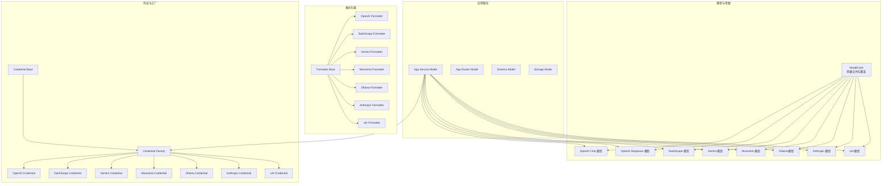
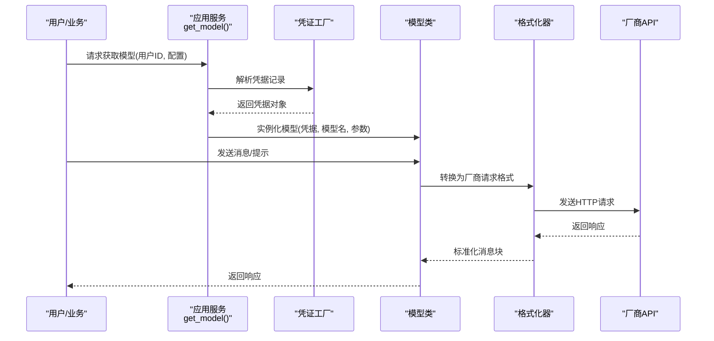
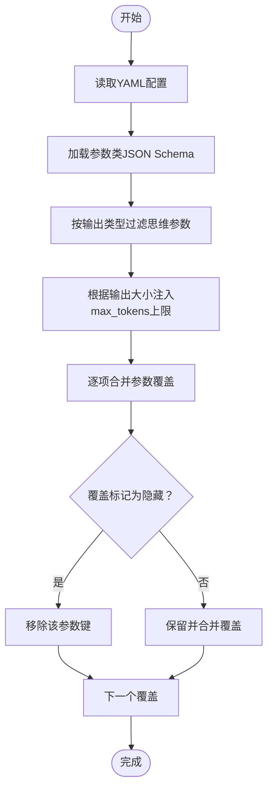
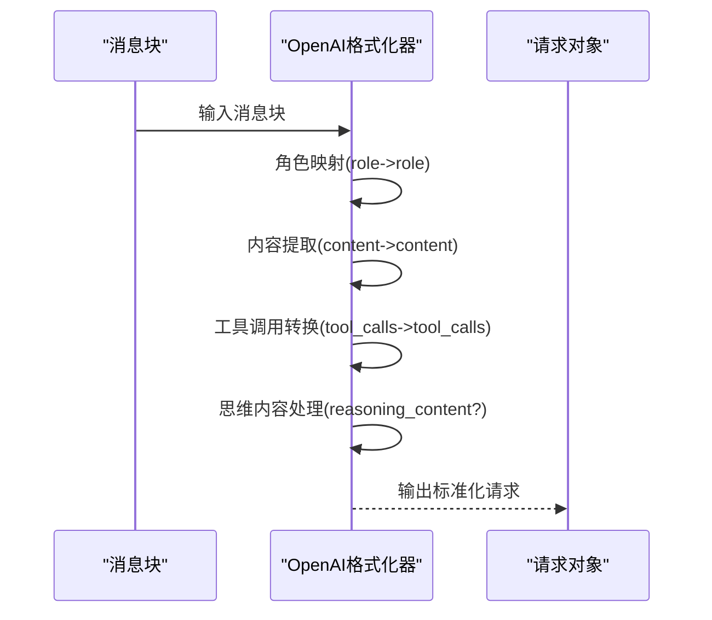
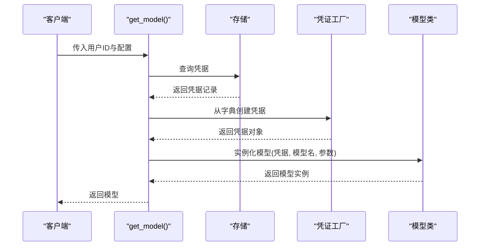
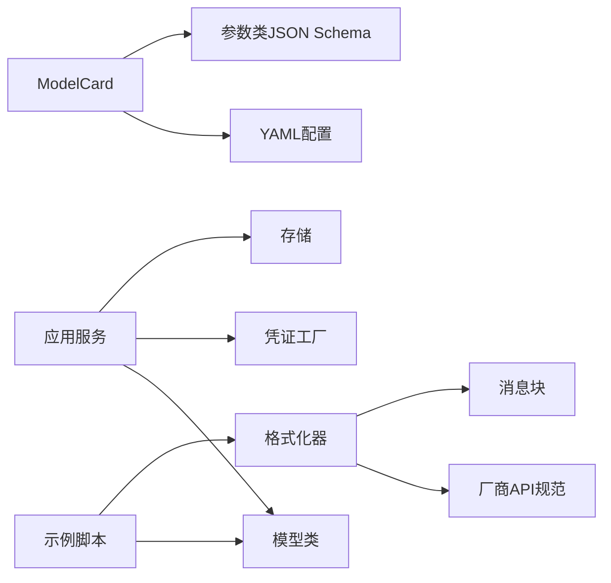

# 模型微调支持

<cite>
**本文引用的文件**
- [README.md](file://README.md)
- [src/agentscope/model/_model_card.py](file://src/agentscope/model/_model_card.py)
- [src/agentscope/app/_service/_model.py](file://src/agentscope/app/_service/_model.py)
- [src/agentscope/model/_openai_chat/_model.py](file://src/agentscope/model/_openai_chat/_model.py)
- [src/agentscope/model/_openai_chat/_models/gpt-4.1-mini.yaml](file://src/agentscope/model/_openai_chat/_models/gpt-4.1-mini.yaml)
- [src/agentscope/model/_openai_response/_model.py](file://src/agentscope/model/_openai_response/_model.py)
- [src/agentscope/model/_openai_response/_models/o4-mini.yaml](file://src/agentscope/model/_openai_response/_models/o4-mini.yaml)
- [src/agentscope/model/_dashscope/_model.py](file://src/agentscope/model/_dashscope/_model.py)
- [src/agentscope/model/_dashscope/_models/qwen-long.yaml](file://src/agentscope/model/_dashscope/_models/qwen-long.yaml)
- [src/agentscope/model/_gemini/_model.py](file://src/agentscope/model/_gemini/_model.py)
- [src/agentscope/model/_gemini/_models/gemini-2.5-flash.yaml](file://src/agentscope/model/_gemini/_models/gemini-2.5-flash.yaml)
- [src/agentscope/model/_moonshot/_model.py](file://src/agentscope/model/_moonshot/_model.py)
- [src/agentscope/model/_moonshot/_models/kimi-k2.5.yaml](file://src/agentscope/model/_moonshot/_models/kimi-k2.5.yaml)
- [src/agentscope/model/_ollama/_model.py](file://src/agentscope/model/_ollama/_model.py)
- [src/agentscope/model/_ollama/_models/qwen3-14b.yaml](file://src/agentscope/model/_ollama/_models/qwen3-14b.yaml)
- [src/agentscope/model/_anthropic/_model.py](file://src/agentscope/model/_anthropic/_model.py)
- [src/agentscope/model/_anthropic/_models/claude-sonnet-4-6.yaml](file://src/agentscope/model/_anthropic/_models/claude-sonnet-4-6.yaml)
- [src/agentscope/model/_xai/_model.py](file://src/agentscope/model/_xai/_model.py)
- [src/agentscope/model/_xai/_models/grok-3.yaml](file://src/agentscope/model/_xai/_models/grok-3.yaml)
- [src/agentscope/formatter/_formatter_base.py](file://src/agentscope/formatter/_formatter_base.py)
- [src/agentscope/formatter/_openai_formatter.py](file://src/agentscope/formatter/_openai_formatter.py)
- [src/agentscope/formatter/_dashscope_formatter.py](file://src/agentscope/formatter/_dashscope_formatter.py)
- [src/agentscope/formatter/_gemini_formatter.py](file://src/agentscope/formatter/_gemini_formatter.py)
- [src/agentscope/formatter/_moonshot_formatter.py](file://src/agentscope/formatter/_moonshot_formatter.py)
- [src/agentscope/formatter/_ollama_formatter.py](file://src/agentscope/formatter/_ollama_formatter.py)
- [src/agentscope/formatter/_anthropic_formatter.py](file://src/agentscope/formatter/_anthropic_formatter.py)
- [src/agentscope/formatter/_xai_formatter.py](file://src/agentscope/formatter/_xai_formatter.py)
- [src/agentscope/embedding/_embedding_base.py](file://src/agentscope/embedding/_embedding_base.py)
- [src/agentscope/embedding/_dashscope_embedding.py](file://src/agentscope/embedding/_dashscope_embedding.py)
- [src/agentscope/embedding/_gemini_embedding.py](file://src/agentscope/embedding/_gemini_embedding.py)
- [src/agentscope/embedding/_ollama_embedding.py](file://src/agentscope/embedding/_ollama_embedding.py)
- [src/agentscope/embedding/_openai_embedding.py](file://src/agentscope/embedding/_openai_embedding.py)
- [src/agentscope/credential/_base.py](file://src/agentscope/credential/_base.py)
- [src/agentscope/credential/_factory.py](file://src/agentscope/credential/_factory.py)
- [src/agentscope/credential/_openai.py](file://src/agentscope/credential/_openai.py)
- [src/agentscope/credential/_dashscope.py](file://src/agentscope/credential/_dashscope.py)
- [src/agentscope/credential/_gemini.py](file://src/agentscope/credential/_gemini.py)
- [src/agentscope/credential/_moonshot.py](file://src/agentscope/credential/_moonshot.py)
- [src/agentscope/credential/_ollama.py](file://src/agentscope/credential/_ollama.py)
- [src/agentscope/credential/_anthropic.py](file://src/agentscope/credential/_anthropic.py)
- [src/agentscope/credential/_xai.py](file://src/agentscope/credential/_xai.py)
- [src/agentscope/tool/_base.py](file://src/agentscope/tool/_base.py)
- [src/agentscope/tool/_builtin/_bash.py](file://src/agentscope/tool/_builtin/_bash.py)
- [src/agentscope/tool/_builtin/_bash_parser.py](file://src/agentscope/tool/_builtin/_bash_parser.py)
- [src/agentscope/message/_base.py](file://src/agentscope/message/_base.py)
- [src/agentscope/middleware/_base.py](file://src/agentscope/middleware/_base.py)
- [src/agentscope/middleware/_tracing/_trace.py](file://src/agentscope/middleware/_tracing/_trace.py)
- [src/agentscope/workspace/_base.py](file://src/agentscope/workspace/_base.py)
- [src/agentscope/workspace/_docker/_docker_workspace.py](file://src/agentscope/workspace/_docker/_docker_workspace.py)
- [src/agentscope/workspace/_e2b/_e2b_workspace.py](file://src/agentscope/workspace/_e2b/_e2b_workspace.py)
- [src/agentscope/app/_router/_model.py](file://src/agentscope/app/_router/_model.py)
- [src/agentscope/app/_schema/_model.py](file://src/agentscope/app/_schema/_model.py)
- [src/agentscope/app/_manager/_workspace_manager.py](file://src/agentscope/app/_manager/_workspace_manager.py)
- [src/agentscope/app/_manager/_session_manager.py](file://src/agentscope/app/_manager/_session_manager.py)
- [src/agentscope/app/_manager/_scheduler_manager.py](file://src/agentscope/app/_manager/_scheduler_manager.py)
- [src/agentscope/app/_manager/_background_task_manager.py](file://src/agentscope/app/_manager/_background_task_manager.py)
- [src/agentscope/app/_middleware/_tool_offload_middleware.py](file://src/agentscope/app/_middleware/_tool_offload_middleware.py)
- [src/agentscope/app/_middleware/_protocol/_base.py](file://src/agentscope/app/_middleware/_protocol/_base.py)
- [src/agentscope/app/_middleware/_protocol/_agui.py](file://src/agentscope/app/_middleware/_protocol/_agui.py)
- [src/agentscope/app/storage/_base.py](file://src/agentscope/app/storage/_base.py)
- [src/agentscope/app/storage/_model/_base.py](file://src/agentscope/app/storage/_model/_base.py)
- [src/agentscope/app/storage/_model/_credential.py](file://src/agentscope/app/storage/_model/_credential.py)
- [src/agentscope/app/storage/_redis_storage.py](file://src/agentscope/app/storage/_redis_storage.py)
- [src/agentscope/types/_hook.py](file://src/agentscope/types/_hook.py)
- [src/agentscope/types/_json.py](file://src/agentscope/types/_json.py)
- [src/agentscope/types/_object.py](file://src/agentscope/types/_object.py)
- [src/agentscope/event/_event.py](file://src/agentscope/event/_event.py)
- [src/agentscope/state/_state.py](file://src/agentscope/state/_state.py)
- [src/agentscope/state/_task.py](file://src/agentscope/state/_task.py)
- [src/agentscope/skill/_base.py](file://src/agentscope/skill/_base.py)
- [src/agentscope/skill/_local_loader.py](file://src/agentscope/skill/_local_loader.py)
- [src/agentscope/permission/_engine.py](file://src/agentscope/permission/_engine.py)
- [src/agentscope/permission/_rule.py](file://src/agentscope/permission/_rule.py)
- [src/agentscope/permission/_context.py](file://src/agentscope/permission/_context.py)
- [src/agentscope/permission/_decision.py](file://src/agentscope/permission/_decision.py)
- [src/agentscope/permission/_types.py](file://src/agentscope/permission/_types.py)
- [src/agentscope/mcp/_mcp_client.py](file://src/agentscope/mcp/_mcp_client.py)
- [src/agentscope/mcp/_config.py](file://src/agentscope/mcp/_config.py)
- [src/agentscope/_logging.py](file://src/agentscope/_logging.py)
- [src/agentscope/_version.py](file://src/agentscope/_version.py)
- [scripts/model_examples/openai_chat_call.py](file://scripts/model_examples/openai_chat_call.py)
- [scripts/model_examples/dashscope_call.py](file://scripts/model_examples/dashscope_call.py)
- [scripts/model_examples/gemini_call.py](file://scripts/model_examples/gemini_call.py)
- [scripts/model_examples/moonshot_call.py](file://scripts/model_examples/moonshot_call.py)
- [scripts/model_examples/ollama_call.py](file://scripts/model_examples/ollama_call.py)
- [scripts/model_examples/anthropic_call.py](file://scripts/model_examples/anthropic_call.py)
- [scripts/model_examples/xai_call.py](file://scripts/model_examples/xai_call.py)
- [tests/formatter_openai_chat_test.py](file://tests/formatter_openai_chat_test.py)
- [tests/formatter_dashscope_test.py](file://tests/formatter_dashscope_test.py)
- [tests/formatter_gemini_test.py](file://tests/formatter_gemini_test.py)
- [tests/formatter_moonshot_test.py](file://tests/formatter_moonshot_test.py)
- [tests/formatter_ollama_test.py](file://tests/formatter_ollama_test.py)
- [tests/formatter_anthropic_test.py](file://tests/formatter_anthropic_test.py)
- [tests/formatter_xai_test.py](file://tests/formatter_xai_test.py)
</cite>

## 目录
1. [引言](#引言)
2. [项目结构](#项目结构)
3. [核心组件](#核心组件)
4. [架构总览](#架构总览)
5. [详细组件分析](#详细组件分析)
6. [依赖关系分析](#依赖关系分析)
7. [性能考虑](#性能考虑)
8. [故障排查指南](#故障排查指南)
9. [结论](#结论)
10. [附录](#附录)

## 引言
本技术文档围绕AgentScope在“模型微调支持”方面的能力与实践展开，目标是帮助读者系统理解微调的概念原理、训练流程与技术实现，并提供从数据准备、预处理、标注到算法选择、超参数配置、训练监控、评估部署与持续改进的完整实施指南。由于当前仓库未直接提供内置的微调训练器或数据加载器，本文将基于现有模型卡片、格式化器、凭证与服务层，给出面向AgentScope生态的“微调集成与应用”方案：如何通过统一的模型卡片与参数体系、标准化的数据格式与提示工程、以及可扩展的服务接口，将外部微调工具链（如LoRA、QLoRA、DPO、奖励建模等）无缝接入AgentScope，从而实现指令微调、偏好优化与领域适应等典型场景。

## 项目结构
AgentScope以模块化方式组织多厂商大模型接入、格式化器、嵌入、凭证与应用服务层。与“微调支持”最相关的部分包括：
- 模型卡片与参数体系：用于统一描述模型能力、输入输出类型、上下文与输出大小、参数覆盖策略等。
- 格式化器：将内部消息结构转换为各厂商API期望的请求格式。
- 凭证与工厂：负责凭据解析与模型类实例化。
- 应用服务：提供模型获取与运行时参数注入的统一入口。
- 示例脚本：展示如何调用不同厂商模型，便于迁移至微调后的模型。

图表来源
- [src/agentscope/model/_model_card.py:88-150](file://src/agentscope/model/_model_card.py#L88-L150)
- [src/agentscope/app/_service/_model.py:10-50](file://src/agentscope/app/_service/_model.py#L10-L50)
- [src/agentscope/formatter/_formatter_base.py](file://src/agentscope/formatter/_formatter_base.py)
- [src/agentscope/credential/_base.py](file://src/agentscope/credential/_base.py)
- [src/agentscope/credential/_factory.py](file://src/agentscope/credential/_factory.py)

章节来源
- [README.md](file://README.md)
- [src/agentscope/model/_model_card.py:88-150](file://src/agentscope/model/_model_card.py#L88-L150)
- [src/agentscope/app/_service/_model.py:10-50](file://src/agentscope/app/_service/_model.py#L10-L50)

## 核心组件
- 模型卡片与参数覆盖
  - 通过YAML配置与参数类JSON Schema合并，自动过滤不支持的参数（如思维参数），并根据输出大小动态设置最大token上限；支持显式隐藏或覆盖参数键值。
  - 参考路径：[模型卡片加载与参数合并:88-150](file://src/agentscope/model/_model_card.py#L88-L150)
- 格式化器
  - 将内部消息结构转换为各厂商API期望的格式，包括角色、内容、工具调用、思维内容等字段差异。
  - 参考路径：[格式化器基类](file://src/agentscope/formatter/_formatter_base.py)，[OpenAI格式化器](file://src/agentscope/formatter/_openai_formatter.py)，[DashScope格式化器](file://src/agentscope/formatter/_dashscope_formatter.py)，[Gemini格式化器](file://src/agentscope/formatter/_gemini_formatter.py)，[Moonshot格式化器](file://src/agentscope/formatter/_moonshot_formatter.py)，[Ollama格式化器](file://src/agentscope/formatter/_ollama_formatter.py)，[Anthropic格式化器](file://src/agentscope/formatter/_anthropic_formatter.py)，[xAI格式化器](file://src/agentscope/formatter/_xai_formatter.py)
- 凭证与工厂
  - 从存储中读取用户凭据，构造对应厂商的模型类实例，并注入运行时参数。
  - 参考路径：[应用服务获取模型:10-50](file://src/agentscope/app/_service/_model.py#L10-L50)，[凭证基类](file://src/agentscope/credential/_base.py)，[凭证工厂](file://src/agentscope/credential/_factory.py)
- 示例调用
  - 各厂商示例脚本展示了标准对话调用流程，便于迁移到微调后的模型。
  - 参考路径：[OpenAI示例](file://scripts/model_examples/openai_chat_call.py)，[DashScope示例](file://scripts/model_examples/dashscope_call.py)，[Gemini示例](file://scripts/model_examples/gemini_call.py)，[Moonshot示例](file://scripts/model_examples/moonshot_call.py)，[Ollama示例](file://scripts/model_examples/ollama_call.py)，[Anthropic示例](file://scripts/model_examples/anthropic_call.py)，[xAI示例](file://scripts/model_examples/xai_call.py)

章节来源
- [src/agentscope/model/_model_card.py:88-150](file://src/agentscope/model/_model_card.py#L88-L150)
- [src/agentscope/app/_service/_model.py:10-50](file://src/agentscope/app/_service/_model.py#L10-L50)
- [src/agentscope/formatter/_formatter_base.py](file://src/agentscope/formatter/_formatter_base.py)
- [src/agentscope/credential/_base.py](file://src/agentscope/credential/_base.py)
- [src/agentscope/credential/_factory.py](file://src/agentscope/credential/_factory.py)
- [scripts/model_examples/openai_chat_call.py](file://scripts/model_examples/openai_chat_call.py)
- [scripts/model_examples/dashscope_call.py](file://scripts/model_examples/dashscope_call.py)
- [scripts/model_examples/gemini_call.py](file://scripts/model_examples/gemini_call.py)
- [scripts/model_examples/moonshot_call.py](file://scripts/model_examples/moonshot_call.py)
- [scripts/model_examples/ollama_call.py](file://scripts/model_examples/ollama_call.py)
- [scripts/model_examples/anthropic_call.py](file://scripts/model_examples/anthropic_call.py)
- [scripts/model_examples/xai_call.py](file://scripts/model_examples/xai_call.py)

## 架构总览
下图展示了“微调集成”的端到端架构：上游通过统一的模型卡片与参数体系，下游通过格式化器适配各厂商API，应用服务层负责凭据解析与模型实例化，最终由示例脚本或业务逻辑发起推理请求。

图表来源
- [src/agentscope/app/_service/_model.py:10-50](file://src/agentscope/app/_service/_model.py#L10-L50)
- [src/agentscope/credential/_factory.py](file://src/agentscope/credential/_factory.py)
- [src/agentscope/formatter/_formatter_base.py](file://src/agentscope/formatter/_formatter_base.py)

## 详细组件分析

### 组件A：模型卡片与参数覆盖
- 设计要点
  - 从YAML读取模型元信息与参数覆盖规则，结合参数类的JSON Schema，执行自动过滤与合并。
  - 支持隐藏参数键（如思维相关参数）、动态设置最大token上限、以及字典合并覆盖。
- 复杂度与性能
  - 时间复杂度近似O(P)，P为参数数量；空间复杂度O(P)用于属性复制与合并。
- 错误处理
  - 当参数覆盖为None时移除该键；当覆盖标记为隐藏时跳过该键。
- 优化建议
  - 对常用覆盖规则进行缓存，避免重复合并；对大规模参数集合采用增量更新策略。

图表来源
- [src/agentscope/model/_model_card.py:88-150](file://src/agentscope/model/_model_card.py#L88-L150)

章节来源
- [src/agentscope/model/_model_card.py:88-150](file://src/agentscope/model/_model_card.py#L88-L150)

### 组件B：格式化器（以OpenAI为例）
- 设计要点
  - 将内部消息块转换为OpenAI期望的结构，包括角色、内容、工具调用、思维内容等字段。
  - 不同模型可能对字段存在差异（例如是否包含思维字段），需在格式化器中适配。
- 复杂度与性能
  - 线性遍历消息块，时间复杂度O(N)，N为消息数量。
- 错误处理
  - 对缺失字段进行默认填充或抛出明确错误，确保下游API稳定。
- 优化建议
  - 对重复格式化结果进行缓存；对批量消息采用向量化处理。

图表来源
- [src/agentscope/formatter/_openai_formatter.py](file://src/agentscope/formatter/_openai_formatter.py)
- [src/agentscope/formatter/_formatter_base.py](file://src/agentscope/formatter/_formatter_base.py)

章节来源
- [src/agentscope/formatter/_formatter_base.py](file://src/agentscope/formatter/_formatter_base.py)
- [src/agentscope/formatter/_openai_formatter.py](file://src/agentscope/formatter/_openai_formatter.py)

### 组件C：应用服务层（模型获取）
- 设计要点
  - 从存储中获取用户凭据，解析为具体厂商的凭据对象，再根据配置实例化对应的模型类，并注入运行时参数。
- 复杂度与性能
  - 主要开销在存储查询与凭据解析，实例化成本较低。
- 错误处理
  - 当凭据不存在时返回404错误，确保上层能正确处理异常。
- 优化建议
  - 对常见模型配置进行缓存；异步化存储访问。

图表来源
- [src/agentscope/app/_service/_model.py:10-50](file://src/agentscope/app/_service/_model.py#L10-L50)

章节来源
- [src/agentscope/app/_service/_model.py:10-50](file://src/agentscope/app/_service/_model.py#L10-L50)

### 组件D：凭证与工厂
- 设计要点
  - 凭证基类定义通用接口，各厂商实现具体凭据类；工厂根据字典数据创建对应凭据对象。
- 复杂度与性能
  - 创建过程为常数时间，主要取决于反序列化成本。
- 错误处理
  - 对未知凭据类型抛出异常，便于定位配置问题。
- 优化建议
  - 对常用凭据类型进行注册表缓存；支持凭据热更新。

章节来源
- [src/agentscope/credential/_base.py](file://src/agentscope/credential/_base.py)
- [src/agentscope/credential/_factory.py](file://src/agentscope/credential/_factory.py)

### 组件E：示例调用脚本（迁移至微调模型）
- 设计要点
  - 各厂商示例脚本展示了标准对话调用流程，微调后只需替换模型名称与参数即可复用。
- 复杂度与性能
  - 主要受网络延迟与模型响应时间影响。
- 错误处理
  - 对API错误进行捕获与重试策略。
- 优化建议
  - 将示例脚本改造为可配置模板，支持一键切换模型与参数。

章节来源
- [scripts/model_examples/openai_chat_call.py](file://scripts/model_examples/openai_chat_call.py)
- [scripts/model_examples/dashscope_call.py](file://scripts/model_examples/dashscope_call.py)
- [scripts/model_examples/gemini_call.py](file://scripts/model_examples/gemini_call.py)
- [scripts/model_examples/moonshot_call.py](file://scripts/model_examples/moonshot_call.py)
- [scripts/model_examples/ollama_call.py](file://scripts/model_examples/ollama_call.py)
- [scripts/model_examples/anthropic_call.py](file://scripts/model_examples/anthropic_call.py)
- [scripts/model_examples/xai_call.py](file://scripts/model_examples/xai_call.py)

## 依赖关系分析
- 模型卡片依赖参数类JSON Schema与YAML配置，用于生成最终参数模式。
- 格式化器依赖消息块结构与各厂商API规范，负责请求转换。
- 应用服务依赖存储与凭证工厂，负责模型实例化。
- 示例脚本依赖对应格式化器与模型类，形成端到端调用链。

图表来源
- [src/agentscope/model/_model_card.py:88-150](file://src/agentscope/model/_model_card.py#L88-L150)
- [src/agentscope/formatter/_formatter_base.py](file://src/agentscope/formatter/_formatter_base.py)
- [src/agentscope/app/_service/_model.py:10-50](file://src/agentscope/app/_service/_model.py#L10-L50)

章节来源
- [src/agentscope/model/_model_card.py:88-150](file://src/agentscope/model/_model_card.py#L88-L150)
- [src/agentscope/formatter/_formatter_base.py](file://src/agentscope/formatter/_formatter_base.py)
- [src/agentscope/app/_service/_model.py:10-50](file://src/agentscope/app/_service/_model.py#L10-L50)

## 性能考虑
- 参数合并与格式化
  - 对于大批量消息，优先采用流式处理与缓存策略，减少重复计算。
- 存储访问
  - 对频繁使用的凭据与模型配置进行本地缓存，降低存储查询开销。
- 网络与并发
  - 在高并发场景下，合理设置连接池与超时阈值，避免阻塞。
- 日志与追踪
  - 使用中间件追踪请求链路，定位性能瓶颈。

## 故障排查指南
- 凭据缺失
  - 现象：返回404错误。
  - 排查：确认用户ID与凭据ID是否匹配，检查存储状态。
  - 参考路径：[应用服务错误处理:33-37](file://src/agentscope/app/_service/_model.py#L33-L37)
- 参数覆盖冲突
  - 现象：参数被意外隐藏或上限不生效。
  - 排查：检查YAML中的参数覆盖配置，确认隐藏标志与数值范围。
  - 参考路径：[参数覆盖合并逻辑:111-129](file://src/agentscope/model/_model_card.py#L111-L129)
- 格式化器不兼容
  - 现象：请求字段缺失或类型不匹配。
  - 排查：核对消息块结构与格式化器实现，确保字段齐全。
  - 参考路径：[格式化器基类](file://src/agentscope/formatter/_formatter_base.py)
- 工具调用与思维内容
  - 现象：工具调用参数为字符串或缺失。
  - 排查：确认格式化器对工具调用参数的序列化方式与思维字段处理。
  - 参考路径：[Ollama格式化器测试:82-118](file://tests/formatter_ollama_test.py#L82-L118)，[DeepSeek格式化器测试:81-115](file://tests/formatter_deepseek_test.py#L81-L115)

章节来源
- [src/agentscope/app/_service/_model.py:33-37](file://src/agentscope/app/_service/_model.py#L33-L37)
- [src/agentscope/model/_model_card.py:111-129](file://src/agentscope/model/_model_card.py#L111-L129)
- [src/agentscope/formatter/_formatter_base.py](file://src/agentscope/formatter/_formatter_base.py)
- [tests/formatter_ollama_test.py:82-118](file://tests/formatter_ollama_test.py#L82-L118)
- [tests/formatter_deepseek_test.py:81-115](file://tests/formatter_deepseek_test.py#L81-L115)

## 结论
AgentScope通过统一的模型卡片与参数体系、标准化的格式化器与凭证工厂，为“微调集成”提供了清晰的架构边界与扩展点。尽管仓库未直接提供内置微调训练器，但其服务层与示例脚本已具备将外部微调产物无缝接入的能力。建议在实际项目中，结合上述组件与测试用例，快速搭建从数据准备、提示工程、训练监控到评估部署的闭环流程，并通过参数覆盖与格式化器适配，实现指令微调、偏好优化与领域适应等多样化任务的模型优化。

## 附录
- 微调概念与流程（概述）
  - 概念：在预训练模型基础上，利用特定任务或领域的数据进行二次训练，以提升模型在该任务上的表现。
  - 流程：数据准备→预处理与标注→模型选择与算法选择→超参数配置→训练监控→评估与部署→持续改进。
- 数据准备与预处理
  - 数据准备：收集与清洗任务相关语料，确保数据质量与代表性。
  - 预处理：统一文本编码、分词、截断与填充策略，保证输入一致性。
  - 标注方法：采用人工标注或半监督方法，标注格式需与格式化器兼容。
- 算法选择与超参数配置
  - 算法选择：根据任务类型选择指令微调（如LoRA/QLoRA）、偏好优化（如DPO/Reward Modeling）或领域适应（如Adapter）。
  - 超参数：学习率、批次大小、梯度累积步数、warmup比例、权重衰减等，需结合硬件资源与收敛情况调整。
- 训练监控机制
  - 指标：损失函数、困惑度、任务指标（如准确率、F1）。
  - 工具：TensorBoard、Weights & Biases、自定义日志系统。
- 评估与部署
  - 评估：离线评估（验证集/测试集）与在线A/B测试。
  - 部署：容器化打包、API网关接入、灰度发布与回滚策略。
- 持续改进策略
  - 数据迭代：定期收集新数据，更新标注。
  - 模型迭代：周期性重新训练，引入更强的预训练模型或更优算法。
  - 监控与反馈：建立用户反馈闭环，持续优化提示与格式化器。