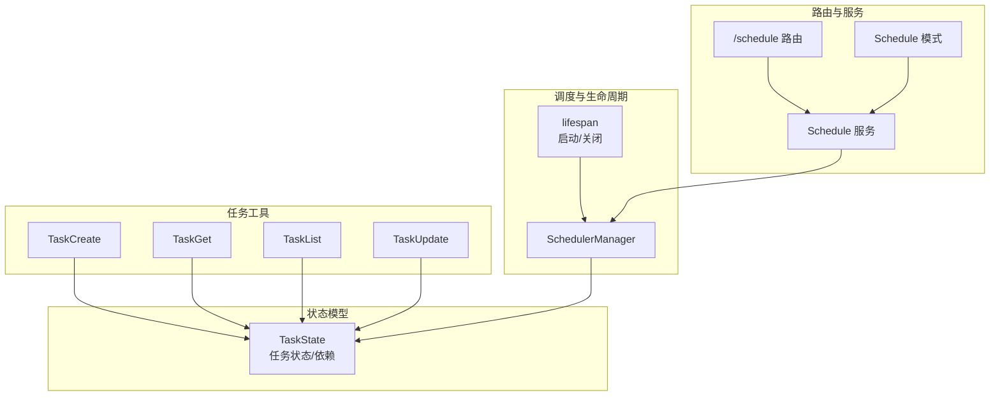
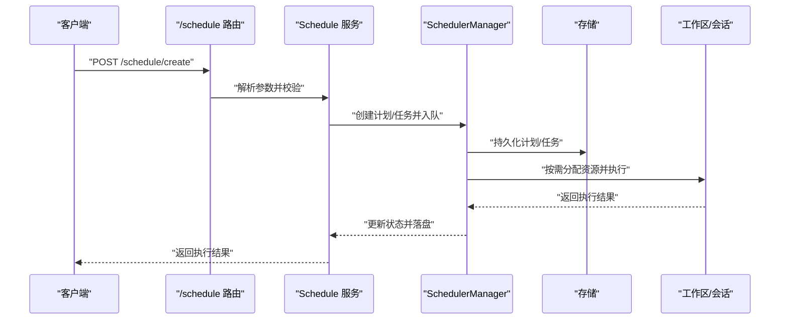
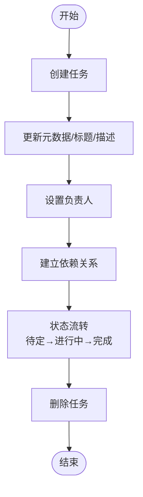
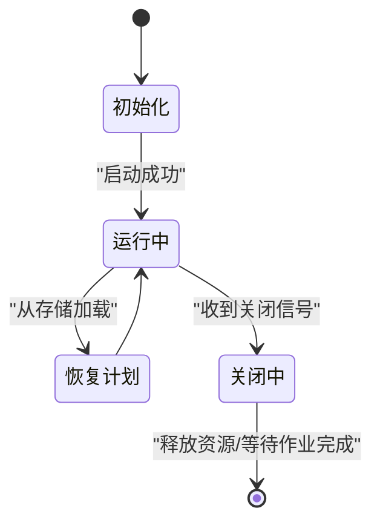
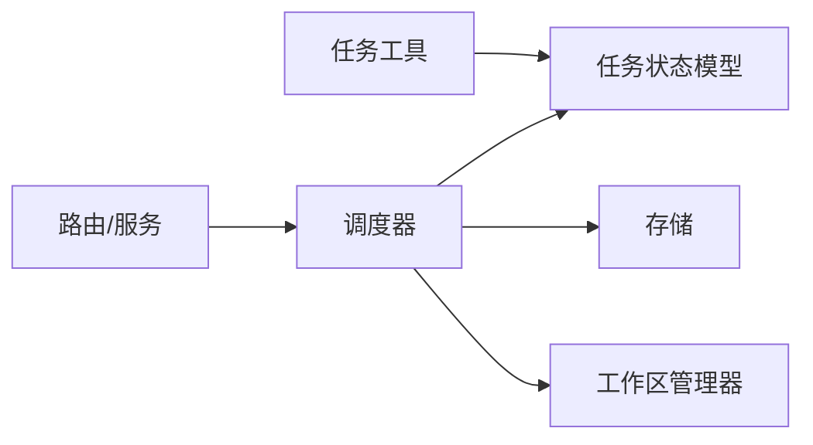

# 规划能力

<cite>
**本文引用的文件**
- [src/agentscope/tool/_task/__init__.py](file://src/agentscope/tool/_task/__init__.py)
- [src/agentscope/tool/_task/_create_task.py](file://src/agentscope/tool/_task/_create_task.py)
- [src/agentscope/tool/_task/_get_task.py](file://src/agentscope/tool/_task/_get_task.py)
- [src/agentscope/tool/_task/_list_task.py](file://src/agentscope/tool/_task/_list_task.py)
- [src/agentscope/tool/_task/_update_task.py](file://src/agentscope/tool/_task/_update_task.py)
- [src/agentscope/state/_task.py](file://src/agentscope/state/_task.py)
- [src/agentscope/app/_lifespan.py](file://src/agentscope/app/_lifespan.py)
- [src/agentscope/app/_manager/_scheduler/_scheduler_manager.py](file://src/agentscope/app/_manager/_scheduler/_scheduler_manager.py)
- [src/agentscope/app/_manager/_scheduler/_tools/_schedule_create.py](file://src/agentscope/app/_manager/_scheduler/_tools/_schedule_create.py)
- [src/agentscope/app/_manager/_scheduler/_tools/_schedule_list.py](file://src/agentscope/app/_manager/_scheduler/_tools/_schedule_list.py)
- [src/agentscope/app/_manager/_scheduler/_tools/_schedule_stop.py](file://src/agentscope/app/_manager/_scheduler/_tools/_schedule_stop.py)
- [src/agentscope/app/_manager/_scheduler/_tools/_schedule_view.py](file://src/agentscope/app/_manager/_scheduler/_tools/_schedule_view.py)
- [src/agentscope/app/_router/_schedule.py](file://src/agentscope/app/_router/_schedule.py)
- [src/agentscope/app/_schema/_schedule.py](file://src/agentscope/app/_schema/_schedule.py)
- [src/agentscope/app/_service/_schedule.py](file://src/agentscope/app/_service/_schedule.py)
- [src/agentscope/agent/_config.py](file://src/agentscope/agent/_config.py)
- [tests/toolkit_task_test.py](file://tests/toolkit_task_test.py)
</cite>

## 目录
1. [简介](#简介)
2. [项目结构](#项目结构)
3. [核心组件](#核心组件)
4. [架构总览](#架构总览)
5. [详细组件分析](#详细组件分析)
6. [依赖关系分析](#依赖关系分析)
7. [性能考虑](#性能考虑)
8. [故障排查指南](#故障排查指南)
9. [结论](#结论)
10. [附录](#附录)

## 简介
本文件系统性阐述 AgentScope 的“规划能力”，聚焦于智能体的任务规划与执行体系：从任务创建、状态流转、依赖关系维护，到调度器的生命周期管理与持久化恢复；并覆盖配置项、性能调优、错误处理与可视化审计等工程实践。文档以代码为依据，结合图示帮助读者快速理解并落地复杂任务的自动规划与执行。

## 项目结构
围绕“规划能力”的关键目录与文件如下：
- 任务工具集：提供任务的创建、查询、列表、更新等原子能力
- 任务状态模型：定义任务实体、状态机与依赖关系
- 调度器与生命周期：负责任务的持久化、恢复、并发与资源协调
- 路由与服务层：对外暴露计划/任务的 API 接口
- 配置与测试：提供上下文压缩、触发阈值等配置项，并通过测试验证行为

图表来源
- [src/agentscope/tool/_task/_create_task.py](file://src/agentscope/tool/_task/_create_task.py)
- [src/agentscope/tool/_task/_get_task.py](file://src/agentscope/tool/_task/_get_task.py)
- [src/agentscope/tool/_task/_list_task.py](file://src/agentscope/tool/_task/_list_task.py)
- [src/agentscope/tool/_task/_update_task.py](file://src/agentscope/tool/_task/_update_task.py)
- [src/agentscope/state/_task.py](file://src/agentscope/state/_task.py)
- [src/agentscope/app/_manager/_scheduler/_scheduler_manager.py](file://src/agentscope/app/_manager/_scheduler/_scheduler_manager.py)
- [src/agentscope/app/_lifespan.py](file://src/agentscope/app/_lifespan.py)
- [src/agentscope/app/_router/_schedule.py](file://src/agentscope/app/_router/_schedule.py)
- [src/agentscope/app/_service/_schedule.py](file://src/agentscope/app/_service/_schedule.py)
- [src/agentscope/app/_schema/_schedule.py](file://src/agentscope/app/_schema/_schedule.py)

章节来源
- [src/agentscope/tool/_task/__init__.py:1-13](file://src/agentscope/tool/_task/__init__.py#L1-L13)
- [src/agentscope/state/_task.py](file://src/agentscope/state/_task.py)
- [src/agentscope/app/_lifespan.py:1-63](file://src/agentscope/app/_lifespan.py#L1-L63)

## 核心组件
- 任务工具集（Task Toolkit）
  - TaskCreate：创建任务，支持标题、描述、元数据（如优先级、标签）等字段
  - TaskGet：获取单个任务的最新状态
  - TaskList：列出任务集合，支持筛选与排序
  - TaskUpdate：更新任务状态、标题、描述、负责人、元数据，以及建立依赖关系（前置/阻塞）
- 任务状态模型（TaskState）
  - 定义任务实体、状态机（待定 → 进行中 → 已完成），以及阻塞/被阻塞关系
- 调度器与生命周期（SchedulerManager + lifespan）
  - 启动时连接存储、启动会话与后台任务管理器、恢复持久化的计划
  - 关闭时取消会话与后台任务、等待作业完成、停止工作区清理
- 路由与服务（/schedule）
  - 提供计划创建、查看、列表、停止等接口，服务层调用调度器进行执行

章节来源
- [src/agentscope/tool/_task/_create_task.py](file://src/agentscope/tool/_task/_create_task.py)
- [src/agentscope/tool/_task/_get_task.py](file://src/agentscope/tool/_task/_get_task.py)
- [src/agentscope/tool/_task/_list_task.py](file://src/agentscope/tool/_task/_list_task.py)
- [src/agentscope/tool/_task/_update_task.py](file://src/agentscope/tool/_task/_update_task.py)
- [src/agentscope/state/_task.py](file://src/agentscope/state/_task.py)
- [src/agentscope/app/_manager/_scheduler/_scheduler_manager.py](file://src/agentscope/app/_manager/_scheduler/_scheduler_manager.py)
- [src/agentscope/app/_lifespan.py:14-63](file://src/agentscope/app/_lifespan.py#L14-L63)

## 架构总览
下图展示了从请求到执行再到状态落盘的关键路径，体现“规划能力”的端到端流程。

图表来源
- [src/agentscope/app/_router/_schedule.py](file://src/agentscope/app/_router/_schedule.py)
- [src/agentscope/app/_service/_schedule.py](file://src/agentscope/app/_service/_schedule.py)
- [src/agentscope/app/_manager/_scheduler/_scheduler_manager.py](file://src/agentscope/app/_manager/_scheduler/_scheduler_manager.py)
- [src/agentscope/app/_lifespan.py:35-63](file://src/agentscope/app/_lifespan.py#L35-L63)

## 详细组件分析

### 任务工具集（Task Toolkit）
- 设计要点
  - 原子化操作：每个工具只做一件事，便于组合与复用
  - 元数据扩展：通过 metadata 字段承载优先级、标签等可选属性
  - 依赖建模：支持 add_blocked_by/add_blocks 建立前后置关系，维护 blocks/blocked_by 列表
  - 状态机：status 受控流转，删除为不可逆
- 关键流程示意

图表来源
- [src/agentscope/tool/_task/_create_task.py](file://src/agentscope/tool/_task/_create_task.py)
- [src/agentscope/tool/_task/_update_task.py](file://src/agentscope/tool/_task/_update_task.py)

章节来源
- [src/agentscope/tool/_task/__init__.py:1-13](file://src/agentscope/tool/_task/__init__.py#L1-L13)
- [src/agentscope/tool/_task/_create_task.py](file://src/agentscope/tool/_task/_create_task.py)
- [src/agentscope/tool/_task/_get_task.py](file://src/agentscope/tool/_task/_get_task.py)
- [src/agentscope/tool/_task/_list_task.py](file://src/agentscope/tool/_task/_list_task.py)
- [src/agentscope/tool/_task/_update_task.py:80-130](file://src/agentscope/tool/_task/_update_task.py#L80-L130)

### 任务状态模型（TaskState）
- 数据结构
  - 任务实体包含 subject、description、metadata、owner、created_at、state、blocks、blocked_by 等字段
  - 状态机：pending → in_progress → completed；deleted 表示永久删除
- 依赖关系
  - blocks：当前任务阻塞的后续任务列表
  - blocked_by：当前任务被前置任务阻塞的列表
- 复杂度与性能
  - 依赖查询与拓扑检查在小规模任务集下开销可控；大规模场景建议引入索引或缓存

章节来源
- [src/agentscope/state/_task.py](file://src/agentscope/state/_task.py)

### 调度器与生命周期（SchedulerManager + lifespan）
- 生命周期管理
  - 启动：初始化存储连接池、工作区管理器、会话管理器、后台任务管理器、调度器；从存储恢复计划
  - 关闭：取消会话与后台任务、等待作业完成、停止调度器与工作区清理
- 调度器职责
  - 维护计划/任务的执行顺序与并发度
  - 协调工作区资源与会话状态
  - 将状态变更持久化至存储

图表来源
- [src/agentscope/app/_lifespan.py:14-63](file://src/agentscope/app/_lifespan.py#L14-L63)
- [src/agentscope/app/_manager/_scheduler/_scheduler_manager.py](file://src/agentscope/app/_manager/_scheduler/_scheduler_manager.py)

章节来源
- [src/agentscope/app/_lifespan.py:14-63](file://src/agentscope/app/_lifespan.py#L14-L63)
- [src/agentscope/app/_manager/_scheduler/_scheduler_manager.py](file://src/agentscope/app/_manager/_scheduler/_scheduler_manager.py)

### 路由与服务（/schedule）
- 路由层
  - 提供计划创建、查看、列表、停止等接口，统一入口与参数校验
- 服务层
  - 解析请求、调用调度器执行计划/任务，组装响应
- 模式定义
  - Schedule 模式用于序列化/反序列化请求与响应，确保一致性

章节来源
- [src/agentscope/app/_router/_schedule.py](file://src/agentscope/app/_router/_schedule.py)
- [src/agentscope/app/_service/_schedule.py](file://src/agentscope/app/_service/_schedule.py)
- [src/agentscope/app/_schema/_schedule.py](file://src/agentscope/app/_schema/_schedule.py)

### 计划制定流程与执行策略
- 目标设定
  - 通过 TaskCreate 的 subject/description/metadata 等字段表达目标与约束
- 任务分解
  - 将高层目标拆分为多个子任务，利用 TaskUpdate 的 add_blocked_by/add_blocks 建立依赖
- 执行策略
  - 优先执行无前置依赖且高优先级的任务
  - 并发执行独立任务，串行执行有依赖链的任务
- 结果落盘
  - 每次状态变更均持久化，保障重启后可恢复

章节来源
- [src/agentscope/tool/_task/_create_task.py](file://src/agentscope/tool/_task/_create_task.py)
- [src/agentscope/tool/_task/_update_task.py:270-291](file://src/agentscope/tool/_task/_update_task.py#L270-L291)
- [src/agentscope/app/_manager/_scheduler/_tools/_schedule_create.py](file://src/agentscope/app/_manager/_scheduler/_tools/_schedule_create.py)
- [src/agentscope/app/_manager/_scheduler/_tools/_schedule_list.py](file://src/agentscope/app/_manager/_scheduler/_tools/_schedule_list.py)
- [src/agentscope/app/_manager/_scheduler/_tools/_schedule_stop.py](file://src/agentscope/app/_manager/_scheduler/_tools/_schedule_stop.py)
- [src/agentscope/app/_manager/_scheduler/_tools/_schedule_view.py](file://src/agentscope/app/_manager/_scheduler/_tools/_schedule_view.py)

### 任务优先级管理、资源分配与进度跟踪
- 优先级管理
  - 通过 metadata.priority 设置优先级，调度器据此排序
- 资源分配
  - 工作区管理器负责工作区生命周期与清理；调度器协调会话与后台任务
- 进度跟踪
  - 通过 TaskGet/TaskList 获取实时状态；/schedule 路由提供计划级视图

章节来源
- [src/agentscope/tool/_task/_update_task.py:80-130](file://src/agentscope/tool/_task/_update_task.py#L80-L130)
- [src/agentscope/app/_manager/_workspace_manager.py:1-44](file://src/agentscope/app/_manager/_workspace_manager.py#L1-L44)
- [src/agentscope/app/_router/_schedule.py](file://src/agentscope/app/_router/_schedule.py)

### 配置选项与性能调优
- 上下文压缩配置（与规划相关）
  - 触发比例与保留比例：当 token 超过最大长度的触发比例时进行压缩，保留比例用于预留空间
  - 压缩提示词：在上下文压缩时提供续写摘要的系统提示
- 性能建议
  - 合理设置触发比例与保留比例，避免频繁压缩导致性能抖动
  - 对高频查询使用缓存（如 TaskList 的过滤与排序结果）

章节来源
- [src/agentscope/agent/_config.py:40-75](file://src/agentscope/agent/_config.py#L40-L75)

### 错误处理与审计日志
- 错误处理
  - 更新前务必使用 TaskGet 获取最新状态，避免竞态
  - 删除任务为不可逆，需谨慎
- 审计日志
  - 每次状态变更持久化，支持按任务/计划维度检索与审计
- 测试验证
  - 单测覆盖了任务创建、更新、删除、依赖关系建立与状态流转等关键路径

章节来源
- [src/agentscope/tool/_task/_update_task.py:102-105](file://src/agentscope/tool/_task/_update_task.py#L102-L105)
- [tests/toolkit_task_test.py:164-1144](file://tests/toolkit_task_test.py#L164-L1144)

## 依赖关系分析
- 组件耦合
  - 任务工具依赖状态模型；调度器依赖存储与工作区管理器；路由/服务层依赖调度器
- 外部依赖
  - 存储：用于持久化计划/任务状态
  - 工作区：提供隔离执行环境
- 循环依赖
  - 当前设计未见循环依赖；各层职责清晰

图表来源
- [src/agentscope/tool/_task/_create_task.py](file://src/agentscope/tool/_task/_create_task.py)
- [src/agentscope/state/_task.py](file://src/agentscope/state/_task.py)
- [src/agentscope/app/_manager/_scheduler/_scheduler_manager.py](file://src/agentscope/app/_manager/_scheduler/_scheduler_manager.py)
- [src/agentscope/app/_router/_schedule.py](file://src/agentscope/app/_router/_schedule.py)
- [src/agentscope/app/_service/_schedule.py](file://src/agentscope/app/_service/_schedule.py)

## 性能考虑
- 任务数量与依赖规模
  - 依赖关系的维护与拓扑检查在小规模任务集下开销可控；建议对大规模任务集引入索引或缓存
- 并发与资源
  - 合理划分独立任务，最大化并行度；同时控制工作区并发数，避免资源争用
- 上下文与压缩
  - 调整上下文压缩的触发与保留比例，减少不必要的压缩成本

## 故障排查指南
- 常见问题
  - 竞态更新：未先读取最新状态直接更新，导致状态不一致
  - 依赖环：错误地建立循环阻塞关系，导致死锁
  - 删除误操作：删除任务不可逆，应确认后再执行
- 排查步骤
  - 使用 TaskGet 获取任务最新状态
  - 使用 TaskList 检查依赖关系与状态分布
  - 查看存储中的持久化记录，定位异常时间点
- 单测参考
  - 通过测试用例验证创建、更新、删除、依赖关系与状态流转的正确性

章节来源
- [src/agentscope/tool/_task/_update_task.py:102-105](file://src/agentscope/tool/_task/_update_task.py#L102-L105)
- [tests/toolkit_task_test.py:164-1144](file://tests/toolkit_task_test.py#L164-L1144)

## 结论
AgentScope 的规划能力以“任务工具 + 状态模型 + 调度器 + 路由服务”为核心，形成从目标设定、任务分解、依赖建模到执行与持久化的完整闭环。通过合理的配置与性能调优、完善的错误处理与审计日志，可在复杂场景下实现稳定可靠的自动化规划与执行。

## 附录

### 规划示例（多步骤、条件分支与异常处理）
- 示例目标：完成一次“缺陷修复”任务
  - 步骤一：创建任务并设置高优先级与标签
  - 步骤二：建立前置依赖（如“需求澄清”完成后才能开始）
  - 步骤三：标记为进行中并分配负责人
  - 步骤四：完成后标记为完成；若任务被删除则不可恢复
- 条件分支
  - 若前置任务未完成，则当前任务保持待定
  - 若任务状态异常（如被他人抢先修改），通过 TaskGet 重新获取最新状态再更新
- 异常处理
  - 删除任务前二次确认
  - 出现竞态时重试或回滚

章节来源
- [src/agentscope/tool/_task/_create_task.py](file://src/agentscope/tool/_task/_create_task.py)
- [src/agentscope/tool/_task/_update_task.py:80-130](file://src/agentscope/tool/_task/_update_task.py#L80-L130)
- [tests/toolkit_task_test.py:164-1144](file://tests/toolkit_task_test.py#L164-L1144)