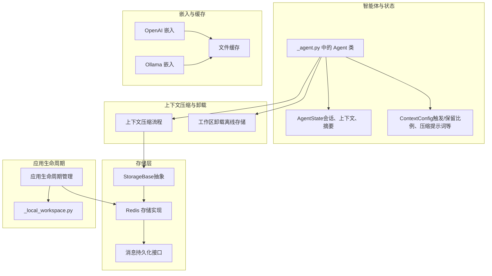
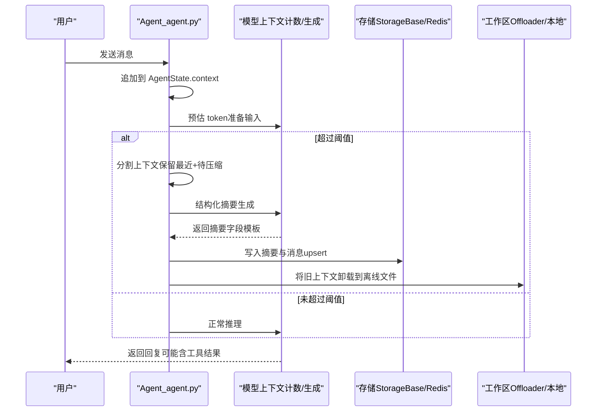
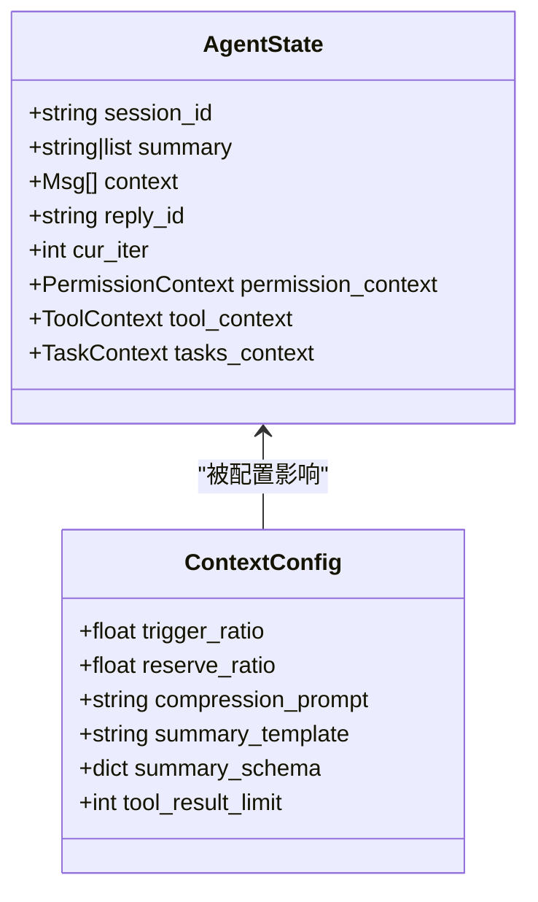
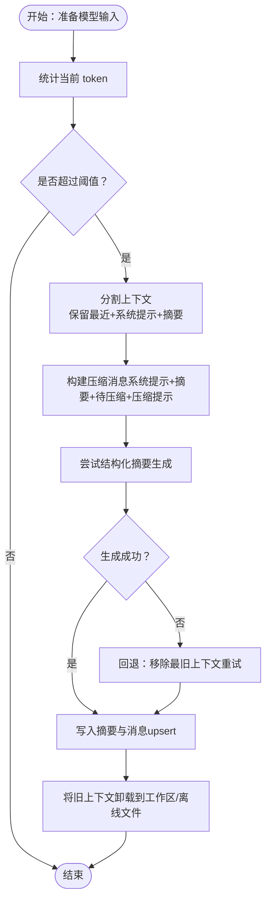
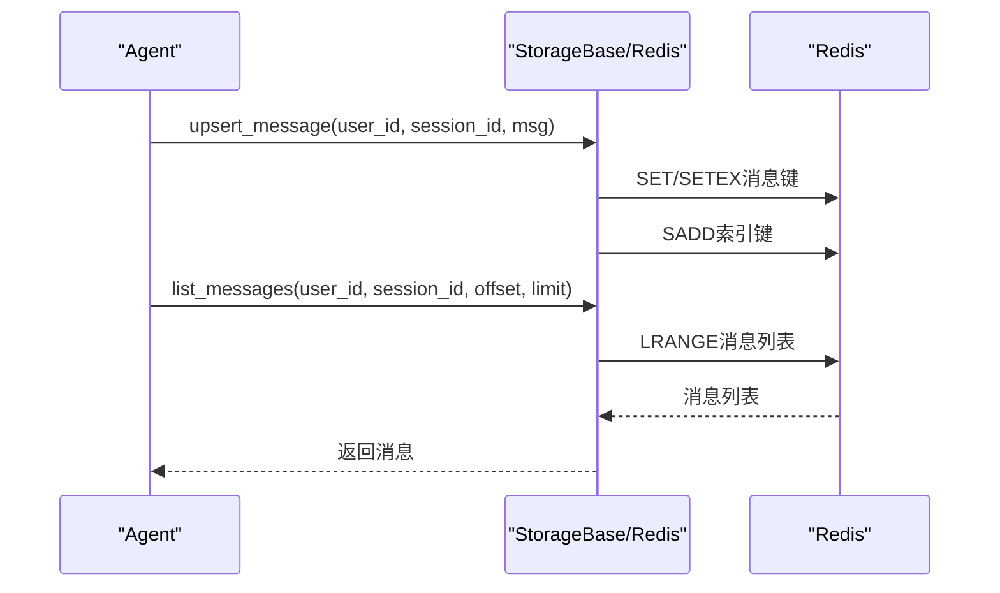
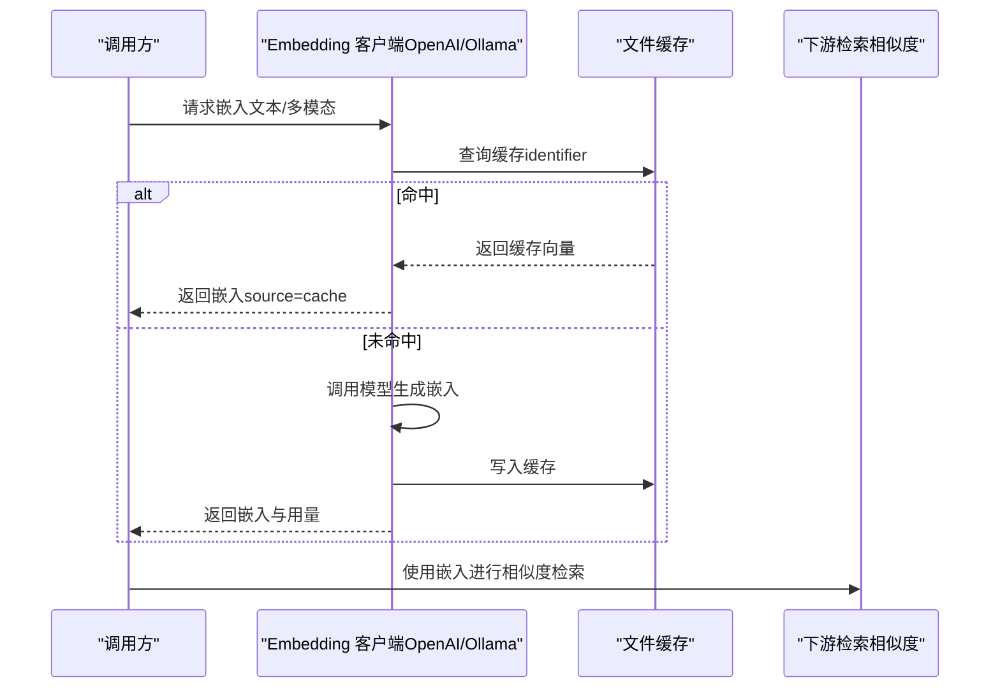
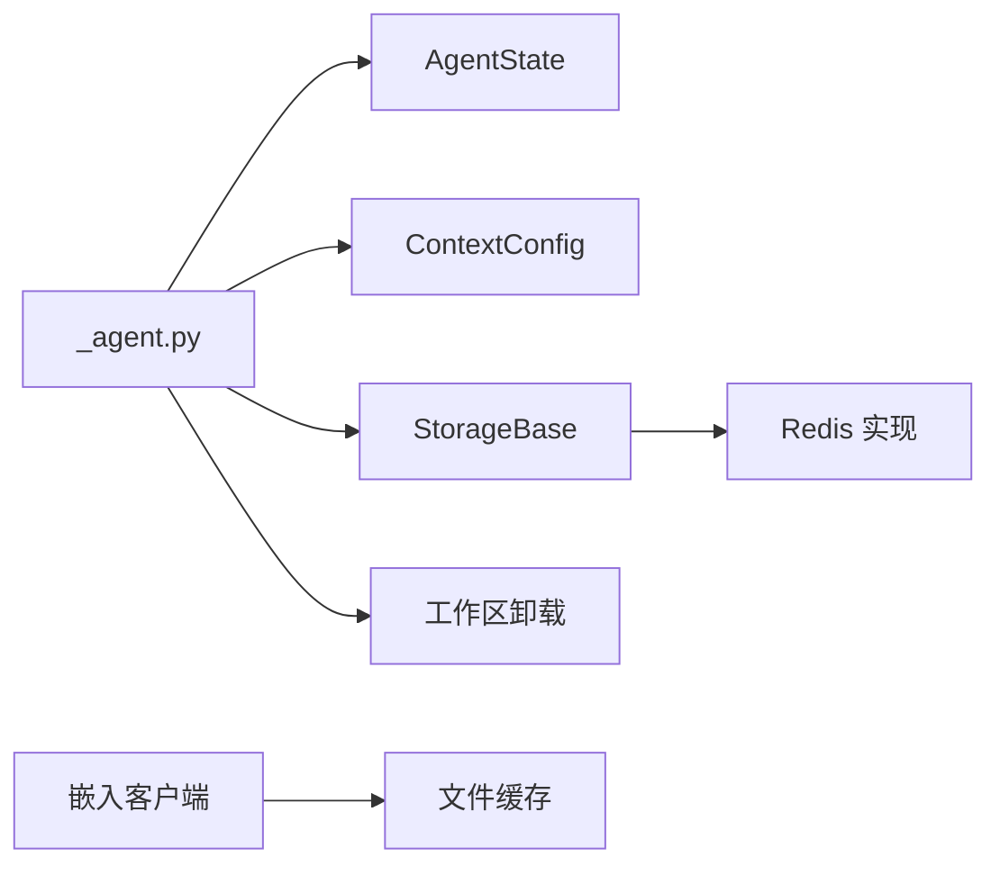

# 记忆机制

<cite>
**本文引用的文件**   
- [src/agentscope/agent/_agent.py](file://src/agentscope/agent/_agent.py)
- [src/agentscope/agent/_config.py](file://src/agentscope/agent/_config.py)
- [src/agentscope/state/_state.py](file://src/agentscope/state/_state.py)
- [src/agentscope/app/storage/_base.py](file://src/agentscope/app/storage/_base.py)
- [src/agentscope/app/storage/_redis_storage.py](file://src/agentscope/app/storage/_redis_storage.py)
- [src/agentscope/embedding/_openai_embedding.py](file://src/agentscope/embedding/_openai_embedding.py)
- [src/agentscope/embedding/_ollama_embedding.py](file://src/agentscope/embedding/_ollama_embedding.py)
- [src/agentscope/embedding/_file_cache.py](file://src/agentscope/embedding/_file_cache.py)
- [src/agentscope/app/_lifespan.py](file://src/agentscope/app/_lifespan.py)
- [src/agentscope/workspace/_local_workspace.py](file://src/agentscope/workspace/_local_workspace.py)
- [tests/compress_context_test.py](file://tests/compress_context_test.py)
- [tests/workspace_local_test.py](file://tests/workspace_local_test.py)
- [tests/storage_redis_test.py](file://tests/storage_redis_test.py)
</cite>

## 目录
1. [引言](#引言)
2. [项目结构](#项目结构)
3. [核心组件](#核心组件)
4. [架构总览](#架构总览)
5. [详细组件分析](#详细组件分析)
6. [依赖关系分析](#依赖关系分析)
7. [性能考量](#性能考量)
8. [故障排查指南](#故障排查指南)
9. [结论](#结论)
10. [附录](#附录)

## 引言
本文件系统性阐述 AgentScope 的记忆机制：短期记忆（对话上下文）与长期记忆（持久化会话与知识片段）、上下文压缩与生命周期管理、嵌入向量生成与缓存、以及安全与备份恢复策略。文档面向不同技术背景读者，既提供高层架构视图，也给出可直接定位到源码的路径指引，便于快速落地与扩展。

## 项目结构
围绕“记忆”的关键模块分布如下：
- 智能体与状态：Agent、AgentState、ContextConfig
- 存储层：StorageBase、Redis 实现、消息持久化接口
- 上下文压缩与生命周期：Agent 内部压缩流程、工作区卸载（offload）
- 嵌入与缓存：OpenAI/Ollama 嵌入、文件缓存
- 应用生命周期：启动/关闭时的资源管理

**图表来源**
- [src/agentscope/agent/_agent.py](file://src/agentscope/agent/_agent.py)
- [src/agentscope/state/_state.py](file://src/agentscope/state/_state.py)
- [src/agentscope/agent/_config.py](file://src/agentscope/agent/_config.py)
- [src/agentscope/app/storage/_base.py](file://src/agentscope/app/storage/_base.py)
- [src/agentscope/app/storage/_redis_storage.py](file://src/agentscope/app/storage/_redis_storage.py)
- [src/agentscope/embedding/_openai_embedding.py](file://src/agentscope/embedding/_openai_embedding.py)
- [src/agentscope/embedding/_ollama_embedding.py](file://src/agentscope/embedding/_ollama_embedding.py)
- [src/agentscope/embedding/_file_cache.py](file://src/agentscope/embedding/_file_cache.py)
- [src/agentscope/app/_lifespan.py](file://src/agentscope/app/_lifespan.py)
- [src/agentscope/workspace/_local_workspace.py](file://src/agentscope/workspace/_local_workspace.py)

**章节来源**
- [src/agentscope/agent/_agent.py](file://src/agentscope/agent/_agent.py)
- [src/agentscope/state/_state.py](file://src/agentscope/state/_state.py)
- [src/agentscope/agent/_config.py](file://src/agentscope/agent/_config.py)
- [src/agentscope/app/storage/_base.py](file://src/agentscope/app/storage/_base.py)
- [src/agentscope/app/storage/_redis_storage.py](file://src/agentscope/app/storage/_redis_storage.py)
- [src/agentscope/embedding/_openai_embedding.py](file://src/agentscope/embedding/_openai_embedding.py)
- [src/agentscope/embedding/_ollama_embedding.py](file://src/agentscope/embedding/_ollama_embedding.py)
- [src/agentscope/embedding/_file_cache.py](file://src/agentscope/embedding/_file_cache.py)
- [src/agentscope/app/_lifespan.py](file://src/agentscope/app/_lifespan.py)
- [src/agentscope/workspace/_local_workspace.py](file://src/agentscope/workspace/_local_workspace.py)

## 核心组件
- 短期记忆（上下文）：由 AgentState.context 维护，按时间顺序保存消息块；系统提示与当前摘要共同构成“系统信息”参与后续推理。
- 长期记忆（会话与知识）：通过 StorageBase 抽象与具体实现（如 Redis）持久化消息列表、会话状态与凭据；支持分页、过期与替换更新。
- 上下文压缩：当 token 超过阈值时，基于结构化摘要模板生成压缩摘要，并将旧上下文卸载至工作区或外部存储。
- 嵌入与缓存：对文本/多模态内容生成嵌入向量并缓存，避免重复请求；支持文件缓存与模型侧缓存。
- 生命周期与卸载：应用启动/关闭时打开/关闭存储连接池与工作区；压缩后的内容可写入离线文件，形成“长期记忆”的一部分。

**章节来源**
- [src/agentscope/state/_state.py](file://src/agentscope/state/_state.py)
- [src/agentscope/agent/_config.py](file://src/agentscope/agent/_config.py)
- [src/agentscope/app/storage/_base.py](file://src/agentscope/app/storage/_base.py)
- [src/agentscope/app/storage/_redis_storage.py](file://src/agentscope/app/storage/_redis_storage.py)
- [src/agentscope/agent/_agent.py](file://src/agentscope/agent/_agent.py)
- [src/agentscope/embedding/_openai_embedding.py](file://src/agentscope/embedding/_openai_embedding.py)
- [src/agentscope/embedding/_ollama_embedding.py](file://src/agentscope/embedding/_ollama_embedding.py)
- [src/agentscope/embedding/_file_cache.py](file://src/agentscope/embedding/_file_cache.py)
- [src/agentscope/app/_lifespan.py](file://src/agentscope/app/_lifespan.py)
- [src/agentscope/workspace/_local_workspace.py](file://src/agentscope/workspace/_local_workspace.py)

## 架构总览
AgentScope 的记忆体系以“状态-存储-压缩-卸载-嵌入”为主线，贯穿会话级的短期记忆与系统级的长期记忆。

**图表来源**
- [src/agentscope/agent/_agent.py](file://src/agentscope/agent/_agent.py)
- [src/agentscope/app/storage/_base.py](file://src/agentscope/app/storage/_base.py)
- [src/agentscope/app/storage/_redis_storage.py](file://src/agentscope/app/storage/_redis_storage.py)
- [src/agentscope/workspace/_local_workspace.py](file://src/agentscope/workspace/_local_workspace.py)

## 详细组件分析

### 短期记忆与长期记忆：AgentState 与 ContextConfig
- AgentState
  - session_id：会话标识，确保跨轮次状态隔离
  - context：消息列表（按时间顺序），作为 LLM 输入的“近期记忆”
  - summary：压缩后的系统信息摘要，前置到上下文中
  - reply_id、cur_iter：回复与迭代控制
  - 权限与任务上下文：用于工具调用与任务编排
- ContextConfig
  - 触发比例（trigger_ratio）与保留比例（reserve_ratio）：决定何时压缩与保留多少上下文
  - 压缩提示词（compression_prompt）与摘要模板（summary_template）：指导结构化摘要生成
  - 工具结果上限（tool_result_limit）：防止工具结果膨胀导致上下文溢出

**图表来源**
- [src/agentscope/state/_state.py](file://src/agentscope/state/_state.py)
- [src/agentscope/agent/_config.py](file://src/agentscope/agent/_config.py)

**章节来源**
- [src/agentscope/state/_state.py](file://src/agentscope/state/_state.py)
- [src/agentscope/agent/_config.py](file://src/agentscope/agent/_config.py)

### 上下文压缩与生命周期管理
- 触发条件：根据模型上下文长度与触发比例估算当前 token 数，超过阈值即激活压缩
- 分割策略：从尾部向前回溯，保留“系统提示+当前摘要+最近消息”，其余进入压缩
- 结构化摘要：通过结构化输出模板生成摘要，写入 AgentState.summary，并作为系统信息注入后续输入
- 卸载与回放：压缩后的上下文可写入离线文件，形成“长期记忆”的一部分；应用重启后可从存储恢复

**图表来源**
- [src/agentscope/agent/_agent.py](file://src/agentscope/agent/_agent.py)
- [src/agentscope/workspace/_local_workspace.py](file://src/agentscope/workspace/_local_workspace.py)

**章节来源**
- [src/agentscope/agent/_agent.py](file://src/agentscope/agent/_agent.py)
- [src/agentscope/workspace/_local_workspace.py](file://src/agentscope/workspace/_local_workspace.py)
- [tests/compress_context_test.py](file://tests/compress_context_test.py)
- [tests/workspace_local_test.py](file://tests/workspace_local_test.py)

### 存储与持久化：消息、会话与凭据
- 抽象接口：StorageBase 定义了凭据、会话、消息的增删改查与索引能力
- Redis 实现：提供键空间、TTL、集合索引等，支持 upsert_message、list_messages、get_message 等
- 生命周期：应用启动时进入存储上下文，关闭时释放资源；会话管理器负责会话与后台任务的生命周期

**图表来源**
- [src/agentscope/app/storage/_base.py](file://src/agentscope/app/storage/_base.py)
- [src/agentscope/app/storage/_redis_storage.py](file://src/agentscope/app/storage/_redis_storage.py)
- [src/agentscope/app/_lifespan.py](file://src/agentscope/app/_lifespan.py)

**章节来源**
- [src/agentscope/app/storage/_base.py](file://src/agentscope/app/storage/_base.py)
- [src/agentscope/app/storage/_redis_storage.py](file://src/agentscope/app/storage/_redis_storage.py)
- [src/agentscope/app/_lifespan.py](file://src/agentscope/app/_lifespan.py)
- [tests/storage_redis_test.py](file://tests/storage_redis_test.py)

### 嵌入向量生成与相似度检索
- 嵌入客户端：OpenAI 与 Ollama 提供统一的嵌入接口，支持缓存命中与回填
- 缓存策略：文件缓存按标识符生成文件名，避免重复请求；可清理与维护目录大小
- 相似度计算：在检索场景中，通常采用余弦相似度或内积比较嵌入向量与查询向量的距离
- 上下文压缩中的嵌入：可用于对长上下文进行分段与选择性保留，减少冗余

**图表来源**
- [src/agentscope/embedding/_openai_embedding.py](file://src/agentscope/embedding/_openai_embedding.py)
- [src/agentscope/embedding/_ollama_embedding.py](file://src/agentscope/embedding/_ollama_embedding.py)
- [src/agentscope/embedding/_file_cache.py](file://src/agentscope/embedding/_file_cache.py)

**章节来源**
- [src/agentscope/embedding/_openai_embedding.py](file://src/agentscope/embedding/_openai_embedding.py)
- [src/agentscope/embedding/_ollama_embedding.py](file://src/agentscope/embedding/_ollama_embedding.py)
- [src/agentscope/embedding/_file_cache.py](file://src/agentscope/embedding/_file_cache.py)

### 安全保护、隐私控制与备份恢复
- 秘密字段处理：存储序列化时将 SecretStr 字段还原为明文再写入，避免掩码泄露
- 访问控制：权限引擎基于 AgentState.permission_context 控制工具调用范围
- 备份与恢复：应用生命周期管理中打开/关闭存储连接池；压缩摘要与消息持久化，重启后可恢复会话状态

**章节来源**
- [src/agentscope/app/storage/_utils.py](file://src/agentscope/app/storage/_utils.py)
- [src/agentscope/app/_lifespan.py](file://src/agentscope/app/_lifespan.py)
- [src/agentscope/agent/_agent.py](file://src/agentscope/agent/_agent.py)

## 依赖关系分析
- Agent 对状态（AgentState）与配置（ContextConfig）强依赖，压缩流程贯穿其生命周期
- 存储层通过抽象接口解耦具体实现（如 Redis），消息持久化遵循 upsert/list/get 约定
- 嵌入层与缓存层相互独立，既可由模型侧缓存，也可由文件缓存兜底
- 工作区卸载为压缩后的内容提供离线落盘，避免内存压力

**图表来源**
- [src/agentscope/agent/_agent.py](file://src/agentscope/agent/_agent.py)
- [src/agentscope/state/_state.py](file://src/agentscope/state/_state.py)
- [src/agentscope/agent/_config.py](file://src/agentscope/agent/_config.py)
- [src/agentscope/app/storage/_base.py](file://src/agentscope/app/storage/_base.py)
- [src/agentscope/app/storage/_redis_storage.py](file://src/agentscope/app/storage/_redis_storage.py)
- [src/agentscope/embedding/_openai_embedding.py](file://src/agentscope/embedding/_openai_embedding.py)
- [src/agentscope/embedding/_file_cache.py](file://src/agentscope/embedding/_file_cache.py)
- [src/agentscope/workspace/_local_workspace.py](file://src/agentscope/workspace/_local_workspace.py)

**章节来源**
- [src/agentscope/agent/_agent.py](file://src/agentscope/agent/_agent.py)
- [src/agentscope/state/_state.py](file://src/agentscope/state/_state.py)
- [src/agentscope/agent/_config.py](file://src/agentscope/agent/_config.py)
- [src/agentscope/app/storage/_base.py](file://src/agentscope/app/storage/_base.py)
- [src/agentscope/app/storage/_redis_storage.py](file://src/agentscope/app/storage/_redis_storage.py)
- [src/agentscope/embedding/_openai_embedding.py](file://src/agentscope/embedding/_openai_embedding.py)
- [src/agentscope/embedding/_file_cache.py](file://src/agentscope/embedding/_file_cache.py)
- [src/agentscope/workspace/_local_workspace.py](file://src/agentscope/workspace/_local_workspace.py)

## 性能考量
- 上下文压缩
  - 合理设置 trigger_ratio 与 reserve_ratio，避免频繁压缩或保留过多导致 token 压力
  - 在压缩前预估 token，必要时降低保留比例或移除最旧上下文
- 嵌入缓存
  - 使用文件缓存降低重复请求成本；定期清理与维护目录大小
  - 对大文本分块处理，避免单次请求超限
- 存储
  - 利用 Redis TTL 与索引键提升读写效率；消息列表分页避免一次性加载过多
- 工作区卸载
  - 将压缩后的上下文写入离线文件，降低内存占用；注意磁盘空间与 IO 开销

[本节为通用性能建议，不直接分析具体文件]

## 故障排查指南
- 压缩失败或上下文溢出
  - 现象：压缩过程中因保留上下文不足导致失败
  - 处理：降低保留比例或移除最旧上下文重试；检查系统提示与摘要长度
  - 参考测试：验证压缩摘要生成与消息写入行为
- 消息持久化异常
  - 现象：upsert 不生效、列表为空或 TTL 异常
  - 处理：确认键空间、索引键与消息键命名；检查过期策略与替换逻辑
- 嵌入缓存未命中
  - 现象：重复请求频繁
  - 处理：核对 identifier 是否一致；检查缓存目录权限与文件存在性

**章节来源**
- [src/agentscope/agent/_agent.py](file://src/agentscope/agent/_agent.py)
- [tests/compress_context_test.py](file://tests/compress_context_test.py)
- [tests/storage_redis_test.py](file://tests/storage_redis_test.py)
- [src/agentscope/embedding/_file_cache.py](file://src/agentscope/embedding/_file_cache.py)

## 结论
AgentScope 的记忆机制通过“短期上下文 + 结构化摘要 + 持久化存储 + 嵌入缓存 + 工作区卸载”的组合，实现了高效、可控且可扩展的记忆体系。合理配置 ContextConfig、利用压缩与缓存策略、结合存储与生命周期管理，可在保证性能的同时满足长期记忆需求。

## 附录
- 最佳实践
  - 在高并发场景下，优先使用结构化摘要模板，减少 token 消耗
  - 对工具结果设置上限，避免爆炸式增长
  - 定期清理嵌入缓存与工作区离线文件，控制资源占用
- 容量管理
  - 通过 trigger_ratio 与 reserve_ratio 动态调节压缩强度
  - 使用分页与 TTL 限制消息列表规模
- 安全与隐私
  - 对敏感字段进行序列化时还原为明文，避免掩码泄露
  - 通过权限引擎限制工具调用范围

[本节为总结性内容，不直接分析具体文件]