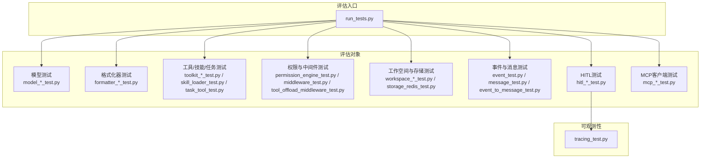
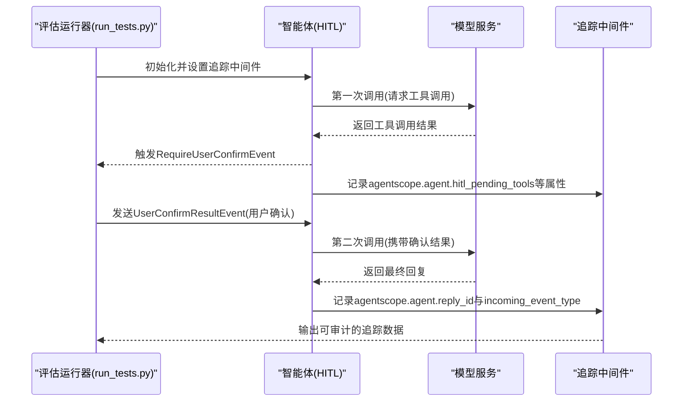
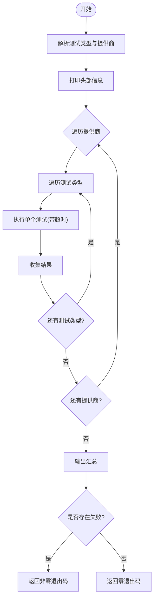
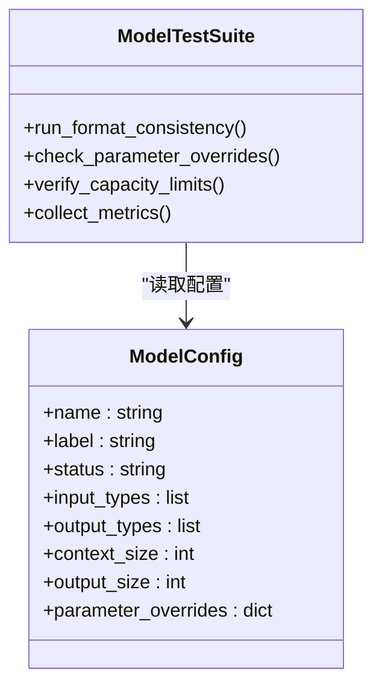
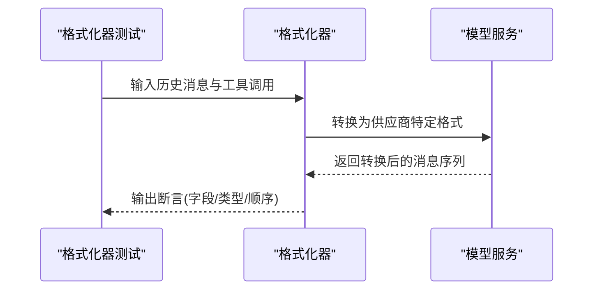
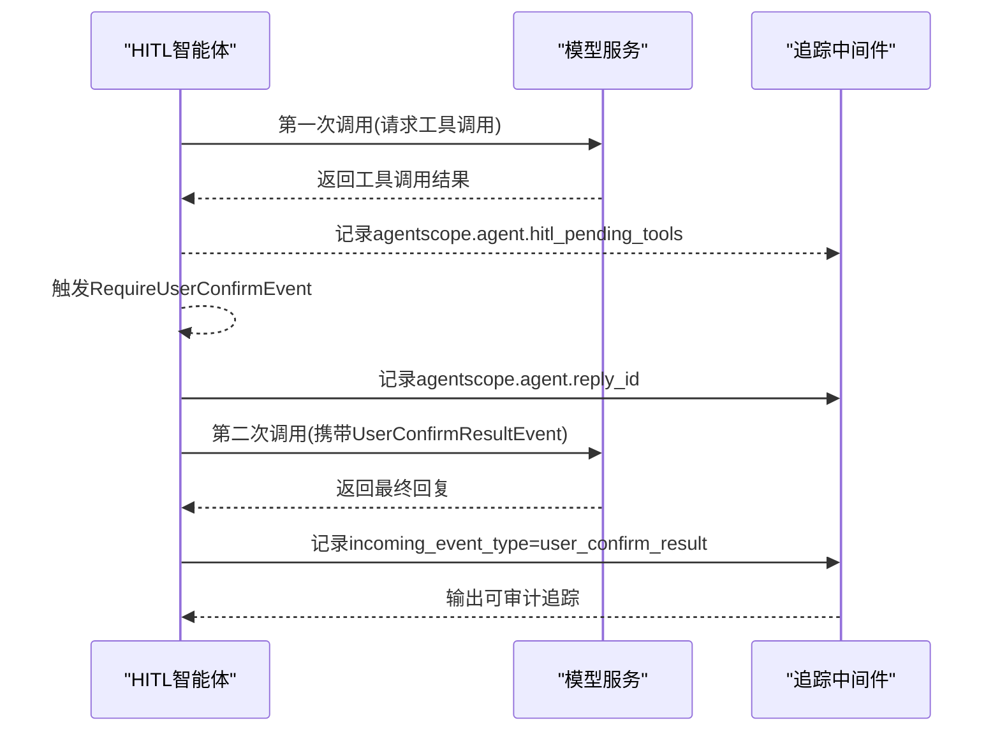
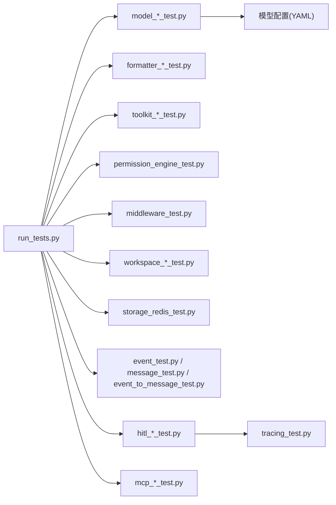

# 评估系统

<cite>
**本文引用的文件**
- [README_zh.md](file://README_zh.md)
- [run_tests.py](file://scripts/model_examples/run_tests.py)
- [agent_basic_test.py](file://tests/agent_basic_test.py)
- [tracing_test.py](file://tests/tracing_test.py)
- [hitl_user_confirmation_test.py](file://tests/hitl_user_confirmation_test.py)
- [hitl_mixed_interrupt.py](file://tests/hitl_mixed_interrupt.py)
- [hitl_external_execution_test.py](file://tests/hitl_external_execution_test.py)
- [formatter_anthropic_test.py](file://tests/formatter_anthropic_test.py)
- [formatter_dashscope_test.py](file://tests/formatter_dashscope_test.py)
- [formatter_deepseek_test.py](file://tests/formatter_deepseek_test.py)
- [formatter_gemini_test.py](file://tests/formatter_gemini_test.py)
- [formatter_moonshot_test.py](file://tests/formatter_moonshot_test.py)
- [formatter_ollama_test.py](file://tests/formatter_ollama_test.py)
- [formatter_openai_chat_test.py](file://tests/formatter_openai_chat_test.py)
- [formatter_openai_response_test.py](file://tests/formatter_openai_response_test.py)
- [formatter_xai_test.py](file://tests/formatter_xai_test.py)
- [model_anthropic_test.py](file://tests/model_anthropic_test.py)
- [model_dashscope_test.py](file://tests/model_dashscope_test.py)
- [model_deepseek_test.py](file://tests/model_deepseek_test.py)
- [model_gemini_test.py](file://tests/model_gemini_test.py)
- [model_moonshot_test.py](file://tests/model_moonshot_test.py)
- [model_ollama_test.py](file://tests/model_ollama_test.py)
- [model_openai_chat_test.py](file://tests/model_openai_chat_test.py)
- [model_openai_response_test.py](file://tests/model_openai_response_test.py)
- [model_xai_test.py](file://tests/model_xai_test.py)
- [message_test.py](file://tests/message_test.py)
- [event_test.py](file://tests/event_test.py)
- [event_to_message_test.py](file://tests/event_to_message_test.py)
- [toolkit_test.py](file://tests/toolkit_test.py)
- [toolkit_skill_test.py](file://tests/toolkit_skill_test.py)
- [toolkit_task_test.py](file://tests/toolkit_task_test.py)
- [workspace_docker_test.py](file://tests/workspace_docker_test.py)
- [workspace_e2b_test.py](file://tests/workspace_e2b_test.py)
- [workspace_local_test.py](file://tests/workspace_local_test.py)
- [storage_redis_test.py](file://tests/storage_redis_test.py)
- [middleware_test.py](file://tests/middleware_test.py)
- [permission_engine_test.py](file://tests/permission_engine_test.py)
- [skill_loader_test.py](file://tests/skill_loader_test.py)
- [task_tool_test.py](file://tests/task_tool_test.py)
- [mcp_sse_client_test.py](file://tests/mcp_sse_client_test.py)
- [mcp_streamable_http_client_test.py](file://tests/mcp_streamable_http_client_test.py)
- [tool_offload_middleware_test.py](file://tests/tool_offload_middleware_test.py)
- [tracing_test.py](file://tests/tracing_test.py)
- [llama4.yaml](file://src/agentscope/model/_ollama/_models/llama4.yaml)
- [qwen3.5-9b.yaml](file://src/agentscope/model/_ollama/_models/qwen3.5-9b.yaml)
- [qwen3.6-max-preview.yaml](file://src/agentscope/model/_dashscope/_models/qwen3.6-max-preview.yaml)
- [qwen3.6-plus.yaml](file://src/agentscope/model/_dashscope/_models/qwen3.6-plus.yaml)
- [qwen3.6-plus.yaml](file://src/agentscope/model/_dashscope/_models/qwen3.6-plus.yaml)
- [qwen3.5-omni-plus.yaml](file://src/agentscope/model/_dashscope/_models/qwen3.5-omni-plus.yaml)
- [qwen-long.yaml](file://src/agentscope/model/_dashscope/_models/qwen-long.yaml)
- [claude-sonnet-4-6.yaml](file://src/agentscope/model/_anthropic/_models/claude-sonnet-4-6.yaml)
- [claude-sonnet-4-5.yaml](file://src/agentscope/model/_anthropic/_models/claude-sonnet-4-5.yaml)
- [claude-opus-4-8.yaml](file://src/agentscope/model/_anthropic/_models/claude-opus-4-8.yaml)
- [claude-opus-4-7.yaml](file://src/agentscope/model/_anthropic/_models/claude-opus-4-7.yaml)
- [claude-opus-4-6.yaml](file://src/agentscope/model/_anthropic/_models/claude-opus-4-6.yaml)
- [claude-haiku-4-5.yaml](file://src/agentscope/model/_anthropic/_models/claude-haiku-4-5.yaml)
- [gpt-4o.yaml](file://src/agentscope/model/_openai_chat/_models/gpt-4o.yaml)
- [gpt-4o-mini.yaml](file://src/agentscope/model/_openai_chat/_models/gpt-4o-mini.yaml)
- [gpt-5.5.yaml](file://src/agentscope/model/_openai_chat/_models/gpt-5.5.yaml)
- [gpt-5.4.yaml](file://src/agentscope/model/_openai_chat/_models/gpt-5.4.yaml)
- [o3.yaml](file://src/agentscope/model/_openai_chat/_models/o3.yaml)
- [o4-mini.yaml](file://src/agentscope/model/_openai_chat/_models/o4-mini.yaml)
- [gpt-4.1.yaml](file://src/agentscope/model/_openai_chat/_models/gpt-4.1.yaml)
- [gpt-4.1-mini.yaml](file://src/agentscope/model/_openai_chat/_models/gpt-4.1-mini.yaml)
- [gpt-4.1-nano.yaml](file://src/agentscope/model/_openai_chat/_models/gpt-4.1-nano.yaml)
- [gemini-2.5-flash.yaml](file://src/agentscope/model/_gemini/_models/gemini-2.5-flash.yaml)
- [gemini-2.5-pro.yaml](file://src/agentscope/model/_gemini/_models/gemini-2.5-pro.yaml)
- [gemini-3-flash-preview.yaml](file://src/agentscope/model/_gemini/_models/gemini-3-flash-preview.yaml)
- [gemini-3.1-pro-preview.yaml](file://src/agentscope/model/_gemini/_models/gemini-3.1-pro-preview.yaml)
- [kimi-k2.6.yaml](file://src/agentscope/model/_moonshot/_models/kimi-k2.6.yaml)
- [kimi-k2.5.yaml](file://src/agentscope/model/_moonshot/_models/kimi-k2.5.yaml)
- [moonshot-v1-32k.yaml](file://src/agentscope/model/_moonshot/_models/moonshot-v1-32k.yaml)
- [moonshot-v1-8k.yaml](file://src/agentscope/model/_moonshot/_models/moonshot-v1-8k.yaml)
- [moonshot-v1-128k.yaml](file://src/agentscope/model/_moonshot/_models/moonshot-v1-128k.yaml)
- [gpt-4.1-mini.yaml](file://src/agentscope/model/_openai_response/_models/gpt-4.1-mini.yaml)
- [gpt-4.1.yaml](file://src/agentscope/model/_openai_response/_models/gpt-4.1.yaml)
- [gpt-5.4.yaml](file://src/agentscope/model/_openai_response/_models/gpt-5.4.yaml)
- [gpt-5.5.yaml](file://src/agentscope/model/_openai_response/_models/gpt-5.5.yaml)
- [o3.yaml](file://src/agentscope/model/_openai_response/_models/o3.yaml)
- [o4-mini.yaml](file://src/agentscope/model/_openai_response/_models/o4-mini.yaml)
- [deepseek-chat.yaml](file://src/agentscope/model/_deepseek/_models/deepseek-chat.yaml)
- [deepseek-reasoner.yaml](file://src/agentscope/model/_deepseek/_models/deepseek-reasoner.yaml)
- [deepseek-v4-flash.yaml](file://src/agentscope/model/_deepseek/_models/deepseek-v4-flash.yaml)
- [deepseek-v4-pro.yaml](file://src/agentscope/model/_deepseek/_models/deepseek-v4-pro.yaml)
- [grok-4.3.yaml](file://src/agentscope/model/_xai/_models/grok-4.3.yaml)
- [grok-3.yaml](file://src/agentscope/model/_xai/_models/grok-3.yaml)
- [grok-3-mini.yaml](file://src/agentscope/model/_xai/_models/grok-3-mini.yaml)
- [grok-3-fast.yaml](file://src/agentscope/model/_xai/_models/grok-3-fast.yaml)
- [Dockerfile.template](file://src/agentscope/workspace/_docker/Dockerfile.template)
- [Dockerfile.install_pypi.template](file://src/agentscope/workspace/_docker/Dockerfile.install_pypi.template)
- [Dockerfile.install_src.template](file://src/agentscope/workspace/_docker/Dockerfile.install_src.template)
- [Dockerfile.node_copy.template](file://src/agentscope/workspace/_docker/Dockerfile.node_copy.template)
- [Dockerfile.node_from.template](file://src/agentscope/workspace/_docker/Dockerfile.node_from.template)
- [main.py](file://examples/agent_service/main.py)
</cite>

## 目录
1. [简介](#简介)
2. [项目结构](#项目结构)
3. [核心组件](#核心组件)
4. [架构总览](#架构总览)
5. [详细组件分析](#详细组件分析)
6. [依赖关系分析](#依赖关系分析)
7. [性能考量](#性能考量)
8. [故障排查指南](#故障排查指南)
9. [结论](#结论)
10. [附录](#附录)

## 简介
本技术文档聚焦于AgentScope的评估系统，系统性阐述评估指标设计、评分算法与质量度量方法，以及自动化评估流程、人工评估（HITL）集成与综合评价体系。文档还解释评估数据的采集、处理与分析机制，提供评估配置选项、自定义指标与报告生成建议，并通过完整评估示例展示如何建立智能体评估框架（性能测试、功能验证、用户体验评估），最后给出结果可视化、趋势分析与改进建议。

## 项目结构
评估系统在AgentScope中以“测试即评估”的方式组织，核心由以下部分构成：
- 测试脚本与运行器：用于批量执行各类评估任务并汇总结果
- 单元测试与集成测试：覆盖模型、格式化器、工具、权限、中间件、工作空间等模块的质量度量
- 可观测性与追踪：通过追踪中间件记录事件与属性，支撑评估数据采集与分析
- 示例与模板：提供可复用的评估场景与配置样例

图表来源
- [run_tests.py:560-585](file://scripts/model_examples/run_tests.py#L560-L585)
- [tracing_test.py:474-615](file://tests/tracing_test.py#L474-L615)

章节来源
- [README_zh.md:58-79](file://README_zh.md#L58-L79)
- [run_tests.py:560-585](file://scripts/model_examples/run_tests.py#L560-L585)

## 核心组件
- 自动化评估运行器：负责解析测试类型、并发执行并输出汇总结果，作为评估流水线的控制中枢
- 模型评估套件：针对不同模型供应商的响应一致性、参数与上下文限制进行验证
- 格式化器评估套件：验证不同供应商的消息格式转换正确性与多模态支持
- 工具/技能/任务评估套件：验证工具调用、技能加载与任务工具链的稳定性与正确性
- 权限与中间件评估套件：验证权限决策引擎与中间件链路的可靠性
- 工作空间与存储评估套件：验证容器化与E2B沙箱、Redis存储等基础设施的可用性
- 事件与消息评估套件：验证事件流转、消息序列化与转换的正确性
- 人工评估（HITL）集成：通过用户确认事件与追踪属性，形成可审计的评估证据链
- MCP客户端评估套件：验证MCP协议的连接、事件与流式传输稳定性

章节来源
- [run_tests.py:560-585](file://scripts/model_examples/run_tests.py#L560-L585)
- [model_anthropic_test.py](file://tests/model_anthropic_test.py)
- [model_dashscope_test.py](file://tests/model_dashscope_test.py)
- [model_deepseek_test.py](file://tests/model_deepseek_test.py)
- [model_gemini_test.py](file://tests/model_gemini_test.py)
- [model_moonshot_test.py](file://tests/model_moonshot_test.py)
- [model_ollama_test.py](file://tests/model_ollama_test.py)
- [model_openai_chat_test.py](file://tests/model_openai_chat_test.py)
- [model_openai_response_test.py](file://tests/model_openai_response_test.py)
- [model_xai_test.py](file://tests/model_xai_test.py)
- [formatter_anthropic_test.py](file://tests/formatter_anthropic_test.py)
- [formatter_dashscope_test.py](file://tests/formatter_dashscope_test.py)
- [formatter_deepseek_test.py](file://tests/formatter_deepseek_test.py)
- [formatter_gemini_test.py](file://tests/formatter_gemini_test.py)
- [formatter_moonshot_test.py](file://tests/formatter_moonshot_test.py)
- [formatter_ollama_test.py](file://tests/formatter_ollama_test.py)
- [formatter_openai_chat_test.py](file://tests/formatter_openai_chat_test.py)
- [formatter_openai_response_test.py](file://tests/formatter_openai_response_test.py)
- [formatter_xai_test.py](file://tests/formatter_xai_test.py)
- [toolkit_test.py](file://tests/toolkit_test.py)
- [toolkit_skill_test.py](file://tests/toolkit_skill_test.py)
- [toolkit_task_test.py](file://tests/toolkit_task_test.py)
- [permission_engine_test.py](file://tests/permission_engine_test.py)
- [middleware_test.py](file://tests/middleware_test.py)
- [tool_offload_middleware_test.py](file://tests/tool_offload_middleware_test.py)
- [workspace_docker_test.py](file://tests/workspace_docker_test.py)
- [workspace_e2b_test.py](file://tests/workspace_e2b_test.py)
- [workspace_local_test.py](file://tests/workspace_local_test.py)
- [storage_redis_test.py](file://tests/storage_redis_test.py)
- [event_test.py](file://tests/event_test.py)
- [message_test.py](file://tests/message_test.py)
- [event_to_message_test.py](file://tests/event_to_message_test.py)
- [hitl_user_confirmation_test.py](file://tests/hitl_user_confirmation_test.py)
- [hitl_mixed_interrupt.py](file://tests/hitl_mixed_interrupt.py)
- [hitl_external_execution_test.py](file://tests/hitl_external_execution_test.py)
- [mcp_sse_client_test.py](file://tests/mcp_sse_client_test.py)
- [mcp_streamable_http_client_test.py](file://tests/mcp_streamable_http_client_test.py)

## 架构总览
评估系统采用“测试驱动+可观测性”的架构，通过统一运行器调度各模块测试，利用追踪中间件记录关键事件与属性，形成可回溯的评估证据链。HITL流程贯穿两次调用：首次触发用户确认，第二次携带确认结果继续推理，追踪中间件确保两次调用共享reply_id并携带正确的incoming_event_type。

图表来源
- [run_tests.py:560-585](file://scripts/model_examples/run_tests.py#L560-L585)
- [tracing_test.py:474-615](file://tests/tracing_test.py#L474-L615)

章节来源
- [tracing_test.py:474-615](file://tests/tracing_test.py#L474-L615)

## 详细组件分析

### 自动化评估运行器
- 职责：解析测试类型与提供商列表，按超时与详细级别执行所有测试，汇总失败计数并决定退出码
- 关键流程：打印头部信息、遍历提供商与测试类型、执行并汇总、输出摘要、根据失败状态返回非零退出码
- 适用场景：CI/CD流水线中的自动化评估、批量回归测试

图表来源
- [run_tests.py:560-585](file://scripts/model_examples/run_tests.py#L560-L585)

章节来源
- [run_tests.py:560-585](file://scripts/model_examples/run_tests.py#L560-L585)

### 模型评估套件
- 设计原则：验证不同供应商模型的响应一致性、参数覆盖与上下文/输出大小限制
- 评分维度：
  - 响应格式一致性：是否符合供应商约定的字段与类型
  - 参数覆盖策略：max_tokens等参数的最大值约束是否生效
  - 上下文与输出容量：context_size与output_size是否满足预期
- 典型指标：
  - 参数覆盖命中率：参数被正确覆盖的比例
  - 容量合规率：上下文/输出未越界的比例
  - 响应完整性：必填字段缺失比例
- 数据处理：基于模型配置文件（YAML）解析参数覆盖与容量限制，结合测试断言统计

图表来源
- [llama4.yaml:1-22](file://src/agentscope/model/_ollama/_models/llama4.yaml#L1-L22)
- [qwen3.5-9b.yaml:1-17](file://src/agentscope/model/_ollama/_models/qwen3.5-9b.yaml#L1-L17)
- [qwen3.6-max-preview.yaml:1-16](file://src/agentscope/model/_dashscope/_models/qwen3.6-max-preview.yaml#L1-L16)

章节来源
- [llama4.yaml:1-22](file://src/agentscope/model/_ollama/_models/llama4.yaml#L1-L22)
- [qwen3.5-9b.yaml:1-17](file://src/agentscope/model/_ollama/_models/qwen3.5-9b.yaml#L1-L17)
- [qwen3.6-max-preview.yaml:1-16](file://src/agentscope/model/_dashscope/_models/qwen3.6-max-preview.yaml#L1-L16)

### 格式化器评估套件
- 设计原则：验证不同供应商的消息格式转换正确性，包括工具调用、多模态内容与文本块
- 评分维度：
  - 工具调用映射：tool_use与tool_result的对应关系
  - 多模态支持：图像/音频/视频等媒体类型的转换
  - 文本块与推理内容：reasoning_content与content的保留与格式
- 典型指标：
  - 工具调用映射准确率
  - 多模态字段完整性
  - 推理内容保留率
- 数据处理：构造历史消息与工具调用序列，调用格式化器后断言输出结构与字段

图表来源
- [formatter_anthropic_test.py:454-491](file://tests/formatter_anthropic_test.py#L454-L491)
- [formatter_dashscope_test.py](file://tests/formatter_dashscope_test.py)
- [formatter_deepseek_test.py:112-149](file://tests/formatter_deepseek_test.py#L112-L149)
- [formatter_gemini_test.py](file://tests/formatter_gemini_test.py)
- [formatter_moonshot_test.py](file://tests/formatter_moonshot_test.py)
- [formatter_ollama_test.py](file://tests/formatter_ollama_test.py)
- [formatter_openai_chat_test.py](file://tests/formatter_openai_chat_test.py)
- [formatter_openai_response_test.py](file://tests/formatter_openai_response_test.py)
- [formatter_xai_test.py](file://tests/formatter_xai_test.py)

章节来源
- [formatter_anthropic_test.py:454-491](file://tests/formatter_anthropic_test.py#L454-L491)
- [formatter_deepseek_test.py:112-149](file://tests/formatter_deepseek_test.py#L112-L149)

### 工具/技能/任务评估套件
- 设计原则：验证工具调用链路、技能加载与任务工具的正确性与鲁棒性
- 评分维度：
  - 工具调用成功率：工具可执行且返回成功
  - 技能加载完整性：技能定义与依赖解析无误
  - 任务工具链路：任务创建、查询、更新的端到端正确性
- 典型指标：
  - 工具调用成功率
  - 技能加载失败率
  - 任务状态迁移正确率
- 数据处理：构造工具调用输入，执行后断言结果状态与输出

章节来源
- [toolkit_test.py](file://tests/toolkit_test.py)
- [toolkit_skill_test.py](file://tests/toolkit_skill_test.py)
- [toolkit_task_test.py](file://tests/toolkit_task_test.py)
- [skill_loader_test.py](file://tests/skill_loader_test.py)
- [task_tool_test.py](file://tests/task_tool_test.py)

### 权限与中间件评估套件
- 设计原则：验证权限决策引擎与中间件链路的正确性与安全性
- 评分维度：
  - 权限决策一致性：规则匹配与决策结果
  - 中间件链路完整性：请求/响应拦截与转换
  - 工具离负载中间件：工具调用的离负载与回传
- 典型指标：
  - 权限决策命中率
  - 中间件拦截成功率
  - 离负载工具调用成功率
- 数据处理：构造权限规则与中间件配置，执行后断言决策与链路行为

章节来源
- [permission_engine_test.py](file://tests/permission_engine_test.py)
- [middleware_test.py](file://tests/middleware_test.py)
- [tool_offload_middleware_test.py](file://tests/tool_offload_middleware_test.py)

### 工作空间与存储评估套件
- 设计原则：验证容器化与E2B沙箱、Redis存储等基础设施的可用性与稳定性
- 评分维度：
  - 容器镜像构建与运行：Dockerfile模板与安装流程
  - E2B沙箱启动与交互：环境初始化与命令执行
  - Redis存储连通性与写入读取
- 典型指标：
  - 容器构建成功率
  - 沙箱启动时间与可用性
  - 存储写入/读取延迟与一致性
- 数据处理：执行构建/启动/写入/读取流程，断言状态与耗时

章节来源
- [workspace_docker_test.py](file://tests/workspace_docker_test.py)
- [workspace_e2b_test.py](file://tests/workspace_e2b_test.py)
- [workspace_local_test.py](file://tests/workspace_local_test.py)
- [storage_redis_test.py](file://tests/storage_redis_test.py)
- [Dockerfile.template](file://src/agentscope/workspace/_docker/Dockerfile.template)
- [Dockerfile.install_pypi.template](file://src/agentscope/workspace/_docker/Dockerfile.install_pypi.template)
- [Dockerfile.install_src.template](file://src/agentscope/workspace/_docker/Dockerfile.install_src.template)
- [Dockerfile.node_copy.template](file://src/agentscope/workspace/_docker/Dockerfile.node_copy.template)
- [Dockerfile.node_from.template](file://src/agentscope/workspace/_docker/Dockerfile.node_from.template)

### 事件与消息评估套件
- 设计原则：验证事件流转、消息序列化与转换的正确性
- 评分维度：
  - 事件类型完整性：事件定义与序列化
  - 消息转换一致性：消息到事件的映射
- 典型指标：
  - 事件序列完整性
  - 消息转换准确率
- 数据处理：构造事件与消息，执行转换后断言结构与字段

章节来源
- [event_test.py](file://tests/event_test.py)
- [message_test.py](file://tests/message_test.py)
- [event_to_message_test.py](file://tests/event_to_message_test.py)

### 人工评估（HITL）集成
- 设计原则：通过用户确认事件与追踪属性，形成可审计的评估证据链
- 评分维度：
  - 用户确认触发率：首次调用是否正确触发RequireUserConfirmEvent
  - 二次调用一致性：第二次调用是否携带正确的incoming_event_type
  - 追踪属性完整性：agentscope.agent.hitl_pending_tools与agentscope.agent.reply_id
- 典型指标：
  - HITL触发成功率
  - 属性携带正确率
  - 两次调用共享reply_id比例
- 数据处理：构造HITL智能体，执行两次调用，断言事件与追踪属性

图表来源
- [tracing_test.py:474-615](file://tests/tracing_test.py#L474-L615)
- [hitl_user_confirmation_test.py](file://tests/hitl_user_confirmation_test.py)
- [hitl_mixed_interrupt.py](file://tests/hitl_mixed_interrupt.py)
- [hitl_external_execution_test.py](file://tests/hitl_external_execution_test.py)

章节来源
- [tracing_test.py:474-615](file://tests/tracing_test.py#L474-L615)
- [hitl_user_confirmation_test.py](file://tests/hitl_user_confirmation_test.py)
- [hitl_mixed_interrupt.py](file://tests/hitl_mixed_interrupt.py)
- [hitl_external_execution_test.py](file://tests/hitl_external_execution_test.py)

### MCP客户端评估套件
- 设计原则：验证MCP协议的连接、事件与流式传输稳定性
- 评分维度：
  - SSE客户端连接稳定性
  - 可流式HTTP客户端事件接收
- 典型指标：
  - 连接建立成功率
  - 事件接收完整性
  - 流式传输吞吐与延迟
- 数据处理：建立连接并接收事件，断言事件类型与数据完整性

章节来源
- [mcp_sse_client_test.py](file://tests/mcp_sse_client_test.py)
- [mcp_streamable_http_client_test.py](file://tests/mcp_streamable_http_client_test.py)

## 依赖关系分析
评估系统内部依赖清晰，运行器作为入口协调各测试套件；追踪中间件为HITL提供可观测性支撑；模型配置文件为模型评估提供参数与容量约束依据。

图表来源
- [run_tests.py:560-585](file://scripts/model_examples/run_tests.py#L560-L585)
- [tracing_test.py:474-615](file://tests/tracing_test.py#L474-L615)
- [llama4.yaml:1-22](file://src/agentscope/model/_ollama/_models/llama4.yaml#L1-L22)
- [qwen3.5-9b.yaml:1-17](file://src/agentscope/model/_ollama/_models/qwen3.5-9b.yaml#L1-L17)
- [qwen3.6-max-preview.yaml:1-16](file://src/agentscope/model/_dashscope/_models/qwen3.6-max-preview.yaml#L1-L16)

章节来源
- [run_tests.py:560-585](file://scripts/model_examples/run_tests.py#L560-L585)
- [tracing_test.py:474-615](file://tests/tracing_test.py#L474-L615)

## 性能考量
- 执行效率：运行器支持超时控制与并发遍历提供商/测试类型，避免单点瓶颈
- 数据采集：追踪中间件仅在HITL场景启用，减少常规测试的开销
- 资源占用：工作空间测试涉及容器与沙箱，需合理配置资源与清理策略
- 结果聚合：汇总阶段按失败计数决定退出码，便于CI/CD快速反馈

## 故障排查指南
- 测试失败定位：优先查看运行器输出的摘要与失败计数，再逐类测试定位具体断言
- HITL问题：检查追踪中间件是否正确记录agentscope.agent.hitl_pending_tools与agentscope.agent.reply_id，确认两次调用的incoming_event_type
- 模型参数：核对模型配置文件中的parameter_overrides与容量限制，确保测试断言与配置一致
- 工具/技能：确认工具定义与技能加载路径，检查任务工具的状态迁移逻辑
- 工作空间：检查Dockerfile模板与安装流程，验证E2B沙箱启动日志与Redis连接状态

章节来源
- [run_tests.py:560-585](file://scripts/model_examples/run_tests.py#L560-L585)
- [tracing_test.py:474-615](file://tests/tracing_test.py#L474-L615)
- [llama4.yaml:1-22](file://src/agentscope/model/_ollama/_models/llama4.yaml#L1-L22)
- [qwen3.5-9b.yaml:1-17](file://src/agentscope/model/_ollama/_models/qwen3.5-9b.yaml#L1-L17)
- [qwen3.6-max-preview.yaml:1-16](file://src/agentscope/model/_dashscope/_models/qwen3.6-max-preview.yaml#L1-L16)

## 结论
AgentScope的评估系统以“测试即评估”为核心理念，通过统一运行器与可观测性中间件，实现了对模型、格式化器、工具/技能/任务、权限与中间件、工作空间与存储、事件与消息以及HITL流程的全栈评估。该体系具备高可扩展性与可审计性，适合在CI/CD中持续集成，保障智能体在多场景下的稳定性与质量。

## 附录
- 评估示例：参考示例工程中的Agent服务入口，结合测试套件构建自定义评估场景
- 配置选项：通过模型配置文件调整参数覆盖与容量限制，通过测试运行器选择提供商与测试类型
- 报告生成：基于运行器汇总结果与追踪中间件输出，生成可审计的评估报告

章节来源
- [main.py](file://examples/agent_service/main.py)