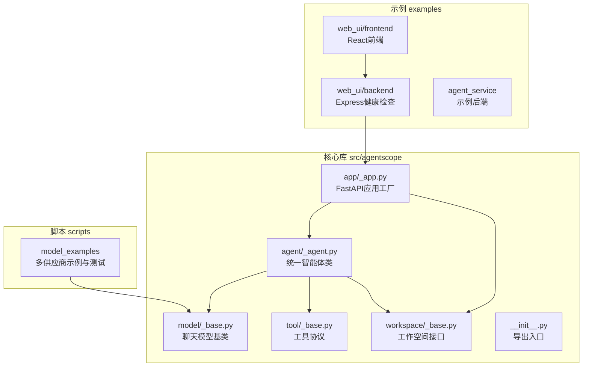
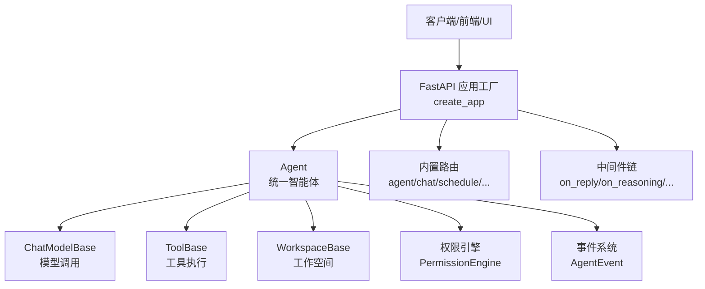
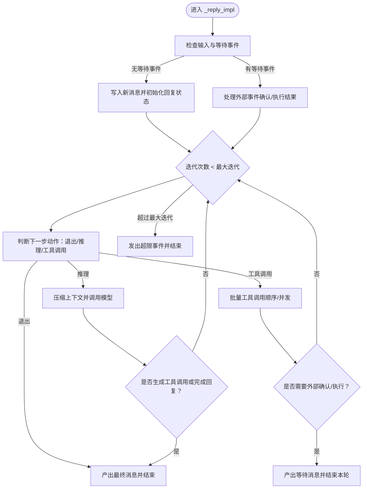
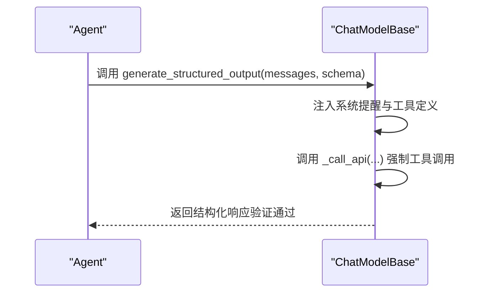
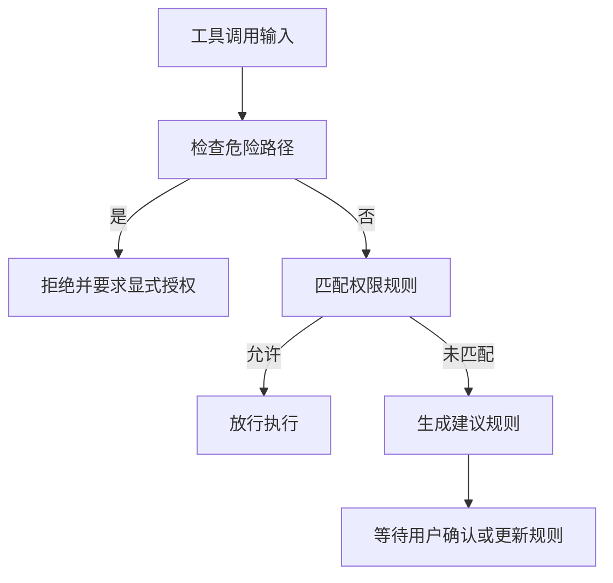
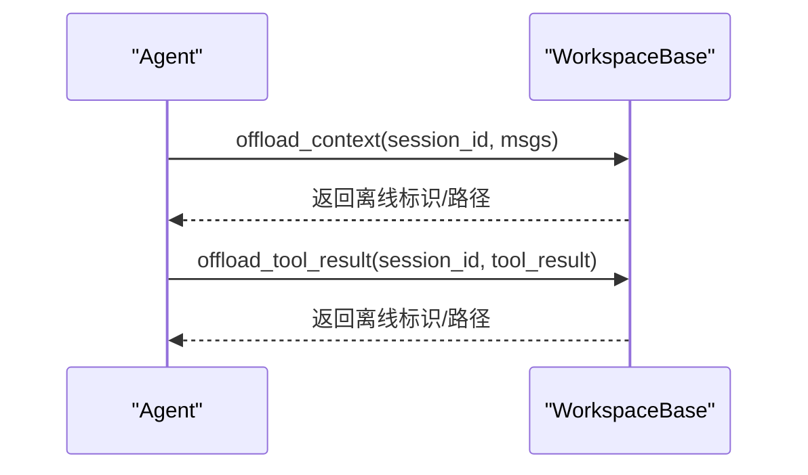
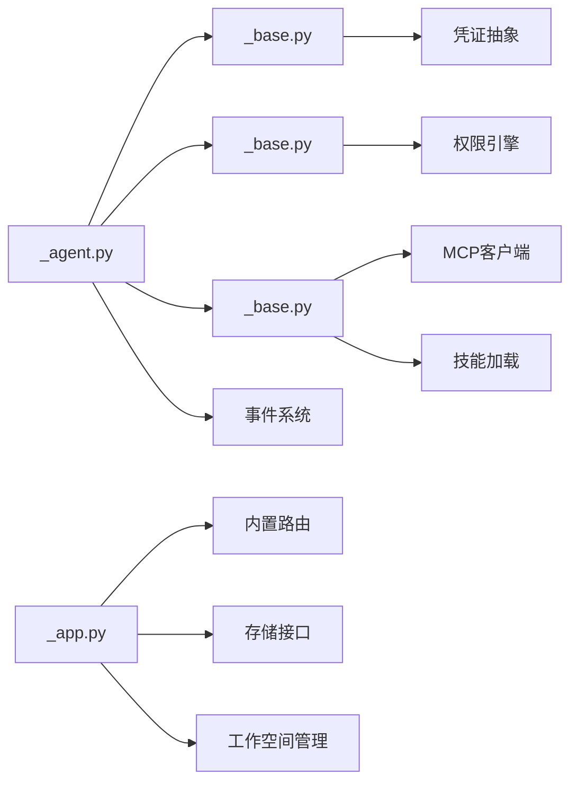

# 项目概览

<cite>
**本文引用的文件**
- [README.md](file://README.md)
- [src/agentscope/__init__.py](file://src/agentscope/__init__.py)
- [src/agentscope/app/_app.py](file://src/agentscope/app/_app.py)
- [src/agentscope/agent/_agent.py](file://src/agentscope/agent/_agent.py)
- [src/agentscope/tool/_base.py](file://src/agentscope/tool/_base.py)
- [src/agentscope/model/_base.py](file://src/agentscope/model/_base.py)
- [src/agentscope/workspace/_base.py](file://src/agentscope/workspace/_base.py)
- [scripts/model_examples/README.md](file://scripts/model_examples/README.md)
- [examples/web_ui/backend/src/index.ts](file://examples/web_ui/backend/src/index.ts)
</cite>

## 目录
1. [简介](#简介)
2. [项目结构](#项目结构)
3. [核心组件](#核心组件)
4. [架构总览](#架构总览)
5. [详细组件分析](#详细组件分析)
6. [依赖分析](#依赖分析)
7. [性能考虑](#性能考虑)
8. [故障排查指南](#故障排查指南)
9. [结论](#结论)
10. [附录](#附录)

## 简介
AgentScope 2.0 是一个“面向日益智能的LLM”的生产就绪、易于使用的智能体框架。其核心价值主张在于：
- 与日益智能的LLM协作：通过模型自身的推理与工具使用能力，而非严格的提示与教条式编排来限制它们。
- 三大核心优势：
  - 简单易用：5分钟启动第一个智能体。
  - 可扩展性：丰富的生态系统集成（工具、内存、可观测性），内置MCP与A2A，消息枢纽支持灵活的多智能体编排与工作流。
  - 生产就绪：支持本地部署、无服务器云部署与K8s集群部署，并内置OTel支持。

该框架以事件驱动的流式响应为核心，提供统一的Agent抽象、可插拔的工具系统、权限控制、上下文压缩与工作空间管理，覆盖从入门到生产的完整开发与运维路径。

**章节来源**
- [README.md:58-71](file://README.md#L58-L71)
- [README.md:134-188](file://README.md#L134-L188)

## 项目结构
仓库采用按功能域分层的组织方式：
- 核心库 src/agentscope：包含Agent、模型、工具、权限、工作空间、事件、中间件等核心模块。
- 示例 examples：包含Web UI前后端示例与Agent服务示例。
- 脚本 scripts：提供多供应商模型调用示例与统一测试运行器。
- 文档 docs：包含路线图与新闻等。

**图表来源**
- [src/agentscope/agent/_agent.py:94-150](file://src/agentscope/agent/_agent.py#L94-L150)
- [src/agentscope/model/_base.py:35-96](file://src/agentscope/model/_base.py#L35-L96)
- [src/agentscope/tool/_base.py:35-76](file://src/agentscope/tool/_base.py#L35-L76)
- [src/agentscope/workspace/_base.py:36-100](file://src/agentscope/workspace/_base.py#L36-L100)
- [src/agentscope/app/_app.py:29-130](file://src/agentscope/app/_app.py#L29-L130)
- [examples/web_ui/backend/src/index.ts:1-17](file://examples/web_ui/backend/src/index.ts#L1-L17)
- [scripts/model_examples/README.md:1-232](file://scripts/model_examples/README.md#L1-L232)

**章节来源**
- [README.md:91-103](file://README.md#L91-L103)

## 核心组件
- 统一智能体 Agent：负责推理-行动循环、事件流、权限校验、上下文压缩与工具批处理执行。
- 模型抽象 ChatModelBase：统一聊天模型调用、重试机制、结构化输出生成与令牌估算。
- 工具协议 ToolBase：定义工具接口、权限检查、并发安全与危险路径保护。
- 工作空间 WorkspaceBase：抽象资源、工具、MCP与技能发现，以及上下文与工具结果的离线存储。
- 应用工厂 create_app：基于FastAPI构建多租户、多会话的Agent服务，内置路由与中间件扩展点。

**章节来源**
- [src/agentscope/agent/_agent.py:94-150](file://src/agentscope/agent/_agent.py#L94-L150)
- [src/agentscope/model/_base.py:35-96](file://src/agentscope/model/_base.py#L35-L96)
- [src/agentscope/tool/_base.py:35-76](file://src/agentscope/tool/_base.py#L35-L76)
- [src/agentscope/workspace/_base.py:36-100](file://src/agentscope/workspace/_base.py#L36-L100)
- [src/agentscope/app/_app.py:29-130](file://src/agentscope/app/_app.py#L29-L130)

## 架构总览
AgentScope 2.0 的整体架构围绕“事件驱动 + 流式响应 + 可插拔组件”展开：
- 事件驱动：Agent在推理-行动循环中产生丰富事件（模型调用开始/结束、文本块增量、工具调用、外部确认等），上层UI或服务可订阅并渲染。
- 流式响应：模型调用支持异步流式返回，Agent将其转换为事件序列，便于实时展示与交互。
- 可插拔组件：模型、工具、工作空间、中间件均可替换或扩展，满足不同部署与业务需求。
- 多部署形态：通过应用工厂与工作空间实现本地、云无服务器与K8s集群部署。

**图表来源**
- [src/agentscope/app/_app.py:29-130](file://src/agentscope/app/_app.py#L29-L130)
- [src/agentscope/agent/_agent.py:94-150](file://src/agentscope/agent/_agent.py#L94-L150)
- [src/agentscope/model/_base.py:35-96](file://src/agentscope/model/_base.py#L35-L96)
- [src/agentscope/tool/_base.py:35-76](file://src/agentscope/tool/_base.py#L35-L76)
- [src/agentscope/workspace/_base.py:36-100](file://src/agentscope/workspace/_base.py#L36-L100)

## 详细组件分析

### 统一智能体 Agent
- 设计要点
  - 推理-行动循环：根据模型输出决定下一步是继续思考（推理）还是执行工具（行动），支持顺序与并发批量执行。
  - 事件流：通过丰富的事件类型（模型调用、文本块、思维块、工具调用、外部确认等）解耦渲染与逻辑。
  - 权限控制：在工具调用前进行权限决策，必要时触发用户确认或外部执行事件。
  - 上下文压缩：当token接近阈值时自动压缩历史对话，保留关键摘要并可选离线存储。
  - 中间件扩展：支持在回复、推理、行动、模型调用、系统提示与上下文压缩等钩子点插入自定义逻辑。
- 关键流程（推理-行动循环）

**图表来源**
- [src/agentscope/agent/_agent.py:542-686](file://src/agentscope/agent/_agent.py#L542-L686)

**章节来源**
- [src/agentscope/agent/_agent.py:94-150](file://src/agentscope/agent/_agent.py#L94-L150)
- [src/agentscope/agent/_agent.py:191-252](file://src/agentscope/agent/_agent.py#L191-L252)
- [src/agentscope/agent/_agent.py:259-492](file://src/agentscope/agent/_agent.py#L259-L492)

### 模型抽象 ChatModelBase
- 设计要点
  - 统一调用接口：支持同步与异步流式返回；内置重试策略与异常分类。
  - 结构化输出：通过注入工具强制模型生成符合JSON Schema的结构化输出。
  - 令牌估算：提供快速估算方法，便于上下文压缩与容量规划。
  - 模型清单：支持从YAML加载模型卡片，统一参数与上下文大小。
- 关键流程（结构化输出生成）

**图表来源**
- [src/agentscope/model/_base.py:373-436](file://src/agentscope/model/_base.py#L373-L436)
- [src/agentscope/model/_base.py:438-571](file://src/agentscope/model/_base.py#L438-L571)

**章节来源**
- [src/agentscope/model/_base.py:35-96](file://src/agentscope/model/_base.py#L35-L96)
- [src/agentscope/model/_base.py:296-372](file://src/agentscope/model/_base.py#L296-L372)

### 工具协议 ToolBase
- 设计要点
  - 协议定义：工具名称、描述、输入模式、并发安全、只读属性、外部工具标记等。
  - 权限检查：支持规则匹配与建议生成，内置危险路径检测（如.ssh、.git等）。
  - 建议规则：针对文件操作、命令行、搜索等场景提供细粒度建议。
- 关键流程（权限检查与建议）

**图表来源**
- [src/agentscope/tool/_base.py:71-144](file://src/agentscope/tool/_base.py#L71-L144)
- [src/agentscope/tool/_base.py:146-195](file://src/agentscope/tool/_base.py#L146-L195)

**章节来源**
- [src/agentscope/tool/_base.py:35-76](file://src/agentscope/tool/_base.py#L35-L76)
- [src/agentscope/tool/_base.py:197-212](file://src/agentscope/tool/_base.py#L197-L212)

### 工作空间 WorkspaceBase
- 设计要点
  - 抽象接口：统一生命周期（initialize/close/reset）、指令片段、工具/MCP/技能发现、上下文与工具结果离线存储。
  - 支持三种实现：本地文件系统、Docker容器、E2B云沙箱，满足不同隔离与弹性需求。
- 关键流程（上下文离线存储）

**图表来源**
- [src/agentscope/workspace/_base.py:123-155](file://src/agentscope/workspace/_base.py#L123-L155)

**章节来源**
- [src/agentscope/workspace/_base.py:36-100](file://src/agentscope/workspace/_base.py#L36-L100)
- [src/agentscope/workspace/_base.py:103-155](file://src/agentscope/workspace/_base.py#L103-L155)

### 应用工厂 create_app 与示例
- 应用工厂 create_app
  - 提供多租户、多会话的Agent服务，注册内置路由，支持额外中间件与工具/凭证工厂扩展。
  - 生命周期由 lifespan 管理，支持挂载到现有FastAPI应用。
- 示例：Agent服务与Web UI
  - 后端：提供健康检查接口，演示与AgentScope服务集成。
  - 前端：React组件体系，支持聊天界面、工具渲染器、会话管理等。
- 示例：模型调用示例
  - 覆盖OpenAI、Anthropic、DashScope、Gemini、Moonshot、xAI、DeepSeek、Ollama等主流供应商。
  - 提供统一测试运行器，支持列出可用供应商、按类型运行测试、设置超时与详细输出。

**章节来源**
- [src/agentscope/app/_app.py:29-130](file://src/agentscope/app/_app.py#L29-L130)
- [examples/web_ui/backend/src/index.ts:1-17](file://examples/web_ui/backend/src/index.ts#L1-L17)
- [scripts/model_examples/README.md:1-232](file://scripts/model_examples/README.md#L1-L232)

## 依赖分析
- 内部依赖关系
  - Agent 依赖 Model、Tool、Workspace、Permission 与事件系统。
  - App 工厂依赖 Router、Storage、WorkspaceManager 与 CredentialFactory。
  - Model 依赖 Credential 与消息/数据块类型。
  - Tool 依赖 Permission 与工具响应类型。
  - Workspace 依赖 MCP、Skill 与消息/工具结果类型。
- 外部依赖
  - FastAPI（应用工厂与路由）
  - Pydantic（参数与结构化输出校验）
  - asyncio（异步流式处理）

**图表来源**
- [src/agentscope/agent/_agent.py:94-150](file://src/agentscope/agent/_agent.py#L94-L150)
- [src/agentscope/app/_app.py:29-130](file://src/agentscope/app/_app.py#L29-L130)
- [src/agentscope/model/_base.py:35-96](file://src/agentscope/model/_base.py#L35-L96)
- [src/agentscope/tool/_base.py:35-76](file://src/agentscope/tool/_base.py#L35-L76)
- [src/agentscope/workspace/_base.py:36-100](file://src/agentscope/workspace/_base.py#L36-L100)

**章节来源**
- [src/agentscope/agent/_agent.py:94-150](file://src/agentscope/agent/_agent.py#L94-L150)
- [src/agentscope/app/_app.py:29-130](file://src/agentscope/app/_app.py#L29-L130)

## 性能考虑
- 流式响应与事件驱动：减少前端阻塞，提升交互体验。
- 上下文压缩：在token接近阈值时自动压缩历史，降低延迟与成本。
- 并发工具调用：支持批量并发执行，缩短端到端时延。
- 重试与退避：模型调用内置重试策略，提升稳定性。
- 离线存储：将压缩后的上下文与工具结果离线存储，避免重复传输与计算。

[本节为通用指导，无需特定文件引用]

## 故障排查指南
- 事件流调试
  - 使用事件类型区分模型调用、文本块、工具调用与外部确认，定位卡顿或阻塞环节。
- 权限问题
  - 检查工具危险路径与规则匹配，必要时生成建议规则并进行用户确认。
- 模型调用失败
  - 查看重试日志与异常类型，确认是否属于可重试异常；调整重试次数与延迟。
- 上下文压缩失败
  - 检查保留比例与压缩阈值，必要时降低保留比例或移除过旧上下文。
- 部署问题
  - 使用健康检查接口确认服务可用；核对环境变量与API密钥；检查路由与中间件配置。

**章节来源**
- [src/agentscope/agent/_agent.py:259-492](file://src/agentscope/agent/_agent.py#L259-L492)
- [src/agentscope/model/_base.py:157-218](file://src/agentscope/model/_base.py#L157-L218)
- [src/agentscope/tool/_base.py:71-144](file://src/agentscope/tool/_base.py#L71-L144)
- [examples/web_ui/backend/src/index.ts:10-12](file://examples/web_ui/backend/src/index.ts#L10-L12)

## 结论
AgentScope 2.0 以“事件驱动 + 流式响应 + 可插拔组件”为核心，提供从入门到生产的全栈能力：5分钟启动智能体、丰富的生态集成、生产级部署形态与可观测性支持。通过统一的Agent抽象、模型与工具协议、工作空间与权限控制，开发者可以专注于业务逻辑与创新，而不被底层细节所束缚。

[本节为总结性内容，无需特定文件引用]

## 附录
- 快速开始
  - 安装与运行：参考根目录README中的安装与Hello AgentScope示例。
  - Agent服务：参考示例后端与Web UI，体验多租户、多会话的智能体服务。
  - 模型示例：参考scripts/model_examples，覆盖多家供应商与多模态场景。
- 社区与贡献
  - 加入社区讨论，查看贡献指南与许可证信息。

**章节来源**
- [README.md:106-133](file://README.md#L106-L133)
- [README.md:134-188](file://README.md#L134-L188)
- [README.md:190-216](file://README.md#L190-L216)
- [scripts/model_examples/README.md:89-173](file://scripts/model_examples/README.md#L89-L173)